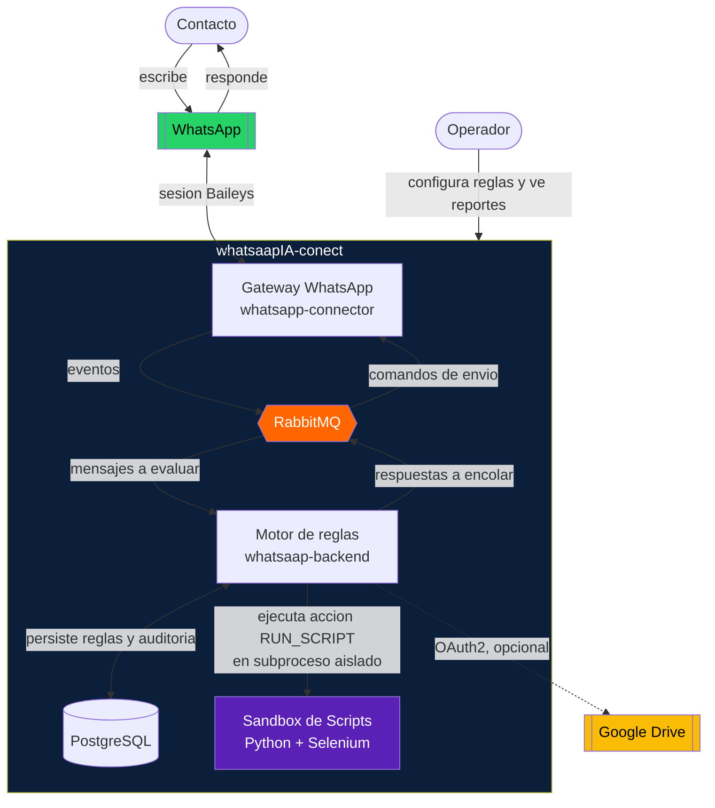
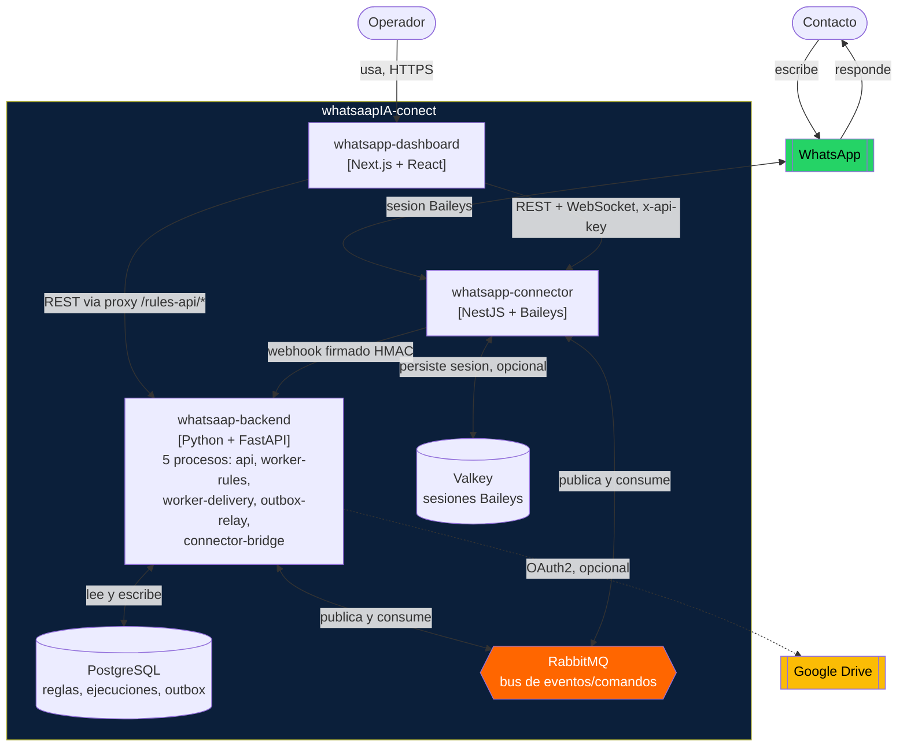
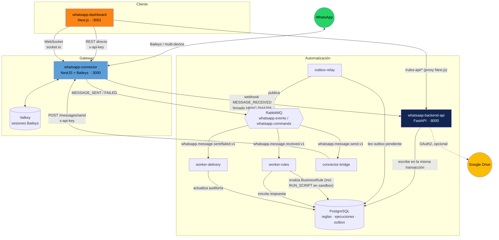
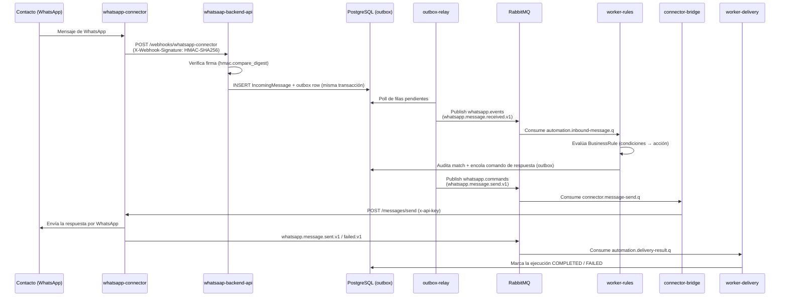

# whatsaapIA-conect

Plataforma de automatización de WhatsApp: conecta sesiones reales de WhatsApp
(vía Baileys), evalúa reglas de negocio sobre los mensajes entrantes y
responde automáticamente, con un panel de administración para operarlo todo.

El sistema se compone de **tres servicios independientes** (cada uno su
propio repositorio/lenguaje) más un **orquestador de despliegue** que los
levanta juntos:

| Repo | Rol | Stack | Puerto local |
|---|---|---|---|
| [`whatsapp-connector`](./whatsapp-connector) | Gateway de WhatsApp (sesiones, QR, envío/recepción de mensajes) | NestJS + Baileys | `3000` |
| [`whatsaap-backend`](./whatsaap_backend) | Motor de reglas y automatización (evalúa mensajes, decide respuestas, audita ejecuciones, integraciones y scripts custom) | Python + FastAPI | `8000` |
| [`whatsapp-dashboard`](./whatsapp-dashboard) | Panel de administración (sesiones, mensajes, reglas, reportes, actividad en vivo) | Next.js + React | `3001` |
| [`deploy-project`](./deploy-project) | Orquestador único (Docker Compose + `deploy.py`) que levanta toda la plataforma | Python + Docker Compose | — |

`whatsapp-connector` **no** ejecuta lógica de negocio (no decide qué
responder); `whatsaap-backend` **no** habla directo con WhatsApp — todo pasa
por el connector. Esa separación es la base de la arquitectura.

> Nota de carpeta: el repo se llama `whatsaap-backend` en la tabla de arriba
> (nombre del servicio/imagen) pero la carpeta en disco es `whatsaap_backend`
> (guion bajo) — los enlaces de este documento ya apuntan al nombre real.

---

## Vista C1 — Contexto del sistema

Vista de más alto nivel: quién usa la plataforma y con qué sistemas externos
habla, sin entrar en los servicios internos (eso está en la sección
"Arquitectura general" más abajo).



**Lectura rápida:**
- Dos tipos de usuario: el **operador** (interno, usa el dashboard) y el
  **contacto** (cliente final, solo interactúa por WhatsApp — no sabe que
  existe una plataforma detrás).
- Dos sistemas externos: **WhatsApp**, obligatorio (es el canal); **Google
  Drive**, opcional (integración para exportar/leer archivos desde reglas).
- Dentro de la caja `whatsaapIA-conect` se ven, a alto nivel, los dos
  servicios, su base de datos compartida (**PostgreSQL**) y el **sandbox
  de scripts**: el motor de reglas puede ejecutar un script Python subido
  por el operador (p. ej. automatizando un navegador con **Selenium**) en
  un subproceso aislado, sin credenciales del proceso confiable. Hablan
  entre sí de forma **asíncrona** a través de **RabbitMQ** — el gateway
  nunca llama directo al motor de reglas ni viceversa. El detalle completo
  (Valkey, outbox-relay, connector-bridge, los 5 procesos del backend, el
  dashboard) está en "Vista C2" y "Arquitectura general" más abajo.

---

## Vista C2 — Contenedores

Un nivel más de detalle que el C1: cada caja de abajo es un **contenedor
desplegable independiente** (su propia imagen Docker / proceso), con su
tecnología. Todavía no se desglosan los 5 procesos internos del backend ni
el flujo mensaje a mensaje — eso está en "Arquitectura general".



**Lectura rápida:**
- 6 contenedores: 3 aplicaciones propias (`dashboard`, `connector`,
  `backend`) + 3 piezas de infraestructura (`PostgreSQL`, `RabbitMQ`,
  `Valkey`).
- El dashboard es el único que habla con los dos servicios de negocio, y
  lo hace de dos formas distintas: directo al connector (REST/WebSocket
  con `x-api-key`) y vía proxy same-origin al backend (`/rules-api/*`),
  nunca directo a los puertos internos.
- El connector y el backend se acoplan **solo** a través de HTTP (webhook
  saliente firmado, comandos de envío) y RabbitMQ — nunca comparten base
  de datos ni llamadas internas directas.

---

## Arquitectura general



> El nodo `whatsaap-backend-api` también expone reglas, reportes, secretos,
> integraciones (Google Drive) y security-settings — omitido del diagrama
> por espacio, detallado en "Componentes en detalle" más abajo.

**Reglas de dependencia:**
- El dashboard nunca escribe directo en las bases de datos; todo pasa por
  las APIs REST de connector y backend.
- El connector nunca conoce las reglas de negocio; solo emite eventos y
  ejecuta comandos de envío.
- El backend nunca abre una sesión de WhatsApp; solo le pide al connector
  que envíe, vía `connector-bridge`.

---

## Flujo de un mensaje entrante (modo `outbox` + RabbitMQ)



El patrón **outbox transaccional** garantiza que un mensaje nunca se marca
como procesado sin que su efecto (auditoría, comando de respuesta) haya
quedado escrito en la misma transacción de base de datos — si RabbitMQ está
caído, la fila simplemente espera en la tabla outbox hasta el próximo poll
de `outbox-relay`. Es *at-least-once*, no *exactly-once*: el consumidor debe
ser idempotente (el dedupe por `message_id` cumple ese rol).

---

## Componentes en detalle

### `whatsapp-connector` — gateway de WhatsApp
Clean Architecture: `api/` (controllers) → `application/` (commands, queries,
ports) → `domain/` (agregados de sesión/mensaje, value objects, eventos) →
`infrastructure/` (Baileys, persistencia, WebSocket, observabilidad).

- **Sesiones**: `GET/POST /sessions`, `GET /sessions/:id/qr`,
  `POST /sessions/:id/disconnect`, `DELETE /sessions/:id`.
- **Mensajes**: `POST /messages/send`, `POST /messages/send-media`.
- **Salud/métricas**: `GET /health` (único endpoint sin auth explícita),
  `GET /health/events-monitor` (dashboard HTML de eventos en vivo),
  `GET /metrics` (Prometheus, requiere auth).
- **Documentación interactiva**: `GET /docs` / `/docs-json` (Swagger UI,
  `@nestjs/swagger`).
- **Persistencia de sesión** configurable: `filesystem` (default),
  `valkey` o `postgres` (`SESSION_PROVIDER`; también existe una variante
  `in-memory` de uso interno/tests).
- **WebSocket** (`socket.io`) para eventos en tiempo real que consume el
  dashboard (`SESSION_CONNECTED`, `QR_GENERATED`, `MESSAGE_RECEIVED`,
  `GROUP_MESSAGE_RECEIVED`, `MEDIA_RECEIVED`, ...), con aislamiento por
  sala de Socket.IO por owner (multi-tenant).
- **Webhooks salientes**: firma cada payload con
  `X-Webhook-Signature: sha256=<HMAC>` (reintenta 3 veces con backoff).
- **Auth**: header `x-api-key` en formato `owner:secret`
  (`API_KEYS=acme:<secret>`), resuelto a un `ownerId` multi-tenant.
- **Endurecimiento**: rate limiting (`@nestjs/throttler`), soporte TLS
  (`TLS_ENABLED`), boundaries de arquitectura verificados con
  `dependency-cruiser` (`npm run arch:check`).
- Documentación propia: [`guia.md`](./whatsapp-connector/guia.md),
  ADRs en [`docs/adr/`](./whatsapp-connector/docs/adr/).

### `whatsaap-backend` — motor de reglas y automatización
Hexagonal: `domain/` (puro: `BusinessRule`, `Condition`, `RuleAction`,
`IncomingMessage`) → `application/` (servicios de evaluación/entrega) →
`infrastructure/` (SQLAlchemy, RabbitMQ, cliente HTTP al connector, sandbox
de scripts) → `presentation/` (FastAPI) → `bootstrap/` (entrypoints de cada
proceso).

Se despliega como **5 procesos independientes**, todos la misma imagen con
distinto comando:

| Proceso | Qué hace |
|---|---|
| `api` | CRUD de reglas, simulación, ejecuciones, `POST /webhooks/whatsapp-connector`, `GET /api/v1/reports/*`, secretos, integraciones y security-settings |
| `worker-rules` | Consume mensajes entrantes, evalúa reglas (`RuleEvaluator`), incluida la acción `RUN_SCRIPT` |
| `worker-delivery` | Consume resultados de entrega, cierra la auditoría |
| `outbox-relay` | Publica filas del outbox a RabbitMQ con *publisher confirms* |
| `connector-bridge` | Consume comandos de envío y llama al REST del connector |

**Capacidades expuestas por la API** (más allá de reglas/reportes):
- **Secretos** (`/api/v1/secrets`): CRUD de credenciales cifradas usadas por
  acciones de regla (nunca se re-exponen en claro).
- **Sandbox de scripts (`RUN_SCRIPT`)**: acciones de regla pueden ejecutar
  un script Python subido por el operador en un **subproceso aislado**
  (entorno propio, sin heredar credenciales del proceso confiable, con
  límites de CPU/procesos/archivos abiertos y timeout) — ver
  `infrastructure/sandbox/`. Se usa, entre otras cosas, para lógica de
  negocio a medida (p. ej. consulta de "traslado de tienda").
- **Integración con Google Drive** (`/api/v1/integrations/google-drive`):
  lectura/escritura de archivos vía OAuth2.
- **Security settings** (`/api/v1/security-settings`): configuración de
  controles de seguridad en caliente.
- **Bulk CSV**: procesamiento masivo fila a fila reutilizando la misma
  lógica de acciones de regla.
- Routers adicionales: `contact-identities`, `business-messages`,
  `overview` (dashboards agregados).

**Topología RabbitMQ**: exchanges `whatsapp.events` (topic, publica el
connector-side vía relay), `whatsapp.commands` (direct), `automation.events`,
más `automation.retry` / `automation.dlx` para reintentos y dead-lettering.
Colas: `automation.inbound-message.q`, `automation.delivery-result.q`,
`connector.message-send.q`.

Documentación propia: [`docs/architecture/event-driven-architecture.md`](./whatsaap_backend/docs/architecture/event-driven-architecture.md),
[`docs/adr/0001-rabbitmq-event-bus.md`](./whatsaap_backend/docs/adr/0001-rabbitmq-event-bus.md).

### `whatsapp-dashboard` — panel de administración
Feature-Sliced Design: `app/(dashboard)/{sessions,messages,rules,
contact-identities,business-messages,integrations,reports,activity,
overview,health}` → `features/` → `entities/` → `shared/`.

- Next.js 16 (App Router) + React 19 + TypeScript estricto + Tailwind v4 +
  shadcn/ui (sobre `@base-ui/react`, no Radix) + TanStack Query + Zustand +
  `socket.io-client`.
- Habla **directo** con `whatsapp-connector` (REST + WebSocket) usando la
  `x-api-key` que el operador ingresa al loguearse (se guarda solo en
  `sessionStorage`, nunca en disco).
- Habla con `whatsaap-backend` **a través de un proxy same-origin**:
  el browser llama a `/rules-api/*` y Next.js reescribe internamente hacia
  `RULES_INTERNAL_API_URL` (la URL interna de Docker), evitando exponer el
  puerto 8000 al navegador.
- Incluye vistas para las capacidades nuevas del backend: mensajes de
  negocio (`business-messages`), integraciones (`integrations`, p. ej.
  Google Drive), identidades de contacto (`contact-identities`) y un
  resumen agregado (`overview`).

---

## Despliegue: `deploy-project`

Un único `docker-compose.yml` levanta las 3 apps más su infraestructura
(PostgreSQL, Valkey, RabbitMQ, migraciones Flyway) en una red Docker externa
compartida (`whatsapp-platform`).

```bash
cd projects/whatsaapIA-conect/deploy-project
python3 deploy.py init      # crea .env desde .env.example
python3 deploy.py up --build
```

Orden de arranque: red Docker → `postgres`/`valkey`/`rabbitmq` → migraciones
Flyway → procesos del backend → `whatsapp-connector` (ya con el webhook
apuntando al backend) → build + arranque de `whatsapp-dashboard`.

| Servicio | URL local |
|---|---|
| Dashboard | `http://localhost:3001` |
| Connector (REST) | `http://localhost:3000` |
| Backend (reglas/reportes) | `http://localhost:8000` |
| RabbitMQ Management | `http://localhost:15672` |
| PostgreSQL | `127.0.0.1:5432` (solo loopback por defecto) |

Ver [`deploy-project/README.md`](./deploy-project/README.md) para comandos
(`plan`, `status`, `logs`, `migrate`, `restart`, `down --volumes`) y la guía
de conexión desde DBeaver.

---

## Seguridad (resumen)

- **Webhooks** connector → backend firmados con HMAC-SHA256
  (`WEBHOOK_SECRET` compartido, verificado con `hmac.compare_digest` para
  evitar timing attacks).
- **APIs REST** (connector y backend) protegidas con `x-api-key` en formato
  `tenant:secret` — el mismo par de credenciales (`API_KEY_SECRET`) se
  comparte entre ambos servicios vía `deploy-project/.env`.
- **Sandbox de scripts**: las acciones `RUN_SCRIPT` corren en un subproceso
  sin heredar el entorno del proceso confiable (sin `DATABASE_URL`,
  `API_KEYS`, etc.), con límites de recursos y salida redactada de secretos.
- **Secretos por regla**: gestionados vía `/api/v1/secrets` (cifrados en
  reposo, nunca devueltos en claro), configurables en caliente vía
  `/api/v1/security-settings`.
- Los secretos de infraestructura (`API_KEY_SECRET`, `WEBHOOK_SECRET`,
  `POSTGRES_PASSWORD`, `RABBITMQ_DEFAULT_PASS`, `AUTH_STATE_ENCRYPTION_KEY`)
  viven únicamente en `deploy-project/.env` (gitignored) — **nunca** se
  commitean. Usar `.env.example` como plantilla y generar valores propios.
- Detalle completo en [`whatsapp-connector/docs/security/`](./whatsapp-connector/docs/security/)
  (incluye checklist ISO 27001).

---

## Dónde seguir leyendo

- [`whatsapp-connector/guia.md`](./whatsapp-connector/guia.md) — cómo
  configurar y conectar una sesión de WhatsApp paso a paso.
- [`whatsaap_backend/docs/architecture/event-driven-architecture.md`](./whatsaap_backend/docs/architecture/event-driven-architecture.md) —
  detalle del bus de eventos y el patrón outbox.
- [`whatsapp-dashboard/AGENTS.md`](./whatsapp-dashboard/AGENTS.md) —
  advertencia sobre la versión de Next.js usada (no confundir con la
  documentación pública de Next.js).
- ADRs de cada repo en su carpeta `docs/adr/`.
