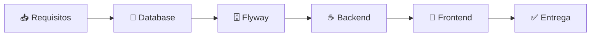

# 📁 Workflows ZNS

---

**metodología**: ZNS v2.2  
**última_actualización**: 2026-02-07  
**versión**: 1.4.0
**propósito**: Repositorio de workflows de orquestación de agentes

---

## 🚀 INICIO RÁPIDO

```
/zns
```

> ☝️ **Escribe `/zns` para abrir el menú interactivo con todos los workflows disponibles**

Ver: [WF-MAIN-000-orquestador-principal.md](WF-MAIN-000-orquestador-principal.md)

---

## 📋 Descripción

Esta carpeta contiene los **workflows de orquestación** que coordinan múltiples agentes especializados para completar tareas complejas de manera estructurada y trazable.

Cada workflow define:
- **Secuencia de pasos** con dependencias claras
- **Agentes involucrados** y sus responsabilidades
- **Interfaces de comunicación** entre agentes
- **Estrategias de resiliencia** y manejo de errores
- **Métricas de calidad** y criterios de éxito
- **Comandos de ejecución** para disparar el workflow

---

## 🗂️ Catálogo de Workflows

| ID | Nombre | Descripción | Comando | Archivo |
|----|--------|-------------|---------|---------|
| **WF-MAIN-000** | 🎼 Orquestador Principal | Menú interactivo con todos los workflows | `/zns` | [Especificación](WF-MAIN-000-orquestador-principal.md) |
| **WF-DEV-001** | 💻 Desarrollo Full-Stack | Orquesta desarrollo completo de features | `/workflow:dev` | [Especificación](WF-DEV-001-desarrollo-fullstack.md) |
| **WF-HUT-001** | 📋 Technical User Stories | Creación y refinamiento de HUTs desde HUs de negocio | `/workflow:hut` | [Especificación](WF-HUT-001-technical-user-stories.md) |
| **WF-QA-001** | 🔍 Quality Assurance | Validación de código vs HUTs | `/workflow:qa` | [Especificación](WF-QA-001-quality-assurance.md) |
| **WF-DEPLOY-001** | 🚀 Despliegue AWS | Infraestructura, CI/CD y deploy en AWS | `/workflow:deploy` | [Especificación](WF-DEPLOY-001-despliegue-aws.md) |

---

## 🚀 Comandos Rápidos por Workflow

### WF-DEPLOY-001: Despliegue AWS

| Comando | Descripción | Uso |
|---------|-------------|-----|
| `/workflow:deploy` | Despliegue completo | Infra + App + Validación |
| `/deploy:init` | Verificar pre-requisitos | Antes de cualquier deploy |
| `/deploy:plan` | Terraform plan | Ver cambios de infra |
| `/deploy:infra` | Solo infraestructura | Terraform plan + apply |
| `/deploy:backend` | Solo backend | Build + Deploy backend |
| `/deploy:frontend` | Solo frontend | Build + Deploy frontend |
| `/deploy:status` | Ver estado servicios | Monitoreo |
| `/deploy:logs` | Ver logs recientes | Debug |
| `/deploy:rollback` | Revertir versión | Emergencia |

#### Ejemplos de Uso:

```markdown
# Despliegue completo a desarrollo
/workflow:deploy
ENV: dev
VERSION: 1.2.0
COMPONENTES: ALL

# Solo infraestructura
/deploy:infra
ENV: staging

# Solo backend con nueva versión
/deploy:backend
VERSION: 1.2.1
COMPONENTES: api-gateway, ms-usuarios

# Rollback de emergencia
/deploy:rollback
VERSION_OBJETIVO: 1.1.0
AMBIENTE: prod
```

### WF-HUT-001: Technical User Stories

| Comando | Descripción | Uso |
|---------|-------------|-----|
| `/workflow:hut` | Descomposición completa de HU | Cuando hay nueva HU de negocio |
| `/workflow:hut-analyze` | Solo análisis estratégico DDD | Identificar Bounded Context y Aggregates |
| `/workflow:hut-backend` | Solo HUTs de backend | Cuando frontend ya tiene HUTs |
| `/workflow:hut-frontend` | Solo HUTs de frontend | Cuando backend ya tiene HUTs |
| `/workflow:hut-validate` | Validar HUTs existentes | Antes de iniciar desarrollo |

#### Ejemplos de Uso:

```markdown
# Descomposición completa de HU
@agent: Ejecuta WF-HUT-001 para HU-XXX
Usa: 0.1-workflow/WF-HUT-001-prompts-invocacion.md

# Solo análisis DDD
@agent: Ejecuta STEP-001 y STEP-002 de WF-HUT-001 para HU-XXX
```

### WF-DEV-001: Desarrollo Full-Stack

| Comando | Descripción | Uso |
|---------|-------------|-----|
| `/workflow:dev` | Desarrollo feature completo | Cuando hay requisitos nuevos |
| `/workflow:dev-full` | Ciclo completo con validación | Para features críticas |
| `/workflow:backend` | Solo desarrollo backend | Cuando frontend ya existe |
| `/workflow:database` | Solo diseño de base de datos | Crear/modificar modelo de datos |
| `/workflow:refactor` | Refactoring guiado | Mejorar código existente |
| `/workflow:fix` | Corrección de defectos | Resolver bugs reportados |

#### Ejemplos de Uso:

```markdown
# Desarrollo completo de feature
/workflow:dev
FEATURE: Sistema de reservas de tutorías
CONTEXTO: Proyecto MI-TOGA, módulo bookings
REQUISITOS: [pegar historia de usuario]

# Solo backend
/workflow:backend
FEATURE: API de notificaciones
MODELO_DATOS: Ya existe en schema notifications_schema
REQUISITOS: Endpoints CRUD para notificaciones

# Solo diseño de BD
/workflow:database
BOUNDED_CONTEXT: payments
ENTIDADES: Payment, Invoice, Transaction
REQUISITOS: Integración con pasarela de pagos

# Refactoring
/workflow:refactor
ALCANCE: Módulo de autenticación
OBJETIVO: Migrar a Arquitectura Hexagonal
RESTRICCIONES: No romper API existente

# Fix de bug
/workflow:fix
DEFECTO: Timeout en consulta de reservas
ERROR_LOG: [pegar stack trace]
IMPACTO: Crítico - producción afectada
```

---

## 📄 Archivos por Workflow

### WF-DEV-001: Desarrollo Full-Stack

| Archivo | Propósito | Contenido |
|---------|-----------|-----------|
| [WF-DEV-001-desarrollo-fullstack.md](WF-DEV-001-desarrollo-fullstack.md) | Especificación principal | Diagrama de flujo, agentes, steps, interfaces, resiliencia |
| [WF-DEV-001-prompts-invocacion.md](WF-DEV-001-prompts-invocacion.md) | Prompts de invocación | Templates listos para invocar cada agente |

#### Agentes Orquestados:

| Agente | Rol | Step | Responsabilidad |
|--------|-----|------|-----------------|
| **AGT-DATABASE** | PostgreSQL Expert | STEP-002 | Diseño de modelo de datos con Dual Key Pattern |
| **AGT-FLYWAY** | Migration Expert | STEP-003 | Scripts de migración versionados (V*.sql, U*.sql) |
| **AGT-BACKEND** | Spring Boot Senior | STEP-004 | Desarrollo backend con Arquitectura Hexagonal |
| **AGT-FRONTEND** | Angular Senior | STEP-005 | Desarrollo frontend con Standalone Components |

#### Flujo de Ejecución:



---

## 🏗️ Estructura de un Workflow

Cada workflow contiene:

```
WF-{ID}-{nombre}/
├── WF-{ID}-{nombre}.md           # Especificación principal
├── WF-{ID}-prompts-invocacion.md # Prompts para invocar cada agente
├── WF-{ID}-diagrama.mermaid      # Diagrama visual (opcional)
└── WF-{ID}-checklist.md          # Checklist de ejecución (opcional)
```

---

## 📐 Estándares Aplicados

Los workflows siguen estos estándares:

| Estándar | Aplicación |
|----------|------------|
| **IEEE 2830-2021** | Trazabilidad y explicabilidad de decisiones |
| **IEEE 2755-2017** | Patrones de automatización inteligente |
| **ISO/IEC 25010** | Criterios de calidad de software |
| **ISO/IEC 11179** | Estándares de naming para metadatos y base de datos |
| **BPMN 2.0** | Notación para modelado de procesos |

---

## 🚀 Cómo Usar un Workflow

### Método 1: Comando Rápido

Usa el comando apropiado según tu necesidad:

```markdown
/workflow:dev
FEATURE: [descripción de la feature]
CONTEXTO: [proyecto y módulo]
REQUISITOS: [historia de usuario o requisitos]
```

### Método 2: Invocación Completa

#### Paso 1: Seleccionar el Workflow

| Si necesitas... | Usa | Comando |
|-----------------|-----|---------|
| Desarrollar feature full-stack | WF-DEV-001 | `/workflow:dev` |
| Solo diseño de BD | WF-DEV-001 (parcial) | `/workflow:database` |
| Solo backend | WF-DEV-001 (parcial) | `/workflow:backend` |
| Refactoring | WF-DEV-001 (modo refactor) | `/workflow:refactor` |

#### Paso 2: Preparar los Inputs

Cada workflow especifica los inputs requeridos. Ejemplo para WF-DEV-001:

```markdown
## Inputs Requeridos

- Historia de Usuario o Requisitos
- Bounded Context (para BD)
- Especificaciones de API (si existen)
- Diseños UI/UX (si existen)
- Contexto de arquitectura actual
```

#### Paso 3: Invocar al Orquestador

```markdown
@orchestrator ejecutar WF-DEV-001 con:
  - historia_usuario: [contenido]
  - bounded_context: [nombre_schema]
  - prioridad: alta
  - entorno: desarrollo
```

#### Paso 4: Monitorear la Ejecución

El orquestador reportará:
- ✅ Inicio/fin de cada step
- 📊 Progreso porcentual
- ⚠️ Warnings encontrados
- 💾 Checkpoints guardados

### Paso 5: Revisar Outputs

Al finalizar, se generarán:
- Modelo de datos (DDL PostgreSQL)
- Scripts de migración Flyway
- Código fuente (Backend + Frontend)
- Tests automatizados
- Documentación actualizada
- Resumen de la feature

---

## 📊 Métricas de Workflows

### Tiempos Típicos

| Workflow | Tiempo Mínimo | Tiempo Promedio | Tiempo Máximo |
|----------|---------------|-----------------|---------------|
| WF-DEV-001 (Full) | 4 horas | 6 horas | 10 horas |
| WF-DEV-001 (Database) | 30 min | 1 hora | 2 horas |
| WF-DEV-001 (Backend) | 2 horas | 3 horas | 5 horas |
| WF-DEV-001 (Frontend) | 2 horas | 3 horas | 5 horas |

### Tasas de Éxito

| Workflow | Éxito Primera Vez | Con Correcciones | Total |
|----------|-------------------|------------------|-------|
| WF-DEV-001 | 70% | 95% | 99% |

---

## 🔧 Crear un Nuevo Workflow

Para crear un nuevo workflow, usa el template base:

```markdown
# 🎼 Workflow: {Nombre del Workflow}

## Metadata
- **ID**: WF-{CAT}-{NUM}
- **Versión**: 1.0.0
- **Fecha**: YYYY-MM-DD

## Objetivo
{Descripción del objetivo del workflow}

## Comandos de Ejecución
| Comando | Descripción |
|---------|-------------|
| /workflow:{nombre} | {descripción} |

## Agentes Involucrados
| ID | Rol | Step | Prompt |
|----|-----|------|--------|
| AGT-XXX | ... | STEP-00X | ... |

## Diagrama de Flujo
{Diagrama Mermaid}

## Especificación de Steps
{Detalle de cada step}

## Interfaces
{Contratos entre agentes}

## Resiliencia
{Políticas de retry y manejo de errores}
```

---

## 📎 Referencias

| Recurso | Ubicación |
|---------|-----------|
| Prompt Orquestador | `1-agents/ZNS-Orchestrator/prompt-orquestador-workflows-senior.md` |
| Agente Database PostgreSQL | `1-agents/ZNS-develop-Agent/4.database_senior/prompt_dev_database_senior.md` |
| Agente Flyway | `1-agents/ZNS-develop-Agent/1.backend_senior/prompt_dev_senior_flyway.md` |
| Agente Backend Spring Boot | `1-agents/ZNS-develop-Agent/1.backend_senior/prompt-dev-springboot-senior.md` |
| Agente Frontend Angular | `1-agents/ZNS-develop-Agent/2.frontend_senior/prompt-dev-frontend-angular-senior.md` |
| Metodología ZNS | `README.md` |

---

## 📝 Changelog

| Fecha | Versión | Cambio |
|-------|---------|--------|
| 2026-02-07 | 1.4.0 | Agregado WF-DEPLOY-001 (Despliegue AWS) |
| 2026-02-07 | 1.3.0 | Optimización de banners y terminal interactiva |
| 2025-02-06 | 1.1.0 | Agregado AGT-DATABASE al WF-DEV-001, documentación de comandos |
| 2025-02-06 | 1.0.0 | Creación de WF-DEV-001 (Desarrollo Full-Stack) |
