# 🚀 Workflow de Despliegue AWS: Infraestructura + CI/CD + Monitoreo

---

**metodo**: ZNS v2.2  
**workflow_id**: WF-DEPLOY-001  
**version**: 1.0.0  
**fecha_creacion**: 2026-02-07  
**ultima_actualizacion**: 2026-02-07  
**autor**: Orchestration Architect Senior  
**tipo**: Despliegue y Aprovisionamiento de Infraestructura AWS  

**estandares_aplicados**:
- IEEE 828-2012: Configuration Management in Systems and Software Engineering
- IEEE 12207-2017: Software Life Cycle Processes
- ISO/IEC 27001:2022: Information Security Management
- AWS Well-Architected Framework
- Terraform Best Practices
- GitFlow Branching Strategy
- Conventional Commits 1.0.0

**changelog**:
- v1.0.0: Versión inicial del workflow de despliegue (2026-02-07)

---

## 🖥️ WF-DEPLOY-001 | Paso 0/8 | ░░░░░░░░░░ 0%
**📍 Fase**: INIT | **⏱️**: 00:00 | **🎯 Tipo**: 🟠 Decisión

> **¿Qué tipo de despliegue ejecutar?**
> A) 🔧 Solo Infraestructura (Terraform)
> B) 📦 Solo Aplicación (Backend/Frontend/Flyway)
> C) 🚀 Completo (Infraestructura + Aplicación)
> D) 🔄 Rollback (Revertir versión)

| Cmd | Acción | | Cmd | Acción |
|:---:|--------|---|:---:|--------|
| `1/c` | ▶️ Continuar | | `3/m` | ✏️ Modificar |
| `2/r` | 🔍 Revisar | | `4/p` | ⏸️ Pausar |
| `5/x` | ❌ Cancelar | | `6/h` | 📚 Ayuda |

**👤 Respuesta:** `___`

<details><summary>📊 Historial de Decisiones</summary>

| # | ⏰ Hora | 📍 Paso | 💬 Pregunta | ✅ Decisión |
|:-:|:------:|:------:|-------------|-------------|
| - | - | - | _Workflow no iniciado_ | - |

</details>

---

### 📜 LOG DE EJECUCIÓN (Plegable)

<details>
<summary>📂 <strong>STEP-000: Verificar Pre-requisitos</strong> ⏳ Pendiente</summary>

_Validación de credenciales AWS, Terraform, Docker pendiente_

</details>

<details>
<summary>📂 <strong>STEP-001: Mapeo de Proyecto</strong> ⏳ Pendiente</summary>

_Identificación de componentes a desplegar pendiente_

</details>

<details>
<summary>📂 <strong>STEP-002: Actualización Git</strong> ⏳ Pendiente</summary>

_Commit, tag y push de versión pendiente_

</details>

<details>
<summary>📂 <strong>STEP-003: Terraform Plan</strong> ⏳ Pendiente</summary>

_Planificación de cambios de infraestructura pendiente_

</details>

<details>
<summary>📂 <strong>STEP-004: Terraform Apply</strong> ⏳ Pendiente</summary>

_Aprovisionamiento de infraestructura pendiente_

</details>

<details>
<summary>📂 <strong>STEP-005: Build & Push Imágenes</strong> ⏳ Pendiente</summary>

_Construcción y publicación de imágenes Docker pendiente_

</details>

<details>
<summary>📂 <strong>STEP-006: Deploy Aplicación</strong> ⏳ Pendiente</summary>

_Despliegue de aplicación en ECS/EKS pendiente_

</details>

<details>
<summary>📂 <strong>STEP-007: Validación Post-Deploy</strong> ⏳ Pendiente</summary>

_Health checks y smoke tests pendiente_

</details>

---

### 🔔 NOTIFICACIONES

| ⚠️ | Mensaje |
|:--:|---------|
| 🟡 | Esperando selección de tipo de despliegue... |

---

## 📋 RESUMEN EJECUTIVO

### Objetivo del Workflow

Este workflow orquesta el **despliegue completo en AWS**, coordinando:

| Agente | Rol | Artefactos |
|--------|-----|------------|
| **AGT-TERRAFORM** | Senior Terraform Engineer | Módulos IaC, State management, Outputs |
| **AGT-FINDEVSECOPS** | FinDevSecOps Engineer | Seguridad, Costos, Compliance |
| **AGT-CICD** | CI/CD Specialist | Pipelines, Build, Deploy |

### Métricas Objetivo

| Métrica | Valor Objetivo | Umbral Mínimo |
|---------|----------------|---------------|
| **Tiempo Deploy Infra** | ≤ 15 min | ≤ 30 min |
| **Tiempo Deploy App** | ≤ 10 min | ≤ 20 min |
| **Zero Downtime** | 100% | 99.9% |
| **Rollback Time** | ≤ 5 min | ≤ 10 min |

---

## 🏗️ MAPA DE PROYECTOS DESPLEGABLES

### Estructura del Proyecto MI-TOGA

```yaml
proyectos:
  backend:
    flyway:
      path: "0-docs/4-source-code/0-backend/2-mitoga-flyway"
      tipo: "database-migration"
      tecnologia: "Flyway + Spring Boot"
      imagen_docker: false
      deploy_target: "ECS Task (one-shot)"
      comandos:
        local: |
          cd 0-docs/4-source-code/0-backend/2-mitoga-flyway
          $env:SPRING_PROFILES_ACTIVE="dev"
          .\gradlew.bat bootRun --no-daemon
        docker_build: "N/A (usa imagen base de Flyway)"
        migrate: |
          flyway -configFiles=flyway.conf migrate
        info: |
          flyway -configFiles=flyway.conf info
      
    api-gateway:
      path: "0-docs/4-source-code/0-backend/1-apigateway-service"
      tipo: "microservice"
      tecnologia: "Spring Boot 3.x"
      imagen_docker: true
      deploy_target: "ECS Fargate"
      puerto: 8080
      health_endpoint: "/actuator/health"
      comandos:
        local: |
          cd 0-docs/4-source-code/0-backend/1-apigateway-service
          $env:SPRING_PROFILES_ACTIVE="dev"
          .\gradlew.bat bootRun --no-daemon
        docker_build: |
          docker build -t mitoga/apigateway:${VERSION} .
        docker_push: |
          docker tag mitoga/apigateway:${VERSION} ${ECR_REGISTRY}/mitoga/apigateway:${VERSION}
          docker push ${ECR_REGISTRY}/mitoga/apigateway:${VERSION}
      
    ms-usuarios:
      path: "0-docs/4-source-code/0-backend/3-msusuarios"
      tipo: "microservice"
      tecnologia: "Spring Boot 3.x"
      imagen_docker: true
      deploy_target: "ECS Fargate"
      puerto: 8081
      health_endpoint: "/actuator/health"
      comandos:
        local: |
          cd 0-docs/4-source-code/0-backend/3-msusuarios
          $env:SPRING_PROFILES_ACTIVE="dev"
          .\gradlew.bat bootRun --no-daemon
        docker_build: |
          docker build -t mitoga/msusuarios:${VERSION} .
        docker_push: |
          docker tag mitoga/msusuarios:${VERSION} ${ECR_REGISTRY}/mitoga/msusuarios:${VERSION}
          docker push ${ECR_REGISTRY}/mitoga/msusuarios:${VERSION}

  frontend:
    webapp:
      path: "0-docs/4-source-code/1-frontend/apps"
      tipo: "spa"
      tecnologia: "Angular 17+"
      imagen_docker: true
      deploy_target: "S3 + CloudFront | ECS Nginx"
      puerto: 80
      comandos:
        local: |
          cd 0-docs/4-source-code/1-frontend/apps
          npm install
          npm run start
        build_prod: |
          npm run build -- --configuration=production
        docker_build: |
          docker build -t mitoga/webapp:${VERSION} .
        docker_push: |
          docker tag mitoga/webapp:${VERSION} ${ECR_REGISTRY}/mitoga/webapp:${VERSION}
          docker push ${ECR_REGISTRY}/mitoga/webapp:${VERSION}

  infraestructura:
    terraform:
      path: "0-docs/6-infrastructure/0-terraform"
      tipo: "iac"
      tecnologia: "Terraform 1.6+"
      state_backend: "S3 + DynamoDB"
      ambientes: ["dev", "staging", "prod"]
      comandos:
        init: |
          cd 0-docs/6-infrastructure/0-terraform
          make init ENV=${ENV}
        plan: |
          make plan ENV=${ENV}
        apply: |
          make apply ENV=${ENV}
        destroy: |
          make destroy ENV=${ENV}
        output: |
          make output ENV=${ENV}
```

---

## 🔄 DIAGRAMA DE FLUJO

```mermaid
flowchart TB
    subgraph INIT["🎬 INICIALIZACIÓN"]
        START([▶️ Inicio Deploy]) --> CHECK_TYPE{🎯 Tipo de<br>Despliegue?}
    end
    
    subgraph PREREQ["📋 STEP-000: Pre-requisitos"]
        CHECK_TYPE -->|Cualquiera| PREREQ_AWS[🔐 Verificar AWS CLI]
        PREREQ_AWS --> PREREQ_TF[📦 Verificar Terraform]
        PREREQ_TF --> PREREQ_DOCKER[🐳 Verificar Docker]
        PREREQ_DOCKER --> PREREQ_OK{✅ Todo OK?}
        PREREQ_OK -->|❌ No| FIX_PREREQ[🔧 Corregir]
        FIX_PREREQ --> PREREQ_AWS
    end
    
    subgraph MAP["🗺️ STEP-001: Mapeo Proyecto"]
        PREREQ_OK -->|✅ Sí| SELECT_ENV[🌍 Seleccionar Ambiente]
        SELECT_ENV --> SELECT_COMP[📦 Seleccionar Componentes]
        SELECT_COMP --> MAP_DEPS[🔗 Mapear Dependencias]
    end
    
    subgraph GIT["📝 STEP-002: Git Update"]
        MAP_DEPS --> GIT_STATUS[📊 Git Status]
        GIT_STATUS --> GIT_COMMIT[💾 Commit Cambios]
        GIT_COMMIT --> GIT_TAG[🏷️ Crear Tag Versión]
        GIT_TAG --> GIT_PUSH[⬆️ Push a Remote]
    end
    
    subgraph INFRA["🏗️ STEP-003/004: Terraform"]
        GIT_PUSH --> TF_INIT[🔧 terraform init]
        TF_INIT --> TF_PLAN[📋 terraform plan]
        TF_PLAN --> TF_REVIEW{👀 Revisar Plan?}
        TF_REVIEW -->|✅ Aprobar| TF_APPLY[⚡ terraform apply]
        TF_REVIEW -->|❌ Rechazar| ABORT_INFRA[🛑 Abortar]
        TF_APPLY --> TF_OUTPUT[📤 Capturar Outputs]
    end
    
    subgraph BUILD["🔨 STEP-005: Build"]
        TF_OUTPUT --> BUILD_DECISION{📦 Qué construir?}
        BUILD_DECISION -->|Backend| BUILD_BACKEND[☕ Build Backend]
        BUILD_DECISION -->|Frontend| BUILD_FRONTEND[🎨 Build Frontend]
        BUILD_DECISION -->|Flyway| BUILD_FLYWAY[🗄️ Prep Flyway]
        BUILD_DECISION -->|Todos| BUILD_ALL[🔄 Build Todos]
        
        BUILD_BACKEND --> DOCKER_BUILD[🐳 Docker Build]
        BUILD_FRONTEND --> DOCKER_BUILD
        BUILD_FLYWAY --> ECR_PUSH
        BUILD_ALL --> DOCKER_BUILD
        
        DOCKER_BUILD --> ECR_PUSH[📤 Push ECR]
    end
    
    subgraph DEPLOY["🚀 STEP-006: Deploy"]
        ECR_PUSH --> DEPLOY_ORDER{📋 Orden Deploy}
        DEPLOY_ORDER --> FLYWAY_RUN[🗄️ Ejecutar Flyway]
        FLYWAY_RUN --> DEPLOY_BACKEND[☕ Deploy Backend ECS]
        DEPLOY_BACKEND --> DEPLOY_FRONTEND[🎨 Deploy Frontend]
        DEPLOY_FRONTEND --> WAIT_HEALTHY[⏳ Esperar Healthy]
    end
    
    subgraph VALIDATE["✅ STEP-007: Validación"]
        WAIT_HEALTHY --> HEALTH_CHECK[💚 Health Checks]
        HEALTH_CHECK --> SMOKE_TEST[🧪 Smoke Tests]
        SMOKE_TEST --> VALIDATE_OK{✅ Todo OK?}
        VALIDATE_OK -->|❌ No| ROLLBACK[🔙 Rollback]
        VALIDATE_OK -->|✅ Sí| NOTIFY_SUCCESS[📢 Notificar Éxito]
        ROLLBACK --> NOTIFY_FAIL[📢 Notificar Fallo]
    end
    
    subgraph END_STATE["🏁 FIN"]
        NOTIFY_SUCCESS --> FINISH([✅ Deploy Exitoso])
        NOTIFY_FAIL --> FINISH_FAIL([❌ Deploy Fallido])
        ABORT_INFRA --> FINISH_ABORT([🛑 Abortado])
    end
    
    style INIT fill:#E3F2FD
    style PREREQ fill:#FFF3E0
    style MAP fill:#E8F5E9
    style GIT fill:#FCE4EC
    style INFRA fill:#F3E5F5
    style BUILD fill:#FFFDE7
    style DEPLOY fill:#E0F7FA
    style VALIDATE fill:#F1F8E9
    style END_STATE fill:#ECEFF1
```



---

## 📘 ESPECIFICACIÓN DE STEPS

---

### STEP-000: Verificar Pre-requisitos

```yaml
step_id: STEP-000
nombre: "Verificar Pre-requisitos"
duracion_estimada: "5-10 min"
tipo: "validacion"
agente: "AGT-FINDEVSECOPS"

objetivo: |
  Validar que todas las herramientas y credenciales están disponibles
  antes de iniciar cualquier operación de despliegue.

verificaciones:
  aws_cli:
    nombre: "AWS CLI v2"
    comando_verificacion: |
      aws --version
      # Esperado: aws-cli/2.x.x ...
    comando_identidad: |
      aws sts get-caller-identity
      # Verificar: Account, UserId, Arn
    variables_requeridas:
      - AWS_ACCESS_KEY_ID
      - AWS_SECRET_ACCESS_KEY
      - AWS_DEFAULT_REGION
    
  terraform:
    nombre: "Terraform >= 1.6.0"
    comando_verificacion: |
      terraform version
      # Esperado: Terraform v1.6.x
    archivos_requeridos:
      - "0-docs/6-infrastructure/0-terraform/main.tf"
      - "0-docs/6-infrastructure/0-terraform/backend.tf"
    
  docker:
    nombre: "Docker Desktop"
    comando_verificacion: |
      docker --version
      docker info
      # Verificar: Server is running
    test_build: |
      docker build --help
      
  git:
    nombre: "Git >= 2.40"
    comando_verificacion: |
      git --version
      git remote -v
      git status
    verificar_branch: |
      git branch --show-current
      # Verificar: rama válida (develop, main, feature/*)

validaciones_adicionales:
  - nombre: "Conexión a ECR"
    comando: |
      aws ecr get-login-password --region us-east-1 | docker login --username AWS --password-stdin ${ECR_REGISTRY}
  
  - nombre: "Acceso a S3 State"
    comando: |
      aws s3 ls s3://mitoga-terraform-state-291693949618/

salida:
  formato: "YAML"
  contenido: |
    prereq_check:
      timestamp: "${TIMESTAMP}"
      status: "PASS|FAIL"
      checks:
        aws_cli: { version: "2.x.x", identity: "...", status: "OK" }
        terraform: { version: "1.6.x", status: "OK" }
        docker: { version: "24.x", daemon: "running", status: "OK" }
        git: { version: "2.x", branch: "...", status: "OK" }
      failed_checks: []

errores_comunes:
  - error: "Unable to locate credentials"
    solucion: |
      aws configure
      # O exportar variables:
      $env:AWS_ACCESS_KEY_ID="..."
      $env:AWS_SECRET_ACCESS_KEY="..."
      $env:AWS_DEFAULT_REGION="us-east-1"
      
  - error: "Docker daemon is not running"
    solucion: |
      # Windows: Iniciar Docker Desktop
      Start-Process "C:\Program Files\Docker\Docker\Docker Desktop.exe"
      
  - error: "terraform init required"
    solucion: |
      cd 0-docs/6-infrastructure/0-terraform
      make init ENV=dev
```

---

### STEP-001: Mapeo de Proyecto

```yaml
step_id: STEP-001
nombre: "Mapeo de Proyecto a Desplegar"
duracion_estimada: "5-10 min"
tipo: "configuracion"
agente: "AGT-TERRAFORM"

objetivo: |
  Identificar y configurar qué componentes del proyecto se van a desplegar,
  incluyendo sus dependencias y orden de despliegue.

proceso:
  - paso: 1
    accion: "Seleccionar Ambiente"
    interaccion: |
      ╔══════════════════════════════════════════════════╗
      ║  🌍 SELECCIONAR AMBIENTE DE DESPLIEGUE           ║
      ╠══════════════════════════════════════════════════╣
      ║  [1] 🟢 dev      - Desarrollo                    ║
      ║  [2] 🟡 staging  - Pre-producción                ║
      ║  [3] 🔴 prod     - Producción                    ║
      ╚══════════════════════════════════════════════════╝
      
      👉 Ingrese opción (1-3): ___
    validacion: |
      ambiente: ${SELECCION}
      aprobacion_requerida:
        dev: false
        staging: true  # Requiere confirmación
        prod: true     # Requiere doble confirmación
        
  - paso: 2
    accion: "Seleccionar Componentes"
    interaccion: |
      ╔══════════════════════════════════════════════════════════╗
      ║  📦 COMPONENTES DISPONIBLES PARA DEPLOY                  ║
      ╠══════════════════════════════════════════════════════════╣
      ║  BACKEND:                                                ║
      ║    [B1] 🗄️  Flyway Migrations  (2-mitoga-flyway)        ║
      ║    [B2] 🚪  API Gateway        (1-apigateway-service)   ║
      ║    [B3] 👤  MS Usuarios        (3-msusuarios)           ║
      ║                                                          ║
      ║  FRONTEND:                                               ║
      ║    [F1] 🎨  WebApp Angular     (apps)                   ║
      ║                                                          ║
      ║  INFRAESTRUCTURA:                                        ║
      ║    [I1] 🏗️  Terraform IaC      (0-terraform)            ║
      ║                                                          ║
      ║  SHORTCUTS:                                              ║
      ║    [ALL]  Todos los componentes                          ║
      ║    [BE]   Solo Backend (B1+B2+B3)                        ║
      ║    [FE]   Solo Frontend (F1)                             ║
      ║    [INF]  Solo Infraestructura (I1)                      ║
      ╚══════════════════════════════════════════════════════════╝
      
      👉 Ingrese componentes (ej: B1,B2,F1 o ALL): ___

  - paso: 3
    accion: "Resolver Dependencias"
    logica: |
      dependencias:
        flyway:
          requiere: ["infraestructura_db"]
          orden: 1
        api-gateway:
          requiere: ["flyway", "ecr", "ecs"]
          orden: 2
        ms-usuarios:
          requiere: ["flyway", "ecr", "ecs"]
          orden: 3
        webapp:
          requiere: ["api-gateway"]
          orden: 4
          
      # Generar orden de despliegue automático
      deploy_order: 
        - component: "terraform"
          when: "infraestructura seleccionada"
        - component: "flyway"
          when: "always if db changes"
        - component: "api-gateway"
          when: "backend seleccionado"
        - component: "ms-usuarios"
          when: "backend seleccionado"
        - component: "webapp"
          when: "frontend seleccionado"

salida:
  archivo: "deploy-manifest-${AMBIENTE}-${TIMESTAMP}.yaml"
  contenido: |
    deploy_manifest:
      timestamp: "${TIMESTAMP}"
      ambiente: "${AMBIENTE}"
      version: "${VERSION}"
      componentes:
        - id: "flyway"
          path: "0-docs/4-source-code/0-backend/2-mitoga-flyway"
          orden: 1
          status: "pending"
        - id: "api-gateway"
          path: "0-docs/4-source-code/0-backend/1-apigateway-service"
          orden: 2
          status: "pending"
      dependencias_resueltas: true
```

---

### STEP-002: Actualización Git

```yaml
step_id: STEP-002
nombre: "Actualización Git y Versionado"
duracion_estimada: "5 min"
tipo: "version-control"
agente: "AGT-FINDEVSECOPS"

objetivo: |
  Asegurar que todos los cambios están commiteados, crear tag de versión
  y sincronizar con el repositorio remoto.

nomenclatura_version:
  patron: "MAJOR.MINOR.PATCH"
  ejemplos:
    - "1.0.0" # Release inicial
    - "1.1.0" # Nueva feature
    - "1.1.1" # Hotfix/patch
  tags:
    patron: "v${VERSION}-${AMBIENTE}"
    ejemplos:
      - "v1.2.0-dev"
      - "v1.2.0-staging"
      - "v1.2.0-prod"

proceso:
  - paso: 1
    nombre: "Verificar Estado Git"
    comandos: |
      # Verificar rama actual
      git branch --show-current
      
      # Verificar cambios pendientes
      git status --porcelain
      
      # Verificar commits no pusheados
      git log origin/$(git branch --show-current)..HEAD --oneline

  - paso: 2
    nombre: "Commit de Cambios"
    interaccion: |
      ¿Hay cambios sin commitear? (git status)
      
      Si hay cambios:
      1. Revisar archivos modificados
      2. Agregar al staging: git add .
      3. Crear commit con mensaje Conventional Commits:
         
         git commit -m "feat(deploy): ${DESCRIPCION}
         
         - Componentes: ${COMPONENTES}
         - Ambiente: ${AMBIENTE}
         - Ticket: ${TICKET_ID}"
    
  - paso: 3
    nombre: "Crear Tag de Versión"
    comandos: |
      # Obtener última versión
      git describe --tags --abbrev=0 2>$null || echo "v0.0.0"
      
      # Crear nuevo tag
      $VERSION = Read-Host "Ingrese nueva versión (ej: 1.2.0)"
      $TAG = "v${VERSION}-${AMBIENTE}"
      
      git tag -a $TAG -m "Release ${VERSION} para ${AMBIENTE}
      
      Componentes desplegados:
      ${COMPONENTES_LISTA}
      
      Cambios incluidos:
      $(git log $(git describe --tags --abbrev=0 2>$null)..HEAD --oneline)"
      
  - paso: 4
    nombre: "Push a Remoto"
    comandos: |
      # Push de cambios
      git push origin $(git branch --show-current)
      
      # Push de tags
      git push origin --tags
      
      # Verificar sincronización
      git log --oneline -5

validaciones:
  - "Branch protegido requiere PR para prod"
  - "Tags deben ser únicos"
  - "Commits deben seguir Conventional Commits"

salida:
  git_info:
    branch: "${BRANCH}"
    commit: "${COMMIT_SHA}"
    tag: "${TAG}"
    pushed: true
```

---

### STEP-003: Terraform Plan

```yaml
step_id: STEP-003
nombre: "Terraform Plan - Planificación de Infraestructura"
duracion_estimada: "5-10 min"
tipo: "infraestructura"
agente: "AGT-TERRAFORM"

objetivo: |
  Generar y revisar el plan de cambios de infraestructura antes de aplicar.

prerequisitos:
  - "STEP-000 completado (pre-requisitos OK)"
  - "STEP-001 completado (componentes mapeados)"
  - "STEP-002 completado (git actualizado)"

proceso:
  - paso: 1
    nombre: "Inicializar Terraform"
    directorio: "0-docs/6-infrastructure/0-terraform"
    comandos:
      windows_powershell: |
        cd "d:\Documents\2.maldivati_workspace\00-anwico\2.MI-TOGA\0-docs\6-infrastructure\0-terraform"
        
        # Inicializar con backend del ambiente
        terraform init -reconfigure -backend-config="environments/${ENV}/backend.tfvars"
        
        # O usar Makefile
        make init ENV=${ENV}
      
  - paso: 2
    nombre: "Seleccionar Workspace"
    comandos: |
      # Listar workspaces
      terraform workspace list
      
      # Seleccionar o crear workspace
      terraform workspace select ${ENV} || terraform workspace new ${ENV}
      
  - paso: 3
    nombre: "Generar Plan"
    comandos:
      windows_powershell: |
        # Generar plan y guardar
        terraform plan `
          -var-file="environments/${ENV}/terraform.tfvars" `
          -out="tfplan.${ENV}" `
          -detailed-exitcode
        
        # Códigos de salida:
        # 0 = Sin cambios
        # 1 = Error
        # 2 = Cambios pendientes
        
        # O usar Makefile
        make plan ENV=${ENV}

  - paso: 4
    nombre: "Revisar Plan"
    interaccion: |
      ╔══════════════════════════════════════════════════════════════╗
      ║  📋 TERRAFORM PLAN SUMMARY                                   ║
      ╠══════════════════════════════════════════════════════════════╣
      ║                                                              ║
      ║  🟢 Recursos a CREAR:    ${ADD_COUNT}                       ║
      ║  🟡 Recursos a MODIFICAR: ${CHANGE_COUNT}                   ║
      ║  🔴 Recursos a DESTRUIR:  ${DESTROY_COUNT}                  ║
      ║                                                              ║
      ╠══════════════════════════════════════════════════════════════╣
      ║  ¿Aprobar este plan?                                         ║
      ║                                                              ║
      ║  [Y] ✅ Sí, aplicar cambios                                  ║
      ║  [N] ❌ No, cancelar                                         ║
      ║  [D] 📋 Ver detalles completos                               ║
      ╚══════════════════════════════════════════════════════════════╝
      
      👉 Respuesta: ___

comandos_rapidos:
  plan_completo: "make plan ENV=${ENV}"
  plan_target: "terraform plan -target=module.${MODULE} -var-file=environments/${ENV}/terraform.tfvars"
  plan_destroy: "make plan-destroy ENV=${ENV}"
  show_plan: "terraform show tfplan.${ENV}"

salida:
  plan_file: "tfplan.${ENV}"
  plan_summary:
    add: ${ADD_COUNT}
    change: ${CHANGE_COUNT}
    destroy: ${DESTROY_COUNT}
    approved: true|false
```

---

### STEP-004: Terraform Apply

```yaml
step_id: STEP-004
nombre: "Terraform Apply - Aprovisionamiento de Infraestructura"
duracion_estimada: "10-20 min"
tipo: "infraestructura"
agente: "AGT-TERRAFORM"

objetivo: |
  Aplicar los cambios de infraestructura aprobados en el plan.

prerequisitos:
  - "STEP-003 completado y plan aprobado"

proceso:
  - paso: 1
    nombre: "Aplicar Plan"
    comandos:
      windows_powershell: |
        cd "d:\Documents\2.maldivati_workspace\00-anwico\2.MI-TOGA\0-docs\6-infrastructure\0-terraform"
        
        # Aplicar plan guardado (más seguro)
        terraform apply tfplan.${ENV}
        
        # O aplicar directamente (menos seguro)
        # make apply ENV=${ENV}

  - paso: 2
    nombre: "Monitorear Progreso"
    indicadores: |
      ⏳ Creando VPC...
      ⏳ Creando Subnets...
      ⏳ Creando Security Groups...
      ⏳ Creando RDS Instance... (puede tomar 5-10 min)
      ⏳ Creando ECS Cluster...
      ⏳ Creando ALB...
      ✅ Apply complete!

  - paso: 3
    nombre: "Capturar Outputs"
    comandos: |
      # Obtener outputs
      terraform output -json > outputs.${ENV}.json
      
      # Outputs típicos:
      terraform output vpc_id
      terraform output rds_endpoint
      terraform output alb_dns_name
      terraform output ecr_repository_urls
      
      # O usar Makefile
      make output ENV=${ENV}

outputs_esperados:
  networking:
    - vpc_id
    - private_subnet_ids
    - public_subnet_ids
    - security_group_ids
  database:
    - rds_endpoint
    - rds_port
    - db_name
  compute:
    - ecs_cluster_arn
    - ecs_service_arns
    - alb_dns_name
    - alb_zone_id
  storage:
    - ecr_repository_urls
    - s3_bucket_names
  observability:
    - cloudwatch_log_groups
    - sns_topic_arn

manejo_errores:
  - error: "Error acquiring state lock"
    solucion: |
      # Verificar si hay otro proceso corriendo
      # Si no, forzar desbloqueo (PELIGROSO)
      terraform force-unlock ${LOCK_ID}
      
  - error: "Resource already exists"
    solucion: |
      # Importar recurso existente
      terraform import ${RESOURCE_ADDRESS} ${RESOURCE_ID}
      
  - error: "Timeout waiting for resource"
    solucion: |
      # Reintentar apply
      terraform apply tfplan.${ENV}
      # Si persiste, verificar en AWS Console
```

---

### STEP-005: Build & Push Imágenes Docker

```yaml
step_id: STEP-005
nombre: "Build y Push de Imágenes Docker"
duracion_estimada: "10-15 min"
tipo: "build"
agente: "AGT-FINDEVSECOPS"

objetivo: |
  Construir imágenes Docker de los componentes y publicarlas en ECR.

proceso:
  - paso: 1
    nombre: "Login a ECR"
    comandos:
      windows_powershell: |
        # Obtener registry URL
        $ECR_REGISTRY = aws ecr describe-repositories --query 'repositories[0].repositoryUri' --output text | Split-Path -Parent
        
        # O usar el output de Terraform
        $ECR_REGISTRY = (terraform output -json | ConvertFrom-Json).ecr_registry.value
        
        # Login a ECR
        aws ecr get-login-password --region us-east-1 | docker login --username AWS --password-stdin $ECR_REGISTRY

  - paso: 2
    nombre: "Build Backend - API Gateway"
    directorio: "0-docs/4-source-code/0-backend/1-apigateway-service"
    comandos:
      windows_powershell: |
        cd "d:\Documents\2.maldivati_workspace\00-anwico\2.MI-TOGA\0-docs\4-source-code\0-backend\1-apigateway-service"
        
        # Build con Gradle primero
        .\gradlew.bat clean build -x test
        
        # Build imagen Docker
        docker build -t mitoga/apigateway:${VERSION} -t mitoga/apigateway:latest .
        
        # Tag para ECR
        docker tag mitoga/apigateway:${VERSION} ${ECR_REGISTRY}/mitoga-apigateway:${VERSION}
        docker tag mitoga/apigateway:latest ${ECR_REGISTRY}/mitoga-apigateway:latest

  - paso: 3
    nombre: "Build Backend - MS Usuarios"
    directorio: "0-docs/4-source-code/0-backend/3-msusuarios"
    comandos:
      windows_powershell: |
        cd "d:\Documents\2.maldivati_workspace\00-anwico\2.MI-TOGA\0-docs\4-source-code\0-backend\3-msusuarios"
        
        # Build con Gradle
        .\gradlew.bat clean build -x test
        
        # Build imagen Docker
        docker build -t mitoga/msusuarios:${VERSION} .
        
        # Tag para ECR
        docker tag mitoga/msusuarios:${VERSION} ${ECR_REGISTRY}/mitoga-msusuarios:${VERSION}

  - paso: 4
    nombre: "Build Frontend - WebApp"
    directorio: "0-docs/4-source-code/1-frontend/apps"
    comandos:
      windows_powershell: |
        cd "d:\Documents\2.maldivati_workspace\00-anwico\2.MI-TOGA\0-docs\4-source-code\1-frontend\apps"
        
        # Install dependencies
        npm ci
        
        # Build producción
        npm run build -- --configuration=production
        
        # Build imagen Docker (si aplica)
        docker build -t mitoga/webapp:${VERSION} .
        
        # Tag para ECR
        docker tag mitoga/webapp:${VERSION} ${ECR_REGISTRY}/mitoga-webapp:${VERSION}

  - paso: 5
    nombre: "Push Imágenes a ECR"
    comandos:
      windows_powershell: |
        # Push todas las imágenes
        docker push ${ECR_REGISTRY}/mitoga-apigateway:${VERSION}
        docker push ${ECR_REGISTRY}/mitoga-apigateway:latest
        docker push ${ECR_REGISTRY}/mitoga-msusuarios:${VERSION}
        docker push ${ECR_REGISTRY}/mitoga-webapp:${VERSION}
        
        # Verificar imágenes en ECR
        aws ecr list-images --repository-name mitoga-apigateway
        aws ecr list-images --repository-name mitoga-msusuarios
        aws ecr list-images --repository-name mitoga-webapp

validaciones:
  - nombre: "Verificar tamaño de imagen"
    comando: "docker images | Select-String mitoga"
    umbral: "< 500MB por imagen"
    
  - nombre: "Scan de vulnerabilidades"
    comando: |
      # Escaneo con Trivy
      trivy image ${ECR_REGISTRY}/mitoga-apigateway:${VERSION}
      
      # O esperar scan de ECR
      aws ecr describe-image-scan-findings --repository-name mitoga-apigateway --image-id imageTag=${VERSION}
```

---

### STEP-006: Deploy Aplicación

```yaml
step_id: STEP-006
nombre: "Deploy de Aplicación en AWS"
duracion_estimada: "10-15 min"
tipo: "deploy"
agente: "AGT-FINDEVSECOPS"

objetivo: |
  Desplegar los componentes de la aplicación en el orden correcto,
  ejecutando migraciones de BD y actualizando servicios ECS.

orden_de_despliegue:
  1_flyway: "Migraciones de Base de Datos"
  2_backend: "Servicios Backend (API Gateway, MS Usuarios)"
  3_frontend: "Frontend (WebApp)"

proceso:
  - paso: 1
    nombre: "Ejecutar Flyway Migrations"
    prioridad: "CRÍTICO - Ejecutar primero"
    comandos:
      windows_powershell: |
        # Opción 1: Ejecutar localmente contra RDS
        cd "d:\Documents\2.maldivati_workspace\00-anwico\2.MI-TOGA\0-docs\4-source-code\0-backend\2-mitoga-flyway"
        
        # Configurar conexión a RDS
        $env:FLYWAY_URL = "jdbc:postgresql://${RDS_ENDPOINT}:5432/${DB_NAME}"
        $env:FLYWAY_USER = "${DB_USER}"
        $env:FLYWAY_PASSWORD = "${DB_PASSWORD}"
        $env:SPRING_PROFILES_ACTIVE = "${ENV}"
        
        # Ejecutar migraciones
        .\gradlew.bat flywayInfo
        .\gradlew.bat flywayMigrate
        
        # Opción 2: Ejecutar como ECS Task
        aws ecs run-task `
          --cluster mitoga-${ENV}-cluster `
          --task-definition mitoga-flyway-${ENV} `
          --launch-type FARGATE `
          --network-configuration "awsvpcConfiguration={subnets=[${PRIVATE_SUBNETS}],securityGroups=[${SG_ID}],assignPublicIp=DISABLED}"
    
    verificacion: |
      # Verificar estado de migraciones
      .\gradlew.bat flywayInfo
      
      # Esperado: Todas las migraciones en estado "Success"

  - paso: 2
    nombre: "Deploy Backend Services"
    comandos:
      api_gateway: |
        # Actualizar Task Definition con nueva imagen
        aws ecs update-service `
          --cluster mitoga-${ENV}-cluster `
          --service mitoga-apigateway-${ENV} `
          --force-new-deployment `
          --task-definition mitoga-apigateway-${ENV}
        
        # Esperar estabilización
        aws ecs wait services-stable `
          --cluster mitoga-${ENV}-cluster `
          --services mitoga-apigateway-${ENV}
          
      ms_usuarios: |
        # Actualizar servicio MS Usuarios
        aws ecs update-service `
          --cluster mitoga-${ENV}-cluster `
          --service mitoga-msusuarios-${ENV} `
          --force-new-deployment
        
        # Esperar estabilización
        aws ecs wait services-stable `
          --cluster mitoga-${ENV}-cluster `
          --services mitoga-msusuarios-${ENV}

  - paso: 3
    nombre: "Deploy Frontend"
    opciones:
      opcion_s3_cloudfront: |
        # Para SPA estática en S3 + CloudFront
        cd "d:\Documents\2.maldivati_workspace\00-anwico\2.MI-TOGA\0-docs\4-source-code\1-frontend\apps"
        
        # Sync a S3
        aws s3 sync dist/ s3://mitoga-webapp-${ENV}/ --delete
        
        # Invalidar CloudFront cache
        aws cloudfront create-invalidation `
          --distribution-id ${CF_DISTRIBUTION_ID} `
          --paths "/*"
          
      opcion_ecs: |
        # Para frontend containerizado en ECS
        aws ecs update-service `
          --cluster mitoga-${ENV}-cluster `
          --service mitoga-webapp-${ENV} `
          --force-new-deployment

monitoreo_despliegue: |
  # Ver eventos de servicio
  aws ecs describe-services `
    --cluster mitoga-${ENV}-cluster `
    --services mitoga-apigateway-${ENV} `
    --query 'services[0].events[:10]'
  
  # Ver logs de tareas
  aws logs tail /ecs/mitoga-apigateway-${ENV} --follow
```

---

### STEP-007: Validación Post-Deploy

```yaml
step_id: STEP-007
nombre: "Validación Post-Despliegue"
duracion_estimada: "5-10 min"
tipo: "validacion"
agente: "AGT-FINDEVSECOPS"

objetivo: |
  Verificar que todos los componentes desplegados funcionan correctamente
  mediante health checks y smoke tests.

proceso:
  - paso: 1
    nombre: "Health Checks"
    checks:
      api_gateway:
        endpoint: "https://${ALB_DNS}/actuator/health"
        metodo: "GET"
        respuesta_esperada: |
          {
            "status": "UP",
            "components": {
              "db": { "status": "UP" },
              "diskSpace": { "status": "UP" }
            }
          }
        comando: |
          $response = Invoke-RestMethod -Uri "https://${ALB_DNS}/actuator/health" -Method GET
          if ($response.status -eq "UP") { 
            Write-Host "✅ API Gateway: HEALTHY" 
          } else { 
            Write-Host "❌ API Gateway: UNHEALTHY" 
          }
          
      ms_usuarios:
        endpoint: "https://${ALB_DNS}/api/usuarios/actuator/health"
        metodo: "GET"
        comando: |
          Invoke-RestMethod -Uri "https://${ALB_DNS}/api/usuarios/actuator/health"
          
      webapp:
        endpoint: "https://${WEBAPP_URL}"
        metodo: "GET"
        validar: "HTTP 200 + contenido HTML válido"

  - paso: 2
    nombre: "Smoke Tests"
    tests:
      - nombre: "API Login Test"
        endpoint: "POST /api/auth/login"
        body: '{"username":"test","password":"test"}'
        esperado: "HTTP 200 o 401"
        
      - nombre: "API Health Check"
        endpoint: "GET /api/health"
        esperado: "HTTP 200"
        
      - nombre: "Frontend Load Test"
        endpoint: "GET /"
        esperado: "HTTP 200, Time < 3s"

  - paso: 3
    nombre: "Verificar Logs"
    comandos: |
      # Ver últimos logs de cada servicio
      aws logs tail /ecs/mitoga-apigateway-${ENV} --since 10m
      aws logs tail /ecs/mitoga-msusuarios-${ENV} --since 10m
      
      # Buscar errores
      aws logs filter-log-events `
        --log-group-name /ecs/mitoga-apigateway-${ENV} `
        --filter-pattern "ERROR" `
        --start-time $(([DateTimeOffset]::Now.AddMinutes(-10)).ToUnixTimeMilliseconds())

  - paso: 4
    nombre: "Verificar Métricas CloudWatch"
    metricas:
      - "ECS CPUUtilization < 80%"
      - "ECS MemoryUtilization < 85%"
      - "ALB HealthyHostCount > 0"
      - "ALB UnHealthyHostCount = 0"
      - "RDS CPUUtilization < 70%"
      
    comando: |
      # Ver dashboard de CloudWatch
      aws cloudwatch get-dashboard --dashboard-name mitoga-${ENV}

decision_final: |
  ╔══════════════════════════════════════════════════════════════╗
  ║  📊 RESUMEN DE VALIDACIÓN                                    ║
  ╠══════════════════════════════════════════════════════════════╣
  ║                                                              ║
  ║  Health Checks:                                              ║
  ║    ✅ API Gateway:  HEALTHY                                  ║
  ║    ✅ MS Usuarios:  HEALTHY                                  ║
  ║    ✅ WebApp:       HEALTHY                                  ║
  ║                                                              ║
  ║  Smoke Tests:      3/3 PASSED                                ║
  ║  Errores en Logs:  0                                         ║
  ║  Métricas:         NORMAL                                    ║
  ║                                                              ║
  ╠══════════════════════════════════════════════════════════════╣
  ║  🎉 DESPLIEGUE EXITOSO                                       ║
  ║                                                              ║
  ║  Versión: ${VERSION}                                         ║
  ║  Ambiente: ${ENV}                                            ║
  ║  Timestamp: ${TIMESTAMP}                                     ║
  ╚══════════════════════════════════════════════════════════════╝

rollback_si_falla: |
  # Si alguna validación falla, ejecutar rollback automático
  # Ver STEP-008: Rollback
```

---

## 🔙 PROCEDIMIENTO DE ROLLBACK

```yaml
rollback:
  nombre: "Rollback de Emergencia"
  cuando: "Validación post-deploy falla o errores críticos en producción"
  
  proceso:
    - paso: 1
      nombre: "Identificar Versión Anterior"
      comando: |
        # Listar tags anteriores
        git tag -l --sort=-v:refname | Select-Object -First 5
        
        # Obtener task definition anterior
        aws ecs describe-services --cluster mitoga-${ENV}-cluster --services mitoga-apigateway-${ENV} --query 'services[0].taskDefinition'
        
    - paso: 2
      nombre: "Rollback ECS Services"
      comando: |
        # Rollback a task definition anterior
        aws ecs update-service `
          --cluster mitoga-${ENV}-cluster `
          --service mitoga-apigateway-${ENV} `
          --task-definition mitoga-apigateway-${ENV}:${PREVIOUS_REVISION}
          
    - paso: 3
      nombre: "Rollback Flyway (si necesario)"
      comando: |
        # ADVERTENCIA: Solo si hay migraciones problemáticas
        cd 0-docs/4-source-code/0-backend/2-mitoga-flyway
        
        # Deshacer última migración
        .\gradlew.bat flywayUndo
        
    - paso: 4
      nombre: "Rollback Terraform (si necesario)"
      comando: |
        cd 0-docs/6-infrastructure/0-terraform
        
        # Restaurar state anterior
        # ADVERTENCIA: Esto puede ser destructivo
        terraform apply -target=module.${MODULE} -var-file=environments/${ENV}/terraform.tfvars
        
    - paso: 5
      nombre: "Verificar Rollback"
      comando: |
        # Ejecutar health checks de nuevo
        # Ver STEP-007
```

---

## 📊 COMANDOS RÁPIDOS

### Menú de Comandos

| Comando | Descripción | Uso |
|---------|-------------|-----|
| `/deploy:init` | Verificar pre-requisitos | Antes de cualquier deploy |
| `/deploy:plan` | Ver plan Terraform | Ver cambios de infra |
| `/deploy:infra` | Solo infraestructura | Terraform plan + apply |
| `/deploy:backend` | Solo backend | Build + Deploy backend |
| `/deploy:frontend` | Solo frontend | Build + Deploy frontend |
| `/deploy:full` | Despliegue completo | Infra + App + Validación |
| `/deploy:status` | Ver estado servicios | Monitoreo |
| `/deploy:logs` | Ver logs recientes | Debug |
| `/deploy:rollback` | Revertir versión | Emergencia |

### Variables de Entorno Requeridas

```powershell
# AWS Credentials
$env:AWS_ACCESS_KEY_ID = "AKIA..."
$env:AWS_SECRET_ACCESS_KEY = "..."
$env:AWS_DEFAULT_REGION = "us-east-1"

# Deploy Config
$env:ENV = "dev"          # dev | staging | prod
$env:VERSION = "1.0.0"    # Versión a desplegar
$env:ECR_REGISTRY = "291693949618.dkr.ecr.us-east-1.amazonaws.com"

# Database (para Flyway local)
$env:DB_HOST = "mitoga-dev.xxx.us-east-1.rds.amazonaws.com"
$env:DB_PORT = "5432"
$env:DB_NAME = "mitoga"
$env:DB_USER = "mitoga_admin"
$env:DB_PASSWORD = "..." # Obtener de Secrets Manager
```

---

## 📎 REFERENCIAS

| Recurso | Ubicación |
|---------|-----------|
| Terraform IaC | `0-docs/6-infrastructure/0-terraform/` |
| Makefile Terraform | `0-docs/6-infrastructure/0-terraform/Makefile` |
| Flyway Project | `0-docs/4-source-code/0-backend/2-mitoga-flyway/` |
| API Gateway | `0-docs/4-source-code/0-backend/1-apigateway-service/` |
| MS Usuarios | `0-docs/4-source-code/0-backend/3-msusuarios/` |
| Frontend Apps | `0-docs/4-source-code/1-frontend/apps/` |
| Runbooks | `0-docs/7-deployment/0-runbooks/` |
| Release Notes | `0-docs/7-deployment/1-release-notes/` |
| Agente Terraform | `2-agents/zns-tecnical-team/5.zns-devOps/12.devsecops/prompt-senior-terraform.md` |
| Agente FinDevSecOps | `2-agents/zns-tecnical-team/5.zns-devOps/12.devsecops/prompt-senior-FinDevSecOps.md` |

---

**Metodología:** ZNS v2.2  
**Mantenedor:** Orchestration Architect Senior
