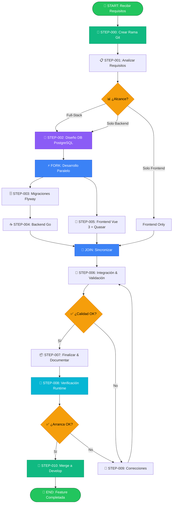
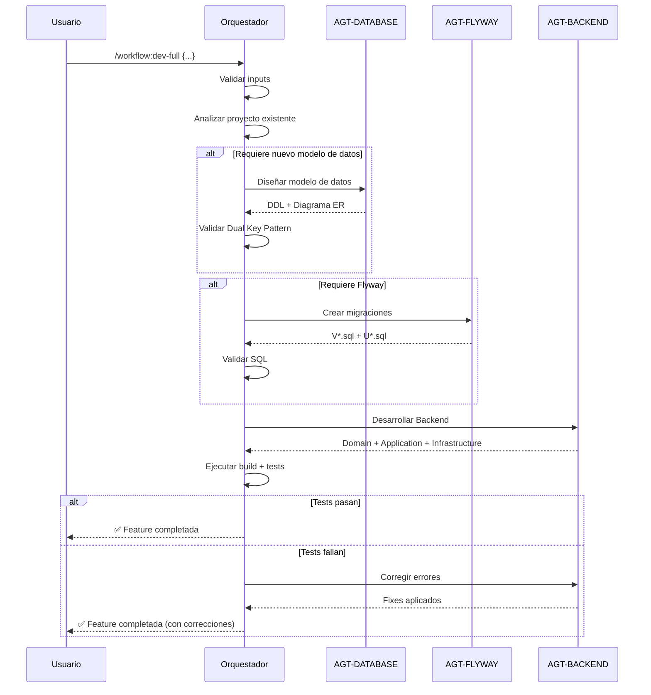

# 🎼 Workflow de Desarrollo Full-Stack: Backend Go + Database + Frontend

---

**metodo**: ZNS v2.2  
**workflow_id**: WF-DEV-002  
**version**: 1.1.0  
**fecha_creacion**: 2026-03-17  
**ultima_actualizacion**: 2026-03-17  
**autor**: Orchestration Architect Senior  
**tipo**: Desarrollo de Features End-to-End  

**estandares_aplicados**:
- IEEE 828-2012: Configuration Management in Systems and Software Engineering
- IEEE 2830-2021: Standard for Technical Framework and Requirements for Trusted AI
- IEEE 2755-2017: Guide for Terms and Concepts in Intelligent Process Automation
- ISO/IEC 12207:2017: Software Life Cycle Processes
- ISO/IEC 25010:2011: Systems and Software Quality Requirements (SQuaRE)
- BPMN 2.0: Business Process Model and Notation
- Conventional Commits 1.0.0

**changelog**:
- v1.1.0: Frontend actualizado de Angular a Vue 3 + Quasar (prompt-dev-frontend-vue3-quasar-senior.md) (2026-03-17)
- v1.0.0: Variante del workflow full-stack con backend Go, runtime ajustado a servicio Go y rutas actualizadas de agentes (2026-03-17)

---

## 🖥️ WF-DEV-002 | Paso 0/10 | ░░░░░░░░░░ 0%
**📍 Fase**: INIT | **⏱️**: 00:00 | **🎯 Tipo**: 🟠 Decisión

> **¿Qué alcance de desarrollo ejecutar?** A) Full-Stack B) Solo Backend C) Solo Frontend

| Cmd | Acción | | Cmd | Acción |
|:---:|--------|---|:---:|--------|
| `1/c` | ▶️ Continuar | | `3/m` | ✏️ Modificar |
| `2/r` | 🔍 Revisar | | `4/p` | ⏸️ Pausar |
| `5/x` | ❌ Cancelar | | | |

**👤 Respuesta:** `___`

<details><summary>📊 Historial de Decisiones</summary>

| # | ⏰ Hora | 📍 Paso | 💬 Pregunta | ✅ Decisión |
|:-:|:------:|:------:|-------------|-------------|
| - | - | - | _Workflow no iniciado_ | - |

</details>

---

### 📜 LOG DE EJECUCIÓN (Plegable)

<details>
<summary>📂 <strong>STEP-000: Crear Rama Git</strong> ⏳ Pendiente</summary>

_Creación de rama feature según nomenclatura GitFlow IEEE/ISO pendiente_

</details>

<details>
<summary>📂 <strong>STEP-001: Analizar Requisitos</strong> ⏳ Pendiente</summary>

_Análisis de requisitos de la feature pendiente_

</details>

<details>
<summary>📂 <strong>STEP-002: Diseño DB PostgreSQL</strong> ⏳ Pendiente</summary>

_Diseño del modelo de datos pendiente_

</details>

<details>
<summary>📂 <strong>STEP-003: Migraciones Flyway</strong> ⏳ Pendiente</summary>

_Generación de scripts de migración pendiente_

</details>

<details>
<summary>📂 <strong>STEP-004: Backend Go</strong> ⏳ Pendiente</summary>

_Desarrollo de capas backend pendiente_

</details>

<details>
<summary>📂 <strong>STEP-005: Frontend Vue 3 + Quasar</strong> ⏳ Pendiente</summary>

_Desarrollo de componentes frontend pendiente_

</details>

<details>
<summary>📂 <strong>STEP-006: Integración & Validación</strong> ⏳ Pendiente</summary>

_Integración E2E y validación pendiente_

</details>

<details>
<summary>📂 <strong>STEP-007: Finalizar & Documentar</strong> ⏳ Pendiente</summary>

_Documentación y finalización pendiente_

</details>

<details>
<summary>📂 <strong>STEP-008: Verificación Ejecución Runtime</strong> ⏳ Pendiente</summary>

_Levantar proyecto y verificar que arranca sin errores de ejecución_

</details>

<details>
<summary>📂 <strong>STEP-009: Correcciones (si aplica)</strong> ⏳ Pendiente</summary>

_Correcciones post-validación si es necesario_

</details>

---

### 🔔 NOTIFICACIONES

| ⚠️ | Mensaje |
|:--:|---------|
| 🟡 | Esperando selección de alcance (Full-Stack/Backend/Frontend)... |

<!--═══════════════════════════════════════════════════════════════════════════
    FIN TERMINAL INTERACTIVA
═══════════════════════════════════════════════════════════════════════════════-->

---

## 📋 RESUMEN EJECUTIVO

### Objetivo del Workflow

Este workflow orquesta el desarrollo completo de una feature full-stack, coordinando cuatro agentes especializados:

| Agente | Rol | Artefactos |
|--------|-----|------------|
| **AGT-DATABASE** | Ingeniero Senior PostgreSQL | Modelo de datos, Schemas, Índices, Constraints, Optimización |
| **AGT-FLYWAY** | Especialista en Migraciones DB | Scripts SQL versionados, Rollbacks, Callbacks |
| **AGT-BACKEND** | Desarrollador Backend Go Senior | Aggregates, Ports, Use Cases, Handlers, OpenAPI, Tests |
| **AGT-FRONTEND** | Desarrollador Vue 3 + Quasar Senior | Components, Composables, Stores Pinia, Routes, Tests |

### Métricas Objetivo

| Métrica | Valor Objetivo | Umbral Mínimo |
|---------|----------------|---------------|
| **Tiempo Total** | ≤ 4 horas | ≤ 6 horas |
| **Coverage Backend** | ≥ 80% | ≥ 70% |
| **Coverage Frontend** | ≥ 80% | ≥ 75% |
| **Lighthouse Score** | ≥ 90 | ≥ 80 |
| **Build Success** | 100% | 100% |
| **Migraciones Válidas** | 100% | 100% |

---

## 🏗️ ARQUITECTURA DEL WORKFLOW

### Diagrama de Flujo Principal



### Diagrama de Dependencias entre Agentes

```mermaid
graph LR
    subgraph "📥 Inputs"
        REQ[Requisitos/HU]
        SPEC[Especificaciones API]
        UI_DESIGN[Diseños UI/UX]
    end
    
    subgraph "� AGT-DATABASE"
        DB_MODEL[Modelo de Datos]
        DB_SCHEMA[Schemas/Bounded Contexts]
        DB_INDEXES[Índices & Constraints]
        DB_OPTIM[Optimización]
    end
    
    subgraph "�🗄️ AGT-FLYWAY"
        FLY_SCHEMA[Esquema DB]
        FLY_MIGRATE[Migraciones]
        FLY_ROLLBACK[Rollbacks]
    end
    
    subgraph "☕ AGT-BACKEND"
        BE_DOMAIN[Domain/Entities]
        BE_REPOS[Repositories]
        BE_SERVICES[Services]
        BE_CONTROLLERS[Controllers]
        BE_TESTS[Tests]
    end
    
    subgraph "🎨 AGT-FRONTEND"
        FE_MODELS[Models/DTOs]
        FE_SERVICES[API Services]
        FE_COMPONENTS[Components]
        FE_ROUTES[Routes]
        FE_TESTS[Tests]
    end
    
    subgraph "📤 Outputs"
        API_DOCS[API Docs]
        DEPLOYED[Feature Deployed]
    end
    
    REQ --> DB_MODEL
    SPEC --> DB_MODEL
    
    DB_MODEL --> DB_SCHEMA
    DB_SCHEMA --> DB_INDEXES
    DB_INDEXES --> DB_OPTIM
    
    DB_OPTIM --> FLY_SCHEMA
    FLY_SCHEMA --> FLY_MIGRATE
    FLY_MIGRATE --> FLY_ROLLBACK
    
    FLY_MIGRATE --> BE_DOMAIN
    BE_DOMAIN --> BE_REPOS
    BE_REPOS --> BE_SERVICES
    BE_SERVICES --> BE_CONTROLLERS
    BE_CONTROLLERS --> BE_TESTS
    
    SPEC --> FE_MODELS
    UI_DESIGN --> FE_COMPONENTS
    
    FE_MODELS --> FE_SERVICES
    FE_SERVICES --> FE_COMPONENTS
    FE_COMPONENTS --> FE_ROUTES
    FE_ROUTES --> FE_TESTS
    
    BE_TESTS --> API_DOCS
    FE_TESTS --> DEPLOYED
    
    style REQ fill:#e0f2fe,stroke:#0284c7
    style SPEC fill:#e0f2fe,stroke:#0284c7
    style UI_DESIGN fill:#e0f2fe,stroke:#0284c7
```



---

<details>
<summary><h2>📑 INVENTARIO DE AGENTES (expandir)</h2></summary>

### AGT-DATABASE: Ingeniero Senior en Base de Datos PostgreSQL

```yaml
agente:
  id: "AGT-DATABASE"
  nombre: "Database Engineer Senior - PostgreSQL Expert"
  prompt_ref: "2-agents/zns-tecnical-team/5.zns-develop/4.database_senior/prompt_dev_database_senior.md"
  
  capacidades:
    - PostgreSQL 16.x Expert
    - Data Modeling (DDD, Normalización, Denormalización)
    - Dual Key Pattern (BIGINT IDENTITY + UUID)
    - Schema per Bounded Context
    - Performance Tuning (Índices, Partitioning, Query Optimization)
    - High Availability & Replication
    - Row-Level Security (RLS)
    - Advanced Features (JSONB, Full-Text Search, CTEs, Window Functions)
    
  inputs:
    - tipo: "requisitos_feature"
      formato: "markdown"
      descripcion: "Historia de usuario o requisitos funcionales"
    - tipo: "modelo_dominio"
      formato: "markdown/yaml"
      descripcion: "Entidades del dominio y sus relaciones"
    - tipo: "bounded_context"
      formato: "string"
      descripcion: "Contexto delimitado al que pertenece"
      
  outputs:
    - tipo: "modelo_datos_fisico"
      formato: "SQL DDL + documentación"
      descripcion: "Diseño completo de tablas, columnas, tipos"
    - tipo: "estrategia_claves"
      formato: "markdown"
      descripcion: "Dual Key Pattern aplicado (PKID + UUID)"
    - tipo: "indices_constraints"
      formato: "SQL"
      descripcion: "Índices, FKs, CHECKs, UNIQUEs"
    - tipo: "schema_definition"
      formato: "SQL"
      descripcion: "CREATE SCHEMA con permisos"
    - tipo: "documentacion_modelo"
      formato: "markdown + diagrama ER"
      descripcion: "Documentación del modelo de datos"
      
  tiempo_estimado: "30-60 min"
  
  validaciones:
    - "Dual Key Pattern aplicado (BIGINT + UUID)"
    - "GENERATED ALWAYS AS IDENTITY (no SERIAL)"
    - "Naming conventions respetadas (pkid_, fk_, idx_, uk_)"
    - "Constraints explícitas con nombres descriptivos"
    - "Índices para todas las FKs"
    - "Campos de auditoría (creation_date, expiration_date)"
    - "Schema per Bounded Context"
```

### AGT-FLYWAY: Especialista en Migraciones de Base de Datos

```yaml
agente:
  id: "AGT-FLYWAY"
  nombre: "Database Migration Expert"
  prompt_ref: "2-agents/zns-tecnical-team/5.zns-develop/1.backend_senior/prompt_dev_senior_flyway.md"
  
  capacidades:
    - Flyway 10.x migrations versionadas
    - PostgreSQL, MySQL, Oracle, SQL Server
    - Zero-downtime deployments
    - Rollback strategies
    - Data migration & validation
    
  inputs:
    - tipo: "modelo_datos"
      formato: "markdown/yaml"
      descripcion: "Especificación del modelo de datos"
    - tipo: "cambios_requeridos"
      formato: "markdown"
      descripcion: "Cambios en esquema o datos"
      
  outputs:
    - tipo: "migration_scripts"
      formato: "SQL files"
      ubicacion: "src/main/resources/db/migration/"
      naming: "V{version}__{description}.sql"
    - tipo: "rollback_scripts"
      formato: "SQL files"
      ubicacion: "src/main/resources/db/migration/"
      naming: "U{version}__{description}.sql"
    - tipo: "repeatable_scripts"
      formato: "SQL files"
      ubicacion: "src/main/resources/db/migration/"
      naming: "R__{description}.sql"
      
  tiempo_estimado: "30-60 min"
  
  validaciones:
    - "Sintaxis SQL válida"
    - "Migraciones idempotentes"
    - "Rollback documentado"
    - "Sin breaking changes en producción"
```

### AGT-BACKEND: Desarrollador Backend Go Senior

```yaml
agente:
  id: "AGT-BACKEND"
  nombre: "Backend Developer Senior - Go"
  prompt_ref: "2-agents/zns-tecnical-team/5.zns-develop/1.backend_senior/prompt-dev-backend-go.md"
  
  capacidades:
    - Go 1.23+ idiomático
    - Arquitectura Hexagonal (Ports & Adapters)
    - Domain-Driven Design (DDD)
    - CQRS aplicado con criterio
    - APIs REST/gRPC documentadas con OpenAPI
    - Testing unitario, integración y contratos
    
  inputs:
    - tipo: "requisitos_feature"
      formato: "markdown"
      descripcion: "Historia de usuario o requisitos técnicos"
    - tipo: "modelo_datos"
      formato: "markdown/yaml"
      descripcion: "Modelo de datos del dominio"
    - tipo: "migrations_executed"
      formato: "confirmation"
      descripcion: "Confirmación de migraciones aplicadas"
      
  outputs:
    - tipo: "domain_entities"
      formato: "Go structs y aggregates"
      ubicacion: "internal/domain/..."
    - tipo: "value_objects"
      formato: "Go value objects"
      ubicacion: "internal/domain/..."
    - tipo: "repositories"
      formato: "Go interfaces + adapters"
      ubicacion: "internal/application/ports/ + internal/infrastructure/"
    - tipo: "use_cases"
      formato: "Go use cases"
      ubicacion: "internal/application/usecases/"
    - tipo: "handlers"
      formato: "Go handlers / transport adapters"
      ubicacion: "internal/infrastructure/http/ o grpc/"
    - tipo: "api_docs"
      formato: "OpenAPI + Postman Collection"
      ubicacion: "api/openapi/ + api/postman/"
    - tipo: "tests"
      formato: "Go test files"
      ubicacion: "tests/ + internal/**/**_test.go"
      
  tiempo_estimado: "90-180 min"
  
  validaciones:
    - "Build exitoso (go build ./...)"
    - "Tests pasan (go test ./...)"
    - "Coverage >= 80%"
    - "OpenAPI/Postman actualizados"
    - "Arquitectura hexagonal respetada"
```

### AGT-FRONTEND: Desarrollador Vue 3 + Quasar Senior

```yaml
agente:
  id: "AGT-FRONTEND"
  nombre: "Frontend Developer Senior - Vue 3 + Quasar"
  prompt_ref: "2-agents/zns-tecnical-team/5.zns-develop/2.frontend_senior/prompt-dev-frontend-vue3-quasar-senior.md"
  
  capacidades:
    - Vue 3 con Composition API, script setup, composables avanzados
    - TypeScript estricto (strict: true, cero any)
    - Quasar Framework (SPA, PWA, SSR, Mobile híbrido)
    - Pinia para state management por dominio
    - Vite con code splitting, aliases y optimización de build
    - Tailwind CSS utility-first con Design Tokens
    - Microfrontends con Module Federation
    - WCAG 2.1 AA Accessibility
    
  inputs:
    - tipo: "requisitos_ui"
      formato: "markdown"
      descripcion: "Requisitos de interfaz de usuario"
    - tipo: "api_spec"
      formato: "OpenAPI/Swagger"
      descripcion: "Especificación de API REST"
    - tipo: "diseños"
      formato: "Figma/images"
      descripcion: "Diseños de UI/UX"
      
  outputs:
    - tipo: "models"
      formato: "TypeScript interfaces/types"
      ubicacion: "src/modules/{feature}/types/"
    - tipo: "composables"
      formato: "TypeScript composables"
      ubicacion: "src/modules/{feature}/composables/"
    - tipo: "stores"
      formato: "Pinia stores"
      ubicacion: "src/modules/{feature}/stores/"
    - tipo: "components"
      formato: "Vue 3 SFC (script setup)"
      ubicacion: "src/modules/{feature}/components/"
    - tipo: "pages"
      formato: "Vue 3 page components"
      ubicacion: "src/modules/{feature}/pages/"
    - tipo: "routes"
      formato: "TypeScript routing"
      ubicacion: "src/modules/{feature}/routes/"
    - tipo: "tests"
      formato: "Vitest specs"
      ubicacion: "src/modules/{feature}/**/*.spec.ts"
      
  tiempo_estimado: "60-120 min"
  
  validaciones:
    - "Build exitoso (quasar build)"
    - "Tests pasan (vitest run)"
    - "Lighthouse Performance >= 90"
    - "Lighthouse Accessibility >= 95"
    - "ESLint sin errores"
```

</details>

---

<details>
<summary><h2>🔄 ESPECIFICACIÓN DE STEPS (expandir)</h2></summary>

### STEP-000: Crear Rama Git (GitFlow IEEE/ISO) 🌿

```yaml
step:
  id: "STEP-000"
  nombre: "Crear Rama Git según GitFlow IEEE/ISO"
  tipo: "task"
  agente: "ORCHESTRATOR"
  obligatorio: true
  
  estandares:
    - "IEEE 828-2012: Configuration Management"
    - "ISO/IEC 12207:2017: Software Life Cycle Processes"
    - "Conventional Commits 1.0.0"
  
  objetivo: |
    Crear una rama de trabajo aislada para la feature/bugfix/hotfix
    siguiendo la nomenclatura GitFlow estandarizada, asegurando
    trazabilidad y gestión de configuración adecuada.
  
  inputs:
    - nombre: "tipo_rama"
      tipo: "enum"
      valores: ["feature", "bugfix", "hotfix", "refactor", "docs"]
      requerido: true
      descripcion: "Tipo de cambio según GitFlow"
    - nombre: "id_ticket"
      tipo: "string"
      patron: "^(HU|HUT|SEC|BUG)-[A-Z]*-?[0-9]+$"
      requerido: true
      descripcion: "ID del ticket (HU-001, HUT-API-001, etc.)"
    - nombre: "descripcion_corta"
      tipo: "string"
      max_length: 50
      formato: "kebab-case"
      requerido: true
      descripcion: "Descripción breve en kebab-case"
    - nombre: "rama_base"
      tipo: "string"
      default: "develop"
      requerido: false
      descripcion: "Rama origen (develop, main, staging)"
      
  nomenclatura:
    patron: "<tipo>/<id-ticket>-<descripcion-kebab-case>"
    ejemplos:
      feature: "feature/HU-001-sistema-reservas-tutorias"
      bugfix: "bugfix/BUG-015-error-validacion-email"
      hotfix: "hotfix/SEC-001-vulnerabilidad-jwt"
      refactor: "refactor/HUT-DOM-005-separar-aggregate"
      docs: "docs/HUT-INFRA-001-readme-flyway"
  
  proceso:
    - paso: 1
      accion: "Verificar rama actual y estado limpio"
      comando: "git status"
      validacion: "working tree clean"
    - paso: 2
      accion: "Actualizar rama base"
      comando: "git checkout {rama_base} && git pull origin {rama_base}"
    - paso: 3
      accion: "Crear rama feature"
      comando: "git checkout -b {tipo}/{id_ticket}-{descripcion}"
    - paso: 4
      accion: "Verificar creación"
      comando: "git branch --show-current"
      validacion: "nombre coincide con patrón"
    - paso: 5
      accion: "Push inicial (opcional)"
      comando: "git push -u origin {nombre_rama}"
      opcional: true
  
  outputs:
    - nombre: "nombre_rama"
      tipo: "string"
      ejemplo: "feature/HU-001-sistema-reservas-tutorias"
    - nombre: "rama_base"
      tipo: "string"
      ejemplo: "develop"
    - nombre: "commit_base"
      tipo: "string"
      ejemplo: "abc123f"
  
  validaciones:
    - "Rama creada con nomenclatura correcta"
    - "Working tree limpio antes de crear"
    - "Rama base actualizada"
    - "No existen cambios sin commit"
  
  errores_comunes:
    - error: "Cambios sin commit"
      solucion: "git stash o git commit antes de crear rama"
    - error: "Rama ya existe"
      solucion: "Verificar si es la correcta o usar nombre único"
    - error: "Conflictos en pull"
      solucion: "Resolver conflictos antes de crear feature"
  
  tiempo_estimado: "2-5 min"
  
  siguiente: "STEP-001"
```

#### 💬 Interacción con Usuario (STEP-000)

```
┌─────────────────────────────────────────────────────────────────┐
│  🌿 STEP-000: CREAR RAMA GIT                                    │
│  ━━━━━━━━━━━━━━━━━━━━━━━━━━━━━━━━━━━━━━━━━━━━━━━━━━━━━━━━━━━━━  │
│                                                                 │
│  📋 Proporciona los datos para crear la rama:                   │
│                                                                 │
│  1. Tipo de rama:                                               │
│     [ ] feature  - Nueva funcionalidad                          │
│     [ ] bugfix   - Corrección de defecto                        │
│     [ ] hotfix   - Corrección urgente producción                │
│     [ ] refactor - Mejora sin cambio funcional                  │
│     [ ] docs     - Solo documentación                           │
│                                                                 │
│  2. ID del ticket: _________ (ej: HU-001, HUT-API-001)          │
│                                                                 │
│  3. Descripción corta: _________________ (kebab-case, max 50)   │
│                                                                 │
│  4. Rama base: [develop] / main / staging                       │
│                                                                 │
└─────────────────────────────────────────────────────────────────┘

Ejemplo resultado: feature/HU-001-sistema-reservas-tutorias
```

#### 🔧 Comandos de Ejecución (STEP-000)

```bash
# Verificar estado limpio
git status

# Actualizar rama base
git checkout develop
git pull origin develop

# Crear rama feature
git checkout -b feature/HU-001-sistema-reservas-tutorias

# Verificar rama actual
git branch --show-current

# Push inicial (opcional)
git push -u origin feature/HU-001-sistema-reservas-tutorias
```

---

### STEP-001: Analizar Requisitos

```yaml
step:
  id: "STEP-001"
  nombre: "Analizar Requisitos de la Feature"
  tipo: "task"
  agente: "ORCHESTRATOR"
  
  objetivo: |
    Descomponer los requisitos de la feature en tareas específicas
    para cada agente (Flyway, Backend, Frontend)
  
  inputs:
    - nombre: "historia_usuario"
      tipo: "markdown"
      requerido: true
    - nombre: "criterios_aceptacion"
      tipo: "markdown"
      requerido: true
    - nombre: "contexto_arquitectura"
      tipo: "markdown"
      requerido: false
      
  outputs:
    - nombre: "tareas_database"
      tipo: "markdown"
      descripcion: "Diseño de modelo de datos requerido"
    - nombre: "tareas_flyway"
      tipo: "markdown"
      descripcion: "Cambios de esquema requeridos"
    - nombre: "tareas_backend"
      tipo: "markdown"
      descripcion: "Funcionalidad backend a implementar"
    - nombre: "tareas_frontend"
      tipo: "markdown"
      descripcion: "Componentes UI a desarrollar"
    - nombre: "alcance_determinado"
      tipo: "enum"
      valores: ["fullstack", "backend_only", "frontend_only"]
      
  timeout: "15m"
  checkpoint: true
  
  siguiente: "GATEWAY-SCOPE"
```

### STEP-002: Diseño de Base de Datos (PostgreSQL)

```yaml
step:
  id: "STEP-002"
  nombre: "Diseñar Modelo de Datos PostgreSQL"
  tipo: "task"
  agente: "AGT-DATABASE"
  
  objetivo: |
    Diseñar el modelo de datos físico siguiendo DDD, aplicando
    Dual Key Pattern (BIGINT + UUID), schemas por bounded context,
    y optimizaciones de PostgreSQL.
  
  precondiciones:
    - "STEP-001.outputs.tareas_database definidas"
    - "Bounded Context identificado"
    
  inputs:
    - nombre: "tareas_database"
      source: "STEP-001.outputs.tareas_database"
    - nombre: "modelo_dominio"
      tipo: "markdown"
      descripcion: "Entidades y relaciones del dominio"
    - nombre: "bounded_context"
      tipo: "string"
      descripcion: "Schema donde se creará el modelo"
      
  outputs:
    - nombre: "modelo_datos_fisico"
      tipo: "SQL DDL"
      descripcion: "CREATE TABLE con Dual Key Pattern"
    - nombre: "indices_constraints"
      tipo: "SQL"
      descripcion: "Índices, FKs, CHECKs definidos"
    - nombre: "documentacion_modelo"
      tipo: "markdown"
      descripcion: "Diagrama ER y descripción de tablas"
      
  acciones:
    - "Identificar el schema (bounded context) apropiado"
    - "Diseñar tablas con Dual Key Pattern (pkid_ + uuid_)"
    - "Usar GENERATED ALWAYS AS IDENTITY (no SERIAL)"
    - "Definir constraints con nombres descriptivos"
    - "Crear índices para FKs y columnas de búsqueda"
    - "Agregar campos de auditoría (creation_date, expiration_date)"
    - "Documentar el modelo con diagrama ER"
    
  validaciones:
    - nombre: "dual_key_pattern"
      regla: "Todas las tablas tienen pkid_ y uuid_"
    - nombre: "identity_standard"
      regla: "Usar GENERATED ALWAYS AS IDENTITY"
    - nombre: "naming_convention"
      regla: "Prefijos: pkid_, fk_, idx_, uk_, ck_"
    - nombre: "audit_fields"
      regla: "creation_date y expiration_date presentes"
      
  timeout: "45m"
  checkpoint: true
  
  on_error:
    strategy: "halt"
    mensaje: "Diseño de modelo de datos incompleto"
    
  siguiente: "STEP-003"
```

### STEP-003: Migraciones Flyway

```yaml
step:
  id: "STEP-003"
  nombre: "Crear Migraciones de Base de Datos"
  tipo: "task"
  agente: "AGT-FLYWAY"
  
  objetivo: |
    Convertir el modelo de datos diseñado en scripts de migración
    SQL versionados siguiendo naming conventions de Flyway
  
  precondiciones:
    - "STEP-002 completado (modelo de datos diseñado)"
    - "Acceso a base de datos de desarrollo"
    
  inputs:
    - nombre: "tareas_flyway"
      source: "STEP-001.outputs.tareas_flyway"
    - nombre: "version_actual"
      tipo: "string"
      descripcion: "Última versión de migración existente"
      
  outputs:
    - nombre: "migration_files"
      tipo: "SQL[]"
      formato: "V{version}__{snake_case_description}.sql"
    - nombre: "undo_files"
      tipo: "SQL[]"
      formato: "U{version}__{snake_case_description}.sql"
    - nombre: "modelo_actualizado"
      tipo: "markdown"
      descripcion: "Documentación del modelo actualizado"
      
  acciones:
    - "Revisar esquema actual de la base de datos"
    - "Identificar siguiente número de versión"
    - "Crear scripts de migración DDL/DML"
    - "Crear scripts de rollback correspondientes"
    - "Documentar cambios en el modelo"
    - "Validar sintaxis SQL"
    - "Ejecutar en entorno de desarrollo"
    
  validaciones:
    - nombre: "sintaxis_valida"
      comando: "./gradlew flywayValidate"
      esperado: "SUCCESS"
    - nombre: "migracion_ejecutable"
      comando: "./gradlew flywayMigrate"
      esperado: "SUCCESS"
      
  timeout: "45m"
  retry_policy:
    max_attempts: 2
    backoff: "5m"
  checkpoint: true
  
  on_error:
    strategy: "halt"
    mensaje: "Migración fallida - Revisar scripts SQL"
    
  siguiente: "STEP-003"
```

### STEP-003: Backend Go

```yaml
step:
  id: "STEP-003"
  nombre: "Desarrollar Backend (Go)"
  tipo: "task"
  agente: "AGT-BACKEND"
  
  objetivo: |
    Implementar la lógica de backend siguiendo arquitectura hexagonal,
    DDD y CQRS cuando aplique. Generar código Go production-ready,
    documentación OpenAPI/Postman y tests automatizados.
  
  precondiciones:
    - "STEP-002 completado exitosamente"
    - "Migraciones Flyway aplicadas"
    
  inputs:
    - nombre: "tareas_backend"
      source: "STEP-001.outputs.tareas_backend"
    - nombre: "modelo_datos"
      source: "STEP-002.outputs.modelo_actualizado"
    - nombre: "contexto_existente"
      tipo: "codebase_context"
      descripcion: "Código existente del proyecto"
      
  outputs:
    - nombre: "domain_layer"
      descripcion: "Entities, Value Objects, Domain Services, Events"
    - nombre: "application_layer"
      descripcion: "Use Cases, DTOs de comando/query"
    - nombre: "infrastructure_layer"
      descripcion: "Controllers, Repositories, Adapters"
    - nombre: "tests"
      descripcion: "Unit tests, Integration tests"
    - nombre: "api_spec"
      tipo: "OpenAPI"
      descripcion: "Especificación de endpoints creados"
      
  acciones:
    - |
      ## 1. Domain Layer (Inside-Out)
      - Crear/modificar Entities con business logic
      - Implementar Value Objects inmutables
      - Definir Domain Events si aplica
      - Crear Domain Services para lógica cross-entity
      
    - |
      ## 2. Application Layer
      - Implementar Use Cases (Commands/Queries)
      - Crear DTOs de entrada/salida
      - Orquestar transacciones y eventos
      
    - |
      ## 3. Infrastructure Layer
      - Implementar adapters de persistencia, HTTP y/o gRPC
      - Crear handlers con validación y manejo consistente de errores
      - Configurar mappers entre DTOs, commands y aggregates
      - Implementar adapters complementarios (cache, mensajería, auth, etc.)
      
    - |
      ## 4. Testing (TDD)
      - Unit tests para Domain (100% coverage)
      - Unit tests para Use Cases
      - Integration/contract tests para handlers
      - Integration tests para adapters de persistencia
      
  validaciones:
    - nombre: "build_success"
      comando: "go build ./..."
      esperado: "exit code 0"
    - nombre: "tests_pass"
      comando: "go test ./..."
      esperado: "exit code 0"
    - nombre: "coverage_check"
      comando: "go test ./... -cover"
      esperado: "Coverage >= 80%"
      
  timeout: "180m"
  retry_policy:
    max_attempts: 2
    backoff: "10m"
  checkpoint: true
  
  on_error:
    strategy: "retry_then_escalate"
    escalate_to: "ORCHESTRATOR"
    
  siguiente: "JOIN-001"
```

### STEP-004: Frontend Vue 3 + Quasar

```yaml
step:
  id: "STEP-004"
  nombre: "Desarrollar Frontend (Vue 3 + Quasar)"
  tipo: "task"
  agente: "AGT-FRONTEND"
  paralelo_con: "STEP-002, STEP-003"
  
  objetivo: |
    Implementar componentes de UI en Vue 3 con Composition API (script setup),
    Quasar Framework, Pinia para estado, TypeScript estricto y Tailwind CSS.
    Asegurar accesibilidad WCAG 2.1 AA.
  
  precondiciones:
    - "STEP-001.outputs.tareas_frontend definidas"
    - "Especificación de API disponible (puede ser draft)"
    
  inputs:
    - nombre: "tareas_frontend"
      source: "STEP-001.outputs.tareas_frontend"
    - nombre: "api_spec"
      tipo: "OpenAPI"
      descripcion: "Especificación de API (puede ser borrador)"
    - nombre: "diseños_ui"
      tipo: "Figma/Images"
      descripcion: "Diseños de interfaz de usuario"
      
  outputs:
    - nombre: "types"
      descripcion: "TypeScript interfaces/types de dominio"
    - nombre: "composables"
      descripcion: "Composables para lógica reutilizable"
    - nombre: "stores"
      descripcion: "Pinia stores por dominio"
    - nombre: "components"
      descripcion: "Vue 3 SFC con script setup"
    - nombre: "pages"
      descripcion: "Page components para rutas"
    - nombre: "routes"
      descripcion: "Configuración de routing"
    - nombre: "tests"
      descripcion: "Unit tests con Vitest + Vue Test Utils"
      
  acciones:
    - |
      ## 1. Types & Interfaces
      - Crear interfaces TypeScript basadas en API spec
      - Definir enums y tipos de dominio
      - Crear DTOs de request/response con adapters tipados
      
    - |
      ## 2. Composables & Services
      - Implementar composables con lógica de negocio reutilizable
      - Crear API services con fetch/axios tipado
      - Manejar errores con composables de error handling
      - Implementar caching si aplica
      
    - |
      ## 3. Pinia Stores
      - Crear stores por dominio funcional
      - Separar estado UI y estado de negocio
      - Implementar acciones puras y getters derivados
      - Persistencia selectiva (no datos sensibles)
      
    - |
      ## 4. Components (Smart & Presentational)
      - Crear container components (smart) con script setup
      - Crear presentational components (dumb) con props tipadas
      - Implementar forms con validación (VeeValidate/Zod)
      - Usar componentes Quasar (QInput, QBtn, QTable, etc.)
      - Asegurar accesibilidad (ARIA, keyboard nav)
      
    - |
      ## 5. Routing & Navigation
      - Configurar rutas con vue-router lazy loading
      - Implementar navigation guards si necesario
      - Crear layout components con Quasar Layout
      
    - |
      ## 6. Testing
      - Unit tests para composables con Vitest
      - Component tests con Vue Test Utils
      - Tests de accesibilidad
      
  validaciones:
    - nombre: "build_success"
      comando: "quasar build"
      esperado: "Build successful"
    - nombre: "tests_pass"
      comando: "vitest run --coverage"
      esperado: "All tests passed"
    - nombre: "lint_pass"
      comando: "eslint --ext .ts,.vue src/"
      esperado: "No lint errors"
    - nombre: "lighthouse_audit"
      esperado: "Performance >= 90, Accessibility >= 95"
      
  timeout: "120m"
  retry_policy:
    max_attempts: 2
    backoff: "5m"
  checkpoint: true
  
  on_error:
    strategy: "retry_then_continue"
    degradation: "Marcar feature como parcial"
    
  siguiente: "JOIN-001"
```

### STEP-005: Integración y Validación

```yaml
step:
  id: "STEP-005"
  nombre: "Integración y Validación E2E"
  tipo: "task"
  agente: "ORCHESTRATOR"
  
  objetivo: |
    Validar que backend y frontend se integran correctamente,
    ejecutar tests E2E y verificar criterios de aceptación.
  
  precondiciones:
    - "JOIN-001 completado (Backend y Frontend finalizados)"
    
  inputs:
    - nombre: "backend_outputs"
      source: "STEP-003.outputs"
    - nombre: "frontend_outputs"
      source: "STEP-004.outputs"
    - nombre: "criterios_aceptacion"
      source: "STEP-001.inputs.criterios_aceptacion"
      
  outputs:
    - nombre: "integration_status"
      tipo: "enum"
      valores: ["success", "partial", "failed"]
    - nombre: "test_results"
      tipo: "json"
      descripcion: "Resultados de tests E2E"
    - nombre: "issues_found"
      tipo: "markdown"
      descripcion: "Lista de issues encontrados"
      
  acciones:
    - |
      ## 1. Validación de Contratos API
      - Verificar que endpoints backend coinciden con frontend services
      - Validar esquemas de request/response
      - Comprobar manejo de errores
      
    - |
      ## 2. Build Integrado
      - Build completo de backend
      - Build completo de frontend
      - Verificar sin conflictos
      
    - |
      ## 3. Tests de Integración
      - Ejecutar tests de integración backend
      - Ejecutar tests E2E frontend (Cypress/Playwright)
      - Validar flujos críticos end-to-end
      
    - |
      ## 4. Verificación de Criterios de Aceptación
      - Revisar cada criterio definido en HU
      - Marcar cumplidos/pendientes
      - Documentar gaps si existen
      
  validaciones:
    - nombre: "backend_build"
      comando: "go build ./..."
      esperado: "exit code 0"
    - nombre: "frontend_build"
      comando: "quasar build"
      esperado: "Build successful"
    - nombre: "e2e_tests"
      comando: "vitest run --config vitest.e2e.config.ts"
      esperado: "All E2E tests passed"
      opcional: true
      
  timeout: "60m"
  checkpoint: true
  
  siguiente: "GATEWAY-QUALITY"
```

### STEP-006: Finalizar y Documentar

```yaml
step:
  id: "STEP-006"
  nombre: "Finalizar Feature y Documentar"
  tipo: "task"
  agente: "ORCHESTRATOR"
  
  objetivo: |
    Generar documentación final, preparar para merge y
    crear resumen de la feature completada.
  
  precondiciones:
    - "GATEWAY-QUALITY = success"
    
  inputs:
    - nombre: "all_outputs"
      descripcion: "Todos los outputs de steps anteriores"
      
  outputs:
    - nombre: "feature_summary"
      tipo: "markdown"
      descripcion: "Resumen ejecutivo de la feature"
    - nombre: "api_documentation"
      tipo: "OpenAPI + markdown"
      descripcion: "Documentación de API actualizada"
    - nombre: "changelog_entry"
      tipo: "markdown"
      descripcion: "Entrada para CHANGELOG"
    - nombre: "merge_ready"
      tipo: "boolean"
      descripcion: "Feature lista para merge"
      
  acciones:
    - |
      ## 1. Documentación Técnica
      - Actualizar README si necesario
      - Generar/actualizar OpenAPI spec
      - Documentar decisiones de arquitectura (ADR si aplica)
      
    - |
      ## 2. Changelog
      - Crear entrada en CHANGELOG.md
      - Seguir formato Keep a Changelog
      - Incluir breaking changes si existen
      
    - |
      ## 3. Preparación para Merge
      - Verificar que todos los tests pasan
      - Confirmar que linting está limpio
      - Crear descripción de PR
      
    - |
      ## 4. Resumen de Feature
      - Listar archivos creados/modificados
      - Documentar dependencias agregadas
      - Incluir instrucciones de despliegue si aplica
      
  timeout: "30m"
  checkpoint: true
  
  siguiente: "STEP-008"
```

### STEP-008: Verificación de Ejecución Runtime

```yaml
step:
  id: "STEP-008"
  nombre: "Verificación de Ejecución Runtime"
  tipo: "validation"
  agente: "ORCHESTRATOR"
  prioridad: "CRÍTICA"
  
  objetivo: |
    Levantar el proyecto completo y verificar que arranca correctamente
    sin errores de EJECUCIÓN (runtime). NO es una verificación de compilación
    o construcción, sino que la aplicación realmente INICIA y responde.
  
  precondiciones:
    - "STEP-007 completado (documentación lista)"
    - "Build exitoso (go build ./... pasó)"
    - "Tests pasaron"
    
  inputs:
    - nombre: "proyecto_backend"
      descripcion: "Path del proyecto Backend Go"
      default: "0-docs/4-source-code/0-backend/0-mitoga-project"
    - nombre: "proyecto_flyway"
      descripcion: "Path del proyecto Flyway (si aplica)"
      default: "0-docs/4-source-code/0-backend/2-mitoga-flyway"
    - nombre: "proyecto_frontend"
      descripcion: "Path del proyecto Vue 3 + Quasar (si aplica)"
      default: "0-docs/4-source-code/1-frontend/apps"
      
  outputs:
    - nombre: "runtime_status"
      tipo: "object"
      descripcion: "Estado de ejecución de cada componente"
      schema:
        backend_started: "boolean"
        flyway_executed: "boolean"
        frontend_started: "boolean"
        health_check_passed: "boolean"
        errors_found: "array[string]"
    - nombre: "startup_logs"
      tipo: "text"
      descripcion: "Logs de arranque para diagnóstico"
      
  proceso:
    - paso: 1
      nombre: "Ejecutar Flyway Migrations (si aplica)"
      condicion: "proyecto incluye cambios de BD"
      comandos:
        windows_powershell: |
          cd "d:\Documents\2.maldivati_workspace\00-anwico\2.MI-TOGA\0-docs\4-source-code\0-backend\2-mitoga-flyway"
          
          # Configurar perfil de desarrollo
          $env:SPRING_PROFILES_ACTIVE = "dev"
          
          # Ejecutar Flyway info primero
          .\gradlew.bat flywayInfo
          
          # Aplicar migraciones
          .\gradlew.bat flywayMigrate
          
          # Verificar estado final
          .\gradlew.bat flywayInfo
      validacion:
        exito: "BUILD SUCCESSFUL"
        error_patterns:
          - "Migration failed"
          - "SQLException"
          - "Connection refused"
        
    - paso: 2
      nombre: "Levantar Backend Go"
      descripcion: "Iniciar aplicación y esperar arranque completo"
      comandos:
        windows_powershell: |
          cd "d:\Documents\2.maldivati_workspace\00-anwico\2.MI-TOGA\0-docs\4-source-code\0-backend\0-mitoga-project"
          
          # Configurar entorno
          $env:APP_ENV = "dev"
          
          # Iniciar en background
          Start-Process -FilePath "go" -ArgumentList "run", "./cmd/api" -NoNewWindow -PassThru
          
          # Esperar a que arranque (máximo 60 segundos)
          $timeout = 60
          $elapsed = 0
          $started = $false
          $healthEndpoints = @(
            "http://localhost:8080/health",
            "http://localhost:8080/healthz",
            "http://localhost:8080/readyz"
          )
          
          while (-not $started -and $elapsed -lt $timeout) {
            Start-Sleep -Seconds 2
            $elapsed += 2
            
            foreach ($endpoint in $healthEndpoints) {
              try {
                $response = Invoke-WebRequest -Uri $endpoint -TimeoutSec 2 -UseBasicParsing
                if ($response.StatusCode -eq 200) {
                  $started = $true
                  Write-Host "✅ Backend arrancó correctamente en $elapsed segundos usando $endpoint"
                  break
                }
              } catch {
                # Intentar siguiente endpoint
              }
            }

            if (-not $started) {
              Write-Host "⏳ Esperando arranque... ($elapsed s)"
            }
          }
          
          if (-not $started) {
            Write-Host "❌ ERROR: Backend no arrancó en $timeout segundos"
            exit 1
          }
      validacion:
        exito: "HTTP 200 en endpoint de health"
        health_endpoint: "http://localhost:8080/health | /healthz | /readyz"
        expected_response:
          status_code: 200
        error_patterns:
          - "panic:"
          - "fatal error:"
          - "address already in use"
          - "connection refused"
          - "undefined:"
          - "no required module provides package"
          - "sql: unknown driver"
          - "context deadline exceeded"
          - "Address already in use"
          - "NullPointerException"
          - "panic"
          
    - paso: 3
      nombre: "Verificar Health Check Backend"
      comandos:
        windows_powershell: |
          $healthEndpoints = @(
            "/health",
            "/healthz",
            "/readyz"
          )

          foreach ($endpoint in $healthEndpoints) {
            try {
              $response = Invoke-WebRequest -Uri "http://localhost:8080$endpoint" -UseBasicParsing -TimeoutSec 2
              Write-Host "✅ $endpoint -> HTTP $($response.StatusCode)"
            } catch {
              Write-Host "⚠️ $endpoint no disponible"
            }
          }
      validacion:
        endpoints_requeridos:
          - path: "/health | /healthz | /readyz"
            status: 200
            optional: false
            
    - paso: 4
      nombre: "Verificar Endpoints de la Feature"
      descripcion: "Probar que los nuevos endpoints responden (sin errores 500)"
      comandos:
        windows_powershell: |
          # Obtener lista de endpoints documentados (si OpenAPI/Swagger está habilitado)
          try {
            $swagger = Invoke-RestMethod -Uri "http://localhost:8080/swagger/doc.json"
            $endpoints = $swagger.paths.PSObject.Properties.Name
            Write-Host "Endpoints disponibles: $($endpoints.Count)"
          } catch {
            Write-Host "⚠️ OpenAPI no disponible en /swagger/doc.json, verificar /openapi.json o manualmente"
          }
          
          # Verificar endpoints base (ajustar según la feature)
          $baseEndpoints = @(
            "/health",
            "/api/v1/health",
            "/swagger/index.html"
          )
          
          foreach ($endpoint in $baseEndpoints) {
            try {
              $response = Invoke-WebRequest -Uri "http://localhost:8080$endpoint" -Method GET -UseBasicParsing
              if ($response.StatusCode -lt 500) {
                Write-Host "✅ $endpoint -> HTTP $($response.StatusCode)"
              } else {
                Write-Host "❌ $endpoint -> HTTP $($response.StatusCode)"
              }
            } catch {
              $statusCode = $_.Exception.Response.StatusCode.value__
              if ($statusCode -and $statusCode -lt 500) {
                Write-Host "✅ $endpoint -> HTTP $statusCode (esperado para auth)"
              } else {
                Write-Host "❌ $endpoint -> ERROR: $($_.Exception.Message)"
              }
            }
          }
      validacion:
        criterio: "Ningún endpoint retorna HTTP 5xx"
        tolerado: "HTTP 401, 403 (requieren auth)"
        
    - paso: 5
      nombre: "Levantar Frontend (si aplica)"
      condicion: "alcance incluye frontend"
      comandos:
        windows_powershell: |
          cd "<ruta-proyecto-frontend>"
          
          # Iniciar servidor de desarrollo Quasar
          Start-Process -FilePath "npx" -ArgumentList "quasar", "dev" -NoNewWindow -PassThru
          
          # Esperar arranque
          $timeout = 120
          $elapsed = 0
          $started = $false
          
          while (-not $started -and $elapsed -lt $timeout) {
            Start-Sleep -Seconds 3
            $elapsed += 3
            
            try {
              $response = Invoke-WebRequest -Uri "http://localhost:9000" -TimeoutSec 2 -UseBasicParsing
              if ($response.StatusCode -eq 200) {
                $started = $true
                Write-Host "✅ Frontend Vue 3 + Quasar arrancó correctamente"
              }
            } catch {
              Write-Host "⏳ Esperando frontend... ($elapsed s)"
            }
          }
      validacion:
        exito: "App running at"
        url: "http://localhost:9000"
        error_patterns:
          - "ERROR"
          - "Cannot find module"
          - "SyntaxError"
          - "Type error"
          
    - paso: 6
      nombre: "Detener Servicios"
      descripcion: "Limpiar procesos iniciados"
      comandos:
        windows_powershell: |
          # Detener procesos Go iniciados por el workflow
          Get-CimInstance Win32_Process -ErrorAction SilentlyContinue |
            Where-Object {
              $_.Name -eq "go.exe" -and (
                $_.CommandLine -like "*go run*" -or
                $_.CommandLine -like "*cmd/api*"
              )
            } |
            ForEach-Object {
              Stop-Process -Id $_.ProcessId -Force
            }
          
          # Detener procesos Node (Quasar/Vite)
          Get-Process -Name "node" -ErrorAction SilentlyContinue | 
            Where-Object { $_.CommandLine -like "*quasar*" -or $_.CommandLine -like "*vite*" } | 
            Stop-Process -Force
          
          Write-Host "✅ Servicios detenidos"
          
  errores_comunes:
    - error: "panic / fatal error"
      causa: "Error no controlado en bootstrap, configuración o dependencia crítica"
      solucion: |
        1. Revisar configuración cargada al iniciar el servicio
        2. Verificar providers, wiring y dependencias en cmd/api
        3. Confirmar que puertos y adapters fueron inicializados correctamente
        
    - error: "connection refused / sql: unknown driver"
      causa: "Base de datos no disponible o credenciales incorrectas"
      solucion: |
        1. Verificar que PostgreSQL/Docker está corriendo
        2. Revisar variables de entorno y config del servicio Go
        3. Verificar credenciales en variables de entorno
        
    - error: "no required module provides package / undefined"
      causa: "Dependencias Go incompletas o imports rotos"
      solucion: |
        1. Ejecutar go mod tidy
        2. Revisar imports y paquetes movidos/renombrados
        3. Verificar interfaces, structs y firmas usadas en handlers/use cases
        
    - error: "Port already in use"
      causa: "Otra instancia corriendo en el mismo puerto"
      solucion: |
        # Windows - encontrar y matar proceso
        netstat -ano | findstr :8080
        taskkill /PID <PID> /F
        
    - error: "NoSuchBeanDefinitionException"
      causa: "Bean no registrado en el contexto de Spring"
      solucion: |
        1. Agregar @Service, @Repository, @Component según corresponda
        2. Verificar que el package está en @ComponentScan
        3. Revisar condiciones @Conditional* si existen
        
  timeout: "10m"
  checkpoint: true
  
  decision_punto:
    pregunta: "¿La aplicación arrancó sin errores de runtime?"
    opciones:
      - opcion: "Sí"
        siguiente: "STEP-010"  # Merge a Develop
      - opcion: "No"
        siguiente: "STEP-009"  # Correcciones
        
  metricas:
    - nombre: "startup_time_seconds"
      descripcion: "Tiempo de arranque de la aplicación"
      objetivo: "< 30s"
    - nombre: "health_check_latency_ms"
      descripcion: "Latencia del health check"
      objetivo: "< 500ms"
    - nombre: "runtime_errors_count"
      descripcion: "Cantidad de errores de runtime detectados"
      objetivo: "0"
```

### STEP-009: Correcciones

```yaml
step:
  id: "STEP-009"
  nombre: "Correcciones Post-Validación"
  tipo: "task"
  agente: "DYNAMIC"  # Se asigna según el issue
  
  objetivo: |
    Corregir issues encontrados durante la validación
    y re-ejecutar validaciones.
  
  inputs:
    - nombre: "issues_found"
      source: "STEP-006.outputs.issues_found OR STEP-008.outputs.errors_found"
      
  outputs:
    - nombre: "fixes_applied"
      tipo: "markdown"
      descripcion: "Lista de correcciones aplicadas"
      
  acciones:
    - "Analizar cada issue reportado"
    - "Asignar al agente correspondiente (Backend/Frontend/Flyway)"
    - "Aplicar correcciones"
    - "Validar corrección individualmente"
    - "Re-ejecutar build y tests"
    - "Re-ejecutar verificación runtime (STEP-008)"
    
  timeout: "60m"
  max_iterations: 3
  
  on_max_iterations:
    strategy: "escalate"
    mensaje: "Máximo de iteraciones de corrección alcanzado"
    
  siguiente: "STEP-006"  # Volver a integración para re-validar
```

</details>

---

<details>
<summary><h2>🔗 CONTRATOS DE INTERFAZ (expandir)</h2></summary>

### INT-001: STEP-001 → STEP-002 (Requisitos → Flyway)

```yaml
interface:
  id: "INT-001-002"
  productor: "STEP-001"
  consumidor: "STEP-002"
  
  contrato:
    formato: "markdown"
    esquema:
      tareas_flyway:
        tipo: "object"
        propiedades:
          - nombre: "nueva_version"
            tipo: "string"
            formato: "semver_minor"
            ejemplo: "1.2"
          - nombre: "cambios_esquema"
            tipo: "array"
            items:
              tipo: "object"
              propiedades:
                - tipo_cambio: "enum[create_table, alter_table, create_index, insert_data]"
                - tabla: "string"
                - descripcion: "string"
                - columnas: "array[column_spec]"
                - rollback_strategy: "string"
```

### INT-002: STEP-002 → STEP-003 (Flyway → Backend)

```yaml
interface:
  id: "INT-002-003"
  productor: "STEP-002"
  consumidor: "STEP-003"
  
  contrato:
    formato: "yaml + sql"
    esquema:
      modelo_actualizado:
        tipo: "object"
        propiedades:
          - nombre: "tablas"
            tipo: "array"
            items:
              - nombre: "string"
              - columnas: "array[column_def]"
              - constraints: "array[constraint_def]"
              - indexes: "array[index_def]"
          - nombre: "relaciones"
            tipo: "array"
            items:
              - origen: "string"
              - destino: "string"
              - tipo: "enum[one_to_one, one_to_many, many_to_many]"
              - nullable: "boolean"
```

### INT-003: STEP-003 → STEP-004 (Backend → Frontend)

```yaml
interface:
  id: "INT-003-004"
  productor: "STEP-003"
  consumidor: "STEP-004"
  
  contrato:
    formato: "OpenAPI 3.1"
    esquema:
      api_spec:
        tipo: "openapi_document"
        requerido:
          - paths
          - components/schemas
          - info/version
        validaciones:
          - "Todos los endpoints documentados"
          - "Schemas con ejemplos"
          - "Responses para 2xx, 4xx, 5xx"
```

</details>

---

<details>
<summary><h2>🛡️ ESTRATEGIA DE RESILIENCIA (expandir)</h2></summary>

### Políticas de Retry

| Step | Reintentable | Max Intentos | Backoff | Condición |
|------|--------------|--------------|---------|-----------|
| STEP-001 | Sí | 2 | 5m | Timeout/Error parsing |
| STEP-002 | Sí | 2 | 5m | SQL syntax error |
| STEP-003 | Sí | 2 | 10m | Build failure |
| STEP-004 | Sí | 2 | 5m | Build/Lint failure |
| STEP-005 | No | - | - | Escalar a correcciones |
| STEP-006 | Sí | 1 | 2m | Documentación incompleta |

### Circuit Breaker

```yaml
circuit_breaker:
  enabled: true
  
  per_agent:
    AGT-FLYWAY:
      failure_threshold: 3
      half_open_timeout: "10m"
      fallback: "Migración manual requerida"
      
    AGT-BACKEND:
      failure_threshold: 3
      half_open_timeout: "15m"
      fallback: "Código parcial + issues documentados"
      
    AGT-FRONTEND:
      failure_threshold: 3
      half_open_timeout: "10m"
      fallback: "Componentes mock + issues documentados"
```

### Checkpoints

```yaml
checkpoints:
  - id: "CP-001"
    after_step: "STEP-001"
    datos:
      - tareas_flyway
      - tareas_backend
      - tareas_frontend
      - alcance
      
  - id: "CP-002"
    after_step: "STEP-002"
    datos:
      - migration_files
      - modelo_actualizado
      
  - id: "CP-003"
    after_step: "STEP-003"
    datos:
      - domain_entities
      - api_spec
      - test_results
      
  - id: "CP-004"
    after_step: "STEP-004"
    datos:
      - components
      - services
      - test_results
      
  - id: "CP-FINAL"
    after_step: "STEP-006"
    datos:
      - feature_summary
      - all_artifacts
```

</details>

---

<details>
<summary><h2>📊 OBSERVABILIDAD Y MÉTRICAS (expandir)</h2></summary>

### Logging

```yaml
logging:
  level: "INFO"
  format: "structured_json"
  
  eventos:
    - "workflow_started"
    - "step_started"
    - "step_completed"
    - "step_failed"
    - "checkpoint_saved"
    - "retry_attempted"
    - "workflow_completed"
    
  campos_obligatorios:
    - workflow_id
    - step_id
    - timestamp
    - duration_ms
    - status
    - agent_id
```

### Métricas

```yaml
metricas:
  - nombre: "workflow_duration_seconds"
    tipo: "histogram"
    labels: ["workflow_id", "status"]
    
  - nombre: "step_duration_seconds"
    tipo: "histogram"
    labels: ["step_id", "agent_id", "status"]
    
  - nombre: "step_retry_count"
    tipo: "counter"
    labels: ["step_id", "reason"]
    
  - nombre: "agent_success_rate"
    tipo: "gauge"
    labels: ["agent_id"]
    
  - nombre: "artifact_count"
    tipo: "gauge"
    labels: ["artifact_type"]
```

</details>

---

<details>
<summary><h2>📋 PLAN DE EJECUCIÓN (expandir)</h2></summary>

### Cronograma Estimado

```mermaid
gantt
    title Cronograma del Workflow WF-DEV-002
    dateFormat HH:mm
    axisFormat %H:%M
    
    section Análisis
    STEP-001 Análisis     :s1, 00:00, 15m
    
    section Database
    STEP-002 Flyway       :s2, after s1, 45m
    
    section Backend
    STEP-003 Backend Go   :s3, after s2, 180m
    
    section Frontend
    STEP-004 Vue3+Quasar  :s4, after s1, 120m
    
    section Integración
    STEP-005 Validación   :s5, after s3, 60m
    STEP-006 Finalizar    :s6, after s5, 30m
```



### Resumen de Tiempos

| Fase | Duración Estimada | Acumulado |
|------|-------------------|-----------|
| Análisis (STEP-001) | 15 min | 0:15 |
| Flyway (STEP-002) | 45 min | 1:00 |
| Backend (STEP-003) | 180 min | 4:00 |
| Frontend Vue 3 + Quasar (STEP-004) | 120 min (paralelo) | 4:00* |
| Integración (STEP-005) | 60 min | 5:00 |
| Finalización (STEP-006) | 30 min | 5:30 |

**Tiempo Total Estimado**: ~5.5 horas (con paralelismo Frontend)

</details>

---

<details>
<summary><h2>🚀 GUÍA DE USO DEL WORKFLOW (expandir)</h2></summary>

### Trigger Manual

Para iniciar el workflow, proporciona:

1. **Historia de Usuario o Requisitos**
   ```markdown
   ## HU-XXX: [Título de la Feature]
   
   ### Descripción
   Como [rol], quiero [funcionalidad], para [beneficio].
   
   ### Criterios de Aceptación
   - [ ] CA-1: ...
   - [ ] CA-2: ...
   
   ### Notas Técnicas
   - Impacto en modelo de datos: Sí/No
   - Nuevos endpoints: [listar]
   - Nuevas pantallas: [listar]
   ```

2. **Contexto de Arquitectura** (opcional)
   - Módulos afectados
   - Dependencias existentes
   - Restricciones técnicas

</details>

---

<details>
<summary><h2>🎮 COMANDOS DE EJECUCIÓN (expandir)</h2></summary>

### Comando Rápido (Desarrollo Simple)

```
/workflow:dev proyecto="0-docs/1-backend/0-mitoga-project" tarea="[DESCRIPCIÓN BREVE]"
```

**Ejemplo:**
```
/workflow:dev proyecto="0-docs/1-backend/0-mitoga-project" tarea="Crear CRUD de categorías"
```

---

### Comando Completo (Desarrollo con Flyway)

```
/workflow:dev-full
  proyecto: "0-docs/1-backend/0-mitoga-project"
  alcance: "flyway+backend"
  
  tarea: |
    [DESCRIPCIÓN DETALLADA DE LA TAREA]
  
  modelo_datos:
    tabla: "[nombre_tabla]"
    columnas:
      - nombre: "[col1]", tipo: "[tipo]", nullable: [true/false]
      - nombre: "[col2]", tipo: "[tipo]", nullable: [true/false]
    relaciones:
      - "[tabla_origen].[col] -> [tabla_destino].[col]"
  
  endpoints:
    - "[GET/POST/PUT/DELETE] /api/v1/[recurso]"
  
  criterios:
    - "[criterio de aceptación 1]"
    - "[criterio de aceptación 2]"
```

**Ejemplo Real:**
```
/workflow:dev-full
  proyecto: "0-docs/1-backend/0-mitoga-project"
  alcance: "flyway+backend"
  
  tarea: |
    Implementar módulo de Reservas de Tutorías.
    Un estudiante puede reservar sesiones con tutores.
    Se debe validar disponibilidad y calcular precio.
  
  modelo_datos:
    tabla: "reservas"
    columnas:
      - nombre: "id", tipo: "UUID", nullable: false, pk: true
      - nombre: "estudiante_id", tipo: "UUID", nullable: false, fk: "usuarios.id"
      - nombre: "tutor_id", tipo: "UUID", nullable: false, fk: "usuarios.id"
      - nombre: "fecha_hora", tipo: "TIMESTAMP", nullable: false
      - nombre: "duracion_minutos", tipo: "INTEGER", nullable: false
      - nombre: "estado", tipo: "VARCHAR(20)", nullable: false, default: "PENDIENTE"
      - nombre: "monto", tipo: "DECIMAL(10,2)", nullable: false
    relaciones:
      - "reservas.estudiante_id -> usuarios.id"
      - "reservas.tutor_id -> usuarios.id"
  
  endpoints:
    - "POST /api/v1/reservas"
    - "GET /api/v1/reservas/{id}"
    - "GET /api/v1/reservas?estudianteId={id}"
    - "PUT /api/v1/reservas/{id}/confirmar"
    - "PUT /api/v1/reservas/{id}/cancelar"
  
  criterios:
    - "Validar que el tutor esté disponible en la fecha/hora"
    - "Calcular monto según tarifa del tutor y duración"
    - "No permitir reservas en el pasado"
    - "Cancelación solo hasta 24h antes"
```

---

### Comando Backend Only (Sin Migraciones)

```
/workflow:backend
  proyecto: "0-docs/1-backend/0-mitoga-project"
  
  tarea: "[DESCRIPCIÓN]"
  
  entidad: "[NombreEntidad]"
  
  operaciones:
    - crear
    - leer
    - actualizar
    - eliminar
    - listar
  
  reglas_negocio:
    - "[regla 1]"
    - "[regla 2]"
```

**Ejemplo:**
```
/workflow:backend
  proyecto: "0-docs/1-backend/0-mitoga-project"
  
  tarea: "CRUD de Categorías de Productos"
  
  entidad: "Categoria"
  
  operaciones:
    - crear
    - leer
    - actualizar
    - eliminar (soft-delete)
    - listar (con paginación)
  
  reglas_negocio:
    - "El nombre debe ser único"
    - "No se puede eliminar si tiene productos asociados"
    - "Máximo 3 niveles de subcategorías"
```

---

### Comando Refactoring

```
/workflow:refactor
  proyecto: "0-docs/1-backend/0-mitoga-project"
  
  archivo_o_modulo: "[ruta/archivo o nombre del módulo]"
  
  tipo_refactor:
    - hexagonal    # Migrar a arquitectura hexagonal
    - tests        # Agregar/mejorar tests
    - performance  # Optimizar rendimiento
    - security     # Corregir vulnerabilidades
    - cleanup      # Limpiar código, remover dead code
  
  descripcion: "[qué se debe mejorar]"
  
  mantener:
    - "[funcionalidad que NO debe cambiar]"
```

**Ejemplo:**
```
/workflow:refactor
  proyecto: "0-docs/1-backend/0-mitoga-project"
  
  archivo_o_modulo: "src/main/java/.../auth/"
  
  tipo_refactor:
    - hexagonal
    - tests
  
  descripcion: |
    Separar lógica de autenticación del controller.
    Crear AuthToken como Value Object.
    Implementar AutenticarUsuarioUseCase.
  
  mantener:
    - "Endpoints REST actuales sin cambios"
    - "Formato de JWT actual"
```

---

### Comando Fix/Hotfix

```
/workflow:fix
  proyecto: "0-docs/1-backend/0-mitoga-project"
  
  problema: "[descripción del bug o error]"
  
  archivo_afectado: "[ruta si se conoce]"
  
  comportamiento_actual: "[qué está pasando]"
  
  comportamiento_esperado: "[qué debería pasar]"
  
  pasos_reproducir:
    - "[paso 1]"
    - "[paso 2]"
```

**Ejemplo:**
```
/workflow:fix
  proyecto: "0-docs/1-backend/0-mitoga-project"
  
  problema: "El endpoint de login retorna 500 cuando el usuario no existe"
  
  archivo_afectado: "src/main/java/.../AuthController.java"
  
  comportamiento_actual: "Lanza NullPointerException"
  
  comportamiento_esperado: "Retornar 401 con mensaje 'Credenciales inválidas'"
  
  pasos_reproducir:
    - "POST /api/v1/auth/login"
    - "Body: { email: 'noexiste@test.com', password: '123' }"
```

</details>

---

## 📊 RESUMEN DE COMANDOS

| Comando | Uso | Alcance |
|---------|-----|---------|
| `/workflow:dev` | Desarrollo rápido simple | Backend |
| `/workflow:dev-full` | Desarrollo completo con DB | Database + Flyway + Backend |
| `/workflow:backend` | CRUD y lógica de negocio | Backend |
| `/workflow:refactor` | Mejorar código existente | Backend |
| `/workflow:fix` | Corregir bugs | Backend |
| `/workflow:database` | Solo diseño de modelo de datos | Database |

---

## ✅ CHECKLIST PRE-EJECUCIÓN

Antes de ejecutar cualquier comando, verifica:

- [ ] **Proyecto correcto**: La ruta del proyecto es válida
- [ ] **Branch correcto**: Estás en la rama donde quieres los cambios
- [ ] **Build limpio**: `go build ./...` pasa sin errores
- [ ] **Sin cambios pendientes**: `git status` limpio (opcional pero recomendado)

---

## 🔄 FLUJO DE EJECUCIÓN



---

## 📎 REFERENCIAS

### Prompts de Agentes

| Agente | Ubicación |
|--------|-----------|
| Database PostgreSQL | `2-agents/zns-tecnical-team/5.zns-develop/4.database_senior/prompt_dev_database_senior.md` |
| Backend Go | `2-agents/zns-tecnical-team/5.zns-develop/1.backend_senior/prompt-dev-backend-go.md` |
| Flyway Migrations | `2-agents/zns-tecnical-team/5.zns-develop/1.backend_senior/prompt_dev_senior_flyway.md` |
| Frontend Vue 3 + Quasar | `2-agents/zns-tecnical-team/5.zns-develop/2.frontend_senior/prompt-dev-frontend-vue3-quasar-senior.md` |

### Estándares Aplicados

- **IEEE 2830-2021**: Trusted AI - Trazabilidad y explicabilidad
- **IEEE 2755-2017**: Intelligent Process Automation - Patrones de workflow
- **ISO/IEC 25010**: Calidad de software - Métricas y validaciones
- **ISO/IEC 11179**: Metadata - Naming conventions
- **BPMN 2.0**: Modelado de procesos - Notación de diagramas

---

## 📝 CHANGELOG

| Versión | Fecha | Cambios |
|---------|-------|---------|
| 1.1.0 | 2025-02-06 | Agregado AGT-DATABASE (PostgreSQL Expert) al workflow |
| 1.0.0 | 2025-02-06 | Versión inicial del workflow de desarrollo full-stack |
