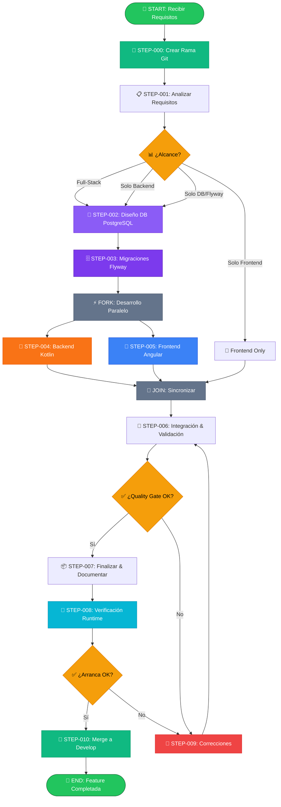
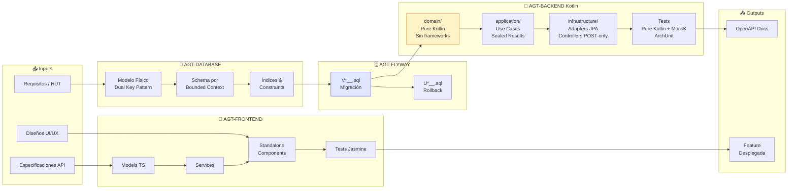

# 🎼 Workflow de Desarrollo Full-Stack: Kotlin + Spring Boot + Angular + PostgreSQL

---

**metodo**: ZNS v2.2  
**workflow_id**: WF-DEV-002  
**version**: 1.0.0  
**fecha_creacion**: 2026-03-18  
**ultima_actualizacion**: 2026-03-18  
**autor**: Orchestration Architect Senior  
**tipo**: Desarrollo de Features End-to-End — Kotlin Stack  
**basado_en**: WF-DEV-001 v2.1.0

**agentes_orquestados**:
- `AGT-DATABASE` → `2-agents/zns-tecnical-team/5.zns-develop/4.database_senior/prompt_dev_database_senior.md`
- `AGT-FLYWAY` → `2-agents/zns-tecnical-team/5.zns-develop/1.backend_senior/prompt_dev_senior_flyway.md`
- `AGT-BACKEND` → `2-agents/zns-tecnical-team/5.zns-develop/1.backend_senior/prompt-dev-kotlin-springboot-senior.md`
- `AGT-FRONTEND` → `2-agents/zns-tecnical-team/5.zns-develop/2.frontend_senior/prompt-dev-frontend-angular-senior.md`

**estandares_aplicados**:
- IEEE 828-2012: Configuration Management in Systems and Software Engineering
- IEEE 2830-2021: Standard for Technical Framework for Trusted AI
- IEEE 2755-2017: Guide for Terms and Concepts in Intelligent Process Automation
- ISO/IEC 12207:2017: Software Life Cycle Processes
- ISO/IEC 25010:2011: Systems and Software Quality Requirements (SQuaRE)
- BPMN 2.0: Business Process Model and Notation
- Conventional Commits 1.0.0

**diferencias_vs_WF-DEV-001**:
- Backend: **Kotlin 2.x** en lugar de Java 21 — dominio desacoplado de frameworks (cero Spring/JPA en `domain/`)
- TDD: Tests de dominio son **pure Kotlin** — sin `@SpringBootTest` ni `@DataJpaTest` en capa de dominio
- MockK en lugar de Mockito para tests de Application Layer
- Resultados tipados con **sealed class** en lugar de excepciones para flujos de negocio normales
- Cobertura objetivo: **domain/ ≥ 95%** | **application/ ≥ 90%** | global ≥ 85%
- ArchUnit verifica en CI que `domain/` no importa frameworks (falla pipeline si se viola)
- SQL nativo **prohibido** — Spring Data Method Queries + Criteria API + QueryDSL

**changelog**:
- v1.0.0: Versión inicial — Kotlin + Spring Boot + Angular + PostgreSQL + Flyway (2026-03-18)

---

## 🖥️ WF-DEV-002 | Paso 0/11 | ░░░░░░░░░░░ 0%
**📍 Fase**: INIT | **⏱️**: 00:00 | **🎯 Tipo**: 🟠 Decisión

> **¿Qué alcance de desarrollo ejecutar?**  
> A) Full-Stack (DB + Flyway + Kotlin Backend + Angular Frontend)  
> B) Solo Backend Kotlin (DB + Flyway + Backend)  
> C) Solo Frontend Angular  
> D) Solo DB + Migraciones Flyway

| Cmd | Acción | | Cmd | Acción |
|:---:|--------|---|:---:|--------|
| `1/c` | ▶️ Continuar | | `3/m` | ✏️ Modificar |
| `2/r` | 🔍 Revisar | | `4/p` | ⏸️ Pausar |
| `5/x` | ❌ Cancelar | | | |

**👤 Respuesta:** `___`

<details><summary>📊 Historial de Decisiones</summary>

| # | ⏰ Hora | 📍 Paso | 💬 Pregunta | ✅ Decisión |
|:-:|:------:|:------:|-------------|-------------|
| - | - | - | _Workflow no iniciado_ | - |

</details>

---

### 📜 LOG DE EJECUCIÓN (Plegable)

<details>
<summary>📂 <strong>STEP-000: Crear Rama Git</strong> ⏳ Pendiente</summary>
_Creación de rama feature según nomenclatura GitFlow IEEE/ISO pendiente_
</details>

<details>
<summary>📂 <strong>STEP-001: Analizar Requisitos</strong> ⏳ Pendiente</summary>
_Análisis de requisitos y descomposición de tareas por agente pendiente_
</details>

<details>
<summary>📂 <strong>STEP-002: Diseño DB PostgreSQL</strong> ⏳ Pendiente</summary>
_Diseño del modelo de datos con Dual Key Pattern pendiente_
</details>

<details>
<summary>📂 <strong>STEP-003: Migraciones Flyway</strong> ⏳ Pendiente</summary>
_Generación y ejecución de scripts de migración pendiente_
</details>

<details>
<summary>📂 <strong>STEP-004: Backend Kotlin + Spring Boot</strong> ⏳ Pendiente</summary>
_Desarrollo hexagonal con dominio desacoplado, TDD pure Kotlin, ArchUnit pendiente_
</details>

<details>
<summary>📂 <strong>STEP-005: Frontend Angular</strong> ⏳ Pendiente</summary>
_Desarrollo de componentes standalone, signals y reactive forms pendiente_
</details>

<details>
<summary>📂 <strong>STEP-006: Integración & Validación</strong> ⏳ Pendiente</summary>
_Integración E2E, contratos API y quality gates pendiente_
</details>

<details>
<summary>📂 <strong>STEP-007: Finalizar & Documentar</strong> ⏳ Pendiente</summary>
_Documentación, changelog y preparación para merge pendiente_
</details>

<details>
<summary>📂 <strong>STEP-008: Verificación Runtime</strong> ⏳ Pendiente</summary>
_Levantar proyecto completo y verificar arranque sin errores pendiente_
</details>

<details>
<summary>📂 <strong>STEP-009: Correcciones (si aplica)</strong> ⏳ Pendiente</summary>
_Correcciones post-validación si es necesario_
</details>

<details>
<summary>📂 <strong>STEP-010: Merge a Develop</strong> ⏳ Pendiente</summary>
_Merge final con conventional commit y PR pendiente_
</details>

---

### 🔔 NOTIFICACIONES

| ⚠️ | Mensaje |
|:--:|---------|
| 🟡 | Esperando selección de alcance (Full-Stack / Solo Backend / Solo Frontend / Solo DB)... |
| 🔵 | **Recordatorio clave:** El dominio Kotlin debe ser **framework-free**. ArchUnit valida esto en STEP-004. |

<!--═══════════════════════════════════════════════════════════════════════════
    FIN TERMINAL INTERACTIVA
═══════════════════════════════════════════════════════════════════════════════-->

---

## 📋 RESUMEN EJECUTIVO

### Objetivo del Workflow

Orquestar el desarrollo completo de una feature full-stack en el stack **Kotlin + Spring Boot + Angular + PostgreSQL**, coordinando cuatro agentes especializados con foco en arquitectura hexagonal, dominio desacoplado de frameworks, TDD y calidad enterprise.

| Agente | Rol | Stack | Artefactos principales |
|--------|-----|-------|----------------------|
| **AGT-DATABASE** | Ingeniero Senior PostgreSQL | PostgreSQL 16 | Modelo físico, Dual Key Pattern, schemas por BC, índices |
| **AGT-FLYWAY** | Especialista Migraciones DB | Flyway 10.x | Scripts versionados `V*__.sql`, rollbacks `U*__.sql` |
| **AGT-BACKEND** | Senior Kotlin + Spring Boot | Kotlin 2.x / Spring Boot 3.4.x | Hexagonal Architecture, domain pure Kotlin, TDD, ArchUnit |
| **AGT-FRONTEND** | Senior Angular | Angular 18+ / TypeScript 5+ | Standalone components, signals, reactive forms |

### Métricas Objetivo

| Métrica | Objetivo | Mínimo |
|---------|----------|--------|
| **Tiempo Total** | ≤ 4 horas | ≤ 6 horas |
| **Coverage domain/** | ≥ 95% | ≥ 90% |
| **Coverage application/** | ≥ 90% | ≥ 85% |
| **Coverage global backend** | ≥ 85% | ≥ 80% |
| **Coverage frontend** | ≥ 80% | ≥ 75% |
| **Lighthouse Score** | ≥ 90 | ≥ 80 |
| **Build Backend** | 100% verde | 100% |
| **Build Frontend** | 100% verde | 100% |
| **Migraciones Flyway** | 100% válidas | 100% |
| **ArchUnit violations** | 0 | 0 |
| **SonarQube Quality Gate** | PASSED | PASSED |

---

## 🏗️ ARQUITECTURA DEL WORKFLOW

### Diagrama de Flujo Principal



### Diagrama de Dependencias entre Agentes



---

<details>
<summary><h2>📑 INVENTARIO DE AGENTES (expandir)</h2></summary>

### AGT-DATABASE: Ingeniero Senior PostgreSQL

```yaml
agente:
  id: "AGT-DATABASE"
  nombre: "Database Engineer Senior - PostgreSQL Expert"
  prompt_ref: "2-agents/zns-tecnical-team/5.zns-develop/4.database_senior/prompt_dev_database_senior.md"

  capacidades:
    - PostgreSQL 16.x Expert
    - Dual Key Pattern (BIGINT IDENTITY + UUID)
    - Schema per Bounded Context
    - Data Modeling (DDD-aligned, normalización, denormalización selectiva)
    - Performance Tuning (índices B-tree/GIN/GiST, EXPLAIN ANALYZE)
    - Row-Level Security (RLS) y políticas de acceso
    - Campos de auditoría estándar (creation_date, expiration_date)
    - Funciones avanzadas (JSONB, Full-Text Search, CTEs, Window Functions)

  inputs:
    - tipo: "requisitos_feature"
      formato: "markdown"
      descripcion: "Historia de usuario o HUT con contexto del dominio"
    - tipo: "modelo_dominio"
      formato: "markdown"
      descripcion: "Aggregates, Value Objects y relaciones del dominio Kotlin"
    - tipo: "bounded_context"
      formato: "string"
      descripcion: "Nombre del BC / schema de destino"

  outputs:
    - tipo: "modelo_datos_fisico"
      formato: "SQL DDL documentado"
    - tipo: "estrategia_claves"
      formato: "markdown"
      descripcion: "Dual Key Pattern: pkid_ BIGINT GENERATED ALWAYS AS IDENTITY + uuid_ UUID"
    - tipo: "indices_constraints"
      formato: "SQL"
    - tipo: "schema_definition"
      formato: "SQL CREATE SCHEMA con permisos"
    - tipo: "documentacion_er"
      formato: "markdown + diagrama ER mermaid"

  tiempo_estimado: "30–60 min"

  validaciones:
    - "Dual Key Pattern en todas las tablas (pkid_ BIGINT + uuid_ UUID)"
    - "GENERATED ALWAYS AS IDENTITY (no SERIAL, no sequence manual)"
    - "Prefijos de naming: pkid_, fk_, idx_, uk_, ck_"
    - "Índices para todas las FKs y columnas de búsqueda frecuente"
    - "Campos de auditoría: creation_date, expiration_date o updated_at"
    - "Schema por Bounded Context (no schema public para tablas de negocio)"
    - "CERO SQL nativo — diseño compatible con Spring Data Method Queries + Criteria API"
```

### AGT-FLYWAY: Especialista en Migraciones de Base de Datos

```yaml
agente:
  id: "AGT-FLYWAY"
  nombre: "Database Migration Expert - Flyway"
  prompt_ref: "2-agents/zns-tecnical-team/5.zns-develop/1.backend_senior/prompt_dev_senior_flyway.md"

  capacidades:
    - Flyway 10.x migrations versionadas
    - PostgreSQL DDL/DML migrations
    - Zero-downtime deployment strategies
    - Rollback scripts (Undo migrations)
    - Repeatable migrations (R__)
    - Callbacks (beforeMigrate, afterMigrate)
    - Validación de checksums

  inputs:
    - tipo: "modelo_datos_fisico"
      source: "AGT-DATABASE.outputs.modelo_datos_fisico"
    - tipo: "indices_constraints"
      source: "AGT-DATABASE.outputs.indices_constraints"
    - tipo: "version_actual"
      formato: "string"
      descripcion: "Última versión de migración existente (ej: 1.4)"

  outputs:
    - tipo: "migration_scripts"
      formato: "SQL files"
      ubicacion: "src/main/resources/db/migration/"
      naming: "V{version}__{snake_case_description}.sql"
      ejemplo: "V1_5__create_usuarios_table.sql"
    - tipo: "undo_scripts"
      formato: "SQL files"
      ubicacion: "src/main/resources/db/migration/"
      naming: "U{version}__{snake_case_description}.sql"
    - tipo: "repeatable_scripts"
      formato: "SQL files"
      naming: "R__{snake_case_description}.sql"
      condicion: "Solo si hay datos de referencia o views"

  tiempo_estimado: "20–45 min"

  validaciones:
    - "Naming convention estricta (V{n.m}__ con doble guión bajo)"
    - "Cada migración es idempotente o tiene undo correspondiente"
    - "./gradlew flywayValidate → SUCCESS"
    - "./gradlew flywayMigrate → SUCCESS en entorno dev"
    - "Sin breaking changes que afecten datos existentes en producción"
    - "Rollback documentado y testeado"
```

### AGT-BACKEND: Desarrollador Senior Kotlin + Spring Boot

```yaml
agente:
  id: "AGT-BACKEND"
  nombre: "Backend Developer Senior - Kotlin & Spring Boot"
  prompt_ref: "2-agents/zns-tecnical-team/5.zns-develop/1.backend_senior/prompt-dev-kotlin-springboot-senior.md"
  skills_activas:
    - "2-agents/zns-tools/skills/kotlin-lang-expert.skill.md"
    - "2-agents/zns-tools/skills/ddd-hexagonal-kotlin.skill.md"
    - "2-agents/zns-tools/skills/security-owasp-kotlin.skill.md"
    - "2-agents/zns-tools/skills/tdd-testing-kotlin.skill.md"

  capacidades:
    - Kotlin 2.x idiomático (data class, sealed class, @JvmInline value class, coroutines)
    - Spring Boot 3.4.x (Spring Security, Spring Data JPA, Spring WebFlux opcional)
    - Arquitectura Hexagonal (Ports & Adapters) — domain/ es Kotlin puro sin frameworks
    - Domain-Driven Design táctico (Aggregates, Value Objects, Domain Events sealed interface)
    - TDD Outside-In (domain tests pure Kotlin → application con MockK → infra con Testcontainers)
    - ArchUnit para verificar reglas de dependencia en CI
    - Spring Data Method Queries + Criteria API (CERO SQL nativo)
    - OWASP Top 10 + Spring Security Kotlin DSL + JWT/BCrypt cost=12

  reglas_no_negociables:
    - "domain/ no importa NADA de Spring, JPA ni ningún framework"
    - "Tests de domain/ son pure Kotlin — sin @SpringBootTest ni @DataJpaTest"
    - "Mocks usan MockK (no Mockito)"
    - "CERO !! (Kotlin not-null assertion) en producción"
    - "CERO SQL nativo sin aprobación de arquitecto + ADR"
    - "Todos los endpoints usan POST (excepto /actuator/health)"
    - "ArchUnit violations = 0 en CI"

  inputs:
    - tipo: "tareas_backend"
      source: "STEP-001.outputs.tareas_backend"
    - tipo: "modelo_datos_fisico"
      source: "AGT-DATABASE.outputs"
    - tipo: "migraciones_aplicadas"
      formato: "confirmation"
      descripcion: "Confirmación de que ./gradlew flywayMigrate ejecutó OK"
    - tipo: "contexto_existente"
      tipo: "codebase_context"
      descripcion: "Código existente del proyecto Kotlin"

  outputs:
    estructura_paquetes: "src/main/kotlin/com/zenapses/<contexto>/"
    capas:
      - capa: "domain/"
        contenido:
          - "model/<Aggregate>.kt — AggregateRoot, sin anotaciones de framework"
          - "model/<Id>.kt — @JvmInline value class"
          - "model/<ValueObject>.kt — data class con init { require(...) }"
          - "event/DomainEvent.kt — sealed interface"
          - "event/<Evento>.kt — data class : DomainEvent"
          - "repository/<Aggregate>Repository.kt — interface pura (Port)"
          - "service/PasswordHashService.kt — interface (Domain Service Port)"
          - "exception/<NegocioException>.kt"
        restriccion: "CERO imports de org.springframework.*, jakarta.persistence.*, org.hibernate.*"

      - capa: "application/"
        contenido:
          - "port/in/<Accion>UseCase.kt — interface (Input Port)"
          - "port/out/<Puerto>Port.kt — interface (Output Port externo)"
          - "service/<Accion>Service.kt — implementa UseCase, usa domain + Ports"
          - "command/<Accion>Command.kt — data class (entrada del caso de uso)"
          - "result/<Accion>Result.kt — sealed class (resultado tipado sin excepciones)"

      - capa: "infrastructure/"
        contenido:
          - "adapter/in/rest/<Recurso>Controller.kt — @RestController, POST-only"
          - "adapter/in/rest/<Accion>Request.kt — data class con @field:NotNull, etc."
          - "adapter/in/rest/<Recurso>Response.kt — data class"
          - "adapter/out/persistence/<Aggregate>PersistenceAdapter.kt — implementa Repository Port"
          - "adapter/out/persistence/<Aggregate>JpaEntity.kt — @Entity aquí, NO en domain/"
          - "adapter/out/persistence/<Aggregate>JpaRepository.kt — extends JpaRepository"
          - "adapter/out/persistence/<Aggregate>Mapper.kt — extension functions toDomain/toJpaEntity"
          - "config/SecurityConfig.kt, BeanConfig.kt"

    tests:
      - "src/test/kotlin/.../domain/ → pure Kotlin, cero Spring"
      - "src/test/kotlin/.../application/ → MockK, cero Spring"
      - "src/test/kotlin/.../infrastructure/ → @DataJpaTest + Testcontainers + WireMock"
      - "src/test/kotlin/.../e2e/ → @SpringBootTest + WebTestClient"
      - "src/test/kotlin/.../arch/ → ArchUnit rules"

  tiempo_estimado: "90–180 min"

  validaciones:
    - comando: "./gradlew build"
      esperado: "BUILD SUCCESSFUL"
    - comando: "./gradlew test"
      esperado: "All tests passed"
    - comando: "./gradlew jacocoTestCoverageVerification"
      esperado: "domain/ ≥ 95% | application/ ≥ 90% | global ≥ 85%"
    - comando: "./gradlew test --tests '*ArchitectureTest'"
      esperado: "0 violations"
    - comando: "./gradlew sonarqube"
      esperado: "Quality Gate PASSED"
```

### AGT-FRONTEND: Desarrollador Angular Senior

```yaml
agente:
  id: "AGT-FRONTEND"
  nombre: "Frontend Developer Senior - Angular"
  prompt_ref: "2-agents/zns-tecnical-team/5.zns-develop/2.frontend_senior/prompt-dev-frontend-angular-senior.md"

  capacidades:
    - Angular 18+ LTS con Standalone Components
    - TypeScript 5+ estricto
    - Signals + RxJS 7+ (programación reactiva)
    - Reactive Forms + validación con Zod
    - Tailwind CSS 3+ / Angular Material
    - WCAG 2.1 AA Accessibility
    - Lazy loading + Core Web Vitals

  inputs:
    - tipo: "tareas_frontend"
      source: "STEP-001.outputs.tareas_frontend"
    - tipo: "api_spec"
      formato: "OpenAPI/Swagger"
      descripcion: "Spec de API Kotlin backend (puede ser borrador inicial)"
    - tipo: "diseños_ui"
      formato: "Figma/Images"
      descripcion: "Diseños de UI/UX"

  outputs:
    - "src/app/core/models/<feature>.model.ts — interfaces TypeScript"
    - "src/app/core/services/<feature>.service.ts — HttpClient services"
    - "src/app/features/<feature>/*.component.ts — Standalone components"
    - "src/app/features/<feature>/<feature>.routes.ts — Lazy routes"
    - "src/app/**/*.spec.ts — Tests Jasmine/Jest"

  tiempo_estimado: "60–120 min"

  validaciones:
    - "ng build --configuration=production → Build successful"
    - "ng test --no-watch --code-coverage → All tests passed, coverage ≥ 80%"
    - "ng lint → No lint errors"
    - "Lighthouse Performance ≥ 90, Accessibility ≥ 95"
```

</details>

---

<details>
<summary><h2>🔄 ESPECIFICACIÓN DE STEPS (expandir)</h2></summary>

### STEP-000: Crear Rama Git (GitFlow IEEE/ISO) 🌿

```yaml
step:
  id: "STEP-000"
  nombre: "Crear Rama Git según GitFlow IEEE/ISO"
  tipo: "task"
  agente: "ORCHESTRATOR"
  obligatorio: true

  estandares:
    - "IEEE 828-2012: Configuration Management"
    - "Conventional Commits 1.0.0"

  nomenclatura:
    patron: "<tipo>/<id-ticket>-<descripcion-kebab-case>"
    tipos: ["feature", "bugfix", "hotfix", "refactor", "docs"]
    ejemplos:
      - "feature/HUT-AUTH-GO-001-registro-usuario-kotlin"
      - "bugfix/BUG-022-null-safety-email-value-object"
      - "hotfix/SEC-003-bcrypt-cost-factor"
      - "refactor/HUT-DOM-007-sealed-result-usecase"

  proceso:
    - "git status  ← verificar working tree limpio"
    - "git checkout develop && git pull origin develop"
    - "git checkout -b <tipo>/<id>-<descripcion>"
    - "git branch --show-current  ← verificar nombre"
    - "git push -u origin <nombre_rama>  ← (opcional)"

  validaciones:
    - "Working tree limpio antes de crear"
    - "Rama base (develop) actualizada"
    - "Nombre sigue patrón: <tipo>/<ID-TICKET>-<kebab-case>"

  tiempo_estimado: "2–5 min"
  siguiente: "STEP-001"
```

#### 💬 Interacción STEP-000

```
┌─────────────────────────────────────────────────────────────────┐
│  🌿 STEP-000: CREAR RAMA GIT (Kotlin Stack)                     │
│  ━━━━━━━━━━━━━━━━━━━━━━━━━━━━━━━━━━━━━━━━━━━━━━━━━━━━━━━━━━━━━  │
│  1. Tipo de rama:                                               │
│     [x] feature  [ ] bugfix  [ ] hotfix  [ ] refactor          │
│  2. ID del ticket: _________ (ej: HUT-AUTH-GO-001)             │
│  3. Descripción corta: _________________ (kebab-case, max 50)  │
│  4. Rama base: [develop]                                        │
│                                                                 │
│  Ejemplo resultado:                                             │
│  feature/HUT-AUTH-GO-001-registro-usuario-kotlin               │
└─────────────────────────────────────────────────────────────────┘
```

---

### STEP-001: Analizar Requisitos

```yaml
step:
  id: "STEP-001"
  nombre: "Analizar Requisitos de la Feature"
  tipo: "task"
  agente: "ORCHESTRATOR"

  objetivo: |
    Descomponer los requisitos en tareas específicas para cada agente.
    Identificar el Bounded Context, los Aggregates, Value Objects y
    Domain Events involucrados (necesarios para guiar AGT-DATABASE y AGT-BACKEND).

  inputs:
    - nombre: "historia_usuario / HUT"
      tipo: "markdown"
      requerido: true
    - nombre: "criterios_aceptacion"
      tipo: "markdown"
      formato: "Given-When-Then"
      requerido: true
    - nombre: "bounded_context"
      tipo: "string"
      requerido: true
      descripcion: "Nombre del BC (ej: autenticacion, reservas, pagos)"

  outputs:
    - nombre: "tareas_database"
      descripcion: "Tablas, relaciones, índices a crear/modificar"
    - nombre: "tareas_flyway"
      descripcion: "Scripts de migración necesarios"
    - nombre: "tareas_backend"
      descripcion: |
        - Aggregates y Value Objects del dominio
        - Use Cases (Input Ports) a implementar
        - Domain Events a emitir
        - Ports de salida necesarios (Repository, external services)
        - Endpoints POST a exponer
    - nombre: "tareas_frontend"
      descripcion: "Componentes, servicios Angular y rutas a crear"
    - nombre: "alcance_determinado"
      tipo: "enum"
      valores: ["fullstack", "backend_only", "frontend_only", "db_flyway_only"]

  checkpoint: true
  tiempo_estimado: "15–20 min"
  siguiente: "GATEWAY-SCOPE"
```

---

### STEP-002: Diseño de Base de Datos (PostgreSQL)

```yaml
step:
  id: "STEP-002"
  nombre: "Diseñar Modelo de Datos PostgreSQL"
  tipo: "task"
  agente: "AGT-DATABASE"

  objetivo: |
    Diseñar el modelo de datos físico alineado con el dominio Kotlin:
    - Un schema por Bounded Context
    - Dual Key Pattern: pkid_ BIGINT GENERATED ALWAYS AS IDENTITY + uuid_ UUID DEFAULT gen_random_uuid()
    - Constraints explícitos con nombres descriptivos
    - Índices optimizados para los accesos de Spring Data Method Queries

  nota_especial: |
    ⚠️ Los nombres de columna deben ser snake_case y compatibles con el
    mapeo automático de Spring Data JPA / Hibernate para entidades Kotlin.
    Evitar reserved keywords de Kotlin/Java como nombres de columna.

  acciones:
    - "Identificar el schema (bounded_context) → CREATE SCHEMA IF NOT EXISTS <bc>"
    - "Diseñar tablas con Dual Key Pattern (pkid_ + uuid_)"
    - "GENERATED ALWAYS AS IDENTITY (NO SERIAL, NO secuencia manual)"
    - "Constraints: pk_, fk_, uk_, ck_, idx_ con nombres descriptivos"
    - "Campos auditoría: creation_date TIMESTAMPTZ NOT NULL DEFAULT NOW()"
    - "Índices en todas las FKs y columnas de búsqueda frecuente"
    - "Diagrama ER en mermaid para documentación"

  validaciones:
    - "Dual Key Pattern aplicado (pkid_ BIGINT + uuid_ UUID)"
    - "GENERATED ALWAYS AS IDENTITY (no SERIAL)"
    - "Naming prefix respetado: pkid_, fk_, idx_, uk_, ck_"
    - "Campos de auditoría presentes"
    - "Schema separado del schema public"

  tiempo_estimado: "30–60 min"
  checkpoint: true
  siguiente: "STEP-003"
```

---

### STEP-003: Migraciones Flyway

```yaml
step:
  id: "STEP-003"
  nombre: "Crear y Ejecutar Migraciones Flyway"
  tipo: "task"
  agente: "AGT-FLYWAY"

  objetivo: |
    Convertir el modelo de datos en scripts SQL versionados.
    Ejecutar en entorno de desarrollo para que AGT-BACKEND
    tenga la BD disponible antes de codificar.

  precondiciones:
    - "STEP-002 completado — modelo de datos aprobado"
    - "PostgreSQL / Docker corriendo en entorno dev"

  acciones:
    - "Revisar última versión: ./gradlew flywayInfo"
    - "Calcular siguiente número de versión (incrementar minor)"
    - "Crear V{version}__{descripcion}.sql con el DDL de STEP-002"
    - "Crear U{version}__{descripcion}.sql con el rollback"
    - "Validar sintaxis: ./gradlew flywayValidate"
    - "Ejecutar migración: ./gradlew flywayMigrate"
    - "Verificar estado: ./gradlew flywayInfo"

  naming_convention:
    migracion: "V{major}.{minor}__{snake_case_description}.sql"
    rollback: "U{major}.{minor}__{snake_case_description}.sql"
    repeatable: "R__{snake_case_description}.sql"
    ejemplos:
      - "V1_5__create_schema_autenticacion.sql"
      - "V1_6__create_table_usuarios.sql"
      - "U1_6__drop_table_usuarios.sql"

  validaciones:
    - "Sintaxis SQL válida (./gradlew flywayValidate)"
    - "Migración ejecuta sin errores (./gradlew flywayMigrate)"
    - "Rollback documentado y testeado manualmente"
    - "Sin breaking changes en tablas con datos en producción"

  tiempo_estimado: "20–45 min"
  checkpoint: true
  retry_policy:
    max_attempts: 2
    backoff: "5m"

  on_error:
    strategy: "halt"
    mensaje: "Migración Flyway fallida — no proceder con backend hasta resolver"

  siguiente: "FORK-DEV"
```

---

### STEP-004: Backend Kotlin + Spring Boot (Hexagonal + TDD)

```yaml
step:
  id: "STEP-004"
  nombre: "Desarrollar Backend Kotlin + Spring Boot"
  tipo: "task"
  agente: "AGT-BACKEND"
  paralelo_con: "STEP-005"

  objetivo: |
    Implementar la feature siguiendo arquitectura hexagonal con dominio
    100% desacoplado de frameworks, TDD outside-in y calidad enterprise.

  precondiciones:
    - "STEP-003 completado — migraciones aplicadas en dev"
    - "BD disponible y accesible"

  proceso_tdd:
    descripcion: "Outside-In TDD — de afuera hacia adentro"
    ciclo:
      - "🔴 RED: Test de dominio pure Kotlin que falla"
      - "🟢 GREEN: Código mínimo para pasar (Aggregate/Value Object)"
      - "🔵 REFACTOR: Idiomático Kotlin, SOLID, nombres expresivos"
      - "🔁 REPEAT por cada criterio Given-When-Then"

  acciones:
    - |
      ## 1. Domain Layer (Pure Kotlin — CERO frameworks)
      ### Regla ABSOLUTA: ningún import de Spring/JPA/Hibernate aquí
      
      Crear tests primero (pure Kotlin, sin Spring):
        - <Aggregate>Test.kt → verifica invariantes, métodos de negocio, eventos emitidos
        - <ValueObject>Test.kt → verifica validaciones del init { require(...) }
      
      Implementar:
        - AggregateRoot<ID> base (si no existe)
        - <Aggregate>.kt con companion object factory (registrar/reconstituir)
        - <AggregateId>.kt → @JvmInline value class
        - <ValueObject>.kt → data class con init { require(...) }
        - DomainEvent.kt → sealed interface base
        - <Evento>.kt → data class : DomainEvent
        - <Aggregate>Repository.kt → interface pura (Port de salida)
        - <DomainService>.kt → interface (Port de servicio de dominio)
        - <NegocioException>.kt → class : DomainException(mensaje)

    - |
      ## 2. Application Layer
      
      Tests (MockK, sin Spring — mockear las interfaces/Ports):
        - <Accion>ServiceTest.kt → mockk<UsuarioRepository>(), mockk<PasswordHashService>()
        - Sistema bajo prueba instanciado directamente: val sut = <Accion>Service(repo, svc)
      
      Implementar:
        - <Accion>UseCase.kt → interface (Input Port)
        - <Accion>Command.kt → data class (parámetros inmutables)
        - <Accion>Result.kt → sealed class (Exito, ErrorNegocio1, ErrorNegocio2)
        - <Accion>Service.kt → @Service, implementa UseCase, orquesta domain + Ports
          - @Transactional en override fun execute(...)
          - Retorna sealed Result (sin lanzar excepciones para flujos normales)
          - publishAll(aggregate.domainEvents); aggregate.clearDomainEvents()

    - |
      ## 3. Infrastructure Layer
      
      Tests (@DataJpaTest + Testcontainers para persistence, WireMock para HTTP externos):
        - <Aggregate>PersistenceAdapterIT.kt — PostgreSQL real via Testcontainers
        - <ExternalService>AdapterIT.kt — WireMock simula API externa
      
      Implementar:
        - <Aggregate>JpaEntity.kt → @Entity @Table (solo aquí, NUNCA en domain/)
        - <Aggregate>JpaRepository.kt → extends JpaRepository / CoroutineCrudRepository
          - CERO @Query con nativeQuery=true
          - Method Queries: findByEmail(), existsByEmail(), etc.
          - Criteria API para filtros dinámicos complejos
        - <Aggregate>Mapper.kt → extension functions toDomain() / toJpaEntity()
        - <Aggregate>PersistenceAdapter.kt → @Component, implementa Repository Port
        - <Recurso>Controller.kt → @RestController, @RequestMapping("/api/v1/<recurso>")
          - TODOS los endpoints usan @PostMapping (excepto health checks)
          - Consume Input Ports (Use Cases) — NO repositories directamente
          - Retorna ResponseEntity<...> según sealed Result
        - SecurityConfig.kt → Spring Security Kotlin DSL
        - BeanConfig.kt → @Bean de Ports (PasswordHashService → BCryptImpl, etc.)

    - |
      ## 4. Architecture Tests (ArchUnit)
      
      Crear/actualizar HexagonalArchitectureTest.kt:
        - domain_no_depende_de_infrastructure
        - domain_no_depende_de_application
        - domain_no_importa_spring (org.springframework.*)
        - domain_no_importa_jpa (jakarta.persistence.*, org.hibernate.*)
        - repositories_domain_son_interfaces
        - controllers_usan_solo_application_ports

  validaciones:
    - comando: "./gradlew test"
      esperado: "All tests passed"
    - comando: "./gradlew test --tests '*ArchitectureTest'"
      esperado: "0 ArchUnit violations"
    - comando: "./gradlew jacocoTestCoverageVerification"
      esperado: "domain/ ≥ 95% | application/ ≥ 90% | global ≥ 85%"
    - comando: "./gradlew build"
      esperado: "BUILD SUCCESSFUL"
    - verificacion_manual: "CERO imports Spring/JPA en archivos bajo domain/"
    - verificacion_manual: "CERO uso de !! en archivos de producción"
    - verificacion_manual: "CERO @Query nativeQuery=true sin ADR aprobado"

  tiempo_estimado: "90–180 min"
  checkpoint: true

  on_error:
    strategy: "retry_then_escalate"
    escalate_to: "ORCHESTRATOR"

  siguiente: "JOIN-001"
```

---

### STEP-005: Frontend Angular (en paralelo con STEP-004)

```yaml
step:
  id: "STEP-005"
  nombre: "Desarrollar Frontend Angular"
  tipo: "task"
  agente: "AGT-FRONTEND"
  paralelo_con: "STEP-004"

  objetivo: |
    Implementar los componentes de UI en Angular 18+ usando standalone components,
    signals, reactive forms y llamadas al backend Kotlin via HTTP.
    Ejecutar en paralelo con STEP-004 usando la especificación de API acordada.

  precondiciones:
    - "STEP-001 completado — tareas frontend definidas"
    - "Especificación de API disponible (puede ser borrador inicial)"

  acciones:
    - |
      ## 1. Models & Interfaces TypeScript
      - Crear interfaces alineadas con los sealed Results del backend Kotlin
      - Mapear los data class de Request/Response de los controllers
      - Definir enums coincidentes con los Kotlin enums (RolUsuario, EstadoUsuario, etc.)

    - |
      ## 2. API Services
      - Implementar services con HttpClient apuntando a POST endpoints
      - Todos los endpoints del backend Kotlin usan POST — reflejar en los services
      - Manejar respuestas de error (401, 409, 422) con RxJS catchError

    - |
      ## 3. Standalone Components
      - Smart components (container): orquestan lógica, llaman services
      - Presentational components (dumb): solo @Input/@Output, sin lógica
      - Reactive Forms con validaciones síncronas y asíncronas
      - Signals para estado local del componente

    - |
      ## 4. Routing con Lazy Loading
      - Configurar rutas lazy para la feature
      - Guards de autenticación / autorización según roles del backend

    - |
      ## 5. Testing
      - Unit tests de services (HttpClientTestingModule)
      - Unit tests de components (TestBed, Spectator)

  validaciones:
    - "ng build --configuration=production → Build successful"
    - "ng test --no-watch --code-coverage → coverage ≥ 80%"
    - "ng lint → 0 errores"
    - "Lighthouse Performance ≥ 90, Accessibility ≥ 95"

  tiempo_estimado: "60–120 min"
  checkpoint: true
  siguiente: "JOIN-001"
```

---

### STEP-006: Integración y Validación

```yaml
step:
  id: "STEP-006"
  nombre: "Integración, Validación y Quality Gates"
  tipo: "task"
  agente: "ORCHESTRATOR"

  objetivo: |
    Validar que backend Kotlin y frontend Angular se integran correctamente,
    verificar criterios de aceptación y que todos los quality gates pasan.

  precondiciones:
    - "JOIN-001: STEP-004 y STEP-005 ambos completados"

  acciones:
    - |
      ## 1. Validación de Contratos API (Backend → Frontend)
      - Verificar que los endpoints POST del backend coinciden con
        los HttpClient calls del frontend
      - Validar esquemas de Request/Response
      - Comprobar manejo de sealed Results del backend
        (Exito → 200/201, EmailDuplicado → 409, DatosInvalidos → 422)

    - |
      ## 2. Quality Gates Backend Kotlin
      - ./gradlew build → BUILD SUCCESSFUL
      - ./gradlew test → All tests passed
      - ./gradlew test --tests '*ArchitectureTest' → 0 violations
      - ./gradlew jacocoTestCoverageVerification → domain/ ≥ 95%, global ≥ 85%
      - ./gradlew sonarqube → Quality Gate PASSED (si disponible)

    - |
      ## 3. Quality Gates Frontend Angular
      - ng build --configuration=production → Build successful
      - ng test --no-watch → All tests passed
      - ng lint → 0 errores

    - |
      ## 4. Verificación de Criterios de Aceptación
      - Recorrer cada Given-When-Then de la HUT
      - Marcar cumplidos ✅ / pendientes ⏳ / fallidos ❌
      - Documentar gaps si existen

    - |
      ## 5. Security Review Express
      - CERO credenciales en código fuente
      - CERO !! en producción Kotlin
      - CERO SQL nativo sin ADR aprobado
      - ArchUnit 0 violations confirmado

  decision_punto:
    pregunta: "¿Todos los quality gates pasan y criterios de aceptación cumplidos?"
    opciones:
      - opcion: "Sí (todos en verde)"
        siguiente: "STEP-007"
      - opcion: "No (hay issues)"
        siguiente: "STEP-009"

  tiempo_estimado: "30–60 min"
  checkpoint: true
```

---

### STEP-007: Finalizar y Documentar

```yaml
step:
  id: "STEP-007"
  nombre: "Finalizar Feature y Documentar"
  tipo: "task"
  agente: "ORCHESTRATOR"

  acciones:
    - |
      ## 1. Documentación Técnica
      - Actualizar/crear README de la feature si aplica
      - Generar/actualizar OpenAPI spec (springdoc-openapi genera automáticamente)
      - Documentar ADR si hubo decisiones arquitectónicas relevantes
        (ej: uso excepcional de SQL nativo con justificación)

    - |
      ## 2. Changelog
      - Crear entrada en CHANGELOG.md (Keep a Changelog format)
      - Indicar breaking changes si existen
      - Incluir nota sobre dominio desacoplado si se crearon nuevos Aggregates

    - |
      ## 3. Preparación para PR
      - Verificar que ./gradlew build pasa en limpio
      - Confirmar 0 ArchUnit violations
      - Crear descripción de PR con:
        * Resumen de la feature
        * Checklist de TDD cumplido
        * Evidencia de coverage
        * Archivos del dominio creados (domain/)
        * Migraciones Flyway aplicadas

    - |
      ## 4. Conventional Commits
      - feat(auth): registrar usuario con Kotlin sealed result
      - test(auth): domain tests pure Kotlin para Usuario aggregate
      - chore(flyway): V1_5 migración tabla usuarios schema autenticacion

  tiempo_estimado: "15–30 min"
  checkpoint: true
  siguiente: "STEP-008"
```

---

### STEP-008: Verificación de Ejecución Runtime

```yaml
step:
  id: "STEP-008"
  nombre: "Verificación de Ejecución Runtime"
  tipo: "validation"
  agente: "ORCHESTRATOR"
  prioridad: "CRÍTICA"

  objetivo: |
    Levantar el proyecto completo y verificar que INICIA sin errores
    de runtime. No es verificación de compilación: la aplicación
    debe arrancar, conectar a BD y responder al health check.

  proceso:
    - paso: 1
      nombre: "Ejecutar Flyway (si hay migraciones pendientes)"
      comandos:
        windows_powershell: |
          # Desde la raíz del proyecto Flyway
          $env:SPRING_PROFILES_ACTIVE = "dev"
          .\gradlew.bat flywayInfo
          .\gradlew.bat flywayMigrate
          .\gradlew.bat flywayInfo
      validacion:
        exito: "BUILD SUCCESSFUL"
        error_patterns: ["Migration failed", "SQLException", "Connection refused"]

    - paso: 2
      nombre: "Levantar Backend Kotlin + Spring Boot"
      comandos:
        windows_powershell: |
          # Desde raíz del proyecto Kotlin/Spring Boot
          $env:SPRING_PROFILES_ACTIVE = "dev"
          Start-Process -FilePath ".\gradlew.bat" -ArgumentList "bootRun","--no-daemon" -NoNewWindow -PassThru

          # Esperar arranque (máx 90s — Kotlin puede tardar más que Java en cold start)
          $timeout = 90; $elapsed = 0; $started = $false
          while (-not $started -and $elapsed -lt $timeout) {
            Start-Sleep -Seconds 3; $elapsed += 3
            try {
              $r = Invoke-RestMethod -Uri "http://localhost:8080/actuator/health" -TimeoutSec 2
              if ($r.status -eq "UP") { $started = $true; Write-Host "✅ Backend Kotlin arrancó en $elapsed s" }
            } catch { Write-Host "⏳ Esperando... ($elapsed s)" }
          }
          if (-not $started) { Write-Host "❌ Backend no arrancó en $timeout s"; exit 1 }
      validacion:
        exito: "Started .* in .* seconds"
        health_endpoint: "http://localhost:8080/actuator/health"
        expected_response:
          status: "UP"

    - paso: 3
      nombre: "Verificar Health Check y Spring Context"
      comandos:
        windows_powershell: |
          $health = Invoke-RestMethod -Uri "http://localhost:8080/actuator/health"
          Write-Host "Health: $($health.status)"
          if ($health.components) {
            $health.components.PSObject.Properties | ForEach-Object {
              Write-Host "  $($_.Name): $($_.Value.status)"
            }
          }
      validacion:
        esperado: "status: UP, db: UP, diskSpace: UP"

    - paso: 4
      nombre: "Verificar Endpoints de la Feature (POST)"
      descripcion: |
        Los endpoints Kotlin usan POST. Probar que responden
        sin HTTP 5xx (401/403 son aceptables — requieren auth).
      comandos:
        windows_powershell: |
          $endpoints = @("/api/v1/<recurso>/buscar", "/api/v1/<recurso>/crear")
          foreach ($ep in $endpoints) {
            try {
              $r = Invoke-WebRequest -Uri "http://localhost:8080$ep" -Method POST `
                   -ContentType "application/json" -Body "{}" -UseBasicParsing
              $code = $r.StatusCode
              if ($code -lt 500) { Write-Host "✅ POST $ep → HTTP $code" }
              else { Write-Host "❌ POST $ep → HTTP $code (ERROR 5xx)" }
            } catch {
              $code = $_.Exception.Response.StatusCode.value__
              if ($code -and $code -lt 500) { Write-Host "✅ POST $ep → HTTP $code (auth requerida)" }
              else { Write-Host "❌ POST $ep → $($_.Exception.Message)" }
            }
          }

    - paso: 5
      nombre: "Levantar Frontend Angular (si alcance incluye FE)"
      condicion: "alcance fullstack o frontend_only"
      comandos:
        windows_powershell: |
          # Desde raíz del proyecto Angular
          Start-Process -FilePath "npm" -ArgumentList "run","start" -NoNewWindow -PassThru
          $timeout = 120; $elapsed = 0; $started = $false
          while (-not $started -and $elapsed -lt $timeout) {
            Start-Sleep -Seconds 3; $elapsed += 3
            try {
              $r = Invoke-WebRequest -Uri "http://localhost:4200" -TimeoutSec 2 -UseBasicParsing
              if ($r.StatusCode -eq 200) { $started = $true; Write-Host "✅ Angular OK en $elapsed s" }
            } catch { Write-Host "⏳ Esperando Angular... ($elapsed s)" }
          }
      validacion:
        exito: "Compiled successfully"
        url: "http://localhost:4200"
        error_patterns: ["ERROR in", "Cannot find module", "Template parse errors"]

    - paso: 6
      nombre: "Detener Servicios"
      comandos:
        windows_powershell: |
          Get-Process -Name "java" -ErrorAction SilentlyContinue | Stop-Process -Force
          Get-Process -Name "node" -ErrorAction SilentlyContinue | Stop-Process -Force
          Write-Host "✅ Servicios detenidos"

  errores_comunes_kotlin:
    - error: "BeanCreationException / UnsatisfiedDependencyException"
      causa: "Falta @Service/@Component o wiring incorrecto"
      solucion: |
        1. Verificar que los adapters de infraestructura implementan los Ports
        2. Revisar @ComponentScan y packages en la configuración
        3. Verificar que BeanConfig.kt registra correctamente los Domain Services (BCryptImpl, etc.)

    - error: "ClassCastException en Kotlin sealed class"
      causa: "when expression sin rama para todos los subtipos"
      solucion: |
        Agregar todas las ramas del sealed Result en el when del Controller.
        El compilador Kotlin debe advertir — asegurarse que no hay -Xlint desactivado.

    - error: "LazyInitializationException / HibernateException"
      causa: "Lazy loading fuera de transacción en JpaEntity"
      solucion: |
        1. Agregar @Transactional en el Use Case Service
        2. Usar EAGER fetch o JOIN FETCH en Criteria API
        3. Revisar que el mapper toDomain() se llama dentro de la transacción

    - error: "ArchUnit violation: domain depends on infrastructure"
      causa: "Se importó accidentalmente una clase de infra en domain/"
      solucion: |
        1. Eliminar el import incorrecto de domain/
        2. Mover la dependencia a application/ o infrastructure/
        3. Si es un comportamiento compartido, crear un Port (interface) en domain/

    - error: "Address already in use :8080"
      causa: "Otra instancia del backend corriendo"
      solucion: |
        netstat -ano | findstr :8080
        taskkill /PID <PID> /F

  decision_punto:
    pregunta: "¿Arrancó sin errores de runtime y health check en UP?"
    opciones:
      - "Sí → STEP-010: Merge a Develop"
      - "No → STEP-009: Correcciones"

  tiempo_estimado: "5–15 min"
  checkpoint: true
```

---

### STEP-009: Correcciones

```yaml
step:
  id: "STEP-009"
  nombre: "Correcciones Post-Validación"
  tipo: "task"
  agente: "DYNAMIC"

  asignacion_dinamica:
    - condicion: "Error en domain/ (ArchUnit, test pure Kotlin)"
      agente: "AGT-BACKEND"
    - condicion: "Error en Flyway (migración SQL)"
      agente: "AGT-FLYWAY"
    - condicion: "Error en frontend Angular (build, lint)"
      agente: "AGT-FRONTEND"
    - condicion: "Error de runtime (BeanCreation, startup)"
      agente: "AGT-BACKEND"

  acciones:
    - "Categorizar el issue (domain / application / infra / flyway / frontend)"
    - "Asignar al agente correspondiente"
    - "Aplicar corrección manteniendo las reglas no negociables Kotlin"
      nota: "No usar !! como 'solución rápida'. No añadir SQL nativo directo."
    - "Re-ejecutar validaciones del step fallido"
    - "Volver a STEP-006 para re-validación completa"

  max_iterations: 3
  on_max_iterations:
    strategy: "escalate"
    mensaje: "Máximo de iteraciones alcanzado — revisar diseño arquitectónico"

  siguiente: "STEP-006"
```

---

### STEP-010: Merge a Develop

```yaml
step:
  id: "STEP-010"
  nombre: "Convencional Commit, PR y Merge a Develop"
  tipo: "task"
  agente: "ORCHESTRATOR"

  precondiciones:
    - "STEP-008: Runtime OK"
    - "STEP-006: Quality gates OK"
    - "0 ArchUnit violations"
    - "Coverage domain/ ≥ 95%, global ≥ 85%"

  acciones:
    - |
      ## 1. Conventional Commits (por capa)
      - feat(<bc>): implementar <use-case> con Kotlin sealed result
      - test(<bc>): domain tests pure Kotlin para <Aggregate>
      - chore(flyway): V<n> migración <descripcion> schema <bc>
      - feat(frontend): componente <Feature> con Angular signals

    - |
      ## 2. Crear Pull Request
      Template de descripción:
        ### Descripción
        Feature: <nombre>
        HUT/HU: <ID>

        ### Cambios
        **Backend Kotlin:**
        - domain/<bc>/model/<Aggregate>.kt (pure Kotlin, sin frameworks)
        - application/<bc>/service/<Accion>Service.kt
        - infrastructure/<bc>/adapter/...

        **Flyway:**
        - V<n>__<descripcion>.sql
        - U<n>__<descripcion>.sql (rollback)

        **Frontend Angular:**
        - features/<feature>/<Feature>.component.ts

        ### Quality Gates
        - [x] ./gradlew test → All passed
        - [x] ArchUnit 0 violations
        - [x] domain/ coverage ≥ 95%
        - [x] Global coverage ≥ 85%
        - [x] Runtime arrancó sin errores

    - |
      ## 3. Merge (squash o merge commit según política del proyecto)
      - Esperar approval de code review (≥ 1 senior)
      - Merge a develop
      - Eliminar rama feature

  tiempo_estimado: "5–10 min"
```

</details>

---

<details>
<summary><h2>🔗 CONTRATOS DE INTERFAZ (expandir)</h2></summary>

### INT-002→003: AGT-DATABASE → AGT-FLYWAY

```yaml
interface:
  id: "INT-002-003"
  productor: "AGT-DATABASE"
  consumidor: "AGT-FLYWAY"

  contrato:
    modelo_datos_fisico:
      - schema: "string  # nombre del BC (ej: autenticacion)"
      - tablas:
          - nombre: "string"
            columnas:
              - "pkid_<tabla> BIGINT GENERATED ALWAYS AS IDENTITY"
              - "uuid_<tabla> UUID NOT NULL DEFAULT gen_random_uuid()"
              - "<campo> <tipo> [NOT NULL] [DEFAULT <valor>]"
            constraints:
              - "CONSTRAINT pk_<tabla> PRIMARY KEY (pkid_<tabla>)"
              - "CONSTRAINT uk_<tabla>_uuid UNIQUE (uuid_<tabla>)"
              - "CONSTRAINT fk_<tabla>_<ref> FOREIGN KEY ..."
            indices:
              - "CREATE INDEX idx_<tabla>_<campo> ON <schema>.<tabla>(<campo>)"
```

### INT-003→004: AGT-FLYWAY (migración ejecutada) → AGT-BACKEND Kotlin

```yaml
interface:
  id: "INT-003-004"
  productor: "AGT-FLYWAY"
  consumidor: "AGT-BACKEND"

  contrato:
    confirmacion_migracion:
      estado: "SUCCESS"
      version_aplicada: "string  # ej: 1.6"
      tablas_disponibles: "array[string]"
      schema: "string"

  nota: |
    AGT-BACKEND necesita saber el schema y nombres exactos de tabla
    para configurar correctamente @Table(name = "...", schema = "...")
    en las JpaEntities de infrastructure/. El domain/ NO usa estos nombres.
```

### INT-004→005: AGT-BACKEND API Spec → AGT-FRONTEND

```yaml
interface:
  id: "INT-004-005"
  productor: "AGT-BACKEND"
  consumidor: "AGT-FRONTEND"

  contrato:
    api_spec:
      formato: "OpenAPI 3.x (springdoc-openapi auto-generado)"
      url_dev: "http://localhost:8080/v3/api-docs"
      swagger_ui: "http://localhost:8080/swagger-ui/index.html"

    patron_endpoints:
      metodo: "POST para todos (excepto /actuator/health)"
      content_type: "application/json"
      request: "data class Kotlin serializado a JSON"
      response: "data class Kotlin serializado a JSON"
      codigos:
        201: "Creación exitosa (sealed Exito)"
        200: "Operación exitosa"
        400: "Validación Bean Validation fallida"
        401: "No autenticado"
        403: "No autorizado (rol insuficiente)"
        409: "Conflicto de negocio (ej: EmailDuplicado sealed)"
        422: "Datos de negocio inválidos"

  nota: |
    El frontend puede empezar con la spec borrador acordada en STEP-001.
    El backend la finaliza al completar STEP-004. La integración
    se valida en STEP-006.
```

</details>

---

## 🔐 REGLAS TRANSVERSALES DEL WORKFLOW

Estas reglas aplican a TODOS los steps y TODOS los agentes:

### 1. Regla del Dominio Desacoplado (Crítica — WF-DEV-002)

> **El dominio es Kotlin puro. Ningún archivo en `domain/` importa Spring, JPA, Hibernate ni Jackson.**

```
Si un developer (o agente) viola esta regla → el CI falla (ArchUnit).
Si un test de domain/ necesita @SpringBootTest para ejecutar → la arquitectura está rota.
Solución siempre: mover la dependencia a infrastructure/, nunca relajar la regla.
```

### 2. Regla de SQL (Crítica)

```
NUNCA: @Query(nativeQuery = true), createNativeQuery(), jdbcTemplate.query("SELECT...")
SIEMPRE: Spring Data Method Queries | Criteria API | QueryDSL
EXCEPCIÓN (solo con ADR + aprobación arquitecto): funciones PostgreSQL no soportadas por JPA
```

### 3. Regla de Null Safety Kotlin

```
NUNCA: !! en código de producción
SIEMPRE: ?. y ?: | requireNotNull() | let { } | sealed class para resultados opcionales
```

### 4. Regla de Endpoints HTTP

```
GET: SOLO /actuator/health y /actuator/info
POST: TODOS los demás endpoints (consultas, creaciones, actualizaciones, eliminaciones)
```

### 5. Regla de Tests por Capa

```
domain/       → Pure Kotlin. CERO @SpringBootTest, @Autowired, @DataJpaTest
application/  → MockK de Ports. CERO Spring Context.
infrastructure → @DataJpaTest + Testcontainers + WireMock
e2e/          → @SpringBootTest + WebTestClient (único lugar permitido)
```

---

## 📊 CHECKLIST GLOBAL DE CALIDAD (Antes de STEP-010)

```markdown
### Backend Kotlin
- [ ] domain/ sin imports de Spring, JPA ni Hibernate (verificado con ArchUnit)
- [ ] Todos los tests de domain/ son pure Kotlin (sin Spring Context)
- [ ] Tests de application/ usan MockK (no Mockito, no Spring)
- [ ] Integration tests usan Testcontainers (no H2 en memoria)
- [ ] CERO !! en archivos de producción
- [ ] CERO @Query(nativeQuery=true) sin ADR aprobado
- [ ] Todos los endpoints usan POST (excepto /actuator/health)
- [ ] Sealed Results en todos los Use Cases
- [ ] ./gradlew test → All passed
- [ ] ./gradlew test --tests '*ArchitectureTest' → 0 violations  
- [ ] domain/ coverage ≥ 95%
- [ ] application/ coverage ≥ 90%
- [ ] Global coverage ≥ 85%
- [ ] SonarQube Quality Gate PASSED

### Flyway
- [ ] Scripts con naming V{n.m}__ (doble guión bajo)
- [ ] Rollback U{n.m}__ creado y testeado
- [ ] ./gradlew flywayValidate → SUCCESS
- [ ] ./gradlew flywayMigrate → SUCCESS en dev

### Frontend Angular
- [ ] ng build --configuration=production → Build successful
- [ ] ng test → coverage ≥ 80%
- [ ] ng lint → 0 errores
- [ ] Todos los HTTP calls usan POST (excepto health)
- [ ] Lighthouse Performance ≥ 90, Accessibility ≥ 95

### Runtime
- [ ] Backend arrancó en < 90s sin errores
- [ ] /actuator/health → status: UP, db: UP
- [ ] Ningún endpoint retorna HTTP 5xx
- [ ] Frontend compila y carga en http://localhost:4200

### Seguridad
- [ ] CERO credenciales en código fuente
- [ ] CERO secretos en application.properties de producción
- [ ] BCrypt cost ≥ 12 para passwords
- [ ] JWT access token ≤ 15 min
- [ ] Dependabot / OWASP Dependency-Check sin Critical/High
```

---

**Versión:** 1.0.0  
**Última Actualización:** 2026-03-18  
**Basado en:** WF-DEV-001 v2.1.0  
**Stack:** Kotlin 2.x + Spring Boot 3.4.x + Angular 18+ + PostgreSQL 16 + Flyway 10.x
