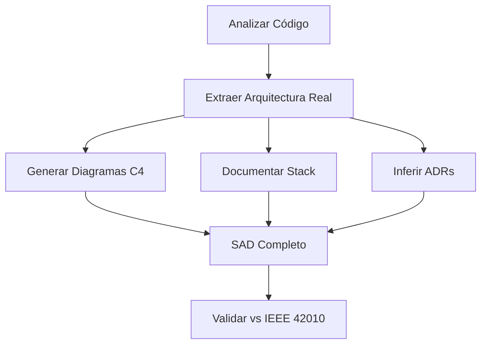
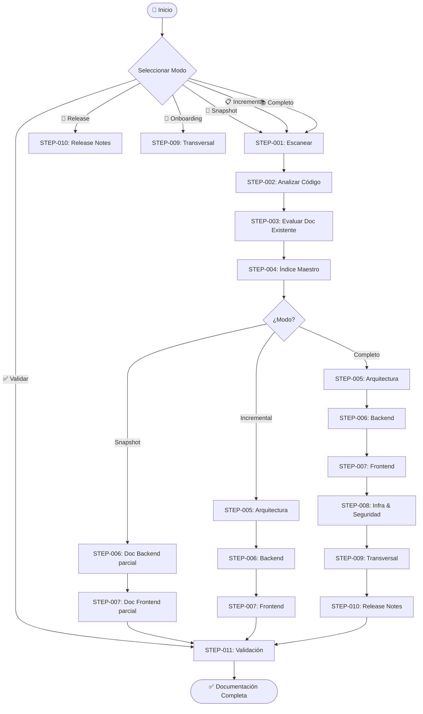

# 📄 Workflow: Documentación Técnica y Funcional — IEEE/ISO Compliant

---

**metodo**: ZNS v2.2  
**workflow_id**: WF-DOC-001  
**version**: 1.0.0  
**fecha_creacion**: 2026-05-12  
**ultima_actualizacion**: 2026-05-12  
**autor**: Orchestration Architect Senior  
**tipo**: Documentación Técnica de Proyectos de Software  
**comando_inicio**: `/workflow:doc`

**estandares_aplicados**:
- IEEE 26511:2018: Gestión de Documentación de Software
- IEEE 1063:2001: Documentación de Usuario de Software
- IEEE 29148:2018: Ingeniería de Requisitos — Trazabilidad
- IEEE 42010:2011: Descripción de Arquitectura de Software
- ISO/IEC 26514:2022: Diseño de Documentación de Usuario
- ISO/IEC 15289:2019: Productos de Información del Ciclo de Vida del Software
- ISO/IEC 12207:2017: Procesos del Ciclo de Vida del Software
- ISO/IEC 25010:2011: Modelo de Calidad del Software (SQuaRE)

**changelog**:
- v1.0.0: Versión inicial del workflow de documentación técnica

---

## 🖥️ WF-DOC-001 | ORQUESTADOR DOCUMENTACIÓN | `/workflow:doc`

### 📋 MENÚ PRINCIPAL

> **Selecciona una opción escribiendo el número o comando**

| # | Comando | Operación | Descripción | Modo |
|:-:|:-------:|:----------|:------------|:-----|
| `1` | `/doc:snapshot` | **📸 SNAPSHOT** | Documentar 1 feature/módulo específico | 30-60 min |
| `2` | `/doc:incremental` | **📋 INCREMENTAL** | Documentar avance del sprint/iteración | 1-3 horas |
| `3` | `/doc:completo` | **📚 COMPLETO** | Documentación completa de cierre/release | 4-8 horas |
| `4` | `/doc:release` | **🚀 RELEASE NOTES** | Generar solo notas de release | 20-30 min |
| `5` | `/doc:validar` | **✅ VALIDAR** | Auditar documentación existente vs IEEE/ISO | 30-60 min |
| `6` | `/doc:onboarding` | **👋 ONBOARDING** | Generar guía de onboarding para devs nuevos | 30-45 min |

---

### ⚡ ACCIONES RÁPIDAS

| Cmd | Acción |
|:---:|:-------|
| `h` | 📖 Mostrar ayuda detallada |
| `t` | 📋 Ver templates disponibles |
| `c` | 📑 Ver checklist IEEE/ISO |
| `q` | ❌ Salir del workflow |

---

### 💬 ACCIÓN REQUERIDA

```
┌─────────────────────────────────────────────────────────────────┐
│  👤 ¿Qué tipo de documentación necesitas generar?               │
│                                                                 │
│  Escribe el NÚMERO (1-6) o el COMANDO                           │
│  Ejemplo: "1" o "/doc:snapshot"                                 │
└─────────────────────────────────────────────────────────────────┘
```

**👤 Tu selección:** `___`

---

## 🗂️ MAPA DE AGENTES ORQUESTADOS

### Agente Principal: Technical Documentation Senior

| Campo | Valor |
|-------|-------|
| **ID** | `AGT-DOC-SENIOR` |
| **Prompt** | `2-agents/zns-tecnical-team/5.zns-develop/prompt-doc-technical-senior.md` |
| **Skill** | `2-agents/zns-tools/skills/technical-documentation-ieee-iso-expert.skill.md` |
| **Rol** | Technical Writer Senior & Documentation Architect |
| **Capacidades** | Documentación IEEE/ISO, SAD, APIs, ERD, Release Notes, Trazabilidad |

### Agentes de Apoyo (para extracción de información)

| Agente | Rol | Cuándo se invoca |
|--------|-----|-----------------|
| ☕ **Backend Senior** | Extraer arquitectura y endpoints del backend | Documentación de APIs y módulos backend |
| 🎨 **Frontend Senior** | Extraer componentes y rutas del frontend | Documentación del frontend |
| 🐘 **Database Senior** | Extraer modelo de datos y migraciones | Documentación de modelo de datos |
| 🔒 **Security Expert** | Extraer configuración de seguridad | Documentación de autenticación/autorización |

---

## 📜 LOG DE EJECUCIÓN (Plegable)

<details>
<summary>📂 <strong>STEP-001: Escanear Proyecto</strong> ⏳ Pendiente</summary>

_Escaneo de `0-docs/4-source-code/`, `0-docs/2-context-hu/`, `0-docs/3-technical-stories/` pendiente_

</details>

<details>
<summary>📂 <strong>STEP-002: Analizar Código Fuente</strong> ⏳ Pendiente</summary>

_Análisis de arquitectura, endpoints, componentes, modelo de datos pendiente_

</details>

<details>
<summary>📂 <strong>STEP-003: Evaluar Documentación Existente</strong> ⏳ Pendiente</summary>

_Evaluación de gaps documentales pendiente_

</details>

<details>
<summary>📂 <strong>STEP-004: Crear Índice Maestro</strong> ⏳ Pendiente</summary>

_Generación de `0-docs/9-technical-docs/README.md` pendiente_

</details>

<details>
<summary>📂 <strong>STEP-005: Documentar Arquitectura (SAD)</strong> ⏳ Pendiente</summary>

_Generación de SAD, C4, ADRs, stack tecnológico pendiente_

</details>

<details>
<summary>📂 <strong>STEP-006: Documentar Backend</strong> ⏳ Pendiente</summary>

_Documentación de APIs, módulos, modelo de datos pendiente_

</details>

<details>
<summary>📂 <strong>STEP-007: Documentar Frontend</strong> ⏳ Pendiente</summary>

_Documentación de componentes, estado, integraciones pendiente_

</details>

<details>
<summary>📂 <strong>STEP-008: Documentar Infraestructura y Seguridad</strong> ⏳ Pendiente</summary>

_Documentación de despliegue, CI/CD, auth, OWASP pendiente_

</details>

<details>
<summary>📂 <strong>STEP-009: Generar Documentación Transversal</strong> ⏳ Pendiente</summary>

_Glosario, trazabilidad, onboarding, convenciones pendiente_

</details>

<details>
<summary>📂 <strong>STEP-010: Release Notes</strong> ⏳ Pendiente</summary>

_Generación de notas de release pendiente_

</details>

<details>
<summary>📂 <strong>STEP-011: Validación IEEE/ISO</strong> ⏳ Pendiente</summary>

_Auditoría de calidad documental pendiente_

</details>

---

## 📋 DETALLE DE STEPS

### STEP-001: Escanear Proyecto ⏱️ 15 min

**Agente**: `AGT-DOC-SENIOR`  
**Input**: Estructura de carpetas del proyecto  
**Output**: Inventario del proyecto (interno)

**Acciones**:
1. Listar `0-docs/4-source-code/0-backend/` → Identificar módulos backend
2. Listar `0-docs/4-source-code/1-frontend/` → Identificar apps frontend
3. Listar `0-docs/2-context-hu/` → Mapear HUs de negocio
4. Listar `0-docs/3-technical-stories/` → Mapear HUTs técnicas
5. Listar `0-docs/6-infrastructure/` → Identificar IaC
6. Identificar stack tecnológico (package.json, build.gradle, etc.)

**Terminal Interactiva**:
```markdown
## 🖥️ WF-DOC-001 | Paso 1/11 | █░░░░░░░░░ 10%

**📍 Fase**: DESCUBRIMIENTO | **⏱️**: 00:15 | **🎯 Agente**: DOC-SENIOR

### 💬 Acción: 🟢 Revisar Inventario
> He identificado los siguientes componentes del proyecto:
> - Backend: [X módulos]
> - Frontend: [Y apps]
> - HUs: [Z historias]
> - HUTs: [W técnicas]
> 
> ¿Es correcto? ¿Falta algo?

| Cmd | Acción | | Cmd | Acción |
|:---:|--------|---|:---:|--------|
| `1/c` | ▶️ Continuar | | `3/m` | ✏️ Modificar |
| `2/r` | 🔍 Revisar detalle | | `4/x` | ❌ Cancelar |

**👤 Respuesta:** `___`
```

---

### STEP-002: Analizar Código Fuente ⏱️ 30 min

**Agente**: `AGT-DOC-SENIOR`  
**Input**: Código fuente del proyecto  
**Output**: Mapa técnico del proyecto (interno)

**Acciones por capa**:

#### Backend:
1. Leer controllers → Extraer endpoints (método HTTP, path, params)
2. Leer services → Identificar lógica de negocio y flujos
3. Leer entities/models → Mapear entidades del dominio
4. Leer repositories → Identificar queries y acceso a datos
5. Leer DTOs → Documentar contratos de entrada/salida
6. Leer configuración de seguridad → Flujo auth
7. Leer migraciones → Evolución del modelo de datos

#### Frontend:
1. Leer rutas/router → Mapear páginas/vistas
2. Leer componentes → Props, eventos, estado
3. Leer stores → Gestión de estado global
4. Leer servicios HTTP → Integración con backend
5. Leer middleware/guards → Protección de rutas

---

### STEP-003: Evaluar Documentación Existente ⏱️ 10 min

**Agente**: `AGT-DOC-SENIOR`  
**Input**: `0-docs/` completo  
**Output**: Gap analysis

**Acciones**:
1. Buscar documentación existente en todas las subcarpetas de `0-docs/`
2. Clasificar: ¿qué existe y qué falta?
3. Evaluar calidad de lo existente vs. estándares IEEE/ISO
4. Generar lista priorizada de gaps

**Terminal Interactiva**:
```markdown
## 🖥️ WF-DOC-001 | Paso 3/11 | ███░░░░░░░ 27%

**📍 Fase**: ANÁLISIS | **⏱️**: 00:25 | **🎯 Agente**: DOC-SENIOR

### 💬 Acción: 🟠 Decidir Prioridades
> Gaps documentales identificados:
> 
> | Prioridad | Documento | Estado |
> |:---------:|-----------|--------|
> | 🔴 Alta | Arquitectura (SAD) | No existe |
> | 🔴 Alta | APIs Backend | Parcial |
> | 🟡 Media | Modelo de Datos | No existe |
> | 🟡 Media | Frontend | No existe |
> | 🟢 Baja | Onboarding | No existe |
> 
> ¿Confirmar prioridades o ajustar?

| Cmd | Acción | | Cmd | Acción |
|:---:|--------|---|:---:|--------|
| `1/c` | ▶️ Continuar con estas prioridades | | `3/m` | ✏️ Modificar orden |
| `2/r` | 🔍 Revisar detalle de gaps | | `4/x` | ❌ Cancelar |

**👤 Respuesta:** `___`
```

---

### STEP-004: Crear Índice Maestro ⏱️ 10 min

**Agente**: `AGT-DOC-SENIOR`  
**Input**: Inventario + Gap analysis  
**Output**: `0-docs/9-technical-docs/README.md`

---

### STEP-005: Documentar Arquitectura ⏱️ 30-60 min

**Agente**: `AGT-DOC-SENIOR`  
**Input**: Código fuente analizado  
**Output**:
- `0-docs/9-technical-docs/01-arquitectura/SAD-arquitectura-general.md`
- `0-docs/9-technical-docs/01-arquitectura/stack-tecnologico.md`
- `0-docs/9-technical-docs/01-arquitectura/ADRs/ADR-NNN-*.md`
- `0-docs/9-technical-docs/01-arquitectura/diagramas/c4-*.md`

**Diagrama Mermaid del flujo**:


---

### STEP-006: Documentar Backend ⏱️ 30-60 min

**Agente**: `AGT-DOC-SENIOR`  
**Input**: Controllers, Services, Entities, DTOs, Migrations  
**Output**:
- `0-docs/9-technical-docs/02-backend/apis/api-[modulo].md`
- `0-docs/9-technical-docs/02-backend/modelo-datos/erd-[schema].md`
- `0-docs/9-technical-docs/02-backend/modelo-datos/diccionario-datos.md`
- `0-docs/9-technical-docs/02-backend/modulos/mod-[nombre].md`

---

### STEP-007: Documentar Frontend ⏱️ 20-40 min

**Agente**: `AGT-DOC-SENIOR`  
**Input**: Componentes, Rutas, Stores, Servicios HTTP  
**Output**:
- `0-docs/9-technical-docs/03-frontend/README.md`
- `0-docs/9-technical-docs/03-frontend/componentes/comp-[nombre].md`
- `0-docs/9-technical-docs/03-frontend/estado/stores.md`
- `0-docs/9-technical-docs/03-frontend/integraciones/api-client.md`

---

### STEP-008: Documentar Infraestructura y Seguridad ⏱️ 20-30 min

**Agente**: `AGT-DOC-SENIOR`  
**Input**: IaC, CI/CD, Security Config  
**Output**:
- `0-docs/9-technical-docs/04-infraestructura/despliegue.md`
- `0-docs/9-technical-docs/04-infraestructura/ambientes.md`
- `0-docs/9-technical-docs/04-infraestructura/ci-cd.md`
- `0-docs/9-technical-docs/05-seguridad/autenticacion.md`
- `0-docs/9-technical-docs/05-seguridad/autorizacion.md`
- `0-docs/9-technical-docs/05-seguridad/owasp-mitigaciones.md`

---

### STEP-009: Generar Documentación Transversal ⏱️ 20-30 min

**Agente**: `AGT-DOC-SENIOR`  
**Input**: Todo lo documentado anteriormente  
**Output**:
- `0-docs/9-technical-docs/glosario.md`
- `0-docs/9-technical-docs/trazabilidad.md`
- `0-docs/9-technical-docs/07-onboarding/guia-desarrollador.md`
- `0-docs/9-technical-docs/07-onboarding/convenciones.md`

---

### STEP-010: Release Notes ⏱️ 20-30 min

**Agente**: `AGT-DOC-SENIOR`  
**Input**: Features implementados, bugs corregidos, changelog  
**Output**: `0-docs/9-technical-docs/06-releases/release-v[X.Y.Z].md`

**Condicional**: Solo se ejecuta en modo COMPLETO o `/doc:release`.

---

### STEP-011: Validación IEEE/ISO ⏱️ 15-30 min

**Agente**: `AGT-DOC-SENIOR`  
**Input**: Toda la documentación generada  
**Output**: Reporte de validación con conformidad IEEE/ISO

**Terminal Interactiva Final**:
```markdown
## 🖥️ WF-DOC-001 | Paso 11/11 | ██████████ 100%

**📍 Fase**: VALIDACIÓN | **⏱️**: HH:MM | **🎯 Agente**: DOC-SENIOR

### 💬 Acción: 🟢 Revisión Final
> Documentación generada:
> 
> | Categoría | Archivos | Estado |
> |-----------|:--------:|:------:|
> | Arquitectura | X | ✅ |
> | Backend/APIs | X | ✅ |
> | Modelo de Datos | X | ✅ |
> | Frontend | X | ✅ |
> | Infraestructura | X | ✅ |
> | Seguridad | X | ✅ |
> | Transversal | X | ✅ |
> | Release | X | ✅ |
> 
> **Conformidad IEEE/ISO**: XX/XX checks pasados (XX%)
> 
> ¿Aprobar documentación?

| Cmd | Acción | | Cmd | Acción |
|:---:|--------|---|:---:|--------|
| `1/c` | ✅ Aprobar | | `3/m` | ✏️ Corregir |
| `2/r` | 🔍 Revisar detalle | | `4/x` | ❌ Rechazar |

**👤 Respuesta:** `___`
```

---

## 📊 DIAGRAMA DE FLUJO DEL WORKFLOW



---

## ⚠️ REGLAS CRÍTICAS

### ❌ NO HACER
- Workflows SIN Terminal Interactiva
- Documentar sin leer el código fuente primero
- Inventar funcionalidades que no existen
- Generar documentación monolítica (>300 líneas por archivo)
- Omitir metadata IEEE en documentos generados
- Dejar placeholders [TODO] en documentación final

### ✅ SIEMPRE HACER
- Terminal Interactiva en cada punto de decisión
- Leer código ANTES de documentar
- Incluir diagramas Mermaid (nunca solo texto)
- Validar contra checklist IEEE/ISO antes de finalizar
- Actualizar `README.md` índice maestro al generar/modificar docs
- Referenciar HUs/HUTs en cada feature documentado

---

## ✅ CHECKLIST RÁPIDO

| ✅ | Verificación |
|:-:|--------------|
| □ | Modo de ejecución seleccionado |
| □ | Proyecto escaneado e inventariado |
| □ | Código fuente analizado |
| □ | Gaps documentales identificados |
| □ | Índice maestro creado/actualizado |
| □ | Documentos generados según modo |
| □ | Diagramas Mermaid incluidos |
| □ | Metadata IEEE en cada documento |
| □ | Validación IEEE/ISO ejecutada |
| □ | Sin placeholders [TODO] |

---

**Versión**: 1.0.0  
**Última actualización**: 2026-05-12  
**Autor**: Orchestration Architect Senior ZNS

---

**FIN DEL WORKFLOW — v1.0.0**
