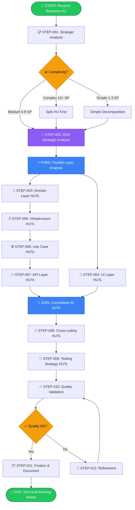
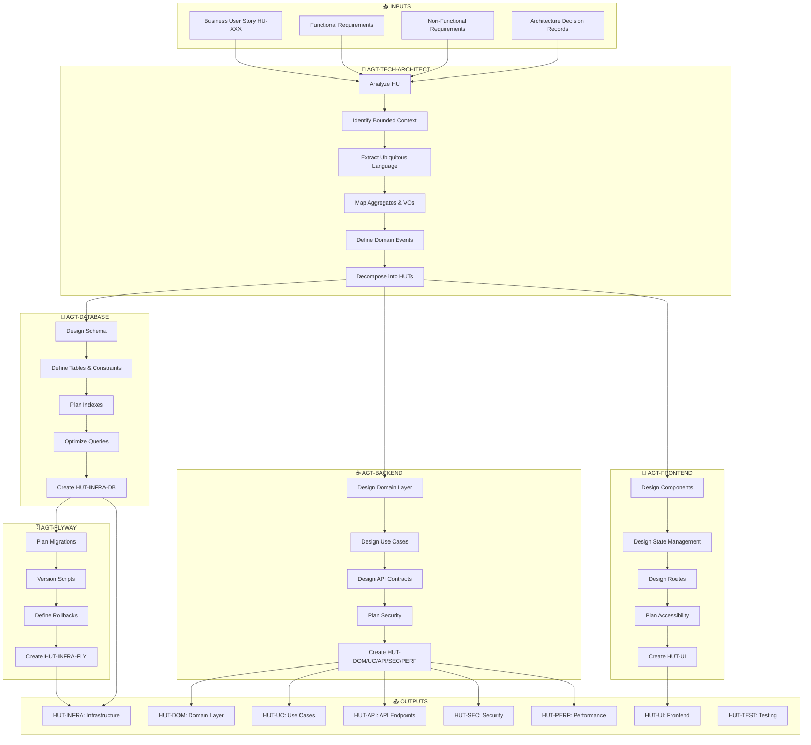

# 🎯 Workflow: Technical User Stories (HUTs) Creation & Refinement for Go Backend

---

**metodo**: ZNS v2.2  
**workflow_id**: WF-HUT-002  
**version**: 1.0.0  
**fecha_creacion**: 2026-03-17  
**ultima_actualizacion**: 2026-03-17  
**autor**: Orchestration Architect Senior  
**tipo**: Technical Decomposition & Backlog Creation  
**comando_inicio**: `/workflow:hut-go`

**estandares_aplicados**:
- IEEE 29148-2018: Systems and software engineering — Requirements engineering
- Domain-Driven Design (Eric Evans)
- Hexagonal Architecture (Alistair Cockburn)
- Test-Driven Development (Kent Beck)
- INVEST Criteria (Bill Wake)

**changelog**:
- v1.0.0: Variante del workflow HUT orientada a backend Go con agente backend Go senior y referencias actualizadas (2026-03-17)

---

## 🖥️ WF-HUT-002 | ORQUESTADOR HUTs GO | `/workflow:hut-go`

### 📋 MENÚ PRINCIPAL

> **Selecciona una opción escribiendo el número o comando**

| # | Comando | Operación | Descripción | Agente Principal |
|:-:|:-------:|:----------|:------------|:-----------------|
| `1` | `/hut:crear` | **📝 CREAR HUTs** | Descomponer HU de negocio en HUTs técnicas | 🏗️ Technical Architect DDD |
| `2` | `/hut:afinar` | **✨ AFINAR HUTs** | Refinar/completar HUTs existentes | 🏗️ Technical Architect DDD |
| `3` | `/hut:backend` | **☕ HUTs Backend** | Generar HUTs específicas de Backend Go | ☕ Backend Go Senior |
| `4` | `/hut:frontend` | **🎨 HUTs Frontend** | Generar HUTs específicas de Angular | 🎨 Frontend Senior |
| `5` | `/hut:database` | **🐘 HUTs Database** | Generar HUTs de modelo de datos | 🐘 Database Senior |
| `6` | `/hut:validar` | **✅ VALIDAR HUTs** | Verificar completitud y calidad | 🔍 QA Validator |

---

### ⚡ ACCIONES RÁPIDAS

| Cmd | Acción |
|:---:|:-------|
| `h` | 📖 Mostrar ayuda detallada |
| `t` | 📋 Ver templates disponibles |
| `c` | 📑 Ver checklist de validación |
| `q` | ❌ Salir del workflow |

---

### 💬 ACCIÓN REQUERIDA

```
┌─────────────────────────────────────────────────────────────────┐
│  👤 ¿Qué operación deseas realizar?                             │
│                                                                 │
│  Escribe el NÚMERO (1-6) o el COMANDO                           │
│  Ejemplo: "1" o "/hut:crear"                                    │
└─────────────────────────────────────────────────────────────────┘
```

**👤 Tu selección:** `___`

---

## 🗂️ MAPA DE AGENTES ORQUESTADOS

### Agente Principal: Technical Architect DDD

| Campo | Valor |
|-------|-------|
| **ID** | `AGT-TECH-ARCHITECT` |
| **Prompt** | `2-agents/zns-tools/technical-user-stories/prompt-technical-user-stories.md` |
| **Rol** | Arquitecto Técnico Senior & Especialista DDD |
| **Capacidades** | Descomposición HU→HUTs, Análisis DDD, Diseño Hexagonal |

### Agentes Especializados (zns-tecnical-team)

| Agente | Prompt | Especialidad |
|--------|--------|--------------|
| ☕ **Backend Go Senior** | `2-agents/zns-tecnical-team/5.zns-develop/1.backend_senior/prompt-dev-backend-go.md` | Go 1.23+, DDD, CQRS, APIs REST/gRPC |
| 🎨 **Frontend Senior** | `2-agents/zns-tecnical-team/5.zns-develop/2.frontend_senior/prompt-dev-frontend-angular-senior.md` | Angular 18, TypeScript, RxJS |
| 🐘 **Database Senior** | `2-agents/zns-tecnical-team/5.zns-develop/4.database_senior/prompt_dev_database_senior.md` | PostgreSQL, Modelado, Índices |
| 🗄️ **Flyway Specialist** | `2-agents/zns-tecnical-team/5.zns-develop/1.backend_senior/prompt_dev_senior_flyway.md` | Migraciones, Versionado DB |

### Templates Disponibles

| Template | Ruta | Uso |
|----------|------|-----|
| 📋 **HUT Genérica** | `2-agents/zns-tools/technical-user-stories/template-hut.md` | HUTs de dominio/aplicación |
| 🔌 **HUT API** | `2-agents/zns-tools/technical-user-stories/template-hut-api.md` | Endpoints REST |
| 🐘 **HUT Database** | `2-agents/zns-tools/technical-user-stories/template-hut-database.md` | Modelo de datos |
| 🔗 **HUT Integration** | `2-agents/zns-tools/technical-user-stories/template-hut-integration.md` | Integraciones externas |
| ✅ **Checklist Validación** | `2-agents/zns-tools/technical-user-stories/checklist-huts-validation.md` | Verificación calidad |

---

## 📝 OPCIÓN 1: CREAR HUTs (`/hut:crear`)

### Flujo de Ejecución

```
HU Negocio → Análisis DDD → Bounded Context → Aggregates → HUTs por Capa
```

### Paso 1: Proporcionar HU de Entrada

```markdown
## INPUT REQUERIDO

Proporciona la Historia de Usuario de Negocio:
- **Opción A:** Ruta del archivo: `0-docs/1-business-analysis/2-user-stories/HU-XXX.md`
- **Opción B:** Pegar contenido directamente (título, descripción, criterios Gherkin)
```

### Paso 2: Invocar Agente Principal

```markdown
@agent: Asume el rol definido en:
`2-agents/zns-tools/technical-user-stories/prompt-technical-user-stories.md`

## PARÁMETROS
- **HU Input:** [HU-XXX o contenido]
- **Proyecto:** MI-TOGA
- **Arquitectura:** Hexagonal + DDD + Go 1.23+ + Angular 18 + PostgreSQL 16

## EJECUTAR
FASE 1: Análisis Estratégico DDD
FASE 2: Identificación de Bounded Contexts y Aggregates
FASE 3: Generación de HUTs por capa (Domain, Infrastructure, Application, API, UI)

## OUTPUT
Directorio: `0-docs/3-technical-stories/[bounded-context]/[HU-XXX]/`
```

### Paso 3: Delegar a Agentes Especializados (si aplica)

| Capa | Agente a Invocar |
|------|------------------|
| Domain/Application | Technical Architect (ya ejecutando) |
| Backend Go | `/hut:backend` → `prompt-dev-backend-go.md` |
| Frontend Angular | `/hut:frontend` → `prompt-dev-frontend-angular-senior.md` |
| Database PostgreSQL | `/hut:database` → `prompt_dev_database_senior.md` |

---

## ✨ OPCIÓN 2: AFINAR HUTs (`/hut:afinar`)

### Flujo de Refinamiento

```
HUT Existente → Análisis Gaps → Completar Specs → Validar → Actualizar
```

### Paso 1: Identificar HUT a Afinar

```markdown
## INPUT REQUERIDO

¿Qué HUT deseas afinar?
- **Ruta:** `0-docs/3-technical-stories/[tipo]/HUT-XXX-*.md`
- **Tipo de refinamiento:**
  - [ ] Completar criterios de aceptación
  - [ ] Agregar especificaciones técnicas
  - [ ] Detallar contratos API
  - [ ] Definir modelo de datos
  - [ ] Agregar casos de prueba
```

### Paso 2: Invocar Agente con Contexto

```markdown
@agent: Asume el rol definido en:
`2-agents/zns-tools/technical-user-stories/prompt-technical-user-stories.md`

## PARÁMETROS
- **HUT a afinar:** [ruta del archivo]
- **Tipo refinamiento:** [selección del usuario]
- **Contexto adicional:** [información complementaria]

## EJECUTAR
- Leer HUT existente
- Identificar gaps según checklist
- Completar secciones faltantes
- Validar contra `checklist-huts-validation.md`

## OUTPUT
HUT actualizada en su ubicación original
```

---

## ☕ OPCIÓN 3: HUTs Backend Go (`/hut:backend`)

### Invocar Backend Go Senior

```markdown
@agent: Asume el rol definido en:
`2-agents/zns-tecnical-team/5.zns-develop/1.backend_senior/prompt-dev-backend-go.md`

## PARÁMETROS
- **HU/HUT de referencia:** [ruta]
- **Componentes a especificar:**
   - [ ] Aggregates / Entities / Value Objects
   - [ ] Ports + Adapters
   - [ ] Use Cases (Commands / Queries)
   - [ ] HTTP Handlers y/o gRPC
   - [ ] DTOs / Contracts / OpenAPI
   - [ ] Tests unitarios, integración y contratos

## TEMPLATE
Usar: `2-agents/zns-tools/technical-user-stories/template-hut-api.md`

## OUTPUT
HUTs en: `0-docs/3-technical-stories/[bounded-context]/[HU-XXX]/`
```

---

## 🎨 OPCIÓN 4: HUTs Frontend (`/hut:frontend`)

### Invocar Frontend Senior

```markdown
@agent: Asume el rol definido en:
`2-agents/zns-tecnical-team/5.zns-develop/2.frontend_senior/prompt-dev-frontend-angular-senior.md`

## PARÁMETROS
- **HU/HUT de referencia:** [ruta]
- **Componentes a especificar:**
  - [ ] Feature Module
  - [ ] Components (Smart + Dumb)
  - [ ] Services
  - [ ] Models/Interfaces
  - [ ] Routing
  - [ ] Tests

## TEMPLATE
Usar: `2-agents/zns-tools/technical-user-stories/template-hut.md`

## OUTPUT
HUTs en: `0-docs/3-technical-stories/1-domain/[bounded-context]/HUT-UI-XXX-*.md`
```

---

## 🐘 OPCIÓN 5: HUTs Database (`/hut:database`)

### Invocar Database Senior

```markdown
@agent: Asume el rol definido en:
`2-agents/zns-tecnical-team/5.zns-develop/4.database_senior/prompt_dev_database_senior.md`

## PARÁMETROS
- **HU/HUT de referencia:** [ruta]
- **Especificaciones:**
  - [ ] Tablas y relaciones
  - [ ] Índices y constraints
  - [ ] Migraciones Flyway
  - [ ] Queries optimizadas

## TEMPLATE
Usar: `2-agents/zns-tools/technical-user-stories/template-hut-database.md`

## OUTPUT
HUTs en: `0-docs/3-technical-stories/0-infra/HUT-INFRA-DB-XXX-*.md`
```

---

## ✅ OPCIÓN 6: VALIDAR HUTs (`/hut:validar`)

### Proceso de Validación

```markdown
## CHECKLIST DE VALIDACIÓN

Usar: `2-agents/zns-tools/technical-user-stories/checklist-huts-validation.md`

### Criterios a Verificar:
1. [ ] Título claro y descriptivo (formato HUT-[TIPO]-[NUM]-[descripcion])
2. [ ] Descripción técnica completa
3. [ ] Criterios de aceptación verificables (Given-When-Then)
4. [ ] Story Points estimados (Fibonacci: 1,2,3,5,8)
5. [ ] Dependencias identificadas
6. [ ] Componentes técnicos especificados
7. [ ] Trazabilidad a HU de negocio
8. [ ] Tests definidos (unit, integration, e2e)
```

---

<details><summary>📊 Historial de Decisiones</summary>

| # | ⏰ Hora | 📍 Paso | 💬 Pregunta | ✅ Decisión |
|:-:|:------:|:------:|-------------|-------------|
| - | - | - | _Workflow no iniciado_ | - |

</details>

---

### 🔔 NOTIFICACIONES

| ⚠️ | Mensaje |
|:--:|---------|
| 🟡 | Esperando selección de operación (1-6)... |

---

## 📋 EXECUTIVE SUMMARY

### Workflow Objective

This workflow orchestrates the **creation and refinement of Technical User Stories (HUTs)** from Business User Stories (HUs), coordinating five specialized agents:

| Agent | Role | Artifacts |
|-------|------|-----------|
| **AGT-TECH-ARCHITECT** | Senior Technical Architect & DDD Expert | HUTs, Bounded Contexts, Aggregates, Domain Events |
| **AGT-DATABASE** | Senior PostgreSQL Engineer | HUT-INFRA (Database), Schemas, Migrations, Indexes |
| **AGT-FLYWAY** | Database Migration Specialist | HUT-INFRA (Flyway), Migration Scripts, Rollbacks |
| **AGT-BACKEND** | Senior Go Backend Developer | HUT-DOM, HUT-UC, HUT-API, HUT-SEC, HUT-PERF |
| **AGT-FRONTEND** | Senior Angular Developer | HUT-UI, Components, Services, State Management |

### Output Directory

```
0-docs/0-Technical_stories/
├── README.md                           # Technical Backlog Index
├── [bounded-context]/                  # Per Bounded Context folder
│   ├── HU-XXX/                        # Per Business User Story folder
│   │   ├── HUT-XXX-DOM-01-*.md       # Domain Layer HUTs
│   │   ├── HUT-XXX-INFRA-01-*.md     # Infrastructure Layer HUTs
│   │   ├── HUT-XXX-UC-01-*.md        # Use Case Layer HUTs
│   │   ├── HUT-XXX-API-01-*.md       # API Layer HUTs
│   │   ├── HUT-XXX-UI-01-*.md        # Frontend/UI Layer HUTs
│   │   ├── HUT-XXX-SEC-01-*.md       # Security Cross-cutting HUTs
│   │   ├── HUT-XXX-PERF-01-*.md      # Performance Optimization HUTs
│   │   ├── HUT-XXX-TEST-01-*.md      # Testing Strategy HUTs
│   │   └── README.md                  # HU Summary & HUT Index
│   └── README.md                      # Bounded Context Summary
```

### Quality Metrics

| Metric | Target | Minimum Threshold |
|--------|--------|-------------------|
| **HUT Coverage** | 100% of HU scenarios | ≥ 95% |
| **Specs Completeness** | Implementation-ready | ≥ 90% |
| **SP Technical Ratio** | 1.5x - 2.5x SP Business | 1.2x - 3.0x |
| **HUT Distribution** | 2-3 SP average | 60% within 2-3 SP |
| **Architecture Validation** | 100% ArchUnit pass | 100% |
| **Traceability Matrix** | 100% bidirectional | 100% |

---

<details>
<summary><h2>🏗️ WORKFLOW ARCHITECTURE (expandir)</h2></summary>

### Main Flow Diagram



### Agent Orchestration Diagram



</details>

---

<details>
<summary><h2>📋 STEP DEFINITIONS (expandir)</h2></summary>

### STEP-001: Strategic Analysis 📋

**Agent:** AGT-TECH-ARCHITECT  
**Prompt:** `2-agents/zns-tools/technical-user-stories/prompt-technical-user-stories.md`  
**Duration:** 15-20 min  

**Input:**
- Business User Story (HU-XXX)
- Functional Requirements (RFs)
- Non-Functional Requirements (RNFs)
- Existing ADRs

**Process:**
1. Read and understand the complete HU (title, description, Gherkin scenarios)
2. Identify complexity level (Simple: 1-3 SP, Medium: 5-8 SP, Complex: 13+ SP)
3. Extract actors, flows (happy path, alternatives, errors)
4. List applicable RNFs (security, performance, compliance)

**Output:**
- Complexity assessment
- Actor mapping
- Flow catalog
- RNF checklist

**Quality Gates:**
- [ ] All Gherkin scenarios understood
- [ ] Actors identified
- [ ] Complexity estimated

---

### STEP-002: DDD Strategic Analysis 🎯

**Agent:** AGT-TECH-ARCHITECT  
**Prompt:** `2-agents/zns-tools/technical-user-stories/prompt-technical-user-stories.md`  
**Duration:** 20-30 min  

**Input:**
- Analysis from STEP-001
- Context Map (if exists)
- Domain glossary

**Process:**
1. **Identify Bounded Context:** Which BC does this HU belong to?
   - Authentication, Marketplace, Profiles, Bookings, Payments, VideoSessions, Notifications, Admin
2. **Extract Ubiquitous Language:**
   - Nouns → Entities/Aggregates (Usuario, Reserva, Pago)
   - Verbs → Use Cases (Registrar, Confirmar, Cancelar)
   - Adjectives → Value Objects (Email válido, Monto positivo)
   - Events → Domain Events (UsuarioRegistrado, ReservaConfirmada)
3. **Map Context Relations:**
   - Shared Kernel (shared concepts)
   - Customer-Supplier (upstream/downstream)
   - Anti-Corruption Layer (external model translation)
4. **Identify Aggregates:**
   - Aggregate Root (invariants guarantor)
   - Internal Entities
   - Value Objects

**Output:**
- Bounded Context identification
- Ubiquitous Language glossary
- Aggregate map with invariants
- Domain Event catalog

**Quality Gates:**
- [ ] Bounded Context clearly identified
- [ ] Ubiquitous Language extracted
- [ ] Aggregates defined with invariants
- [ ] Domain Events named in past tense

---

### STEP-003: Domain Layer HUTs 💎

**Agent:** AGT-BACKEND (Domain Focus)  
**Prompt:** `2-agents/zns-tecnical-team/5.zns-develop/1.backend_senior/prompt-dev-backend-go.md`  
**Duration:** 30-45 min  

**Input:**
- DDD Strategic Analysis from STEP-002
- Aggregate definitions
- Invariants list

**Process:**
1. Create **HUT-XXX-DOM-01** for each Aggregate:
   - Aggregate Root definition
   - Entity definitions
   - Value Object definitions
   - Factory methods
   - Business methods (NO setters)
   - Invariant validations
2. Create **HUT-XXX-DOM-02** for Domain Events:
   - Event naming (past tense)
   - Event properties
   - Event publishing points
3. Create **HUT-XXX-DOM-03** for Domain Services (if needed):
   - Cross-aggregate logic
   - Business rules spanning multiple aggregates

**Output:**
- HUT-XXX-DOM-01: Aggregates & Entities
- HUT-XXX-DOM-02: Value Objects
- HUT-XXX-DOM-03: Domain Events
- HUT-XXX-DOM-04: Domain Services (optional)

**Quality Gates:**
- [ ] Aggregates are pure (no framework dependencies)
- [ ] Value Objects are immutable
- [ ] Domain Events use past tense naming
- [ ] Unit test scenarios defined (>90% coverage target)

---

### STEP-004: UI Layer HUTs 🎨

**Agent:** AGT-FRONTEND  
**Prompt:** `2-agents/zns-tecnical-team/5.zns-develop/2.frontend_senior/prompt-dev-frontend-angular-senior.md`  
**Duration:** 30-45 min  

**Input:**
- Business HU with UI requirements
- UI/UX designs (if available)
- API contracts (from STEP-007 or parallel)

**Process:**
1. Create **HUT-XXX-UI-01** for Smart Components:
   - Container components
   - State management integration
   - API service calls
2. Create **HUT-XXX-UI-02** for Dumb Components:
   - Presentational components
   - Input/Output definitions
   - Accessibility requirements
3. Create **HUT-XXX-UI-03** for Services:
   - HTTP services
   - State services
   - Form handling
4. Create **HUT-XXX-UI-04** for Routes:
   - Route definitions
   - Guards
   - Resolvers

**Output:**
- HUT-XXX-UI-01: Container Components
- HUT-XXX-UI-02: Presentational Components
- HUT-XXX-UI-03: Angular Services
- HUT-XXX-UI-04: Routes & Navigation

**Quality Gates:**
- [ ] Components follow Smart/Dumb pattern
- [ ] Accessibility (WCAG 2.1 AA) specified
- [ ] Responsive design considered
- [ ] Performance budget defined (<300KB bundle)

---

### STEP-005: Infrastructure HUTs 🗄️

**Agent:** AGT-DATABASE + AGT-FLYWAY  
**Prompts:** 
- `2-agents/zns-tecnical-team/5.zns-develop/4.database_senior/prompt_dev_database_senior.md`
- `2-agents/zns-tecnical-team/5.zns-develop/1.backend_senior/prompt_dev_senior_flyway.md`  
**Duration:** 30-45 min  

**Input:**
- Aggregates from STEP-003
- Bounded Context schema mapping
- Performance requirements

**Process:**

**AGT-DATABASE Tasks:**
1. Create **HUT-XXX-INFRA-DB-01** for Tables:
   - Table definitions with Dual Key Pattern (BIGINT + UUID)
   - Column definitions with types and constraints
   - Foreign keys with cascade rules
   - Audit columns (created_at, updated_at, etc.)
2. Create **HUT-XXX-INFRA-DB-02** for Indexes:
   - Index strategy (B-tree, GiST, GIN)
   - Query optimization
   - Partition strategy (if needed)
3. Create **HUT-XXX-INFRA-DB-03** for Schema:
   - Schema per Bounded Context
   - Cross-schema references
   - Permissions

**AGT-FLYWAY Tasks:**
4. Create **HUT-XXX-INFRA-FLY-01** for Migrations:
   - Version numbering (V1.0.0__description.sql)
   - DDL scripts
   - Rollback scripts (U1.0.0__rollback.sql)
   - Repeatable scripts (R__views.sql)

**Output:**
- HUT-XXX-INFRA-DB-01: Table Definitions
- HUT-XXX-INFRA-DB-02: Index Strategy
- HUT-XXX-INFRA-DB-03: Schema Design
- HUT-XXX-INFRA-FLY-01: Flyway Migrations

**Quality Gates:**
- [ ] Dual Key Pattern applied (BIGINT internal + UUID external)
- [ ] GENERATED ALWAYS AS IDENTITY used (not BIGSERIAL)
- [ ] All FKs use BIGINT internal IDs
- [ ] Indexes created for frequent queries
- [ ] Flyway naming convention followed

---

### STEP-006: Use Case HUTs ⚙️

**Agent:** AGT-BACKEND  
**Prompt:** `2-agents/zns-tecnical-team/5.zns-develop/1.backend_senior/prompt-dev-backend-go.md`  
**Duration:** 20-30 min  

**Input:**
- Domain HUTs from STEP-003
- Infrastructure HUTs from STEP-005
- Business rules and validations

**Process:**
1. Create **HUT-XXX-UC-01** for Commands (write operations):
   - Command DTO definition
   - Use Case interface (Port IN)
   - Use case / handler implementation
   - Transaction boundaries
   - Domain Event publishing
2. Create **HUT-XXX-UC-02** for Queries (read operations):
   - Query DTO definition
   - Response DTO definition
   - Query handler implementation
   - Projections (if CQRS)

**Output:**
- HUT-XXX-UC-01: Commands (Write Use Cases)
- HUT-XXX-UC-02: Queries (Read Use Cases)

**Quality Gates:**
- [ ] Use Cases orchestrate Domain + Infrastructure
- [ ] Commands are transactional
- [ ] Domain Events published after commit
- [ ] DTOs separate from Domain entities
- [ ] Unit tests with mocks (>80% coverage target)

---

### STEP-007: API Layer HUTs 🔌

**Agent:** AGT-BACKEND  
**Prompt:** `2-agents/zns-tecnical-team/5.zns-develop/1.backend_senior/prompt-dev-backend-go.md`  
**Duration:** 20-30 min  

**Input:**
- Use Case HUTs from STEP-006
- OpenAPI standards
- Security requirements

**Process:**
1. Create **HUT-XXX-API-01** for each endpoint:
   - HTTP method and path
   - Request DTO con validación explícita
   - Response DTO
   - HTTP status codes
   - OpenAPI / Swagger contract
   - Error handling

**Template per endpoint:**
```yaml
Endpoint: POST /api/v1/[resource]
Request:
  - Headers: Authorization, Content-Type
  - Body: { field1, field2, ... }
   - Validation: required, format, length, enum, domain rules
Response:
  - 201 Created: { uuid, field1, createdAt }
  - 400 Bad Request: { error: { code, message } }
  - 401 Unauthorized: { error: { code, message } }
  - 409 Conflict: { error: { code, message } }
```

**Output:**
- HUT-XXX-API-01: REST Endpoints
- HUT-XXX-API-02: Request/Response DTOs
- HUT-XXX-API-03: Error Handling

**Quality Gates:**
- [ ] OpenAPI/Swagger documented
- [ ] All HTTP status codes specified
- [ ] Request validation complete
- [ ] Response DTOs (never expose domain entities)
- [ ] Integration tests defined (MockMvc/RestAssured)

---

### STEP-008: Cross-cutting HUTs 🔐

**Agent:** AGT-BACKEND + AGT-FRONTEND  
**Duration:** 15-20 min  

**Input:**
- RNFs from STEP-001
- Security requirements
- Performance requirements

**Process:**

**Security (HUT-SEC):**
1. Create **HUT-XXX-SEC-01** for Authentication:
   - JWT validation
   - OAuth2/OIDC integration
   - Token refresh
2. Create **HUT-XXX-SEC-02** for Authorization:
   - RBAC (Role-Based Access Control)
   - @PreAuthorize annotations
   - Resource ownership validation
3. Create **HUT-XXX-SEC-03** for Data Security:
   - Password hashing (BCrypt)
   - Data encryption (AES-256)
   - Audit logging

**Performance (HUT-PERF):**
4. Create **HUT-XXX-PERF-01** for Database:
   - Query optimization
   - Index strategy
   - Connection pooling
5. Create **HUT-XXX-PERF-02** for Caching:
   - Redis cache strategy
   - Cache invalidation
   - TTL configuration

**Output:**
- HUT-XXX-SEC-01: Authentication
- HUT-XXX-SEC-02: Authorization
- HUT-XXX-SEC-03: Data Security
- HUT-XXX-PERF-01: Database Optimization
- HUT-XXX-PERF-02: Caching Strategy

**Quality Gates:**
- [ ] OWASP Top 10 addressed
- [ ] Performance SLAs defined (<200ms p95)
- [ ] Security tests defined
- [ ] Performance tests defined

---

### STEP-009: Testing Strategy HUTs 🧪

**Agent:** AGT-TECH-ARCHITECT  
**Duration:** 15-20 min  

**Input:**
- All HUTs from previous steps
- Coverage requirements

**Process:**
1. Create **HUT-XXX-TEST-01** for Testing Strategy:
   - Unit tests (Domain: >90%, Use Cases: >80%)
   - Integration tests (Infrastructure: >70%)
   - E2E tests (API: Happy path + Error paths)
   - Architecture tests (ArchUnit)
   - Security tests
   - Performance tests

**Testing Pyramid:**
```
        /\
       /  \  E2E Tests (10%)
      /    \  - API flows
     /──────\  - Gherkin scenarios
    /        \
   /  Integ   \  Integration Tests (20%)
  /   Tests    \  - Testcontainers
 /──────────────\  - Repository tests
/                \
/   Unit Tests    \  Unit Tests (70%)
/                  \  - Domain pure tests
/────────────────────\  - No mocks needed
```

**Output:**
- HUT-XXX-TEST-01: Testing Strategy Document

**Quality Gates:**
- [ ] All acceptance criteria have test cases
- [ ] Coverage targets specified
- [ ] Testing pyramid balanced
- [ ] CI/CD integration defined

---

### STEP-010: Quality Validation ✅

**Agent:** AGT-TECH-ARCHITECT  
**Prompt:** `2-agents/zns-tools/technical-user-stories/checklist-huts-validation.md`  
**Duration:** 15-20 min  

**Process:**
Execute the validation checklist:

**1. Functional Completeness:**
- [ ] 100% HU scenarios covered by HUTs
- [ ] All Gherkin scenarios have technical counterparts
- [ ] Error flows implemented
- [ ] Edge cases covered

**2. Architecture Validation:**
- [ ] No inverted dependencies (Domain → Infrastructure)
- [ ] Hexagonal layers respected
- [ ] Aggregates correctly designed
- [ ] Patterns applied correctly

**3. Implementation Readiness:**
- [ ] Code examples provided
- [ ] SQL queries written
- [ ] API contracts complete
- [ ] All specs sufficient for development

**4. Testability:**
- [ ] Acceptance criteria verifiable
- [ ] Coverage targets specified
- [ ] Test strategy defined

**5. Estimation:**
- [ ] SP ratio within 1.5x-2.5x of business SP
- [ ] 60%+ HUTs within 2-3 SP range
- [ ] Dependencies mapped (no cycles)

**Output:**
- Validation report
- Issues list (if any)
- Approval status

---

### STEP-011: Finalize & Document 📦

**Agent:** AGT-TECH-ARCHITECT  
**Duration:** 10-15 min  

**Process:**
1. Generate README for HU folder:
   - HUT index with links
   - Dependency graph
   - SP summary
   - Implementation order
2. Update Bounded Context README
3. Update main Technical Backlog README
4. Create traceability matrix

**Output:**
- `0-docs/0-Technical_stories/[bounded-context]/HU-XXX/README.md`
- Updated indexes

---

### STEP-012: Refinement 🔧

**Agent:** Respective specialist agents  
**Duration:** Variable  

**Process:**
1. Address issues from validation
2. Complete missing specifications
3. Adjust estimations
4. Re-run validation

**Loop until STEP-010 passes.**

</details>

---

<details>
<summary><h2>🎯 AGENT PROMPTS REFERENCE (expandir)</h2></summary>

### Invocation Commands

```markdown
# STEP-001 & STEP-002: Strategic Analysis
@agent: Assume the role defined in:
2-agents/zns-tools/technical-user-stories/prompt-technical-user-stories.md

Analyze HU-XXX and execute FASE 1 (Strategic DDD Analysis):
- Identify Bounded Context
- Extract Ubiquitous Language
- Map Aggregates and Value Objects
- Define Domain Events

Input HU: [paste HU content or reference]

# STEP-003 & STEP-006 & STEP-007: Backend HUTs
@agent: Assume the role defined in:
2-agents/zns-tecnical-team/5.zns-develop/1.backend_senior/prompt-dev-backend-go.md

Create HUTs for Domain, Use Cases, and API layers following:
- Hexagonal Architecture
- DDD Tactical Patterns
- Go 1.23+ idiomatic standards

Aggregates: [from STEP-002]

# STEP-004: Frontend HUTs
@agent: Assume the role defined in:
2-agents/zns-tecnical-team/5.zns-develop/2.frontend_senior/prompt-dev-frontend-angular-senior.md

Create HUT-UI for:
- Container and Presentational Components
- Angular Services
- Routes and Guards

UI Requirements: [from HU]

# STEP-005a: Database HUTs
@agent: Assume the role defined in:
2-agents/zns-tecnical-team/5.zns-develop/4.database_senior/prompt_dev_database_senior.md

Create HUT-INFRA-DB for:
- Table definitions (Dual Key Pattern)
- Indexes and Constraints
- Schema design

Aggregates: [from STEP-003]

# STEP-005b: Flyway HUTs
@agent: Assume the role defined in:
2-agents/zns-tecnical-team/5.zns-develop/1.backend_senior/prompt_dev_senior_flyway.md

Create HUT-INFRA-FLY for:
- Flyway migrations (V1.0.0__description.sql)
- Rollback scripts
- Repeatable scripts

Tables: [from STEP-005a]

# STEP-010: Validation
@agent: Assume the role defined in:
2-agents/zns-tools/technical-user-stories/prompt-technical-user-stories.md

Validate all HUTs using checklist:
2-agents/zns-tools/technical-user-stories/checklist-huts-validation.md

HUTs to validate: [list HUTs]
```

</details>

---

## 📊 SUCCESS METRICS

| Criteria | Metric | Threshold |
|----------|--------|-----------|
| **Coverage** | % HU scenarios with HUTs | 100% |
| **Completeness** | % HUTs with full specs | ≥ 95% |
| **Traceability** | Bidirectional HU ↔ HUT mapping | 100% |
| **Estimation** | SP ratio business:technical | 1.5x - 2.5x |

---

## 📁 OUTPUT STRUCTURE

```
0-docs/0-Technical_stories/
├── README.md                                    # Main Index
├── authentication/                              # Bounded Context
│   ├── README.md                               # BC Summary
│   ├── HU-001-registro-usuario/
│   │   ├── README.md                           # HU Summary
│   │   ├── HUT-001-DOM-01-aggregate-usuario.md
│   │   ├── HUT-001-DOM-02-value-objects.md
│   │   ├── HUT-001-DOM-03-domain-events.md
│   │   ├── HUT-001-INFRA-DB-01-tabla-usuarios.md
│   │   ├── HUT-001-INFRA-FLY-01-migracion-usuarios.md
│   │   ├── HUT-001-UC-01-registrar-usuario-command.md
│   │   ├── HUT-001-API-01-post-registro.md
│   │   ├── HUT-001-UI-01-formulario-registro.md
│   │   ├── HUT-001-SEC-01-hash-password.md
│   │   ├── HUT-001-PERF-01-indices-usuarios.md
│   │   └── HUT-001-TEST-01-estrategia-testing.md
│   └── HU-002-login/
│       └── ...
├── bookings/                                    # Bounded Context
│   ├── README.md
│   ├── HU-021-reservar-sesion/
│   │   └── ...
│   └── ...
└── payments/                                    # Bounded Context
    └── ...
```

---

## 🚀 QUICK START

### Execute Workflow

```bash
# 1. Start with a Business HU
HU_ID="HU-001"
BOUNDED_CONTEXT="authentication"

# 2. Create folder structure
mkdir -p "0-docs/0-Technical_stories/${BOUNDED_CONTEXT}/${HU_ID}"

# 3. Invoke agents in sequence
# - STEP-001 → STEP-002: AGT-TECH-ARCHITECT
# - STEP-003: AGT-BACKEND (Domain)
# - STEP-004: AGT-FRONTEND (parallel)
# - STEP-005a: AGT-DATABASE
# - STEP-005b: AGT-FLYWAY
# - STEP-006: AGT-BACKEND (Use Cases)
# - STEP-007: AGT-BACKEND (API)
# - STEP-008: AGT-BACKEND + AGT-FRONTEND (Cross-cutting)
# - STEP-009: AGT-TECH-ARCHITECT (Testing)
# - STEP-010: Validation
# - STEP-011: Documentation

# 4. Validate output
# All HUTs saved in 0-docs/0-Technical_stories/
```

---

**Last Updated:** 2026-02-06  
**Version:** 1.0.0  
**Author:** Prompt Engineer Senior  
**License:** Internal Use - MI-TOGA Project
