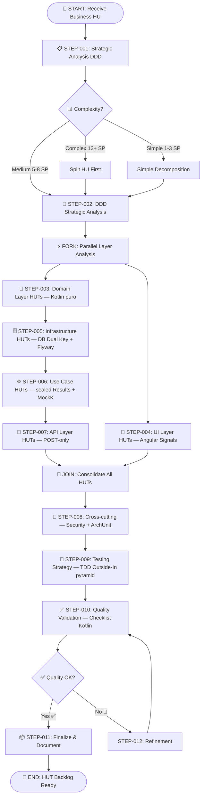
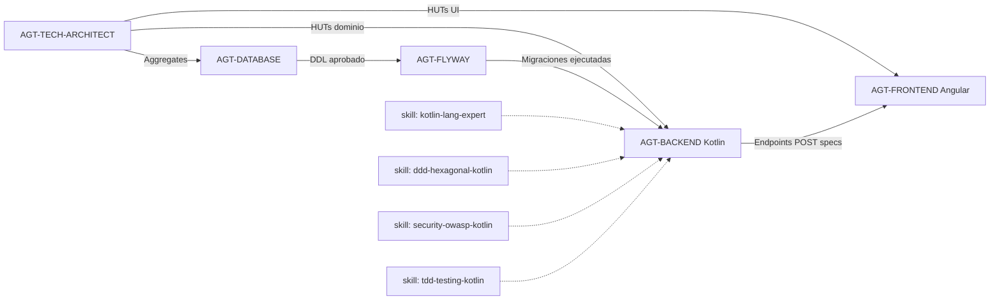

# 🎯 Workflow: Technical User Stories (HUTs) Creation & Refinement — Kotlin Stack

---

**metodo**: ZNS v2.2  
**workflow_id**: WF-HUT-004  
**version**: 1.0.0  
**fecha_creacion**: 2026-03-18  
**ultima_actualizacion**: 2026-03-18  
**autor**: Orchestration Architect Senior  
**tipo**: Technical Decomposition & Backlog Creation  
**comando_inicio**: `/workflow:hut-kotlin`  
**basado_en**: WF-HUT-001 v2.0.0

**diferencias_vs_WF-HUT-001**:
- Backend: `prompt-dev-kotlin-springboot-senior.md` (reemplaza `prompt-dev-springboot-senior.md`)
- Skills activas en AGT-BACKEND: kotlin-lang-expert, ddd-hexagonal-kotlin, security-owasp-kotlin, tdd-testing-kotlin
- Arquitectura referenciada: Kotlin 2.x + Spring Boot 3.4.x (no Java 21)
- Dominio desacoplado como regla absoluta — domain/ = Kotlin puro, CERO Spring/JPA
- Tests de dominio: pure Kotlin (sin @SpringBootTest, sin MockK de Spring)
- Mocking: MockK (no Mockito)
- Coverage: domain ≥95% / application ≥90% / global ≥85%

**estandares_aplicados**:
- IEEE 29148-2018: Systems and software engineering — Requirements engineering
- Domain-Driven Design (Eric Evans)
- Hexagonal Architecture (Alistair Cockburn)
- Test-Driven Development (Kent Beck) — Outside-In con domain puro
- INVEST Criteria (Bill Wake)

**changelog**:
- v1.0.0: Variante del workflow HUT orientada a backend Kotlin + Spring Boot con skills activas y regla de dominio desacoplado (2026-03-18)

---

## 🖥️ WF-HUT-004 | ORQUESTADOR HUTs KOTLIN | `/workflow:hut-kotlin`

### 📋 MENÚ PRINCIPAL

> **Selecciona una opción escribiendo el número o comando**

| # | Comando | Operación | Descripción | Agente Principal |
|:-:|:-------:|:----------|:------------|:-----------------|
| `1` | `/hut:crear` | **📝 CREAR HUTs** | Descomponer HU de negocio en HUTs técnicas | 🏗️ Technical Architect DDD |
| `2` | `/hut:afinar` | **✨ AFINAR HUTs** | Refinar/completar HUTs existentes | 🏗️ Technical Architect DDD |
| `3` | `/hut:backend` | **🟣 HUTs Backend** | Generar HUTs específicas de Kotlin + Spring Boot | 🟣 Backend Kotlin Senior |
| `4` | `/hut:frontend` | **🎨 HUTs Frontend** | Generar HUTs específicas de Angular | 🎨 Frontend Senior |
| `5` | `/hut:database` | **🐘 HUTs Database** | Generar HUTs de modelo de datos | 🐘 Database Senior |
| `6` | `/hut:validar` | **✅ VALIDAR HUTs** | Verificar completitud y calidad | 🔍 QA Validator |

---

### ⚡ ACCIONES RÁPIDAS

| Cmd | Acción |
|:---:|:-------|
| `h` | 📖 Mostrar ayuda detallada |
| `t` | 📋 Ver templates disponibles |
| `c` | 📑 Ver checklist de validación |
| `q` | ❌ Salir del workflow |

---

### 💬 ACCIÓN REQUERIDA

```
┌─────────────────────────────────────────────────────────────────┐
│  👤 ¿Qué operación deseas realizar?                             │
│                                                                 │
│  Escribe el NÚMERO (1-6) o el COMANDO                           │
│  Ejemplo: "1" o "/hut:crear"                                    │
└─────────────────────────────────────────────────────────────────┘
```

**👤 Tu selección:** `___`

---

## 🗂️ MAPA DE AGENTES ORQUESTADOS

### Agente Principal: Technical Architect DDD

| Campo | Valor |
|-------|-------|
| **ID** | `AGT-TECH-ARCHITECT` |
| **Prompt** | `2-agents/zns-tools/technical-user-stories/prompt-technical-user-stories.md` |
| **Rol** | Arquitecto Técnico Senior & Especialista DDD |
| **Capacidades** | Descomposición HU→HUTs, Análisis DDD, Diseño Hexagonal |

### Agentes Especializados (zns-tecnical-team)

| Agente | Prompt | Especialidad |
|--------|--------|--------------|
| 🟣 **Backend Kotlin Senior** | `2-agents/zns-tecnical-team/5.zns-develop/1.backend_senior/prompt-dev-kotlin-springboot-senior.md` | Kotlin 2.x, Spring Boot 3.4.x, DDD Hexagonal, TDD Outside-In |
| 🎨 **Frontend Senior** | `2-agents/zns-tecnical-team/5.zns-develop/2.frontend_senior/prompt-dev-frontend-angular-senior.md` | Angular 18, TypeScript, Signals, RxJS |
| 🐘 **Database Senior** | `2-agents/zns-tecnical-team/5.zns-develop/4.database_senior/prompt_dev_database_senior.md` | PostgreSQL 16, Dual Key Pattern, Modelado |
| 🗄️ **Flyway Specialist** | `2-agents/zns-tecnical-team/5.zns-develop/1.backend_senior/prompt_dev_senior_flyway.md` | Flyway 10.x, V{n.m}__ naming, rollbacks |

### Skills Kotlin Activas (para AGT-BACKEND)

| Skill | Ruta | Propósito |
|-------|------|-----------|
| `kotlin-lang-expert` | `2-agents/zns-tools/skills/kotlin-lang-expert.skill.md` | Null safety, sealed/data/value classes, coroutines |
| `ddd-hexagonal-kotlin` | `2-agents/zns-tools/skills/ddd-hexagonal-kotlin.skill.md` | Arquitectura hexagonal en Kotlin puro |
| `security-owasp-kotlin` | `2-agents/zns-tools/skills/security-owasp-kotlin.skill.md` | OWASP Top 10, Spring Security Kotlin DSL |
| `tdd-testing-kotlin` | `2-agents/zns-tools/skills/tdd-testing-kotlin.skill.md` | TDD Outside-In, dominio desacoplado, MockK |

### Templates Disponibles

| Template | Ruta | Uso |
|----------|------|-----|
| 📋 **HUT Genérica** | `2-agents/zns-tools/technical-user-stories/template-hut.md` | HUTs de dominio/aplicación |
| 🔌 **HUT API** | `2-agents/zns-tools/technical-user-stories/template-hut-api.md` | Endpoints REST POST-only |
| 🐘 **HUT Database** | `2-agents/zns-tools/technical-user-stories/template-hut-database.md` | Modelo de datos Dual Key |
| 🔗 **HUT Integration** | `2-agents/zns-tools/technical-user-stories/template-hut-integration.md` | Integraciones externas |
| ✅ **Checklist Validación** | `2-agents/zns-tools/technical-user-stories/checklist-huts-validation.md` | Verificación calidad |

---

## ⚠️ REGLA ABSOLUTA — DOMINIO DESACOPLADO

> Aplica a TODAS las HUTs generadas por este workflow.  
> El TECHNICAL ARCHITECT y el BACKEND KOTLIN SENIOR deben recordar esto en CADA HUT.

```
domain/ es Kotlin puro.
CERO imports de org.springframework.*, jakarta.persistence.*, io.micronaut.* en domain/

CONSECUENCIAS si se viola:
1. ArchUnit rompe el pipeline de CI — la rama no puede mergear
2. Los tests de domain/ dejan de ser pure Kotlin y necesitan @SpringBootTest (más lentos)
3. El dominio queda acoplado al framework — cualquier migración de versión afecta el core
4. Los Value Objects no pueden instanciarse en tests sin contexto Spring
5. La arquitectura hexagonal pierde su razón de ser

CORRECCIÓN si se detecta en una HUT:
→ Mover la dependencia a infrastructure/adapter/out/ o application/service/
→ Crear un Output Port (interface en domain/) que infrastructure implementa
→ NUNCA agregar @Suppress("archunit") o exclusiones
```

---

## 📝 OPCIÓN 1: CREAR HUTs (`/hut:crear`)

### Flujo de Ejecución

```
HU Negocio → Análisis DDD → Bounded Context → Aggregates Kotlin → HUTs por Capa
```

### Paso 1: Proporcionar HU de Entrada

```markdown
## INPUT REQUERIDO

Proporciona la Historia de Usuario de Negocio:
- **Opción A:** Ruta del archivo: `0-docs/1-business-analysis/2-user-stories/HU-XXX.md`
- **Opción B:** Pegar contenido directamente (título, descripción, criterios Gherkin)
```

### Paso 2: Invocar Agente Principal

```markdown
@agent: Asume el rol definido en:
`2-agents/zns-tools/technical-user-stories/prompt-technical-user-stories.md`

## PARÁMETROS
- **HU Input:** [HU-XXX o contenido]
- **Proyecto:** [nombre del proyecto]
- **Arquitectura:** Hexagonal + DDD + Kotlin 2.x + Spring Boot 3.4.x + Angular 18 + PostgreSQL 16

## CONSIDERACIONES KOTLIN AL DESCOMPONER
- Aggregates → data class con companion object create()
- Value Objects → @JvmInline value class o data class con init { require(...) }
- Results de Use Cases → sealed interface/class (NO exception-driven)
- Domain Events → sealed interface DomainEvent
- Repository → interface en domain/ (never @Repository here)
- domain/ no importa ningún framework — ArchUnit verifica esto

## EJECUTAR
FASE 1: Análisis Estratégico DDD
FASE 2: Identificación de Bounded Contexts y Aggregates
FASE 3: Generación de HUTs por capa (Domain, Infrastructure, Application, API, UI)

## OUTPUT
Directorio: `0-docs/3-technical-stories/[bounded-context]/[HU-XXX]/`
```

### Paso 3: Delegar a Agentes Especializados (si aplica)

| Capa | Agente a Invocar |
|------|------------------|
| Domain/Application | Technical Architect (ya ejecutando) |
| Backend Kotlin | `/hut:backend` → `prompt-dev-kotlin-springboot-senior.md` |
| Frontend Angular | `/hut:frontend` → `prompt-dev-frontend-angular-senior.md` |
| Database PostgreSQL | `/hut:database` → `prompt_dev_database_senior.md` |

---

## ✨ OPCIÓN 2: AFINAR HUTs (`/hut:afinar`)

### Flujo de Refinamiento

```
HUT Existente → Análisis Gaps → Completar Specs → Validar → Actualizar
```

### Paso 1: Identificar HUT a Afinar

```markdown
## INPUT REQUERIDO

¿Qué HUT deseas afinar?
- **Ruta:** `0-docs/3-technical-stories/[tipo]/HUT-XXX-*.md`
- **Tipo de refinamiento:**
  - [ ] Completar criterios de aceptación
  - [ ] Agregar especificaciones técnicas Kotlin (sealed results, Value Objects)
  - [ ] Detallar contratos API (POST-only, request/response data classes)
  - [ ] Definir modelo de datos (Dual Key Pattern)
  - [ ] Agregar casos de prueba (domain puro → MockK → Testcontainers)
  - [ ] Verificar que domain/ no tiene imports de frameworks
```

### Paso 2: Invocar Agente con Contexto

```markdown
@agent: Asume el rol definido en:
`2-agents/zns-tools/technical-user-stories/prompt-technical-user-stories.md`

## PARÁMETROS
- **HUT a afinar:** [ruta del archivo]
- **Tipo refinamiento:** [selección del usuario]
- **Contexto adicional:** [información complementaria]
- **Stack:** Kotlin 2.x + Spring Boot 3.4.x

## EJECUTAR
- Leer HUT existente
- Verificar que no haya imports de framework en especificaciones de domain/
- Identificar gaps según checklist
- Completar secciones faltantes
- Validar contra `checklist-huts-validation.md`

## OUTPUT
HUT actualizada en su ubicación original
```

---

## 🟣 OPCIÓN 3: HUTs Backend Kotlin (`/hut:backend`)

### Invocar Backend Kotlin Senior

> **Activar las 4 skills Kotlin antes de comenzar**

```markdown
@agent: Asume el rol definido en:
`2-agents/zns-tecnical-team/5.zns-develop/1.backend_senior/prompt-dev-kotlin-springboot-senior.md`

Activa estas skills:
- `2-agents/zns-tools/skills/kotlin-lang-expert.skill.md`
- `2-agents/zns-tools/skills/ddd-hexagonal-kotlin.skill.md`
- `2-agents/zns-tools/skills/security-owasp-kotlin.skill.md`
- `2-agents/zns-tools/skills/tdd-testing-kotlin.skill.md`

## PARÁMETROS
- **HU/HUT de referencia:** [ruta]
- **Bounded Context:** [nombre — determina el package base com.zenapses.[bc]]
- **Componentes a especificar:**
   - [ ] Aggregates (data class + companion object create())
   - [ ] Value Objects (@JvmInline o data class con init { require(...) })
   - [ ] Domain Events (sealed interface DomainEvent)
   - [ ] Repository Ports (interface en domain/ — CERO @Repository aquí)
   - [ ] Input Ports / Use Case interfaces (application/port/in/)
   - [ ] Output Ports adicionales (application/port/out/)
   - [ ] Use Cases con sealed Results (application/service/)
   - [ ] Commands (data class inmutables)
   - [ ] JpaEntity + PersistenceAdapter (infrastructure/adapter/out/)
   - [ ] @RestController POST-only (infrastructure/adapter/in/rest/)
   - [ ] ArchUnit rules (7 reglas — domain sin frameworks)
   - [ ] Tests: domain pure Kotlin + application MockK + infrastructure @DataJpaTest + E2E @SpringBootTest

## REGLA ABSOLUTA
domain/ no importa ningún framework.
Los tests de domain/ son pure Kotlin (val aggregate = Aggregate.crear(...))
MockK para mocks — nunca Mockito

## TEMPLATE
Usar: `2-agents/zns-tools/technical-user-stories/template-hut-api.md`

## OUTPUT
HUTs en: `0-docs/3-technical-stories/[bounded-context]/[HU-XXX]/`
```

### Estructura de Paquetes Esperada en las HUTs

```
src/main/kotlin/com/zenapses/[bc]/
├── domain/
│   ├── model/          ← data class / @JvmInline value class / sealed class
│   ├── event/          ← sealed interface DomainEvent
│   ├── repository/     ← interface Repository (Output Port)
│   ├── service/        ← interface DomainService (Output Port)
│   └── exception/      ← DomainException (preferir sealed results)
├── application/
│   ├── port/in/        ← interface UseCase (Input Port)
│   ├── port/out/       ← interface OutputPort adicional
│   ├── service/        ← @Service (implementa Input Ports)
│   ├── command/        ← data class Command
│   └── result/         ← sealed interface/class NombreResult
└── infrastructure/
    ├── adapter/in/rest/ ← @RestController (POST-only excepto /actuator/health)
    ├── adapter/out/persistence/ ← @Entity, JpaRepository, PersistenceAdapter
    └── config/
```

---

## 🎨 OPCIÓN 4: HUTs Frontend (`/hut:frontend`)

### Invocar Frontend Senior

```markdown
@agent: Asume el rol definido en:
`2-agents/zns-tecnical-team/5.zns-develop/2.frontend_senior/prompt-dev-frontend-angular-senior.md`

## PARÁMETROS
- **HU/HUT de referencia:** [ruta]
- **APIs del backend Kotlin a consumir:**
  [LISTAR ENDPOINTS POST — el backend Kotlin usa POST para todo]
- **Componentes a especificar:**
  - [ ] Standalone Components (no NgModules)
  - [ ] Signals para estado reactivo
  - [ ] Reactive Forms
  - [ ] Angular Service con http.post() (no http.get para operaciones)
  - [ ] Interfaces TypeScript alineadas con data classes Kotlin
  - [ ] Lazy routes
  - [ ] Tests con coverage ≥ 80%

## NOTA CRÍTICA DE INTEGRACIÓN
El backend Kotlin retorna sealed Results mapeados a HTTP status:
- Exito → 200/201
- Error de negocio → 409/404/400
El frontend debe manejar catchError en RxJS para cada código.

## TEMPLATE
Usar: `2-agents/zns-tools/technical-user-stories/template-hut.md`

## OUTPUT
HUTs en: `0-docs/3-technical-stories/[bounded-context]/[HU-XXX]/HUT-XXX-UI-*.md`
```

---

## 🐘 OPCIÓN 5: HUTs Database (`/hut:database`)

### Invocar Database Senior

```markdown
@agent: Asume el rol definido en:
`2-agents/zns-tecnical-team/5.zns-develop/4.database_senior/prompt_dev_database_senior.md`

## PARÁMETROS
- **HU/HUT de referencia:** [ruta]
- **Aggregates Kotlin identificados:** [LISTAR — de las HUTs de dominio]
- **Bounded Context / Schema:** [nombre_bc]
- **Especificaciones:**
  - [ ] Tablas con Dual Key Pattern (pkid_ BIGINT GENERATED ALWAYS AS IDENTITY + uuid_ UUID)
  - [ ] Índices y constraints (pk_, fk_, idx_, uk_, ck_)
  - [ ] Campos de auditoría (creation_date TIMESTAMPTZ NOT NULL DEFAULT NOW())
  - [ ] Apertura de schema (CREATE SCHEMA IF NOT EXISTS [nombre_bc])
  - [ ] Diagrama ER en mermaid

## NOTA PARA COMPATIBILIDAD KOTLIN/JPA
- Columnas en snake_case (Spring Data mapea automáticamente)
- Evitar reserved keywords: user→usr_, group→grp_, order→ord_
- Los @JvmInline value class del dominio no requieren columnas especiales

## TEMPLATE
Usar: `2-agents/zns-tools/technical-user-stories/template-hut-database.md`

## OUTPUT
HUTs en: `0-docs/3-technical-stories/[bounded-context]/[HU-XXX]/HUT-XXX-INFRA-DB-*.md`
```

---

## ✅ OPCIÓN 6: VALIDAR HUTs (`/hut:validar`)

### Proceso de Validación

```markdown
## CHECKLIST DE VALIDACIÓN — Kotlin Stack

Usar: `2-agents/zns-tools/technical-user-stories/checklist-huts-validation.md`

### Criterios Generales:
1. [ ] Título claro y descriptivo (formato HUT-[TIPO]-[NUM]-[descripcion])
2. [ ] Descripción técnica completa
3. [ ] Criterios de aceptación verificables (Given-When-Then)
4. [ ] Story Points estimados (Fibonacci: 1,2,3,5,8)
5. [ ] Dependencias identificadas
6. [ ] Componentes técnicos especificados
7. [ ] Trazabilidad a HU de negocio
8. [ ] Tests definidos (unit domain puro, integration MockK, e2e @SpringBootTest)

### Criterios Específicos Kotlin (adicionales):
9. [ ] domain/ no referencia ningún framework en la especificación
10. [ ] Tests de domain/ especificados como pure Kotlin (sin @SpringBootTest)
11. [ ] Aggregates definidos como data class con companion object
12. [ ] Value Objects con validación en init { require(...) }
13. [ ] Use Case results definidos como sealed (no exceptions)
14. [ ] Endpoints especificados como POST (no GET/PUT/DELETE para operaciones de negocio)
15. [ ] MockK referenciado para mocks de application layer (no Mockito)
16. [ ] ArchUnit rule planificada para verificar dominio puro
17. [ ] Coverage targets: domain ≥95% / application ≥90% / global ≥85%
```

---

<details><summary>📊 Historial de Decisiones</summary>

| # | ⏰ Hora | 📍 Paso | 💬 Pregunta | ✅ Decisión |
|:-:|:------:|:------:|-------------|-------------|
| - | - | - | _Workflow no iniciado_ | - |

</details>

---

### 🔔 NOTIFICACIONES

| ⚠️ | Mensaje |
|:--:|---------|
| 🟡 | Esperando selección de operación (1-6)... |

---

## 📋 EXECUTIVE SUMMARY

### Workflow Objective

This workflow orchestrates the **creation and refinement of Technical User Stories (HUTs)** from Business User Stories (HUs), using the **Kotlin + Spring Boot 3.4.x** stack with hexagonal architecture and decoupled domain as a non-negotiable rule.

| Agent | Role | Artifacts |
|-------|------|-----------|
| **AGT-TECH-ARCHITECT** | Senior Technical Architect & DDD Expert | HUTs, Bounded Contexts, Aggregates, Domain Events |
| **AGT-DATABASE** | Senior PostgreSQL Engineer | HUT-INFRA (Database), Schemas, Dual Key, Indexes |
| **AGT-FLYWAY** | Database Migration Specialist | HUT-INFRA (Flyway), V{n.m}__ scripts, Rollbacks |
| **AGT-BACKEND** | Senior Kotlin Developer + 4 skills | HUT-DOM (Kotlin pure), HUT-UC (sealed results), HUT-API (POST-only) |
| **AGT-FRONTEND** | Senior Angular Developer | HUT-UI, Standalone components, Signals, http.post() |

### Non-Negotiable Rules for All HUTs

| Regla | Descripción |
|-------|-------------|
| 🔴 **Dominio desacoplado** | domain/ = Kotlin puro. CERO Spring/JPA imports. ArchUnit verifica en CI. |
| 🔴 **Sin `!!`** | CERO not-null assertion en código de producción. |
| 🔴 **POST-only** | Todos los endpoints HTTP son POST (excepto /actuator/health). |
| 🔴 **MockK** | Mocking con MockK. Nunca Mockito en el stack Kotlin. |
| 🔴 **Sealed results** | Use Cases retornan sealed interface/class — nunca lanzan exceptions al caller. |
| 🟡 **Coverage** | domain ≥95% / application ≥90% / global ≥85% |

### Output Directory

```
0-docs/3-technical-stories/
└── [bounded-context]/
    └── [HU-XXX]/
        ├── HUT-XXX-DOM-01-aggregate-[nombre].md      ← Kotlin data class / Value Objects
        ├── HUT-XXX-DOM-02-domain-events.md            ← sealed interface DomainEvent
        ├── HUT-XXX-INFRA-01-db-schema.md              ← PostgreSQL + Dual Key
        ├── HUT-XXX-INFRA-02-flyway-migration.md       ← V{n.m}__desc.sql
        ├── HUT-XXX-UC-01-[nombre]-usecase.md          ← sealed Result, MockK tests
        ├── HUT-XXX-API-01-[nombre]-endpoint.md        ← POST-only, data class DTO
        ├── HUT-XXX-UI-01-[nombre]-component.md        ← Standalone + Signals
        ├── HUT-XXX-SEC-01-security.md                 ← Spring Security Kotlin DSL
        ├── HUT-XXX-TEST-01-tdd-strategy.md            ← pyramid domain→app→infra→e2e
        └── README.md                                   ← HU Summary & HUT Index
```

### Quality Metrics

| Metric | Target | Minimum Threshold |
|--------|--------|-------------------|
| **HUT Coverage** | 100% of HU scenarios | ≥ 95% |
| **Specs Completeness** | Implementation-ready | ≥ 90% |
| **SP Technical Ratio** | 1.5x - 2.5x SP Business | 1.2x - 3.0x |
| **HUT Distribution** | 2-3 SP average | 60% within 2-3 SP |
| **ArchUnit Rules** | 7 reglas definidas por BC | 100% — 0 violations |
| **Traceability Matrix** | 100% bidirectional | 100% |

---

<details>
<summary><h2>🏗️ WORKFLOW ARCHITECTURE (expandir)</h2></summary>

### Main Flow Diagram



### Agent Collaboration



</details>

---

**Versión:** 1.0.0  
**Última Actualización:** 2026-03-18  
**Companion file:** `1-workflow/WF-HUT-004-prompts-invocacion.md`  
**Ver también:** [WF-HUT-001](./WF-HUT-001-technical-user-stories.md) — [WF-HUT-002](./WF-HUT-002-technical-user-stories-go.md)
