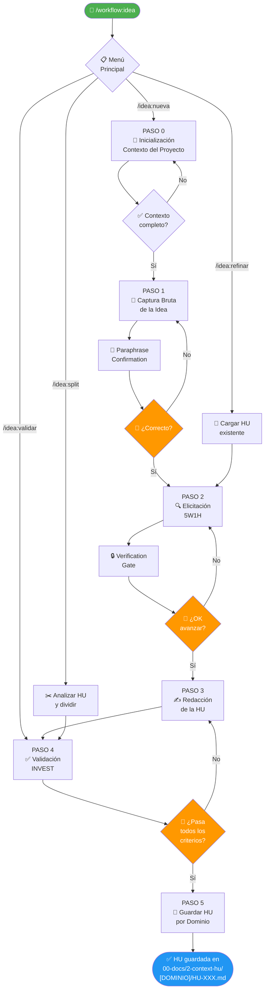

# 💡 Workflow: Idea → Historia de Usuario (HU)

---

**metodo**: ZNS v2.2  
**workflow_id**: WF-IDEA-001  
**version**: 1.0.0  
**fecha_creacion**: 2026-03-18  
**ultima_actualizacion**: 2026-03-18  
**autor**: Orchestration Architect Senior  
**tipo**: Business Analysis — Captura de Ideas y Generación de HUs  
**comando_inicio**: `/workflow:idea`

**estandares_aplicados**:
- IEEE 29148-2018: Systems and Software Engineering — Requirements Engineering
- ISO/IEC 25010:2011: Systems and Software Quality Requirements (SQuaRE)
- INVEST Criteria (Bill Wake)
- Gherkin / BDD (Cucumber)

**agente_orquestado**:
- `2-agents/zns-tools/prompt-idea-a-hu-senior.md` — Idea to HU Senior (Business Analyst & Requirements Architect)

**changelog**:
- v1.0.0: Versión inicial — Workflow de captura de ideas con salida por dominio en `00-docs/2-context-hu/` (2026-03-18)

---

## 🖥️ WF-IDEA-001 | ORQUESTADOR IDEA → HU | `/workflow:idea`

### 📋 MENÚ PRINCIPAL

> **Selecciona una opción escribiendo el número o comando**

| # | Comando | Operación | Descripción |
|:-:|:-------:|:----------|:------------|
| `1` | `/idea:nueva` | **💡 NUEVA IDEA** | Capturar una idea desde cero y generar HU formal |
| `2` | `/idea:refinar` | **✨ REFINAR HU** | Completar o mejorar una HU existente incompleta |
| `3` | `/idea:validar` | **✅ VALIDAR HU** | Verificar que una HU cumple criterios INVEST |
| `4` | `/idea:split` | **✂️ DIVIDIR HU** | Dividir una HU grande en múltiples HUs atómicas |

---

### ⚡ ACCIONES RÁPIDAS

| Cmd | Acción |
|:---:|:-------|
| `h` | 📖 Mostrar ayuda |
| `d` | 📂 Ver dominios con HUs existentes en `00-docs/2-context-hu/` |
| `q` | ❌ Salir del workflow |

---

### 💬 ACCIÓN REQUERIDA

```
┌─────────────────────────────────────────────────────────────────┐
│  👤 ¿Qué operación deseas realizar?                             │
│                                                                 │
│  Escribe el NÚMERO (1-4) o el COMANDO                           │
│  Ejemplo: "1" o "/idea:nueva"                                   │
└─────────────────────────────────────────────────────────────────┘
```

**👤 Tu selección:** `___`

---

## 🗂️ AGENTE ORQUESTADO

### Agente Principal: Idea to HU Senior

| Campo | Valor |
|-------|-------|
| **ID** | `AGT-IDEA-HU` |
| **Prompt** | `2-agents/zns-tools/prompt-idea-a-hu-senior.md` |
| **Rol** | Business Analyst Senior & Requirements Architect |
| **Capacidades** | Elicitación 5W1H, Anti-Alucinación, Gherkin, INVEST, Scope Boundary |
| **Comando** | `/idea:hu` |

---

## 📂 ESTRUCTURA DE OUTPUT

Los outputs se organizan **por dominio** en `00-docs/2-context-hu/`:

```
00-docs/
└── 2-context-hu/
    ├── [DOMINIO-A]/
    │   ├── HU-[DOMINIO-A]-001.md
    │   ├── HU-[DOMINIO-A]-002.md
    │   └── ...
    ├── [DOMINIO-B]/
    │   ├── HU-[DOMINIO-B]-001.md
    │   └── ...
    └── [DOMINIO-N]/
        └── HU-[DOMINIO-N]-001.md
```

> **Convención de nombres**: El código de dominio (ej. `AUTH`, `PAY`, `USR`, `NOTIF`) se define durante la fase de inicialización del agente. Las carpetas usan el mismo código en **minúsculas** (ej. `auth/`, `pay/`).

---

## ⚙️ ESPECIFICACIÓN YAML

```yaml
workflow:
  id: "WF-IDEA-001"
  nombre: "Idea → Historia de Usuario"
  version: "1.0.0"
  patron: "iterativo"
  trigger:
    tipo: "manual"
    descripcion: "El usuario tiene una idea de funcionalidad que debe convertirse en HU formal"
  inputs:
    - nombre: "idea_bruta"
      tipo: "text"
      requerido: true
      descripcion: "Descripción libre de la idea (texto, bullets, voz transcrita)"
    - nombre: "contexto_proyecto"
      tipo: "object"
      requerido: true
      campos: [nombre_proyecto, dominio_negocio, codigo_dominio]
  outputs:
    - nombre: "historia_usuario"
      tipo: "markdown"
      destino: "00-docs/2-context-hu/[codigo_dominio_lowercase]/HU-[DOMINIO]-[NNN].md"
    - nombre: "glosario_dominio"
      tipo: "section"
      descripcion: "Sección dentro de la HU con términos clave del dominio"
    - nombre: "mapa_actores"
      tipo: "section"
      descripcion: "Sección dentro de la HU con actores y dependencias"
  agentes:
    - id: "AGT-IDEA-HU"
      prompt: "2-agents/zns-tools/prompt-idea-a-hu-senior.md"
      rol: "Business Analyst Senior & Requirements Architect"
  pasos:
    - id: "S0"
      nombre: "Inicialización y Contexto"
      agente: "AGT-IDEA-HU"
      input: "contexto_proyecto"
      output: "contexto_validado"
      timeout: "5m"
      on_error: {strategy: "retry", max_attempts: 2}
    - id: "S1"
      nombre: "Captura Bruta de Idea"
      agente: "AGT-IDEA-HU"
      input: "idea_bruta"
      output: "idea_parafraseada"
      timeout: "15m"
      verificacion: "Paraphrase Confirmation — esperar OK del usuario"
      on_error: {strategy: "restart_step"}
    - id: "S2"
      nombre: "Elicitación 5W1H"
      agente: "AGT-IDEA-HU"
      input: "idea_parafraseada"
      output: "requisitos_elicitados"
      timeout: "20m"
      verificacion: "Verification Gate — resumen al usuario antes de avanzar"
      on_error: {strategy: "retry", max_attempts: 2}
    - id: "S3"
      nombre: "Redacción de la HU"
      agente: "AGT-IDEA-HU"
      input: "requisitos_elicitados"
      output: "hu_borrador"
      timeout: "15m"
      on_error: {strategy: "retry", max_attempts: 2}
    - id: "S4"
      nombre: "Validación INVEST"
      agente: "AGT-IDEA-HU"
      input: "hu_borrador"
      output: "hu_validada"
      timeout: "10m"
      verificacion: "Checklist INVEST — todos los criterios deben pasar"
      on_error: {strategy: "loop_back", target: "S3"}
    - id: "S5"
      nombre: "Guardar HU por Dominio"
      tipo: "output"
      input: "hu_validada"
      output: "00-docs/2-context-hu/[dominio]/HU-[DOMINIO]-[NNN].md"
      timeout: "5m"
      on_error: {strategy: "notify_user"}
  error_handling:
    global_timeout: "90m"
    on_timeout: "notify_user_and_save_draft"
    on_unhandled: "escalate_to_user"
  terminal: true
```

---

## 📊 DIAGRAMA DE FLUJO



---

## 📋 FASES DE EJECUCIÓN DETALLADAS

### PASO 0: Inicialización ⏱️ 2-5 min

> **Objetivo**: Recopilar el contexto mínimo del proyecto antes de iniciar la elicitación.

**Terminal**:

```
╔══════════════════════════════════════════════════════════════════╗
║  WF-IDEA-001 | Paso 0/5 | ░░░░░░░░░░ 0%                        ║
╠══════════════════════════════════════════════════════════════════╣
║  📍 Fase: INIT | 🎯 Agente: AGT-IDEA-HU | 🟡 Input             ║
╠══════════════════════════════════════════════════════════════════╣
║  Necesito el contexto del proyecto para configurar el agente:   ║
║                                                                  ║
║  1. Nombre del proyecto                                          ║
║  2. Dominio del negocio (ej: e-commerce, salud, fintech)         ║
║  3. Código de dominio para el ID de HU (ej: USR, PAY, AUTH)     ║
╚══════════════════════════════════════════════════════════════════╝
```

**Criterios para avanzar**:
- [ ] Nombre del proyecto capturado
- [ ] Dominio de negocio identificado
- [ ] Código de dominio definido (determina carpeta `00-docs/2-context-hu/[código]/`)

---

### PASO 1: Captura Bruta de la Idea ⏱️ 5-15 min

> **Objetivo**: Recibir la idea sin estructura. El agente escucha sin interrumpir.

**Terminal**:

```
╔══════════════════════════════════════════════════════════════════╗
║  WF-IDEA-001 | Paso 1/5 | ██░░░░░░░░ 20%                       ║
╠══════════════════════════════════════════════════════════════════╣
║  📍 Fase: CAPTURA | 🎯 Agente: AGT-IDEA-HU | 🟡 Input          ║
╠══════════════════════════════════════════════════════════════════╣
║  💬 Cuéntame tu idea. Sin formato, sin estructura técnica.       ║
║  Puede ser un párrafo, bullets o idea a medio terminar.          ║
║                                                                  ║
║  ¿Qué necesitas que el sistema pueda hacer?                      ║
╚══════════════════════════════════════════════════════════════════╝
```

**Reglas**:
- ❌ El agente NO interrumpe durante la idea inicial
- ❌ NO sugiere soluciones técnicas
- ✅ Al finalizar → ejecuta Paraphrase Confirmation

---

### PASO 2: Elicitación 5W1H ⏱️ 15-20 min

> **Objetivo**: Extraer las dimensiones completas de la necesidad. Máximo 3 preguntas por turno.

**Sub-pasos**:
1. `Who` — Actor específico (no "usuario" genérico)
2. `What` — Capacidad concreta y medible
3. `Why` — Valor de negocio que justifica la HU
4. `When` — Condiciones de activación o contexto de uso
5. `Where` — Módulo, sistema o contexto técnico
6. `How Much` — Criterios de aceptación cuantificables

**Verification Gate obligatorio** antes de avanzar al Paso 3.

---

### PASO 3: Redacción de la HU ⏱️ 10-15 min

> **Objetivo**: Producir la HU formal con todos los campos requeridos.

**Estructura de la HU generada**:

```markdown
# HU-[DOMINIO]-[NNN]: [Título descriptivo]

## Metadatos
- **ID**: HU-[DOMINIO]-[NNN]
- **Proyecto**: [Nombre]
- **Dominio**: [Nombre del dominio]
- **Fecha**: [Fecha]
- **Estado**: Draft | Revisada | Aprobada

## Narrativa
**Como** [actor específico],  
**Quiero** [capacidad concreta],  
**Para** [valor de negocio].

## Criterios de Aceptación (Gherkin)
### Escenario happy path:
**Given** [estado inicial]  
**When** [acción del actor]  
**Then** [resultado esperado]

### Escenario de error:
**Given** [estado inicial con condición anómala]  
**When** [acción del actor]  
**Then** [manejo del error esperado]

## Scope Boundary
### ✅ In Scope
- [Lo que SÍ incluye esta HU]

### ❌ Out of Scope
- [Lo que NO incluye esta HU]

## Requisitos No Funcionales
| NFR | Categoría | Umbral |
|-----|-----------|--------|
| ... | Performance / Security / Usability | ... |

## Mapa de Actores y Dependencias
- **Actores**: [lista de roles que interactúan]
- **Sistemas dependientes**: [lista de sistemas/módulos]
- **HUs relacionadas**: [IDs si aplica]

## Glosario del Dominio
| Término | Definición |
|---------|------------|
| ...     | ...        |

## Handoff hacia WF-HUT-001
- **Siguiente paso**: Invocar `WF-HUT-001` para descomponer en HUTs técnicas
- **Agente**: `2-agents/zns-tools/technical-user-stories/prompt-technical-user-stories.md`
```

---

### PASO 4: Validación INVEST ⏱️ 5-10 min

> **Objetivo**: Verificar que la HU cumple los 6 criterios de calidad antes de guardar.

| Criterio | Pregunta clave | ✅/❌ |
|----------|---------------|:-----:|
| **I**ndependiente | ¿Puede desarrollarse sin depender de otra HU? | |
| **N**egociable | ¿Tiene flexibilidad en la implementación? | |
| **V**aliosa | ¿Aporta valor directo al negocio o al usuario? | |
| **E**stimable | ¿El equipo puede estimar su esfuerzo? | |
| **S**mall | ¿Puede completarse en 1-3 sprints? | |
| **T**esteable | ¿Los criterios de aceptación son verificables? | |

> Si algún criterio falla → el agente refina la HU antes de guardar.

---

### PASO 5: Guardar HU por Dominio ⏱️ 2-3 min

> **Objetivo**: Persistir la HU en la estructura de carpetas por dominio.

**Ruta de salida**:
```
00-docs/2-context-hu/[codigo_dominio_lowercase]/HU-[DOMINIO]-[NNN].md
```

**Ejemplos**:
```
00-docs/2-context-hu/auth/HU-AUTH-001.md
00-docs/2-context-hu/pay/HU-PAY-001.md
00-docs/2-context-hu/usr/HU-USR-001.md
00-docs/2-context-hu/notif/HU-NOTIF-001.md
```

**Terminal de cierre**:

```
╔══════════════════════════════════════════════════════════════════╗
║  WF-IDEA-001 | Paso 5/5 | ██████████ 100%                       ║
╠══════════════════════════════════════════════════════════════════╣
║  📍 Fase: DONE | 🟢 HU Guardada                                  ║
╠══════════════════════════════════════════════════════════════════╣
║  ✅ HU generada: HU-[DOMINIO]-[NNN]                              ║
║  📂 Ubicación: 00-docs/2-context-hu/[dominio]/HU-XXX.md          ║
║  🔗 Siguiente: WF-HUT-001 para descomponer en HUTs               ║
╠══════════════════════════════════════════════════════════════════╣
║  OPCIONES:                                                       ║
║  [1] Continuar con WF-HUT-001                                    ║
║  [2] Capturar otra idea                                          ║
║  [3] Finalizar                                                   ║
╚══════════════════════════════════════════════════════════════════╝
```

---

## 🔗 INTEGRACIÓN CON OTROS WORKFLOWS

```
[Usuario tiene idea]
       ↓
  WF-IDEA-001       ← Este workflow
  /workflow:idea
       ↓
  HU formal en
  00-docs/2-context-hu/[DOMINIO]/
       ↓
  WF-HUT-001        ← Siguiente paso
  /workflow:hut
  /hut:crear
       ↓
  HUTs técnicas en
  00-docs/3-technical-stories/[contexto]/
       ↓
  WF-DEV-001
  /workflow:dev
```

---

## ✅ CHECKLIST RÁPIDO

| ✅ | Verificación |
|:-:|--------------|
| □ | Contexto del proyecto capturado (nombre, dominio, código) |
| □ | Idea bruta recibida sin interrupciones |
| □ | Paraphrase Confirmation ejecutada y aprobada |
| □ | Elicitación 5W1H completa (todos los campos) |
| □ | Verification Gate pasado antes de redactar |
| □ | HU redactada con narrativa Como/Quiero/Para |
| □ | Mínimo 1 criterio Gherkin happy path + 1 error |
| □ | Scope Boundary definido (In/Out) |
| □ | Validación INVEST: 6/6 criterios aprobados |
| □ | HU guardada en `00-docs/2-context-hu/[dominio]/` |

---

## ⚠️ REGLAS CRÍTICAS

### ❌ NO HACER
- Generar la HU antes de completar la elicitación 5W1H
- Usar "usuario" como actor (debe ser un rol concreto)
- Omitir el Scope Boundary (Out of Scope es tan importante como In Scope)
- Guardar la HU sin pasar la validación INVEST
- Mezclar múltiples necesidades en una sola HU

### ✅ SIEMPRE HACER
- Paraphrase Confirmation después de recibir la idea bruta
- Verification Gate antes de redactar la HU
- Marcar `[ASUMIDO]` todo dato no confirmado explícitamente
- Crear subcarpeta por dominio antes de guardar
- Incluir sección de Handoff hacia WF-HUT-001

---

## 📚 REFERENCIAS

| Recurso | Ruta |
|---------|------|
| Agente principal | `2-agents/zns-tools/prompt-idea-a-hu-senior.md` |
| Skill anti-alucinación | `2-agents/zns-tools/skills/anti-hallucination-prompting.skill.md` |
| Skill elicitación | `2-agents/zns-tools/skills/requirement-elicitation-senior.skill.md` |
| Workflow HUTs | `1-workflow/WF-HUT-001-technical-user-stories.md` |
| Prompts de invocación | `1-workflow/WF-IDEA-001-prompts-invocacion.md` |
| Output carpeta | `00-docs/2-context-hu/` |
