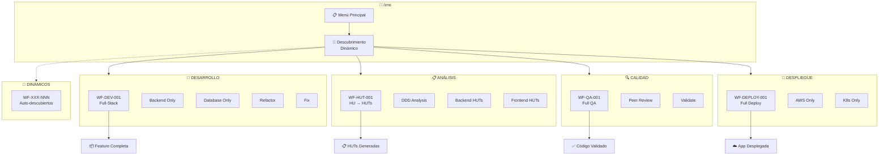

# 🎼 Workflow Principal: Orquestador ZNS

---

**metodo**: ZNS v2.2  
**workflow_id**: WF-MAIN-000  
**version**: 1.1.0  
**fecha_creacion**: 2026-02-07  
**fecha_actualizacion**: 2026-02-07  
**autor**: Orchestration Architect Senior  
**tipo**: Orquestador Principal de Workflows  
**modo_descubrimiento**: dinámico  

**comando_inicio**: `/zns`

---

## 🚀 INICIO RÁPIDO

Para iniciar el orquestador, simplemente escribe:

```
/zns
```

---

## 🎼 ZNS v2.2 | ORQUESTADOR PRINCIPAL `/zns`

---

## � DESCUBRIMIENTO DINÁMICO DE WORKFLOWS

> **⚠️ INSTRUCCIÓN CRÍTICA AL AGENTE**: Antes de mostrar el menú, SIEMPRE ejecutar descubrimiento dinámico.

### 📡 Protocolo de Descubrimiento Automático

```yaml
descubrimiento:
  trigger: "Al recibir comando /zns"
  directorio_scan: "1-workflow/"
  patron_archivos: "WF-*-*.md"
  excluir: "*-prompts-invocacion.md"
  
  pasos:
    1. Escanear carpeta 1-workflow/
    2. Filtrar archivos que coincidan con WF-*-*.md
    3. Excluir archivos *-prompts-invocacion.md
    4. Extraer metadata del header YAML de cada archivo
    5. Construir menú dinámicamente agrupando por categoría
    6. Mostrar workflows descubiertos + workflows base
```

### 🏷️ Convención de Nomenclatura de Workflows

| Prefijo | Categoría | Comando Base | Icono |
|:--------|:----------|:-------------|:-----:|
| `WF-DEV-XXX` | Desarrollo | `/workflow:dev` | 🔧 |
| `WF-HUT-XXX` | Análisis HUT | `/workflow:hut` | 📋 |
| `WF-QA-XXX` | Calidad | `/workflow:qa` | 🔍 |
| `WF-DEPLOY-XXX` | Despliegue | `/workflow:deploy` | 🚀 |
| `WF-SALES-XXX` | Ventas | `/workflow:sales` | 💼 |
| `WF-INFRA-XXX` | Infraestructura | `/workflow:infra` | 🏗️ |
| `WF-DOCS-XXX` | Documentación | `/workflow:docs` | 📚 |

### 📄 Estructura Requerida en Cada Workflow

Cada archivo de workflow DEBE tener este header para ser descubierto:

```yaml
# En el header del archivo WF-XXX-nombre.md:
workflow_id: WF-XXX-NNN
version: X.Y.Z
categoria: desarrollo|analisis|calidad|despliegue|ventas|infra|docs
comando_principal: /workflow:xxx
comandos_alias: ["/workflow:alias1", "/workflow:alias2"]
descripcion_corta: "Descripción de una línea"
agentes: ["Agente1", "Agente2"]
estado: active|beta|deprecated|coming-soon
```

---

## 📋 MENÚ PRINCIPAL

> **Selecciona un workflow escribiendo el número o comando correspondiente**
> 
> **📡 NOTA**: Este menú se construye dinámicamente. Los workflows listados abajo son la **configuración base**. 
> Workflows adicionales en `1-workflow/` se detectan automáticamente.

---

### 🔧 WORKFLOWS DE DESARROLLO

| # | Comando | Workflow | Descripción | Agentes |
|:-:|:-------:|:---------|:------------|:--------|
| `1` | `/workflow:dev` | **WF-DEV-001** | Desarrollo Full-Stack completo | 🐘 Database → 🗄️ Flyway → ☕ Backend → 🎨 Frontend |
| `2` | `/workflow:backend` | **WF-DEV-001** (parcial) | Solo desarrollo Backend | ☕ Backend |
| `3` | `/workflow:database` | **WF-DEV-001** (parcial) | Solo diseño Base de Datos | 🐘 Database → 🗄️ Flyway |
| `4` | `/workflow:refactor` | **WF-DEV-001** (modo) | Refactoring guiado | ☕ Backend / 🎨 Frontend |
| `5` | `/workflow:fix` | **WF-DEV-001** (modo) | Corrección de defectos | Según el error |

---

### 📋 WORKFLOWS DE ANÁLISIS

| # | Comando | Workflow | Descripción | Agentes |
|:-:|:-------:|:---------|:------------|:--------|
| `6` | `/workflow:hut` | **WF-HUT-001** | Descomposición completa de HU a HUTs | 🏗️ Architect → 🐘 DB → ☕ Backend → 🎨 Frontend |
| `7` | `/workflow:hut-analyze` | **WF-HUT-001** (parcial) | Solo análisis DDD estratégico | 🏗️ Tech Architect |
| `8` | `/workflow:hut-backend` | **WF-HUT-001** (parcial) | Solo HUTs de Backend | ☕ Backend Expert |
| `9` | `/workflow:hut-frontend` | **WF-HUT-001** (parcial) | Solo HUTs de Frontend | 🎨 Frontend Expert |

---

### 🔍 WORKFLOWS DE CALIDAD

| # | Comando | Workflow | Descripción | Agentes |
|:-:|:-------:|:---------|:------------|:--------|
| `10` | `/workflow:qa` | **WF-QA-001** | Quality Assurance completo | 🔍 QA Senior |
| `11` | `/workflow:review` | **WF-QA-001** (parcial) | Solo Peer Review de código | 🔍 QA Senior |
| `12` | `/workflow:validate` | **WF-QA-001** (parcial) | Validar HUTs existentes | 🔍 QA Senior |

---

### � WORKFLOWS DE DESPLIEGUE

| # | Comando | Workflow | Descripción | Agentes |
|:-:|:-------:|:---------|:------------|:--------|
| `13` | `/workflow:deploy` | **WF-DEPLOY-001** | Despliegue completo a AWS | 🚀 DevOps → ☁️ AWS → 🔧 Terraform |
| `14` | `/workflow:deploy-aws` | **WF-DEPLOY-001** (parcial) | Solo despliegue AWS | ☁️ AWS Expert |
| `15` | `/workflow:deploy-k8s` | **WF-DEPLOY-001** (parcial) | Solo Kubernetes | 🐳 K8s Expert |

---

### �💼 WORKFLOWS DE VENTAS (Próximamente)

| # | Comando | Workflow | Descripción | Estado |
|:-:|:-------:|:---------|:------------|:------:|
| `16` | `/workflow:brief` | **WF-SALES-001** | Captura de Brief | 🔜 |
| `17` | `/workflow:discovery` | **WF-SALES-002** | Discovery & Análisis | 🔜 |
| `18` | `/workflow:proposal` | **WF-SALES-003** | Generación de Propuesta | 🔜 |

---

### 📡 WORKFLOWS DESCUBIERTOS DINÁMICAMENTE

> **INSTRUCCIÓN AL AGENTE**: Aquí se listan workflows adicionales detectados en `1-workflow/`
> que no están en las secciones anteriores. Usar el protocolo de descubrimiento.

| # | Comando | Workflow | Descripción | Estado |
|:-:|:-------:|:---------|:------------|:------:|
| `+N` | `[auto-detectado]` | `[WF-XXX-NNN]` | `[extraído del header]` | 📡 Dinámico |

---

## ⚡ ACCIONES RÁPIDAS

| Comando | Acción |
|:-------:|:-------|
| `h` | 📖 Mostrar ayuda detallada |
| `s` | 🔍 Buscar workflow por palabra clave |
| `l` | 📋 Listar todos los agentes disponibles |
| `r` | 🔄 **Re-escanear workflows** (descubrimiento dinámico) |
| `c` | ⚙️ Configurar preferencias |
| `q` | ❌ Salir del orquestador |

---

## 💬 ACCIÓN REQUERIDA

```
┌─────────────────────────────────────────────────────────────────────────────┐
│                                                                             │
│   👤 ¿Qué workflow deseas ejecutar?                                         │
│                                                                             │
│   Escribe el NÚMERO (1-18+) o el COMANDO del workflow                       │
│                                                                             │
│   Ejemplo: "1" o "/workflow:dev" o "/workflow:deploy"                       │
│                                                                             │
│   💡 Usa 'r' para re-escanear y descubrir nuevos workflows                  │
│                                                                             │
└─────────────────────────────────────────────────────────────────────────────┘
```

**👤 Tu selección:** `___`

---

## 📖 GUÍA DE USO

### Opción 1: Por Número
```
> 1
✅ Iniciando WF-DEV-001: Desarrollo Full-Stack...
```

### Opción 2: Por Comando
```
> /workflow:dev
✅ Iniciando WF-DEV-001: Desarrollo Full-Stack...
```

### Opción 3: Con Contexto Directo
```
> /workflow:dev
FEATURE: Sistema de reservas de tutorías
CONTEXTO: Proyecto MI-TOGA, módulo bookings
```

---

## 🗺️ MAPA DE NAVEGACIÓN



---

## 📂 ARCHIVOS RELACIONADOS

| Workflow | Especificación | Prompts |
|:---------|:---------------|:--------|
| WF-DEV-001 | [desarrollo-fullstack.md](WF-DEV-001-desarrollo-fullstack.md) | [prompts-invocacion.md](WF-DEV-001-prompts-invocacion.md) |
| WF-HUT-001 | [technical-user-stories.md](WF-HUT-001-technical-user-stories.md) | [prompts-invocacion.md](WF-HUT-001-prompts-invocacion.md) |
| WF-QA-001 | [quality-assurance.md](WF-QA-001-quality-assurance.md) | [prompts-invocacion.md](WF-QA-001-prompts-invocacion.md) |
| WF-DEPLOY-001 | [despliegue-aws.md](WF-DEPLOY-001-despliegue-aws.md) | [prompts-invocacion.md](WF-DEPLOY-001-prompts-invocacion.md) |

> **📡 NOTA**: Workflows adicionales se detectan dinámicamente de `1-workflow/`

---

## 🔄 FLUJO DE DECISIÓN

```
¿Qué necesitas hacer?
│
├─► Tengo una HU de negocio y necesito descomponerla
│   └─► /workflow:hut (WF-HUT-001)
│
├─► Tengo HUTs listas y quiero implementar
│   └─► /workflow:dev (WF-DEV-001)
│
├─► Solo necesito diseñar la base de datos
│   └─► /workflow:database
│
├─► Solo necesito desarrollar el backend
│   └─► /workflow:backend
│
├─► Necesito validar código vs HUTs
│   └─► /workflow:qa (WF-QA-001)
│
├─► Necesito refactorizar código existente
│   └─► /workflow:refactor
│
├─► Necesito corregir un bug
│   └─► /workflow:fix
│
├─► Necesito desplegar a AWS/Cloud
│   └─► /workflow:deploy (WF-DEPLOY-001)
│
└─► ¿No encuentras tu workflow?
    └─► Usa 'r' para re-escanear o revisa 1-workflow/
```

---

<div align="center">

```
═══════════════════════════════════════════════════════════════════════════════
                         🎼 ZNS v2.2 | Metodología de Desarrollo
                              Escribe /zns para volver al menú
═══════════════════════════════════════════════════════════════════════════════
```

</div>
