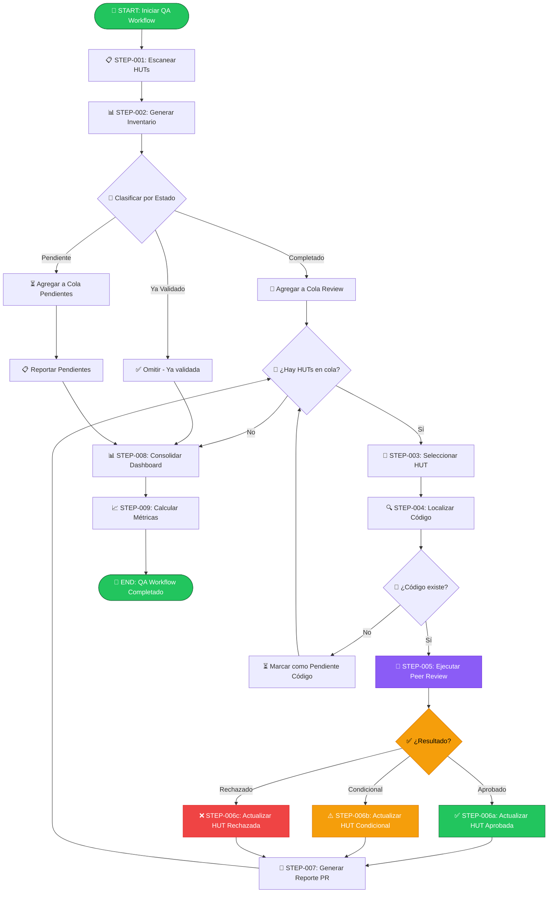

# 🔍 Workflow: Quality Assurance & Peer Review — Validación de HUTs vs Código

---

**metodo**: ZNS v2.2  
**workflow_id**: WF-QA-001  
**version**: 1.1.0  
**fecha_creacion**: 2026-02-07  
**autor**: Orchestration Architect Senior  
**tipo**: Quality Assurance & Technical Validation  

**estandares_aplicados**:
- IEEE 29148-2018: Systems and software engineering — Requirements engineering
- IEEE 730-2014: Software Quality Assurance Processes
- ISO/IEC 25010:2011: Systems and Software Quality Requirements (SQuaRE)
- ISO/IEC 12207:2017: Software Life Cycle Processes
- BPMN 2.0: Business Process Model and Notation

**changelog**:
- v1.1.0: Terminal Interactiva integrada (2026-02-07)
- v1.0.0: Versión inicial del workflow

---

## 🖥️ WF-QA-001 | Paso 0/9 | ░░░░░░░░░░ 0%
**📍 Fase**: INIT | **⏱️**: 00:00 | **🎯 Tipo**: 🔵 Confirmación

> **¿Iniciar QA?** Escanear: `0-docs/3-technical-stories/` → Validar: `0-docs/4-source-code/0-backend/`

| Cmd | Acción | | Cmd | Acción |
|:---:|--------|---|:---:|--------|
| `1/c` | ▶️ Continuar | | `3/m` | ✏️ Modificar |
| `2/r` | 🔍 Revisar | | `4/p` | ⏸️ Pausar |
| `5/x` | ❌ Cancelar | | | |

**👤 Respuesta:** `___`

<details><summary>📊 Historial de Decisiones</summary>

| # | ⏰ Hora | 📍 Paso | 💬 Pregunta | ✅ Decisión |
|:-:|:------:|:------:|-------------|-------------|
| - | - | - | _Workflow no iniciado_ | - |

</details>

---

### 📜 LOG DE EJECUCIÓN (Plegable)

<details>
<summary>📂 <strong>STEP-001: Escanear HUTs</strong> ⏳ Pendiente</summary>

_Escaneo de directorio `0-docs/3-technical-stories/` pendiente_

</details>

<details>
<summary>📂 <strong>STEP-002: Generar Inventario</strong> ⏳ Pendiente</summary>

_Generación de inventario estructurado pendiente_

</details>

<details>
<summary>📂 <strong>STEP-003 a 007: Peer Review Loop</strong> ⏳ Pendiente</summary>

_Ciclo de validación de HUTs pendiente_

</details>

<details>
<summary>📂 <strong>STEP-008: Consolidar Dashboard</strong> ⏳ Pendiente</summary>

_Consolidación de resultados pendiente_

</details>

<details>
<summary>📂 <strong>STEP-009: Calcular Métricas</strong> ⏳ Pendiente</summary>

_Cálculo de métricas de calidad pendiente_

</details>

---

### 🔔 NOTIFICACIONES

| ⚠️ | Mensaje |
|:--:|---------|
| 🟡 | Esperando confirmación para iniciar QA Workflow... |

<!--═══════════════════════════════════════════════════════════════════════════
    FIN TERMINAL INTERACTIVA
═══════════════════════════════════════════════════════════════════════════════-->

---

## 📋 RESUMEN EJECUTIVO

### Objetivo del Workflow

Este workflow orquesta el **proceso de Quality Assurance** que valida la trazabilidad entre las **Historias de Usuario Técnicas (HUTs)** especificadas y el **código implementado**, coordinando el agente de Peer Review Senior para:

1. **Inventariar** todas las HUTs en `0-docs/3-technical-stories/`
2. **Clasificar** el estado de cada HUT (Pendiente, En Progreso, Completada, Validada)
3. **Ejecutar Peer Review** cruzando especificación vs código implementado
4. **Actualizar** las HUTs con evidencias de validación
5. **Generar** dashboard de estado y métricas de calidad

### Agentes Involucrados

| Agente | Rol | Artefactos |
|--------|-----|------------|
| **AGT-QA-ORCHESTRATOR** | Orquestador de QA | Inventario HUTs, Dashboard, Métricas |
| **AGT-PEER-REVIEW** | Peer Review Senior | Reportes PR-HUT-*, Validaciones, Actualizaciones HUT |

### Ubicaciones de Artefactos

```
0-docs/
├── 3-technical-stories/          # 📥 INPUT: HUTs a validar
│   ├── 0-infra/                  # HUTs de Infraestructura
│   │   └── HUT-INFRA-001-*.md
│   ├── 1-domain/                 # HUTs de Dominio
│   │   └── HUT-DOM-XXX-*.md
│   ├── 2-api/                    # HUTs de API
│   │   └── HUT-API-XXX-*.md
│   └── _templates/               # Templates de HUTs
│
├── 4-source-code/0-backend/      # 📂 CÓDIGO: Backend a validar
│   └── 0-mitoga-project/         # Proyecto principal
│
└── 5-quality-assurance/          # 📤 OUTPUT: Reportes de validación
    ├── 0-peer-reviews/
    │   ├── reports/              # Reportes individuales PR-HUT-*.md
    │   └── logs/                 # Logs de auditoría
    └── dashboard-qa.md           # Dashboard consolidado
```

### Métricas Objetivo

| Métrica | Objetivo | Umbral Mínimo |
|---------|----------|---------------|
| **HUTs Validadas** | 100% | ≥ 90% |
| **Cobertura Tests** | ≥ 80% promedio | ≥ 70% |
| **Issues Críticos** | 0 | ≤ 2 |
| **Tiempo por HUT** | ≤ 45 min | ≤ 60 min |
| **Trazabilidad** | 100% | 100% |

---

<details>
<summary><h2>🏗️ ARQUITECTURA DEL WORKFLOW (expandir)</h2></summary>

### Diagrama de Flujo Principal



</details>

---

<details>
<summary><h2>📋 PROCESO DETALLADO (expandir)</h2></summary>

### STEP-001: Escanear HUTs ⏱️ 5 min

**Objetivo**: Identificar todas las HUTs existentes en el directorio de Technical Stories.

**Proceso**:
1. Escanear directorio `0-docs/3-technical-stories/`
2. Identificar archivos con patrón `HUT-*-*.md`
3. Extraer metadata de cada HUT (tipo, estado, módulo)
4. Excluir archivos README.md y templates

**Comando de escaneo**:
```bash
# PowerShell
Get-ChildItem -Path "0-docs/3-technical-stories" -Filter "HUT-*.md" -Recurse | 
Select-Object Name, FullName, LastWriteTime
```

**Output esperado**:
```markdown
| Archivo | Ruta | Última Modificación |
|---------|------|---------------------|
| HUT-INFRA-001-flyway-migration-project.md | 0-docs/3-technical-stories/0-infra/ | 2026-02-07 |
| HUT-DOM-001-user-entity.md | 0-docs/3-technical-stories/1-domain/usuarios/ | 2026-02-07 |
```

---

### STEP-002: Generar Inventario ⏱️ 10 min

**Objetivo**: Crear inventario estructurado con clasificación de estado.

**Extracción de metadata por HUT**:

Para cada archivo HUT-*.md, extraer:
- **ID**: `HUT-[TIPO]-[SECUENCIA]`
- **Título**: Primera línea `# HUT-...`
- **Tipo**: `INFRA | DOM | UC | API | UI | SEC | PERF | TEST`
- **Estado declarado**: Campo `**Estado:**` en metadata
- **Tiene validación**: Buscar sección `## ✅ VALIDACIÓN PEER REVIEW`
- **Módulo**: Campo `**Módulo:**`
- **Sprint**: Campo `**Sprint:**`

**Template de Inventario**:

```markdown
# 📊 Inventario de HUTs — QA Dashboard

**Fecha generación:** YYYY-MM-DD HH:MM  
**Total HUTs:** X  
**Workflow:** WF-QA-001 v1.0.0

## 📈 Resumen por Estado

| Estado | Cantidad | Porcentaje |
|--------|:--------:|:----------:|
| ✅ Validadas | X | XX% |
| ⚠️ Condicionales | X | XX% |
| ❌ Rechazadas | X | XX% |
| 📋 Completadas (sin validar) | X | XX% |
| ⏳ Pendientes | X | XX% |
| 🚧 En Progreso | X | XX% |

## 📋 Detalle por HUT

### ✅ HUTs Validadas

| ID | Título | Tipo | Módulo | Fecha Validación | Reporte |
|----|--------|------|--------|------------------|---------|
| HUT-XXX | [Título] | [TIPO] | [Módulo] | YYYY-MM-DD | [PR-HUT-XXX](link) |

### 📋 HUTs Completadas (Pendientes de Validación)

| ID | Título | Tipo | Módulo | Sprint | Prioridad Review |
|----|--------|------|--------|--------|------------------|
| HUT-XXX | [Título] | [TIPO] | [Módulo] | X | 🔴 Alta |

### ⏳ HUTs Pendientes de Implementación

| ID | Título | Tipo | Módulo | Sprint | Asignado |
|----|--------|------|--------|--------|----------|
| HUT-XXX | [Título] | [TIPO] | [Módulo] | X | [Dev] |
```

---

### STEP-003: Seleccionar HUT para Review ⏱️ 2 min

**Objetivo**: Priorizar y seleccionar la siguiente HUT a revisar.

**Criterios de priorización**:
1. **Prioridad declarada**: ALTA > MEDIA > BAJA
2. **Tipo de HUT**: INFRA > DOM > UC > API > UI > SEC > PERF > TEST
3. **Sprint**: Menor número primero (más antiguo)
4. **Dependencias**: HUTs sin dependencias primero

**Selección**:
```markdown
## 🎯 HUT Seleccionada para Review

**HUT:** HUT-INFRA-001  
**Título:** Configurar Proyecto Flyway Independiente  
**Prioridad:** ALTA  
**Razón selección:** Sprint 1, tipo INFRA (fundacional), sin dependencias
```

---

### STEP-004: Localizar Código Implementado ⏱️ 5 min

**Objetivo**: Encontrar los archivos de código correspondientes a la HUT.

**Proceso**:
1. Leer sección "Estructura del Proyecto" de la HUT
2. Verificar existencia de archivos/directorios especificados
3. Localizar tests asociados
4. Identificar archivos modificados/creados

**Mapeo HUT → Código**:

| Componente HUT | Ruta Esperada | Existe | Estado |
|----------------|---------------|:------:|:------:|
| Proyecto Flyway | `0-docs/4-source-code/0-backend/2-mitoga-flyway/` | ✅/❌ | — |
| build.gradle.kts | `0-docs/4-source-code/0-backend/2-mitoga-flyway/build.gradle.kts` | ✅/❌ | — |
| application.yml | `src/main/resources/application.yml` | ✅/❌ | — |
| Migraciones | `src/main/resources/db/migration/` | ✅/❌ | — |

**Si código no existe**: Marcar HUT como "Pendiente Código" y continuar con siguiente.

---

### STEP-005: Ejecutar Peer Review ⏱️ 30-45 min

**Objetivo**: Invocar al agente Peer Review Senior para validación exhaustiva.

**Prompt de invocación**:

```markdown
Hola, necesito que asumas el rol de Peer Review Senior.

CONTEXTO:
- Proyecto: MI-TOGA
- HUT a validar: [HUT-ID] — [Título]
- Ubicación HUT: 0-docs/3-technical-stories/[tipo]/[ruta-hut].md
- Código fuente: [ruta al código implementado]
- Tests: [ruta a los tests si existen]

OBJETIVO:
Realizar Peer Review exhaustivo cruzando la HUT con el código implementado,
validar criterios de aceptación, testing y calidad, y determinar veredicto.

PROCESO:
1. Cargar y analizar la HUT completa
2. Localizar código implementado
3. Cruzar especificación vs implementación
4. Validar criterios de aceptación con evidencias
5. Evaluar calidad de código
6. Determinar veredicto: APROBADO / CONDICIONAL / RECHAZADO

ENTREGABLES:
- Reporte de Peer Review en: 0-docs/5-quality-assurance/0-peer-reviews/reports/PR-[HUT-ID]-[fecha].md
- Actualización de la HUT con bloque de validación

¡Comencemos!
```

**Agente**: [prompt-peer-review-senior.md](../1-agents/zns-quality/prompt-peer-review-senior.md)

---

### STEP-006: Actualizar HUT con Resultado ⏱️ 5 min

**Objetivo**: Agregar bloque de validación al final de la HUT.

**Según resultado**:

| Resultado | Template a usar | Acción adicional |
|-----------|-----------------|------------------|
| ✅ APROBADO | `template-hut-validation-block.md` (APROBADO) | Cerrar HUT |
| ⚠️ CONDICIONAL | `template-hut-validation-block.md` (CONDICIONAL) | Crear tickets deuda |
| ❌ RECHAZADO | `template-hut-validation-block.md` (RECHAZADO) | Notificar dev |

**Templates**: [1-agents/zns-quality/templates/](../1-agents/zns-quality/templates/)

---

### STEP-007: Generar Reporte de Peer Review ⏱️ 5 min

**Objetivo**: Crear reporte detallado en carpeta de peer-reviews.

**Ubicación**: `0-docs/peer-reviews/PR-HUT-[ID]-[FECHA].md`

**Template**: [template-peer-review-report.md](../1-agents/zns-quality/templates/template-peer-review-report.md)

---

### STEP-008: Consolidar Dashboard ⏱️ 10 min

**Objetivo**: Actualizar dashboard de QA con resultados acumulados.

**Archivo**: `0-docs/peer-reviews/dashboard-qa.md`

**Contenido del Dashboard**:

```markdown
# 📊 Dashboard de Quality Assurance — MI-TOGA

**Última actualización:** YYYY-MM-DD HH:MM  
**Workflow:** WF-QA-001 v1.0.0  
**Ejecutado por:** QA Orchestrator Agent

---

## 📈 Métricas Generales

| Métrica | Valor | Objetivo | Estado |
|---------|:-----:|:--------:|:------:|
| Total HUTs | XX | — | — |
| HUTs Validadas | XX (XX%) | 100% | ✅/⚠️/❌ |
| Aprobadas | XX | — | ✅ |
| Condicionales | XX | 0 | ⚠️ |
| Rechazadas | XX | 0 | ❌ |
| Pendientes Review | XX | 0 | ⏳ |
| Pendientes Código | XX | 0 | 🚧 |

---

## 📊 Estado por Tipo de HUT

| Tipo | Total | ✅ | ⚠️ | ❌ | ⏳ | % Validado |
|------|:-----:|:--:|:--:|:--:|:--:|:----------:|
| INFRA | X | X | X | X | X | XX% |
| DOM | X | X | X | X | X | XX% |
| UC | X | X | X | X | X | XX% |
| API | X | X | X | X | X | XX% |
| UI | X | X | X | X | X | XX% |
| SEC | X | X | X | X | X | XX% |
| PERF | X | X | X | X | X | XX% |
| TEST | X | X | X | X | X | XX% |

---

## 📋 Historial de Validaciones

| Fecha | HUT | Resultado | Revisor | Reporte |
|-------|-----|:---------:|---------|---------|
| YYYY-MM-DD | HUT-INFRA-001 | ✅ | Peer Review Agent | [PR-HUT-INFRA-001](./PR-HUT-INFRA-001-2026-02-07.md) |

---

## ⚠️ Issues Abiertos

| HUT | Severidad | Issue | Estado | Asignado |
|-----|:---------:|-------|:------:|----------|
| HUT-XXX | 🔴 | [Descripción] | Abierto | [Dev] |

---

## 📈 Tendencia

\```
Semana 1: ████████░░ 80%
Semana 2: █████████░ 90%
Semana 3: ██████████ 100%
\```

---

**Próxima ejecución programada:** [Fecha/Trigger]
```

---

### STEP-009: Calcular Métricas Finales ⏱️ 5 min

**Objetivo**: Generar resumen de métricas del ciclo de QA.

**Métricas a calcular**:

```markdown
## 📊 Métricas del Ciclo de QA

### Cobertura
- **HUTs en inventario:** X
- **HUTs revisadas este ciclo:** Y
- **% Cobertura de review:** Y/X × 100

### Resultados
- **Aprobadas:** X (XX%)
- **Condicionales:** X (XX%)
- **Rechazadas:** X (XX%)
- **Tasa de éxito (Aprobadas/Total):** XX%

### Tiempos
- **Tiempo promedio por review:** XX min
- **Tiempo total del ciclo:** X horas Y min

### Calidad
- **Cobertura de tests promedio:** XX%
- **Issues críticos encontrados:** X
- **Issues menores encontrados:** X

### Tendencia vs ciclo anterior
- **Tasa de éxito:** +X% / -X%
- **Issues críticos:** +X / -X
```

</details>

---

## 🎯 INVENTARIO ACTUAL DE HUTs

| ID | Título | Tipo | Estado | Validación |
|----|--------|:----:|:------:|:----------:|
| HUT-INFRA-001 | Configurar Proyecto Flyway Independiente | INFRA | ✅ | ⏳ |

### Clasificación

| Estado | Cantidad | Acción Requerida |
|--------|:--------:|------------------|
| ✅ Completadas, validadas | 0 | Ninguna |
| ✅ Completadas, sin validar | 1 | Ejecutar Peer Review |
| ⏳ Pendientes | 0 | Implementar primero |
| 🚧 En progreso | 0 | Esperar finalización |

---

## 🚀 PROMPT DE EJECUCIÓN

### Para ejecutar el workflow completo:

```markdown
Hola, necesito que asumas el rol de QA Orchestrator.

CONTEXTO:
- Proyecto: MI-TOGA
- Directorio HUTs: 0-docs/3-technical-stories/
- Directorio Código: 0-docs/4-source-code/
- Directorio Output: 0-docs/5-quality-assurance/

OBJETIVO:
Ejecutar el workflow WF-QA-001 para:
1. Escanear e inventariar todas las HUTs
2. Clasificar por estado (Pendiente/Completada/Validada)
3. Para cada HUT completada sin validar, ejecutar Peer Review
4. Actualizar HUTs con resultados de validación
5. Generar dashboard consolidado de QA

PROCESO:
Seguir el workflow definido en: 0.1-workflow/WF-QA-001-quality-assurance.md

ENTREGABLES:
- Inventario actualizado de HUTs
- Reportes de Peer Review (PR-HUT-*.md)
- Dashboard de QA actualizado
- HUTs actualizadas con bloque de validación

¡Comencemos con STEP-001: Escanear HUTs!
```

### Para ejecutar Peer Review de una HUT específica:

```markdown
Hola, necesito que ejecutes el Peer Review para una HUT específica.

HUT: HUT-INFRA-001-flyway-migration-project.md
Ubicación: 0-docs/3-technical-stories/0-infra/HUT-INFRA-001-flyway-migration-project.md
Código: 0-docs/4-source-code/0-backend/2-mitoga-flyway/

OBJETIVO:
Validar que el código implementado cumple 100% con la especificación de la HUT.

Usar agente: 1-agents/zns-quality/prompt-peer-review-senior.md

¡Comenzar review!
```

---

## ⚠️ RESTRICCIONES Y CONSIDERACIONES

### ❌ NO HACER:
- ❌ Validar HUTs sin código implementado (marcar como pendientes)
- ❌ Aprobar sin ejecutar tests
- ❌ Omitir actualización de HUT con resultado
- ❌ Saltarse HUTs por orden de archivo (respetar prioridades)

### ✅ SIEMPRE HACER:
- ✅ Generar reporte de Peer Review para cada validación
- ✅ Actualizar dashboard después de cada ciclo
- ✅ Documentar issues encontrados con severidad
- ✅ Notificar rechazos al equipo de desarrollo
- ✅ Crear tickets para issues condicionales

---

## 📚 REFERENCIAS

- [prompt-peer-review-senior.md](../1-agents/zns-quality/prompt-peer-review-senior.md) — Agente de Peer Review
- [template-peer-review-report.md](../1-agents/zns-quality/templates/template-peer-review-report.md) — Template de reporte
- [template-hut-validation-block.md](../1-agents/zns-quality/templates/template-hut-validation-block.md) — Bloques de validación
- [checklist-peer-review-quick.md](../1-agents/zns-quality/templates/checklist-peer-review-quick.md) — Checklist rápido
- [template-hut.md](../1-agents/zns-product-owner/8.technical-user-stories/template-hut.md) — Template de HUT

---

## 📝 CHANGELOG

| Versión | Fecha | Cambios |
|---------|-------|---------|
| 1.0.0 | 2026-02-07 | Versión inicial del workflow de QA |

---

**Autor:** Orchestration Architect Senior  
**Metodología:** ZNS v2.2  
**Mantenedor:** ZNS Quality Team
