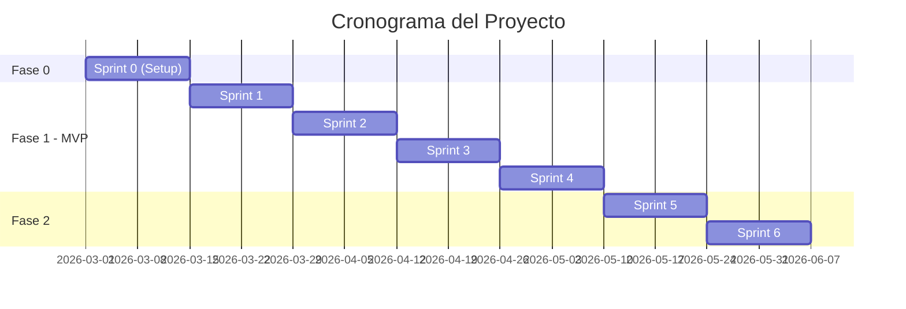

# 📄 Propuesta Comercial — {PROYECTO}

---

<div align="center">

# 🚀 {NOMBRE DEL PROYECTO}

## Propuesta Comercial

**Para:** {NOMBRE DEL CLIENTE}  
**De:** {NOMBRE DE LA EMPRESA}  
**Fecha:** {DD de Mes de YYYY}  
**Versión:** 1.0  
**Válida hasta:** {DD de Mes de YYYY}

---

**Contacto**  
{Nombre del Ejecutivo Comercial}  
{Email} | {Teléfono}

</div>

---

## 📋 Tabla de Contenidos

1. [Resumen Ejecutivo](#1-resumen-ejecutivo)
2. [Entendimiento del Proyecto](#2-entendimiento-del-proyecto)
3. [Solución Propuesta](#3-solución-propuesta)
4. [Metodología y Plan de Trabajo](#4-metodología-y-plan-de-trabajo)
5. [Equipo Propuesto](#5-equipo-propuesto)
6. [Inversión](#6-inversión)
7. [Términos y Condiciones](#7-términos-y-condiciones)
8. [Por Qué Elegirnos](#8-por-qué-elegirnos)
9. [Próximos Pasos](#9-próximos-pasos)
10. [Anexos](#10-anexos)

---

## 1. Resumen Ejecutivo

### El Desafío

{Descripción del problema o necesidad del cliente en 2-3 párrafos. Demostrar que entendemos su situación y el impacto que tiene en su negocio.}

{Incluir datos cuantitativos si están disponibles: costos actuales, ineficiencias, oportunidades perdidas.}

### Nuestra Solución

{Descripción de la solución propuesta en 2-3 párrafos. Enfocarse en beneficios, no en tecnología. Explicar cómo resuelve el problema y el valor que aporta.}

### Beneficios Clave

| Beneficio | Impacto Esperado |
|-----------|------------------|
| 🚀 {Beneficio 1} | {Cuantificación si es posible} |
| 💰 {Beneficio 2} | {Cuantificación si es posible} |
| ⚡ {Beneficio 3} | {Cuantificación si es posible} |
| 🛡️ {Beneficio 4} | {Cuantificación si es posible} |

### Resumen de la Inversión

| Aspecto | Valor |
|---------|:-----:|
| **Inversión Total** | **$ {XXX,XXX}** |
| **Duración** | {X} meses |
| **Inicio Sugerido** | {Fecha} |
| **Equipo Dedicado** | {X} profesionales |
| **Modelo** | {Fixed Price / T&M} |

---

## 2. Entendimiento del Proyecto

### 2.1 Contexto del Cliente

{Descripción del cliente, su industria, y contexto de negocio. Demostrar conocimiento del sector.}

| Aspecto | Información |
|---------|-------------|
| **Industria** | {Sector} |
| **Mercado** | {B2B / B2C / etc.} |
| **Tamaño** | {Empleados, operaciones} |
| **Ubicación** | {Geografía} |

### 2.2 Situación Actual

{Descripción de la situación actual (AS-IS), pain points, y desafíos que enfrenta el cliente.}

**Principales Desafíos Identificados:**
- 🔴 {Desafío 1}
- 🔴 {Desafío 2}
- 🔴 {Desafío 3}

### 2.3 Objetivos del Proyecto

| # | Objetivo | KPI Asociado | Meta |
|:-:|----------|--------------|:----:|
| 1 | {Objetivo 1} | {Métrica} | {Valor} |
| 2 | {Objetivo 2} | {Métrica} | {Valor} |
| 3 | {Objetivo 3} | {Métrica} | {Valor} |

### 2.4 Alcance Acordado

#### ✅ En Alcance

| # | Funcionalidad/Componente | Prioridad |
|:-:|--------------------------|:---------:|
| 1 | {Funcionalidad 1} | Must Have |
| 2 | {Funcionalidad 2} | Must Have |
| 3 | {Funcionalidad 3} | Should Have |

#### ❌ Fuera de Alcance

- {Exclusión 1}
- {Exclusión 2}
- {Exclusión 3}

---

## 3. Solución Propuesta

### 3.1 Descripción de la Solución

{Descripción detallada de la solución propuesta, explicando cómo aborda cada uno de los objetivos del cliente.}

### 3.2 Arquitectura de Alto Nivel

```
┌─────────────────────────────────────────────────────────────┐
│                        FRONTEND                              │
│  ┌─────────────┐  ┌─────────────┐  ┌─────────────┐         │
│  │   Web App   │  │ Mobile App  │  │   Admin     │         │
│  └─────────────┘  └─────────────┘  └─────────────┘         │
└─────────────────────────────────────────────────────────────┘
                            │
                            ▼
┌─────────────────────────────────────────────────────────────┐
│                      API GATEWAY                             │
│                   (Autenticación, Rate Limiting)             │
└─────────────────────────────────────────────────────────────┘
                            │
          ┌─────────────────┼─────────────────┐
          ▼                 ▼                 ▼
   ┌─────────────┐  ┌─────────────┐  ┌─────────────┐
   │ Servicio A  │  │ Servicio B  │  │ Servicio C  │
   └─────────────┘  └─────────────┘  └─────────────┘
          │                 │                 │
          └─────────────────┼─────────────────┘
                            ▼
                   ┌─────────────────┐
                   │   Base de Datos │
                   │   (PostgreSQL)  │
                   └─────────────────┘
```

{Nota: Este diagrama es ilustrativo. Se detallará en la propuesta técnica si corresponde.}

### 3.3 Stack Tecnológico

| Capa | Tecnología | Justificación |
|------|------------|---------------|
| **Frontend** | {React/Angular/Vue} | {Razón} |
| **Backend** | {Java Spring Boot/Node.js/etc.} | {Razón} |
| **Base de Datos** | {PostgreSQL/MySQL/MongoDB} | {Razón} |
| **Cloud** | {AWS/Azure/GCP} | {Razón} |
| **CI/CD** | {GitHub Actions/Jenkins} | {Razón} |

### 3.4 Módulos Principales

| Módulo | Descripción | Complejidad |
|--------|-------------|:-----------:|
| {Módulo 1} | {Descripción breve} | Alta/Media/Baja |
| {Módulo 2} | {Descripción breve} | Alta/Media/Baja |
| {Módulo 3} | {Descripción breve} | Alta/Media/Baja |

### 3.5 Integraciones

| Sistema | Tipo de Integración | Responsable |
|---------|---------------------|:-----------:|
| {Sistema 1} | {API REST / File / etc.} | Nosotros / Cliente |
| {Sistema 2} | {Tipo} | Nosotros / Cliente |

---

## 4. Metodología y Plan de Trabajo

### 4.1 Metodología

Utilizaremos **{Scrum / Kanban / SAFe}** con las siguientes características:

| Aspecto | Configuración |
|---------|---------------|
| **Duración de Sprint** | {2} semanas |
| **Ceremonias** | Daily, Planning, Review, Retro |
| **Herramienta de Gestión** | {Jira / Azure DevOps} |
| **Comunicación** | {Slack / Teams} |
| **Repositorio** | {GitHub / GitLab} |

### 4.2 Fases del Proyecto



### 4.3 Detalle por Fase

#### Fase 0: Sprint 0 — Setup y Configuración
**Duración**: 2 semanas  
**Objetivo**: Preparar ambiente y alinear equipo

| Entregable | Descripción |
|------------|-------------|
| Ambiente de desarrollo | Configurado y funcional |
| Backlog refinado | Historias de usuario para Sprint 1-2 |
| Arquitectura base | Proyecto inicial con estructura |
| CI/CD | Pipeline básico funcionando |

#### Fase 1: MVP
**Duración**: {X} semanas ({X} sprints)  
**Objetivo**: {Objetivo de la fase}

| Sprint | Funcionalidades | Entregable |
|:------:|-----------------|------------|
| Sprint 1 | {Features} | {Entregable} |
| Sprint 2 | {Features} | {Entregable} |
| Sprint 3 | {Features} | {Entregable} |
| Sprint 4 | {Features} | **MVP Funcional** |

#### Fase 2: {Nombre}
**Duración**: {X} semanas  
**Objetivo**: {Objetivo de la fase}

| Sprint | Funcionalidades | Entregable |
|:------:|-----------------|------------|
| Sprint 5 | {Features} | {Entregable} |
| Sprint 6 | {Features} | **Versión 1.0** |

### 4.4 Hitos del Proyecto

| # | Hito | Fecha Estimada | Criterio de Aceptación |
|:-:|------|:--------------:|------------------------|
| 1 | Kickoff | Semana 1 | Equipo alineado, ambientes listos |
| 2 | MVP interno | Semana {X} | {Criterio} |
| 3 | UAT | Semana {X} | {Criterio} |
| 4 | Go-Live | Semana {X} | Producción estable |

---

## 5. Equipo Propuesto

### 5.1 Estructura del Equipo

```
                    ┌─────────────────┐
                    │ Project Manager │
                    │   (20% - Shared)│
                    └────────┬────────┘
                             │
        ┌────────────────────┼────────────────────┐
        │                    │                    │
┌───────▼───────┐    ┌───────▼───────┐    ┌───────▼───────┐
│   Tech Lead   │    │   Developer   │    │  QA Engineer  │
│   (100% FTE)  │    │   (100% FTE)  │    │  (50% FTE)    │
└───────────────┘    └───────────────┘    └───────────────┘
```

### 5.2 Roles y Responsabilidades

| Rol | Responsabilidades | Dedicación |
|-----|-------------------|:----------:|
| **Project Manager** | Gestión del proyecto, comunicación con stakeholders, reportes | 20% |
| **Tech Lead** | Arquitectura, decisiones técnicas, code review, mentoría | 100% |
| **Senior Developer** | Desarrollo de features, testing unitario, documentación | 100% |
| **QA Engineer** | Testing, automatización, validación de calidad | 50% |

### 5.3 Perfiles del Equipo

#### Tech Lead / Architect
- **Experiencia**: +{X} años en desarrollo de software
- **Especialización**: {Tecnologías}
- **Certificaciones**: {Si aplica}

#### Senior Developer
- **Experiencia**: +{X} años
- **Especialización**: {Stack}

### 5.4 Participación del Cliente

| Rol Cliente | Responsabilidad | Dedicación Esperada |
|-------------|-----------------|:-------------------:|
| **Product Owner** | Priorización, aceptación de entregables | {X} hrs/semana |
| **Sponsor** | Decisiones estratégicas, escalamientos | Según necesidad |
| **SME (Experto)** | Reglas de negocio, validación funcional | {X} hrs/semana |

---

## 6. Inversión

### 6.1 Resumen de Inversión

| Fase | Descripción | Duración | Inversión |
|------|-------------|:--------:|----------:|
| Fase 0 | Sprint 0 - Setup | 2 semanas | $ {X,XXX} |
| Fase 1 | MVP | {X} semanas | $ {XX,XXX} |
| Fase 2 | {Nombre} | {X} semanas | $ {XX,XXX} |
| **TOTAL** | — | **{X} meses** | **$ {XXX,XXX}** |

### 6.2 Desglose por Rol

| Rol | Dedicación | Tarifa/Hora | Horas Estimadas | Total |
|-----|:----------:|:-----------:|:---------------:|------:|
| Tech Lead | 100% | $ {XX} | {XXX} | $ {XX,XXX} |
| Sr. Developer | 100% | $ {XX} | {XXX} | $ {XX,XXX} |
| QA Engineer | 50% | $ {XX} | {XXX} | $ {X,XXX} |
| Project Manager | 20% | $ {XX} | {XX} | $ {X,XXX} |
| **TOTAL** | — | — | **{XXX}** | **$ {XXX,XXX}** |

### 6.3 Condiciones de Pago

| Hito | Porcentaje | Monto | Trigger |
|------|:----------:|------:|---------|
| Anticipo | 30% | $ {XX,XXX} | Firma de contrato |
| Entrega MVP | 30% | $ {XX,XXX} | Aceptación de MVP |
| Entrega Final | 30% | $ {XX,XXX} | Aceptación v1.0 |
| Cierre | 10% | $ {X,XXX} | Go-Live exitoso |
| **TOTAL** | **100%** | **$ {XXX,XXX}** | — |

### 6.4 Costos Adicionales (No Incluidos)

| Concepto | Estimación | Responsable |
|----------|:----------:|:-----------:|
| Infraestructura cloud (mensual) | $ {X,XXX}/mes | Cliente |
| Licencias de software (si aplica) | $ {X,XXX} | Cliente |
| Servicios de terceros (APIs) | Variable | Cliente |
| Soporte post go-live | Cotización separada | A convenir |

---

## 7. Términos y Condiciones

### 7.1 Supuestos Clave

Esta propuesta se basa en los siguientes supuestos:

1. ✅ El cliente proporcionará un Product Owner con disponibilidad de {X} horas semanales
2. ✅ Los requisitos se congelarán al finalizar Sprint 0
3. ✅ El cliente proporcionará acceso a sistemas de integración en los primeros 5 días
4. ✅ Las aprobaciones de entregables se realizarán en máximo {X} días hábiles
5. ✅ {Supuesto adicional}

### 7.2 Responsabilidades del Cliente

| Responsabilidad | Descripción | Impacto si no se cumple |
|-----------------|-------------|-------------------------|
| Disponibilidad PO | {X} hrs/semana | Retrasos en decisiones |
| Acceso a sistemas | Primeros 5 días | Bloqueo de integraciones |
| Aprobación de entregables | Máximo {X} días | Retraso en siguiente fase |
| Ambientes de prueba | Según roadmap | Retraso en QA |

### 7.3 Exclusiones

Esta propuesta **NO** incluye:

- ❌ Desarrollo de aplicación móvil nativa
- ❌ Migración de datos históricos anteriores a {año}
- ❌ Capacitación presencial (virtual incluida)
- ❌ Soporte y mantenimiento post go-live
- ❌ Licencias de software de terceros
- ❌ Infraestructura cloud
- ❌ {Exclusión adicional}

### 7.4 Gestión de Cambios

| Tipo de Cambio | Proceso | Impacto |
|----------------|---------|---------|
| Menor (< 10% esfuerzo) | Aprobación verbal | Sin costo adicional |
| Medio (10-30% esfuerzo) | Documento de cambio + aprobación | Posible extensión de tiempo |
| Mayor (> 30% esfuerzo) | Nueva cotización | Negociación de alcance/costo |

### 7.5 Garantía

- **Período de garantía**: {30} días post go-live
- **Cobertura**: Corrección de defectos en funcionalidades entregadas
- **Exclusiones**: Cambios de requisitos, datos incorrectos, integraciones de terceros

### 7.6 Propiedad Intelectual

- El código fuente desarrollado será propiedad del **Cliente** al completar el pago total
- Frameworks y librerías de terceros mantienen sus licencias originales
- Metodologías y templates de {Empresa} permanecen como propiedad de {Empresa}

### 7.7 Vigencia

- Esta propuesta es válida por **{30} días** a partir de la fecha de emisión
- Precios sujetos a revisión después de la fecha de vigencia

---

## 8. Por Qué Elegirnos

### 8.1 Nuestra Propuesta de Valor

| Diferenciador | Descripción |
|---------------|-------------|
| 🎯 **Experiencia en {industria}** | +{X} proyectos exitosos en el sector |
| 🚀 **Entrega ágil** | Metodología probada con entregas incrementales |
| 🛡️ **Calidad garantizada** | Prácticas de testing y code review rigurosas |
| 🤝 **Compromiso** | Equipo dedicado y comunicación transparente |

### 8.2 Casos de Éxito Relevantes

#### Cliente: {Nombre del Cliente Similar}
- **Industria**: {Sector}
- **Proyecto**: {Descripción breve}
- **Resultados**: {Métricas de éxito}

#### Cliente: {Otro Cliente}
- **Industria**: {Sector}
- **Proyecto**: {Descripción breve}
- **Resultados**: {Métricas de éxito}

### 8.3 Certificaciones y Partners

- {Certificación 1}
- {Certificación 2}
- Partner de {Cloud Provider}

---

## 9. Próximos Pasos

Para avanzar con el proyecto, proponemos los siguientes pasos:

| # | Paso | Responsable | Fecha Sugerida |
|:-:|------|-------------|:--------------:|
| 1 | Revisión de propuesta | Cliente | Semana 1 |
| 2 | Reunión de aclaración (si necesario) | Ambos | Semana 1 |
| 3 | Aprobación y firma de contrato | Cliente | Semana 2 |
| 4 | Kickoff del proyecto | Ambos | Semana 3 |
| 5 | Inicio de Sprint 0 | Equipo | Semana 3 |

### Contacto

Para cualquier consulta sobre esta propuesta, contactar a:

| Rol | Nombre | Email | Teléfono |
|-----|--------|-------|----------|
| Comercial | {Nombre} | {email} | {teléfono} |
| Técnico | {Nombre} | {email} | {teléfono} |

---

## 10. Anexos

### Anexo A: Glosario de Términos
{Definiciones de términos técnicos usados en la propuesta}

### Anexo B: CVs del Equipo
{Resúmenes de los perfiles propuestos}

### Anexo C: Detalle Técnico
{Referencia a propuesta técnica si existe}

### Anexo D: Casos de Éxito Detallados
{Más información sobre proyectos similares}

---

<div align="center">

---

**{NOMBRE DE LA EMPRESA}**

{Dirección}  
{Ciudad, País}  
{Website}

---

*Propuesta preparada exclusivamente para {NOMBRE DEL CLIENTE}*  
*Documento confidencial*

</div>

---

## 📝 Control de Versiones

| Versión | Fecha | Autor | Cambios |
|---------|-------|-------|---------|
| 1.0 | {YYYY-MM-DD} | {Nombre} | Versión inicial |

---

**Generado por**: Proposal Generation Agent  
**Metodología**: ZNS v2.2
