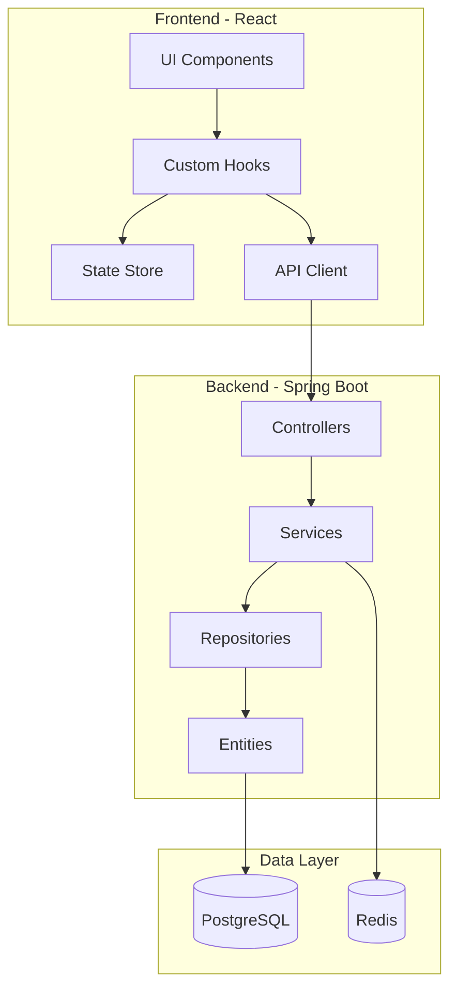
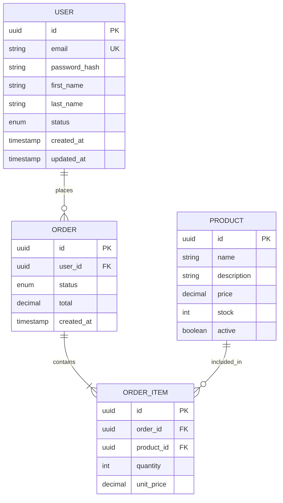
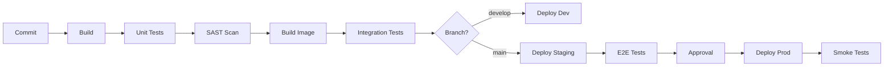

# 📄 Propuesta Técnica

---

**Proyecto**: {Nombre del Proyecto}  
**Cliente**: {Nombre del Cliente}  
**Versión**: {X.X}  
**Fecha**: {YYYY-MM-DD}  
**Elaborado por**: {Empresa}  
**Confidencialidad**: Confidencial

---

## 📋 Tabla de Contenidos

1. [Introducción](#1-introducción)
2. [Arquitectura de la Solución](#2-arquitectura-de-la-solución)
3. [Stack Tecnológico](#3-stack-tecnológico)
4. [Diseño de Componentes](#4-diseño-de-componentes)
5. [Modelo de Datos](#5-modelo-de-datos)
6. [Integraciones](#6-integraciones)
7. [Seguridad](#7-seguridad)
8. [Infraestructura y DevOps](#8-infraestructura-y-devops)
9. [Estrategia de Testing](#9-estrategia-de-testing)
10. [Performance y Escalabilidad](#10-performance-y-escalabilidad)
11. [Plan de Migración](#11-plan-de-migración)
12. [Anexos Técnicos](#12-anexos-técnicos)

---

## 1. Introducción

### 1.1 Propósito del Documento

Este documento presenta la propuesta técnica detallada para el desarrollo de **{Nombre del Proyecto}**. Incluye la arquitectura de la solución, stack tecnológico seleccionado, diseño de componentes, estrategias de seguridad, infraestructura y metodología de desarrollo.

### 1.2 Alcance Técnico

| Aspecto | Incluido | Observaciones |
|---------|:--------:|---------------|
| Desarrollo Backend | ✅ | API REST, lógica de negocio |
| Desarrollo Frontend | ✅ | Web responsive / SPA |
| Base de datos | ✅ | Diseño y migraciones |
| Autenticación/Autorización | ✅ | {JWT / OAuth2 / SSO} |
| CI/CD Pipeline | ✅ | Build, test, deploy automatizado |
| Infraestructura Cloud | ✅/⚠️ | {AWS / Azure / GCP} |
| Monitoreo y Observabilidad | ✅ | Logs, métricas, alertas |
| Documentación técnica | ✅ | API docs, runbooks |

### 1.3 Documentos de Referencia

| Documento | Versión | Ubicación |
|-----------|:-------:|-----------|
| Requisitos Funcionales | v{X.X} | `deliverables/01-context-consolidated/02-requisitos-funcionales.md` |
| Requisitos No Funcionales | v{X.X} | `deliverables/01-context-consolidated/03-requisitos-no-funcionales.md` |
| Contexto de Negocio | v{X.X} | `deliverables/01-context-consolidated/01-contexto-negocio.md` |
| Estimación de Esfuerzo | v{X.X} | `deliverables/estimations/estimacion-{proyecto}.md` |

---

## 2. Arquitectura de la Solución

### 2.1 Vista General de Arquitectura

```
┌─────────────────────────────────────────────────────────────────────────┐
│                              CLIENTES                                    │
├───────────────┬───────────────┬──────────────────┬─────────────────────┤
│   Browser     │   Mobile App  │   Third-party    │   Internal Tools    │
│   (React)     │   (Flutter)   │   Systems        │                     │
└───────┬───────┴───────┬───────┴────────┬─────────┴──────────┬──────────┘
        │               │                │                    │
        └───────────────┴────────────────┴────────────────────┘
                                │
                    ┌───────────▼───────────┐
                    │    Load Balancer      │
                    │   (AWS ALB / Nginx)   │
                    └───────────┬───────────┘
                                │
        ┌───────────────────────┼───────────────────────┐
        │                       │                       │
┌───────▼───────┐      ┌───────▼───────┐      ┌───────▼───────┐
│  Frontend     │      │  API Gateway  │      │  Auth Service │
│  (CDN/S3)     │      │  (Spring)     │      │  (OAuth2)     │
└───────────────┘      └───────┬───────┘      └───────────────┘
                               │
        ┌──────────────────────┼──────────────────────┐
        │                      │                      │
┌───────▼───────┐     ┌───────▼───────┐     ┌───────▼───────┐
│ Service A     │     │ Service B     │     │ Service C     │
│ (Microservice)│     │ (Microservice)│     │ (Microservice)│
└───────┬───────┘     └───────┬───────┘     └───────┬───────┘
        │                     │                     │
        └─────────────────────┼─────────────────────┘
                              │
              ┌───────────────┼───────────────┐
              │               │               │
      ┌───────▼───────┐ ┌────▼────┐   ┌─────▼──────┐
      │  PostgreSQL   │ │  Redis  │   │  Storage   │
      │  (RDS)        │ │  Cache  │   │  (S3)      │
      └───────────────┘ └─────────┘   └────────────┘
```

### 2.2 Diagrama de Arquitectura (C4 - Context)

```mermaid
graph TB
    subgraph External[Sistemas Externos]
        EXT1[Sistema Externo 1]
        EXT2[Sistema Externo 2]
    end
    
    subgraph Users[Usuarios]
        U1[Usuario Final]
        U2[Administrador]
    end
    
    subgraph System[Sistema: {Nombre}]
        WEB[Web Application]
        API[API Backend]
        DB[(Base de Datos)]
    end
    
    U1 --> WEB
    U2 --> WEB
    WEB --> API
    API --> DB
    API <--> EXT1
    API <--> EXT2
```

### 2.3 Patrón de Arquitectura

**Patrón seleccionado**: {Monolito Modular / Microservicios / Serverless}

| Criterio | Evaluación | Justificación |
|----------|:----------:|---------------|
| Complejidad del dominio | Alta/Media/Baja | {Justificación} |
| Requerimiento de escalabilidad | Alto/Medio/Bajo | {Justificación} |
| Tamaño del equipo | {X} personas | {Justificación} |
| Time-to-market | Crítico/Normal | {Justificación} |
| **Decisión** | **{Patrón}** | {Justificación principal} |

### 2.4 Decisiones de Arquitectura (ADRs)

#### ADR-001: Selección de Patrón de Arquitectura

| Campo | Valor |
|-------|-------|
| **Estado** | Propuesto |
| **Contexto** | {Descripción del contexto que llevó a esta decisión} |
| **Decisión** | {Descripción de la decisión tomada} |
| **Consecuencias** | {Impacto positivo y negativo de la decisión} |
| **Alternativas** | {Opciones que fueron consideradas} |

#### ADR-002: Selección de Base de Datos

| Campo | Valor |
|-------|-------|
| **Estado** | Propuesto |
| **Contexto** | {Descripción} |
| **Decisión** | {PostgreSQL / MySQL / MongoDB / etc.} |
| **Consecuencias** | {Impactos} |

---

## 3. Stack Tecnológico

### 3.1 Resumen del Stack

```
┌──────────────────────────────────────────────────────────────────┐
│                        STACK TECNOLÓGICO                         │
├────────────────┬─────────────────────────────────────────────────┤
│  Frontend      │  React 18 + TypeScript + Vite + TailwindCSS     │
├────────────────┼─────────────────────────────────────────────────┤
│  Backend       │  Java 21 + Spring Boot 3.2 + Spring Security    │
├────────────────┼─────────────────────────────────────────────────┤
│  Base de Datos │  PostgreSQL 16 + Flyway Migrations              │
├────────────────┼─────────────────────────────────────────────────┤
│  Caché         │  Redis 7                                        │
├────────────────┼─────────────────────────────────────────────────┤
│  Message Queue │  RabbitMQ / Apache Kafka                        │
├────────────────┼─────────────────────────────────────────────────┤
│  Infra / Cloud │  AWS (ECS, RDS, S3, CloudFront)                 │
├────────────────┼─────────────────────────────────────────────────┤
│  CI/CD         │  GitHub Actions / Jenkins                       │
├────────────────┼─────────────────────────────────────────────────┤
│  Containers    │  Docker + Docker Compose                        │
├────────────────┼─────────────────────────────────────────────────┤
│  Observability │  Prometheus + Grafana + ELK Stack               │
└────────────────┴─────────────────────────────────────────────────┘
```

### 3.2 Detalle por Capa

#### Frontend

| Tecnología | Versión | Propósito |
|------------|:-------:|-----------|
| React | 18.x | Framework UI |
| TypeScript | 5.x | Type safety |
| Vite | 5.x | Build tool |
| TailwindCSS | 3.x | Styling |
| React Query | 5.x | Server state management |
| Zustand | 4.x | Client state management |
| React Hook Form | 7.x | Forms handling |
| Zod | 3.x | Schema validation |
| Vitest | 1.x | Unit testing |
| Playwright | 1.x | E2E testing |

**Justificación**: {Por qué se eligió este stack frontend}

#### Backend

| Tecnología | Versión | Propósito |
|------------|:-------:|-----------|
| Java | 21 LTS | Lenguaje principal |
| Spring Boot | 3.2.x | Framework |
| Spring Security | 6.x | Seguridad |
| Spring Data JPA | 3.x | Persistencia |
| Flyway | 10.x | Migraciones DB |
| MapStruct | 1.5.x | Object mapping |
| Lombok | 1.18.x | Boilerplate reduction |
| OpenAPI | 3.0 | API documentation |
| JUnit 5 | 5.x | Unit testing |
| Testcontainers | 1.x | Integration testing |

**Justificación**: {Por qué se eligió este stack backend}

#### Base de Datos

| Tecnología | Versión | Propósito |
|------------|:-------:|-----------|
| PostgreSQL | 16.x | RDBMS principal |
| Redis | 7.x | Cache, sessions |
| {Otro} | {X.x} | {Propósito} |

**Justificación**: {Por qué se eligió esta base de datos}

---

## 4. Diseño de Componentes

### 4.1 Estructura de Módulos

```
📦 {proyecto}
├── 📁 api-gateway/                 # Gateway y routing
│   ├── 📁 src/main/java/
│   │   └── 📁 com.{empresa}.gateway/
│   │       ├── 📁 config/
│   │       ├── 📁 filters/
│   │       └── 📁 routes/
│   └── 📄 build.gradle
│
├── 📁 service-{modulo1}/           # Microservicio/Módulo 1
│   ├── 📁 src/main/java/
│   │   └── 📁 com.{empresa}.{modulo1}/
│   │       ├── 📁 controller/      # REST endpoints
│   │       ├── 📁 service/         # Business logic
│   │       ├── 📁 repository/      # Data access
│   │       ├── 📁 entity/          # JPA entities
│   │       ├── 📁 dto/             # Data transfer objects
│   │       ├── 📁 mapper/          # Object mappers
│   │       ├── 📁 exception/       # Custom exceptions
│   │       └── 📁 config/          # Configuration
│   └── 📄 build.gradle
│
├── 📁 service-{modulo2}/           # Microservicio/Módulo 2
│   └── ...
│
├── 📁 common-lib/                  # Shared library
│   ├── 📁 dto/
│   ├── 📁 util/
│   └── 📁 exception/
│
└── 📁 infrastructure/              # IaC
    ├── 📁 terraform/
    ├── 📁 k8s/
    └── 📁 docker/
```

### 4.2 Diagrama de Componentes



### 4.3 Responsabilidades por Componente

| Componente | Responsabilidad | Tecnología |
|------------|-----------------|------------|
| API Gateway | Routing, rate limiting, auth validation | Spring Cloud Gateway |
| Auth Service | Autenticación, tokens, sesiones | Spring Security + OAuth2 |
| {Módulo 1} Service | {Responsabilidad} | Spring Boot |
| {Módulo 2} Service | {Responsabilidad} | Spring Boot |
| Notification Service | Emails, push, SMS | Spring Boot + SendGrid |

---

## 5. Modelo de Datos

### 5.1 Diagrama Entidad-Relación



### 5.2 Tablas Principales

| Tabla | Propósito | Cardinalidad Estimada |
|-------|-----------|:---------------------:|
| `users` | Usuarios del sistema | ~{X,XXX} |
| `orders` | Pedidos/Transacciones | ~{XX,XXX} |
| `products` | Catálogo de productos | ~{X,XXX} |
| `order_items` | Ítems de pedidos | ~{XXX,XXX} |
| `audit_log` | Auditoría de acciones | ~{X,XXX,XXX} |

### 5.3 Estrategia de Índices

| Tabla | Índice | Columnas | Tipo | Justificación |
|-------|--------|----------|:----:|---------------|
| `users` | `idx_users_email` | email | UNIQUE | Login, búsqueda |
| `orders` | `idx_orders_user_status` | user_id, status | BTREE | Listado de órdenes |
| `products` | `idx_products_name_gin` | name | GIN | Full-text search |

---

## 6. Integraciones

### 6.1 Mapa de Integraciones

```mermaid
graph LR
    subgraph Sistema[{Nombre del Sistema}]
        API[API Backend]
    end
    
    subgraph Externos[Sistemas Externos]
        PAY[Payment Gateway]
        MAIL[Email Service]
        SMS[SMS Provider]
        ERP[Sistema ERP]
    end
    
    API <-->|REST/HTTPS| PAY
    API -->|SMTP/API| MAIL
    API -->|REST/HTTPS| SMS
    API <-->|REST/SOAP| ERP
```

### 6.2 Detalle de Integraciones

#### Integración 1: {Nombre del Sistema Externo}

| Campo | Valor |
|-------|-------|
| **Sistema** | {Nombre} |
| **Tipo** | REST API / SOAP / Webhook / Message Queue |
| **Autenticación** | API Key / OAuth2 / mTLS |
| **Dirección** | Inbound / Outbound / Bidireccional |
| **Frecuencia** | Real-time / Near real-time / Batch |
| **Criticidad** | Alta / Media / Baja |
| **Fallback** | {Estrategia si falla} |

**Endpoints consumidos**:

| Endpoint | Método | Propósito |
|----------|:------:|-----------|
| `/api/v1/resource` | GET | {Propósito} |
| `/api/v1/resource` | POST | {Propósito} |

**Manejo de errores**:
- Retry con exponential backoff (max 3 intentos)
- Circuit breaker (umbral: 5 fallos en 60s)
- Dead letter queue para mensajes fallidos

---

## 7. Seguridad

### 7.1 Modelo de Seguridad

```
┌─────────────────────────────────────────────────────────────────┐
│                    CAPAS DE SEGURIDAD                           │
├─────────────────────────────────────────────────────────────────┤
│  1. Perimetral: WAF, DDoS protection, Rate limiting             │
├─────────────────────────────────────────────────────────────────┤
│  2. Red: VPC, Security Groups, NACLs, Private subnets           │
├─────────────────────────────────────────────────────────────────┤
│  3. Transporte: TLS 1.3, Certificate management                 │
├─────────────────────────────────────────────────────────────────┤
│  4. Aplicación: Authentication, Authorization, Input validation │
├─────────────────────────────────────────────────────────────────┤
│  5. Datos: Encryption at rest, Column-level encryption, Masking │
└─────────────────────────────────────────────────────────────────┘
```

### 7.2 Autenticación y Autorización

| Aspecto | Implementación |
|---------|----------------|
| **Autenticación** | JWT + OAuth 2.0 / OpenID Connect |
| **Token lifetime** | Access: 15 min, Refresh: 7 días |
| **Password policy** | Min 12 chars, mayúsc, minúsc, número, especial |
| **MFA** | Opcional / Obligatorio para admins |
| **Session management** | Stateless con Redis para blacklist |
| **Authorization** | RBAC (Role-Based Access Control) |

### 7.3 Roles y Permisos

| Rol | Permisos | Scope |
|-----|----------|-------|
| `ROLE_ADMIN` | Full access | Global |
| `ROLE_MANAGER` | CRUD en su área | Por área |
| `ROLE_USER` | Read + own resources | Own data |
| `ROLE_VIEWER` | Read only | Asignado |

### 7.4 Seguridad OWASP Top 10

| Vulnerabilidad | Mitigación |
|----------------|------------|
| A01:2021 Broken Access Control | RBAC, validación de ownership |
| A02:2021 Cryptographic Failures | TLS 1.3, AES-256, bcrypt |
| A03:2021 Injection | Prepared statements, input validation |
| A04:2021 Insecure Design | Threat modeling, security reviews |
| A05:2021 Security Misconfiguration | IaC, security scanning |
| A06:2021 Vulnerable Components | Dependency scanning (Dependabot) |
| A07:2021 Auth Failures | Rate limiting, account lockout |
| A08:2021 Software Integrity | Signed builds, SRI |
| A09:2021 Logging Failures | Structured logging, SIEM integration |
| A10:2021 SSRF | URL validation, allowlisting |

---

## 8. Infraestructura y DevOps

### 8.1 Arquitectura de Infraestructura

```
┌─────────────────────────────────────────────────────────────────────┐
│                        AWS CLOUD                                     │
├─────────────────────────────────────────────────────────────────────┤
│  ┌─────────────────────────────────────────────────────────────┐   │
│  │                    VPC (10.0.0.0/16)                         │   │
│  │  ┌───────────────────────┐  ┌───────────────────────┐       │   │
│  │  │  Public Subnet        │  │  Public Subnet        │       │   │
│  │  │  (10.0.1.0/24)        │  │  (10.0.2.0/24)        │       │   │
│  │  │  ┌─────────────────┐  │  │  ┌─────────────────┐  │       │   │
│  │  │  │  NAT Gateway    │  │  │  │  NAT Gateway    │  │       │   │
│  │  │  └─────────────────┘  │  │  └─────────────────┘  │       │   │
│  │  │  ┌─────────────────┐  │  │  ┌─────────────────┐  │       │   │
│  │  │  │  ALB            │  │  │  │  ALB            │  │       │   │
│  │  │  └─────────────────┘  │  │  └─────────────────┘  │       │   │
│  │  └───────────────────────┘  └───────────────────────┘       │   │
│  │                                                              │   │
│  │  ┌───────────────────────┐  ┌───────────────────────┐       │   │
│  │  │  Private Subnet       │  │  Private Subnet       │       │   │
│  │  │  (10.0.10.0/24)       │  │  (10.0.20.0/24)       │       │   │
│  │  │  ┌─────────────────┐  │  │  ┌─────────────────┐  │       │   │
│  │  │  │  ECS Fargate    │  │  │  │  ECS Fargate    │  │       │   │
│  │  │  └─────────────────┘  │  │  └─────────────────┘  │       │   │
│  │  └───────────────────────┘  └───────────────────────┘       │   │
│  │                                                              │   │
│  │  ┌───────────────────────┐  ┌───────────────────────┐       │   │
│  │  │  Data Subnet          │  │  Data Subnet          │       │   │
│  │  │  (10.0.100.0/24)      │  │  (10.0.200.0/24)      │       │   │
│  │  │  ┌─────────────────┐  │  │  ┌─────────────────┐  │       │   │
│  │  │  │  RDS Primary    │  │  │  │  RDS Standby    │  │       │   │
│  │  │  └─────────────────┘  │  │  └─────────────────┘  │       │   │
│  │  │  ┌─────────────────┐  │  │                       │       │   │
│  │  │  │  ElastiCache    │  │  │                       │       │   │
│  │  │  └─────────────────┘  │  │                       │       │   │
│  │  └───────────────────────┘  └───────────────────────┘       │   │
│  └─────────────────────────────────────────────────────────────┘   │
└─────────────────────────────────────────────────────────────────────┘
```

### 8.2 Ambientes

| Ambiente | Propósito | Recursos | URL |
|----------|-----------|----------|-----|
| `dev` | Desarrollo | Mínimos | dev.{proyecto}.com |
| `staging` | QA, UAT | Similar a prod | staging.{proyecto}.com |
| `prod` | Producción | Full | {proyecto}.com |

### 8.3 CI/CD Pipeline



**Stages del Pipeline**:

| Stage | Herramienta | Trigger | Tiempo Est. |
|-------|-------------|---------|:-----------:|
| Build | Gradle | Push | 2-3 min |
| Unit Tests | JUnit 5 | Automático | 3-5 min |
| SAST | SonarQube | Automático | 5-10 min |
| Container Build | Docker | Automático | 3-5 min |
| Integration Tests | Testcontainers | Automático | 5-10 min |
| Deploy to Dev | ArgoCD / ECS | Auto (develop) | 3-5 min |
| Deploy to Staging | ArgoCD / ECS | Auto (main) | 3-5 min |
| E2E Tests | Playwright | Post-deploy | 10-15 min |
| Deploy to Prod | ArgoCD / ECS | Manual approval | 3-5 min |

---

## 9. Estrategia de Testing

### 9.1 Pirámide de Tests

```
                    ┌─────────┐
                    │   E2E   │  ~5%
                   ┌┴─────────┴┐
                   │Integration│  ~20%
                  ┌┴───────────┴┐
                  │    Unit     │  ~75%
                  └─────────────┘
```

### 9.2 Cobertura y Métricas

| Tipo de Test | Cobertura Objetivo | Herramienta |
|--------------|:------------------:|-------------|
| Unit Tests | ≥ 80% | JUnit 5, Vitest |
| Integration Tests | Flujos críticos | Testcontainers |
| E2E Tests | Happy paths | Playwright |
| Performance Tests | SLAs | k6, JMeter |
| Security Tests | OWASP | OWASP ZAP |

### 9.3 Testing por Capa

| Capa | Qué se testea | Enfoque |
|------|---------------|---------|
| Controller | Request/Response mapping | MockMvc |
| Service | Business logic | Mocks/Stubs |
| Repository | Data access | Testcontainers |
| Frontend Components | UI behavior | React Testing Library |
| API Contract | Schema compliance | Pact / OpenAPI |

---

## 10. Performance y Escalabilidad

### 10.1 Objetivos de Performance (SLOs)

| Métrica | Objetivo | Medición |
|---------|:--------:|----------|
| Response Time P50 | < 200ms | APM |
| Response Time P99 | < 1s | APM |
| Availability | 99.9% | Uptime monitor |
| Throughput | 1000 RPS | Load test |
| Error Rate | < 0.1% | APM |

### 10.2 Estrategia de Escalabilidad

| Componente | Estrategia | Configuración |
|------------|------------|---------------|
| Frontend | CDN + Edge caching | CloudFront |
| API | Horizontal scaling | ECS Auto Scaling |
| Database | Read replicas, Connection pooling | RDS Multi-AZ |
| Cache | Redis cluster | ElastiCache |

### 10.3 Optimizaciones Planificadas

- [ ] Implementar caching de respuestas frecuentes
- [ ] Paginación cursor-based para grandes datasets
- [ ] Compresión de respuestas (gzip/brotli)
- [ ] Lazy loading en frontend
- [ ] Database query optimization (EXPLAIN ANALYZE)

---

## 11. Plan de Migración

*Completar si aplica migración de sistema legacy*

### 11.1 Estrategia de Migración

| Fase | Descripción | Duración |
|------|-------------|:--------:|
| 1. Coexistencia | Nuevo sistema en paralelo | 2-4 semanas |
| 2. Migración gradual | Feature flags, canary deployment | 2-4 semanas |
| 3. Cutover | Transición completa | 1 semana |
| 4. Decommission | Apagar sistema legacy | 2 semanas |

### 11.2 Plan de Rollback

En caso de fallas críticas en producción:

1. **Trigger**: Error rate > 5% o P99 > 5s
2. **Acción**: Revertir deployment al tag anterior
3. **Tiempo estimado**: < 5 minutos
4. **Responsable**: DevOps / SRE on-call

---

## 12. Anexos Técnicos

### A. API Endpoints (Resumen)

| Módulo | Endpoints | Autenticación |
|--------|:---------:|:-------------:|
| Auth | 5 | Público/JWT |
| Users | 8 | JWT |
| {Módulo 1} | 12 | JWT |
| {Módulo 2} | 10 | JWT |

### B. Variables de Configuración

| Variable | Descripción | Ambiente |
|----------|-------------|:--------:|
| `DATABASE_URL` | Connection string PostgreSQL | All |
| `REDIS_URL` | Connection string Redis | All |
| `JWT_SECRET` | Secret para firmar tokens | All |
| `AWS_REGION` | Región de AWS | All |

### C. Glosario Técnico

| Término | Definición |
|---------|------------|
| ADR | Architecture Decision Record |
| SLO | Service Level Objective |
| RPS | Requests Per Second |
| APM | Application Performance Monitoring |

---

**Documento generado siguiendo metodología ZNS v2.2**  
**Template versión**: 1.0.0
