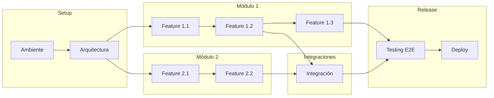

# 📋 Work Breakdown Structure (WBS)

---

**Proyecto**: {Nombre del Proyecto}  
**Cliente**: {Nombre del Cliente}  
**Versión**: {X.X}  
**Fecha**: {YYYY-MM-DD}  
**Autor**: {Nombre}

---

## 📊 Resumen del WBS

### Estructura General

```
📦 {Proyecto}
├── 🔧 E0: Fase 0 — Setup & Arquitectura
│   ├── EP0.1: Configuración de Ambiente
│   └── EP0.2: Arquitectura Base
│
├── 📦 E1: Módulo 1 — {Nombre}
│   ├── F1.1: {Feature 1}
│   ├── F1.2: {Feature 2}
│   └── F1.3: {Feature 3}
│
├── 📦 E2: Módulo 2 — {Nombre}
│   ├── F2.1: {Feature 1}
│   └── F2.2: {Feature 2}
│
├── 📦 E3: Módulo 3 — {Nombre}
│   └── F3.1: {Feature 1}
│
├── 🔄 E4: Integraciones
│   └── F4.1: {Integración 1}
│
└── 🚀 E5: Fase Final — Testing & Deployment
    ├── EP5.1: Testing E2E
    └── EP5.2: Deployment & Go-Live
```

### Métricas Generales

| Métrica | Valor |
|---------|:-----:|
| Total Épicas | {X} |
| Total Features | {XX} |
| Total Tareas | {XXX} |
| Total Story Points | {XXX} SP |
| Total Horas Estimadas | {XXX} horas |

---

## 🔧 E0: Fase 0 — Setup & Arquitectura

### EP0.1: Configuración de Ambiente

| ID | Tarea | Tipo | SP | Horas | Responsable | Dependencias |
|:--:|-------|:----:|:--:|:-----:|:-----------:|:------------:|
| T0.1.1 | Setup repositorio Git (branching strategy) | Setup | 1 | 2 | DevOps | — |
| T0.1.2 | Configuración Docker Compose local | Setup | 2 | 4 | DevOps | T0.1.1 |
| T0.1.3 | Pipeline CI/CD inicial | DevOps | 3 | 8 | DevOps | T0.1.1 |
| T0.1.4 | Ambiente de desarrollo (variables, secrets) | Setup | 2 | 4 | DevOps | T0.1.2 |
| T0.1.5 | Ambiente staging/QA | DevOps | 3 | 8 | DevOps | T0.1.3 |

**Subtotal EP0.1**: {XX} SP | {XX} horas

---

### EP0.2: Arquitectura Base

| ID | Tarea | Tipo | SP | Horas | Responsable | Dependencias |
|:--:|-------|:----:|:--:|:-----:|:-----------:|:------------:|
| T0.2.1 | Scaffolding proyecto backend | Dev | 2 | 4 | Tech Lead | T0.1.1 |
| T0.2.2 | Scaffolding proyecto frontend | Dev | 2 | 4 | Tech Lead | T0.1.1 |
| T0.2.3 | Configuración base de datos | Dev | 2 | 4 | Backend | T0.2.1 |
| T0.2.4 | Setup migraciones (Flyway/Liquibase) | Dev | 2 | 4 | Backend | T0.2.3 |
| T0.2.5 | Configuración autenticación base | Dev | 3 | 8 | Backend | T0.2.1 |
| T0.2.6 | Documentación arquitectura (ADR inicial) | Doc | 2 | 4 | Tech Lead | T0.2.1, T0.2.2 |

**Subtotal EP0.2**: {XX} SP | {XX} horas

---

## 📦 E1: Módulo 1 — {Nombre del Módulo}

> **Descripción**: {Descripción del módulo y su propósito principal}  
> **Requisitos relacionados**: RF-001, RF-002, RF-003

### F1.1: {Nombre de Feature}

> **Historia de Usuario**: Como {rol}, quiero {acción} para {beneficio}  
> **Prioridad**: Must Have | **Complejidad**: Media

| ID | Tarea | Tipo | SP | Horas | Responsable | Dependencias |
|:--:|-------|:----:|:--:|:-----:|:-----------:|:------------:|
| T1.1.1 | {Diseño de modelo de datos} | Dev | 2 | 4 | Backend | — |
| T1.1.2 | {Crear entidad y repositorio} | Dev | 2 | 4 | Backend | T1.1.1 |
| T1.1.3 | {Implementar servicio de negocio} | Dev | 3 | 8 | Backend | T1.1.2 |
| T1.1.4 | {Crear endpoints API REST} | Dev | 2 | 4 | Backend | T1.1.3 |
| T1.1.5 | {Tests unitarios backend} | Test | 2 | 4 | Backend | T1.1.4 |
| T1.1.6 | {Componente UI - Listado} | Dev | 3 | 8 | Frontend | T1.1.4 |
| T1.1.7 | {Componente UI - Formulario} | Dev | 3 | 8 | Frontend | T1.1.4 |
| T1.1.8 | {Tests unitarios frontend} | Test | 2 | 4 | Frontend | T1.1.6, T1.1.7 |
| T1.1.9 | {Tests E2E de la feature} | QA | 3 | 6 | QA | T1.1.5, T1.1.8 |

**Subtotal F1.1**: {XX} SP | {XX} horas

**Criterios de Aceptación**:
- [ ] {Criterio 1}
- [ ] {Criterio 2}
- [ ] {Criterio 3}

---

### F1.2: {Nombre de Feature}

> **Historia de Usuario**: Como {rol}, quiero {acción} para {beneficio}  
> **Prioridad**: Must Have | **Complejidad**: Alta

| ID | Tarea | Tipo | SP | Horas | Responsable | Dependencias |
|:--:|-------|:----:|:--:|:-----:|:-----------:|:------------:|
| T1.2.1 | {Tarea 1} | Dev | 3 | 8 | Backend | — |
| T1.2.2 | {Tarea 2} | Dev | 5 | 16 | Backend | T1.2.1 |
| T1.2.3 | {Tarea 3} | Dev | 3 | 8 | Frontend | T1.2.2 |
| T1.2.4 | {Testing} | QA | 3 | 6 | QA | T1.2.3 |

**Subtotal F1.2**: {XX} SP | {XX} horas

---

### F1.3: {Nombre de Feature}

> **Historia de Usuario**: Como {rol}, quiero {acción} para {beneficio}  
> **Prioridad**: Should Have | **Complejidad**: Baja

| ID | Tarea | Tipo | SP | Horas | Responsable | Dependencias |
|:--:|-------|:----:|:--:|:-----:|:-----------:|:------------:|
| T1.3.1 | {Tarea 1} | Dev | 2 | 4 | Backend | — |
| T1.3.2 | {Tarea 2} | Dev | 2 | 4 | Frontend | T1.3.1 |
| T1.3.3 | {Testing} | QA | 2 | 4 | QA | T1.3.2 |

**Subtotal F1.3**: {XX} SP | {XX} horas

---

### 📊 Resumen Módulo 1

| Feature | SP | Horas | Prioridad |
|---------|:--:|:-----:|:---------:|
| F1.1: {Nombre} | {XX} | {XX} | Must |
| F1.2: {Nombre} | {XX} | {XX} | Must |
| F1.3: {Nombre} | {XX} | {XX} | Should |
| **TOTAL M1** | **{XX}** | **{XXX}** | — |

---

## 📦 E2: Módulo 2 — {Nombre del Módulo}

> **Descripción**: {Descripción del módulo}  
> **Requisitos relacionados**: RF-004, RF-005

### F2.1: {Nombre de Feature}

| ID | Tarea | Tipo | SP | Horas | Responsable | Dependencias |
|:--:|-------|:----:|:--:|:-----:|:-----------:|:------------:|
| T2.1.1 | {Tarea} | Dev | 3 | 8 | Backend | — |
| T2.1.2 | {Tarea} | Dev | 3 | 8 | Frontend | T2.1.1 |
| T2.1.3 | {Testing} | QA | 2 | 4 | QA | T2.1.2 |

**Subtotal F2.1**: {XX} SP | {XX} horas

---

### F2.2: {Nombre de Feature}

| ID | Tarea | Tipo | SP | Horas | Responsable | Dependencias |
|:--:|-------|:----:|:--:|:-----:|:-----------:|:------------:|
| T2.2.1 | {Tarea} | Dev | 5 | 16 | Backend | F2.1 |
| T2.2.2 | {Tarea} | Dev | 3 | 8 | Frontend | T2.2.1 |
| T2.2.3 | {Testing} | QA | 3 | 6 | QA | T2.2.2 |

**Subtotal F2.2**: {XX} SP | {XX} horas

---

### 📊 Resumen Módulo 2

| Feature | SP | Horas | Prioridad |
|---------|:--:|:-----:|:---------:|
| F2.1: {Nombre} | {XX} | {XX} | Must |
| F2.2: {Nombre} | {XX} | {XX} | Should |
| **TOTAL M2** | **{XX}** | **{XX}** | — |

---

## 📦 E3: Módulo 3 — {Nombre del Módulo}

> **Descripción**: {Descripción del módulo}  
> **Requisitos relacionados**: RF-006, RF-007

### F3.1: {Nombre de Feature}

| ID | Tarea | Tipo | SP | Horas | Responsable | Dependencias |
|:--:|-------|:----:|:--:|:-----:|:-----------:|:------------:|
| T3.1.1 | {Tarea} | Dev | 3 | 8 | Backend | — |
| T3.1.2 | {Tarea} | Dev | 5 | 16 | Backend | T3.1.1 |
| T3.1.3 | {Tarea} | Dev | 3 | 8 | Frontend | T3.1.2 |
| T3.1.4 | {Testing} | QA | 3 | 6 | QA | T3.1.3 |

**Subtotal F3.1**: {XX} SP | {XX} horas

---

### 📊 Resumen Módulo 3

| Feature | SP | Horas | Prioridad |
|---------|:--:|:-----:|:---------:|
| F3.1: {Nombre} | {XX} | {XX} | Must |
| **TOTAL M3** | **{XX}** | **{XX}** | — |

---

## 🔄 E4: Integraciones

### F4.1: Integración con {Sistema Externo}

> **Tipo**: API REST / SOAP / Webhook / Message Queue  
> **Prioridad**: Must Have | **Complejidad**: Alta

| ID | Tarea | Tipo | SP | Horas | Responsable | Dependencias |
|:--:|-------|:----:|:--:|:-----:|:-----------:|:------------:|
| T4.1.1 | Análisis de documentación API externa | Análisis | 2 | 4 | Backend | — |
| T4.1.2 | Crear cliente HTTP/SDK | Dev | 3 | 8 | Backend | T4.1.1 |
| T4.1.3 | Implementar mapeo de DTOs | Dev | 2 | 4 | Backend | T4.1.2 |
| T4.1.4 | Manejo de errores y reintentos | Dev | 3 | 8 | Backend | T4.1.3 |
| T4.1.5 | Tests de integración (mock) | Test | 3 | 8 | Backend | T4.1.4 |
| T4.1.6 | Tests contra ambiente de sandbox | Test | 3 | 8 | QA | T4.1.5 |
| T4.1.7 | Documentación de integración | Doc | 2 | 4 | Backend | T4.1.4 |

**Subtotal F4.1**: {XX} SP | {XX} horas

**Riesgos de Integración**:
- ⚠️ Disponibilidad del ambiente sandbox
- ⚠️ Estabilidad de la API externa
- ⚠️ Cambios en versionamiento de API

---

### 📊 Resumen Integraciones

| Integración | SP | Horas | Riesgo |
|-------------|:--:|:-----:|:------:|
| F4.1: {Sistema} | {XX} | {XX} | Alto/Medio |
| **TOTAL E4** | **{XX}** | **{XX}** | — |

---

## 🚀 E5: Fase Final — Testing & Deployment

### EP5.1: Testing E2E

| ID | Tarea | Tipo | SP | Horas | Responsable | Dependencias |
|:--:|-------|:----:|:--:|:-----:|:-----------:|:------------:|
| T5.1.1 | Diseño de casos de prueba E2E | QA | 3 | 8 | QA | E1-E4 |
| T5.1.2 | Automatización tests E2E | QA | 5 | 16 | QA | T5.1.1 |
| T5.1.3 | Ejecución y reporte de tests | QA | 3 | 8 | QA | T5.1.2 |
| T5.1.4 | Regression testing | QA | 3 | 8 | QA | Bug fixes |
| T5.1.5 | Performance testing básico | QA | 3 | 8 | QA | T5.1.3 |

**Subtotal EP5.1**: {XX} SP | {XX} horas

---

### EP5.2: Deployment & Go-Live

| ID | Tarea | Tipo | SP | Horas | Responsable | Dependencias |
|:--:|-------|:----:|:--:|:-----:|:-----------:|:------------:|
| T5.2.1 | Configuración ambiente producción | DevOps | 3 | 8 | DevOps | EP5.1 |
| T5.2.2 | Deploy a producción | DevOps | 2 | 4 | DevOps | T5.2.1 |
| T5.2.3 | Smoke tests en producción | QA | 2 | 4 | QA | T5.2.2 |
| T5.2.4 | Configuración monitoreo | DevOps | 2 | 4 | DevOps | T5.2.2 |
| T5.2.5 | Runbook de operaciones | Doc | 2 | 4 | DevOps | T5.2.4 |
| T5.2.6 | Handover y cierre | PM | 2 | 4 | PM | T5.2.5 |

**Subtotal EP5.2**: {XX} SP | {XX} horas

---

## 📊 Resumen Consolidado

### Por Épica/Módulo

| Épica / Módulo | Features | Tareas | SP | Horas |
|----------------|:--------:|:------:|:--:|:-----:|
| E0: Setup & Arquitectura | 2 | {X} | {XX} | {XX} |
| E1: {Módulo 1} | 3 | {X} | {XX} | {XXX} |
| E2: {Módulo 2} | 2 | {X} | {XX} | {XX} |
| E3: {Módulo 3} | 1 | {X} | {XX} | {XX} |
| E4: Integraciones | 1 | {X} | {XX} | {XX} |
| E5: Testing & Deployment | 2 | {X} | {XX} | {XX} |
| **TOTAL** | **{XX}** | **{XXX}** | **{XXX}** | **{XXX}** |

### Por Tipo de Tarea

| Tipo | Tareas | Horas | % |
|------|:------:|:-----:|:-:|
| Desarrollo Backend | {XX} | {XXX} | {XX%} |
| Desarrollo Frontend | {XX} | {XX} | {XX%} |
| Testing / QA | {XX} | {XX} | {X%} |
| DevOps / Infra | {XX} | {XX} | {X%} |
| Documentación | {X} | {XX} | {X%} |
| Análisis / Diseño | {X} | {XX} | {X%} |
| **TOTAL** | **{XXX}** | **{XXX}** | **100%** |

### Por Prioridad

| Prioridad | Features | SP | Horas |
|-----------|:--------:|:--:|:-----:|
| Must Have | {X} | {XXX} | {XXX} |
| Should Have | {X} | {XX} | {XX} |
| Could Have | {X} | {XX} | {XX} |
| **TOTAL** | **{XX}** | **{XXX}** | **{XXX}** |

---

## 🔗 Diagrama de Dependencias



---

## 📝 Notas y Observaciones

### Consideraciones de Secuenciación

1. **Camino Crítico**: E0 → F1.1 → F1.2 → F4.1 → E5
2. **Paralelización posible**: F1.1-F1.3 pueden desarrollarse en paralelo con F2.1-F2.2 después de Setup
3. **Bloqueos potenciales**: Integración F4.1 depende de disponibilidad de ambiente externo

### Supuestos del WBS

- {Supuesto 1}
- {Supuesto 2}
- {Supuesto 3}

---

**Documento generado siguiendo metodología ZNS v2.2**  
**Template versión**: 1.0.0
