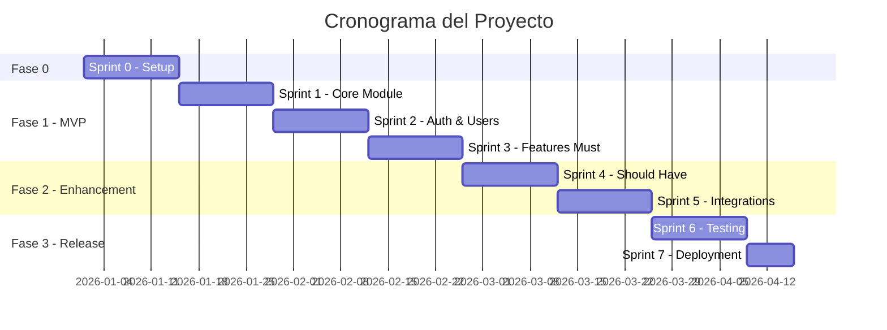

# 📊 Estimación de Esfuerzo

---

**Proyecto**: {Nombre del Proyecto}  
**Cliente**: {Nombre del Cliente}  
**Versión**: {X.X}  
**Fecha**: {YYYY-MM-DD}  
**Autor**: {Nombre del Estimador}  
**Estado**: Borrador | En Revisión | Aprobada

---

## 📋 Tabla de Contenidos

1. [Resumen Ejecutivo](#1-resumen-ejecutivo)
2. [Supuestos y Exclusiones](#2-supuestos-y-exclusiones)
3. [Metodología de Estimación](#3-metodología-de-estimación)
4. [Desglose por Módulos](#4-desglose-por-módulos)
5. [Actividades Transversales](#5-actividades-transversales)
6. [Contingencia y Riesgos](#6-contingencia-y-riesgos)
7. [Resumen de Esfuerzo](#7-resumen-de-esfuerzo)
8. [Cronograma Estimado](#8-cronograma-estimado)
9. [Inversión Estimada](#9-inversión-estimada)
10. [Anexos](#10-anexos)

---

## 1. Resumen Ejecutivo

### 🎯 Visión General

| Aspecto | Valor |
|---------|-------|
| **Total Story Points** | {XXX} SP |
| **Total Horas Estimadas** | {XXX} horas |
| **Duración Estimada** | {X} semanas / {X} meses |
| **Equipo Recomendado** | {X.X} FTE |
| **Inversión Estimada** | USD ${XXX,XXX} |

### 📊 Distribución por Prioridad

```
┌────────────────────────────────────────────────────────────┐
│ Must Have (MVP)     ████████████████████████████  {XX%}    │
│ Should Have         ██████████████                {XX%}    │
│ Could Have          ██████                        {X%}     │
│ Contingencia        ████                          {X%}     │
└────────────────────────────────────────────────────────────┘
```

| Prioridad | Story Points | Horas | % Total |
|-----------|:------------:|:-----:|:-------:|
| Must Have (MVP) | {XX} | {XXX} | {XX%} |
| Should Have | {XX} | {XXX} | {XX%} |
| Could Have | {XX} | {XX} | {X%} |
| **Subtotal Features** | **{XXX}** | **{XXX}** | **{XX%}** |
| Transversales | — | {XX} | {X%} |
| Contingencia ({X%}) | — | {XX} | {X%} |
| **TOTAL** | **{XXX}** | **{XXX}** | **100%** |

---

## 2. Supuestos y Exclusiones

### ✅ Supuestos

Los siguientes supuestos han sido considerados en esta estimación:

| # | Supuesto | Impacto si no se cumple |
|:-:|----------|-------------------------|
| 1 | Cliente disponible para clarificaciones en máx 48 horas | +15% tiempo en esperas |
| 2 | Ambiente de desarrollo disponible desde Semana 1 | +2 semanas de delay |
| 3 | APIs de terceros documentadas y estables | +20% en integraciones |
| 4 | No hay restricciones de arquitectura legacy | +30% refactoring |
| 5 | Equipo propuesto asignado al 100% | Recalcular duración |
| 6 | {Supuesto adicional} | {Impacto} |

### ❌ Exclusiones

Lo siguiente **NO está incluido** en esta estimación:

| # | Exclusión | Motivo |
|:-:|-----------|--------|
| 1 | Migración de datos históricos | Requiere análisis de datos fuente |
| 2 | Capacitación a usuarios finales | No especificado en alcance |
| 3 | Soporte post-producción | Se cotiza por separado |
| 4 | Licenciamiento de software de terceros | Cliente provee |
| 5 | Infraestructura cloud | Cliente provee o se cotiza aparte |
| 6 | {Exclusión adicional} | {Motivo} |

---

## 3. Metodología de Estimación

### 📐 Técnica Utilizada

**Método principal**: Estimación relativa con Story Points (Fibonacci)

| Story Points | Complejidad | Descripción | Horas Referencia |
|:------------:|:-----------:|-------------|:----------------:|
| 1 | XS | Trivial, sin riesgo | 1-2 hrs |
| 2 | S | Simple, bien entendido | 2-4 hrs |
| 3 | M | Moderado, algunas decisiones | 4-8 hrs |
| 5 | L | Complejo, múltiples componentes | 8-16 hrs |
| 8 | XL | Muy complejo, investigación | 16-24 hrs |
| 13 | XXL | Épico, debería dividirse | 24-40 hrs |

### 🔄 Conversión SP → Horas

- **Ratio aplicado**: 1 SP ≈ {X} horas
- **Justificación**: Basado en velocity histórica del equipo / estándar de industria

### 📊 Factores de Ajuste

| Factor | Nivel | Ajuste Aplicado |
|--------|:-----:|:---------------:|
| Complejidad de dominio | Alto/Medio/Bajo | +{X%} |
| Tecnología nueva | Alto/Medio/Bajo | +{X%} |
| Integraciones externas | Alto/Medio/Bajo | +{X%} |
| Requisitos de seguridad | Alto/Medio/Bajo | +{X%} |
| **Total ajuste** | — | **+{XX%}** |

---

## 4. Desglose por Módulos

### Módulo 1: {Nombre del Módulo}

> **Descripción**: {Breve descripción del módulo y su propósito}

| ID | Feature / Tarea | Tipo | Complejidad | SP | Horas | Notas |
|:--:|-----------------|------|:-----------:|:--:|:-----:|-------|
| M1-F1 | {Feature 1} | Dev | M | 3 | 12 | {Nota} |
| M1-F1.1 | └─ {Subtarea 1.1} | Dev | S | 2 | 8 | |
| M1-F1.2 | └─ {Subtarea 1.2} | Dev | S | 2 | 8 | |
| M1-F1.3 | └─ Testing Feature 1 | QA | S | 2 | 4 | |
| M1-F2 | {Feature 2} | Dev | L | 5 | 16 | {Nota} |
| M1-F2.1 | └─ {Subtarea 2.1} | Dev | M | 3 | 12 | |
| M1-F2.2 | └─ Testing Feature 2 | QA | M | 2 | 6 | |

**Subtotal Módulo 1**: {XX} SP | {XXX} horas

---

### Módulo 2: {Nombre del Módulo}

> **Descripción**: {Breve descripción del módulo y su propósito}

| ID | Feature / Tarea | Tipo | Complejidad | SP | Horas | Notas |
|:--:|-----------------|------|:-----------:|:--:|:-----:|-------|
| M2-F1 | {Feature 1} | Dev | M | 3 | 12 | {Nota} |
| M2-F2 | {Feature 2} | Dev | L | 5 | 16 | {Nota} |
| M2-F3 | {Feature 3} | Dev | XL | 8 | 24 | {Nota} |

**Subtotal Módulo 2**: {XX} SP | {XXX} horas

---

### Módulo 3: {Nombre del Módulo}

> **Descripción**: {Breve descripción del módulo y su propósito}

| ID | Feature / Tarea | Tipo | Complejidad | SP | Horas | Notas |
|:--:|-----------------|------|:-----------:|:--:|:-----:|-------|
| M3-F1 | {Feature 1} | Dev | M | 3 | 12 | {Nota} |
| M3-F2 | {Feature 2} | Dev | L | 5 | 16 | {Nota} |

**Subtotal Módulo 3**: {XX} SP | {XXX} horas

---

### 📊 Resumen por Módulos

| Módulo | Features | SP | Horas Dev | Horas QA | Total Horas |
|--------|:--------:|:--:|:---------:|:--------:|:-----------:|
| M1: {Nombre} | {X} | {XX} | {XX} | {X} | {XX} |
| M2: {Nombre} | {X} | {XX} | {XX} | {X} | {XX} |
| M3: {Nombre} | {X} | {XX} | {XX} | {X} | {XX} |
| **TOTAL** | **{XX}** | **{XXX}** | **{XXX}** | **{XX}** | **{XXX}** |

---

## 5. Actividades Transversales

Actividades no directamente asociadas a features pero necesarias para el proyecto:

| Actividad | Descripción | Horas | % del Proyecto |
|-----------|-------------|:-----:|:--------------:|
| **Sprint 0 / Setup** | | | |
| └─ Setup ambiente desarrollo | Docker, CI/CD, repositorio | {X} | |
| └─ Arquitectura base | Esqueleto proyecto, config | {X} | |
| └─ Definición estándares | Coding standards, PR workflow | {X} | |
| **Subtotal Sprint 0** | | **{XX}** | **{X%}** |
| | | | |
| **Gestión de Proyecto** | | | |
| └─ Planificación sprints | Sprint planning, backlog grooming | {X} | |
| └─ Seguimiento y reportes | Dailys, retrospectivas | {X} | |
| └─ Coordinación con cliente | Calls, emails, aprobaciones | {X} | |
| **Subtotal Gestión** | | **{XX}** | **{X%}** |
| | | | |
| **Calidad Continua** | | | |
| └─ Code reviews | Revisión de PRs | {X} | |
| └─ Pair programming | Sesiones colaborativas | {X} | |
| └─ Bug fixing | Buffer para correcciones | {X} | |
| **Subtotal Calidad** | | **{XX}** | **{X%}** |
| | | | |
| **Documentación** | | | |
| └─ Documentación técnica | API docs, arquitectura | {X} | |
| └─ Manual de usuario | Si aplica | {X} | |
| └─ Runbook operaciones | Deploy, troubleshooting | {X} | |
| **Subtotal Documentación** | | **{XX}** | **{X%}** |
| | | | |
| **TOTAL TRANSVERSALES** | | **{XX}** | **{XX%}** |

---

## 6. Contingencia y Riesgos

### 📊 Nivel de Incertidumbre

| Factor | Evaluación | Peso |
|--------|:----------:|:----:|
| Claridad de requisitos | Alta/Media/Baja | {X}/5 |
| Familiaridad con tecnología | Alta/Media/Baja | {X}/5 |
| Complejidad de integraciones | Alta/Media/Baja | {X}/5 |
| Estabilidad del alcance | Alta/Media/Baja | {X}/5 |
| Disponibilidad del cliente | Alta/Media/Baja | {X}/5 |
| **Promedio de incertidumbre** | | **{X.X}/5** |

**Nivel resultante**: {Alto/Medio/Bajo}

### 📈 Contingencia Aplicada

| Nivel de Incertidumbre | Contingencia Estándar | Aplicada |
|------------------------|:---------------------:|:--------:|
| Bajo (promedio < 2) | 10-15% | |
| Medio (promedio 2-3) | 15-25% | ✅ |
| Alto (promedio > 3) | 25-35% | |

**Contingencia aplicada**: {XX%} = {XX} horas

### ⚠️ Riesgos Identificados

| # | Riesgo | Probabilidad | Impacto | Mitigación |
|:-:|--------|:------------:|:-------:|------------|
| R1 | {Descripción del riesgo} | Alta/Media/Baja | Alto/Medio/Bajo | {Acción de mitigación} |
| R2 | {Descripción del riesgo} | Alta/Media/Baja | Alto/Medio/Bajo | {Acción de mitigación} |
| R3 | {Descripción del riesgo} | Alta/Media/Baja | Alto/Medio/Bajo | {Acción de mitigación} |
| R4 | Cambios de alcance durante ejecución | Media | Alto | Change request formal |
| R5 | Retrasos en aprobaciones del cliente | Media | Medio | SLA de respuesta acordado |

---

## 7. Resumen de Esfuerzo

### 📊 Consolidación Total

| Categoría | Story Points | Horas | % |
|-----------|:------------:|:-----:|:-:|
| **Desarrollo de Features** | | | |
| └─ Must Have (MVP) | {XX} | {XXX} | {XX%} |
| └─ Should Have | {XX} | {XX} | {X%} |
| └─ Could Have | {XX} | {XX} | {X%} |
| **Subtotal Features** | **{XXX}** | **{XXX}** | **{XX%}** |
| | | | |
| **Testing / QA** | — | {XX} | {X%} |
| **Actividades Transversales** | — | {XX} | {XX%} |
| **Contingencia ({XX%})** | — | {XX} | {X%} |
| | | | |
| **TOTAL PROYECTO** | **{XXX}** | **{XXX}** | **100%** |

### 📈 Distribución por Rol

| Rol | Horas | % del Proyecto |
|-----|:-----:|:--------------:|
| Tech Lead / Architect | {XX} | {X%} |
| Senior Developer | {XXX} | {XX%} |
| Mid Developer | {XXX} | {XX%} |
| QA Engineer | {XX} | {X%} |
| DevOps / SRE | {XX} | {X%} |
| Project Manager | {XX} | {X%} |
| **TOTAL** | **{XXX}** | **100%** |

---

## 8. Cronograma Estimado

### ⚙️ Parámetros de Capacidad

| Parámetro | Valor |
|-----------|:-----:|
| Horas productivas por persona/día | 6 hrs |
| Días laborables por semana | 5 días |
| Horas productivas por persona/semana | 30 hrs |
| Factor de productividad real | 85% |

### 📅 Escenarios de Duración

| Escenario | Equipo | Capacidad/Semana | Duración |
|-----------|:------:|:----------------:|:--------:|
| Agresivo | {X} FTE | {XXX} hrs | {X} semanas |
| **Recomendado** | **{X} FTE** | **{XX} hrs** | **{X} semanas** |
| Conservador | {X} FTE | {XX} hrs | {X} semanas |

### 👥 Composición de Equipo Recomendada

| Rol | FTE | Duración | Horas Totales |
|-----|:---:|:--------:|:-------------:|
| Tech Lead | 0.5 | Todo el proyecto | {XX} |
| Senior Developer | 1.0 | Todo el proyecto | {XXX} |
| Mid Developer | 1.0 | Todo el proyecto | {XXX} |
| QA Engineer | 0.5 | Sprint 2 en adelante | {XX} |
| DevOps | 0.25 | Sprints 1 y final | {XX} |
| PM | 0.2 | Todo el proyecto | {XX} |
| **TOTAL** | **{X.X}** | — | **{XXX}** |

### 📆 Timeline por Fases



| Fase | Sprints | Duración | Hitos |
|------|:-------:|:--------:|-------|
| Fase 0: Setup | 1 | 2 semanas | Ambiente listo, arquitectura definida |
| Fase 1: MVP | 3 | 6 semanas | MVP funcional en staging |
| Fase 2: Enhancement | 2 | 4 semanas | Features Should Have completados |
| Fase 3: Release | 2 | 3 semanas | Go-live en producción |
| **TOTAL** | **8** | **15 semanas** | — |

---

## 9. Inversión Estimada

### 💵 Cálculo por Rol

| Rol | Horas | Tarifa/Hora (USD) | Subtotal |
|-----|:-----:|:-----------------:|----------:|
| Tech Lead | {XX} | ${XX} | ${XX,XXX} |
| Senior Developer | {XXX} | ${XX} | ${XX,XXX} |
| Mid Developer | {XXX} | ${XX} | ${XX,XXX} |
| QA Engineer | {XX} | ${XX} | ${X,XXX} |
| DevOps / SRE | {XX} | ${XX} | ${X,XXX} |
| Project Manager | {XX} | ${XX} | ${X,XXX} |
| **TOTAL** | **{XXX}** | — | **${XXX,XXX}** |

### 📊 Rangos de Inversión

| Escenario | Ajuste | Horas | Inversión |
|-----------|:------:|:-----:|----------:|
| Optimista | -10% | {XXX} | ${XXX,XXX} |
| **Base** | — | **{XXX}** | **${XXX,XXX}** |
| Conservador | +{XX%} contingencia | {XXX} | ${XXX,XXX} |

### 💰 Precio Recomendado para Propuesta

| Componente | Monto |
|------------|------:|
| Costo base | ${XXX,XXX} |
| Contingencia ({XX%}) | ${XX,XXX} |
| Margen ({XX%}) | ${XX,XXX} |
| **PRECIO PROPUESTA** | **${XXX,XXX}** |

---

## 10. Anexos

### A. Mapping Requisitos → Estimación

| RF ID | Descripción | Módulo | Feature | SP |
|:-----:|-------------|--------|---------|:--:|
| RF-001 | {Descripción} | M1 | M1-F1 | 3 |
| RF-002 | {Descripción} | M1 | M1-F2 | 5 |
| RF-003 | {Descripción} | M2 | M2-F1 | 8 |

### B. Historial de Versiones

| Versión | Fecha | Autor | Cambios |
|:-------:|:-----:|-------|---------|
| 1.0 | {Fecha} | {Nombre} | Versión inicial |
| 1.1 | {Fecha} | {Nombre} | Ajuste por feedback cliente |

### C. Aprobaciones

| Rol | Nombre | Fecha | Firma |
|-----|--------|:-----:|:-----:|
| Estimador | {Nombre} | {Fecha} | ☑️ |
| Revisor Técnico | {Nombre} | {Fecha} | ⬜ |
| Commercial Lead | {Nombre} | {Fecha} | ⬜ |

---

**Documento generado siguiendo metodología ZNS v2.2**  
**Template versión**: 1.0.0
