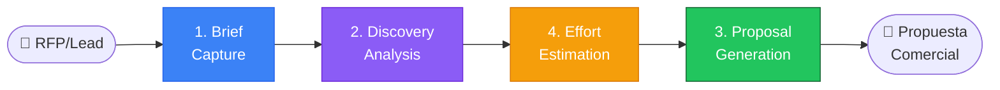

# 📊 ZNS-Sales — Módulo de Agentes de Ventas

---

**metodo**: ZNS v2.2  
**modulo**: 2.zns-sales  
**version**: 2.0.0  
**fecha_actualizacion**: 2026-02-07  
**mantenedor**: Prompt Engineering Team  

---

## 🎯 Propósito del Módulo

El módulo **ZNS-Sales** contiene los agentes especializados en el **proceso de ventas y pre-ventas** de proyectos de software. Cubre desde la recepción inicial de un RFP/RFQ hasta la generación de propuestas comerciales y técnicas completas.

---

## 📋 Agentes del Módulo

| # | Agente | Rol | Input | Output |
|:-:|--------|-----|-------|--------|
| 1 | **Brief Agent** | Capturar contexto inicial del cliente | Reuniones, emails, docs | Brief comercial |
| 2 | **Discovery Agent** | Análisis profundo de requisitos | Brief + raw docs | Contexto consolidado |
| 3 | **Proposal Agent** | Generar propuesta comercial | Contexto + estimaciones | Propuesta comercial |
| 4 | **Estimation Agent** | Estimar esfuerzo y costos | Requisitos técnicos | Estimación detallada |

---

## 📁 Estructura del Módulo

```
2.zns-sales/
├── README.md                          # Este archivo
├── 1.brief-capture/                   # Agente 1: Captura de Brief
│   ├── prompt-brief-capture-senior.md
│   └── templates/
│       ├── template-brief-comercial.md
│       └── template-meeting-notes.md
├── 2.discovery-analysis/              # Agente 2: Discovery & Análisis
│   ├── prompt-discovery-senior.md
│   └── templates/
│       ├── template-contexto-negocio.md
│       ├── template-requisitos-funcionales.md
│       └── template-requisitos-no-funcionales.md
├── 3.proposal-generation/             # Agente 3: Generación de Propuestas
│   ├── prompt-proposal-senior.md
│   └── templates/
│       ├── template-propuesta-comercial.md
│       └── template-propuesta-tecnica.md
├── 4.effort-estimation/               # Agente 4: Estimación
│   ├── prompt-estimation-senior.md
│   └── templates/
│       ├── template-estimacion-esfuerzo.md
│       └── template-breakdown-wbs.md
└── _archive/                          # Versiones anteriores (migrado)
    └── 0.consolidation_context/       # Contenido original
```

---

## 🔄 Flujo del Proceso de Ventas



---

## 📊 Entregables por Agente

### 1. Brief Capture Agent
- `brief-[cliente]-[proyecto]-[fecha].md` — Documento de brief comercial
- `meeting-notes-[fecha].md` — Notas de reuniones (si aplica)

### 2. Discovery Analysis Agent
- `01-contexto-negocio.md` — Contexto completo del negocio
- `02-requisitos-funcionales.md` — RFs priorizados (MoSCoW)
- `03-requisitos-no-funcionales.md` — RNFs cuantificados

### 3. Proposal Generation Agent
- `propuesta-comercial-[proyecto]-[version].md` — Propuesta comercial
- `propuesta-tecnica-[proyecto]-[version].md` — Anexo técnico (opcional)

### 4. Effort Estimation Agent
- `estimacion-[proyecto]-[version].md` — Estimación detallada
- `wbs-[proyecto].md` — Work Breakdown Structure

---

## 🚀 Guía de Uso Rápido

### Para capturar un nuevo brief:
```markdown
Hola, necesito que asumas el rol de Brief Capture Agent Senior.

CONTEXTO:
- Cliente: [Nombre del cliente]
- Proyecto: [Nombre tentativo]
- Fuente: [RFP / Reunión / Email / Llamada]

OBJETIVO:
Capturar y estructurar el brief inicial del proyecto.

Sigue el prompt: 1-agents/2.zns-sales/1.brief-capture/prompt-brief-capture-senior.md

¡Comenzar captura!
```

### Para ejecutar discovery completo:
```markdown
Hola, necesito que asumas el rol de Discovery Analysis Senior.

INPUTS:
- Brief: [ruta al brief]
- Documentos raw: [ruta a 00-raw-inputs/]

OBJETIVO:
Consolidar contexto completo del proyecto.

Sigue el prompt: 1-agents/2.zns-sales/2.discovery-analysis/prompt-discovery-senior.md

¡Comenzar análisis!
```

---

## 📚 Referencias

- [Prompt Engineer Senior](../zns-tools/prompt-engineer-prompt-senior.md) — Creación de prompts
- [Workflow Orchestrator](../zns-tools/prompt-orquestador-workflows-senior.md) — Orquestación de flujos
- [Product Owner](../3.zns-product-owner/) — Siguiente fase (HUTs)

---

## 📝 Changelog

| Versión | Fecha | Cambios |
|---------|-------|---------|
| 2.0.0 | 2026-02-07 | Reestructuración completa: 4 agentes especializados |
| 1.0.0 | 2025-11-14 | Versión inicial con consolidation_context |

---

**Autor**: Prompt Engineering Team  
**Metodología**: ZNS v2.2
