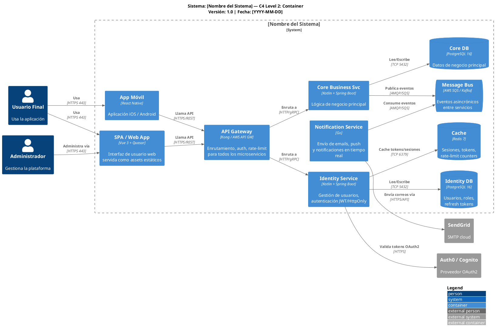
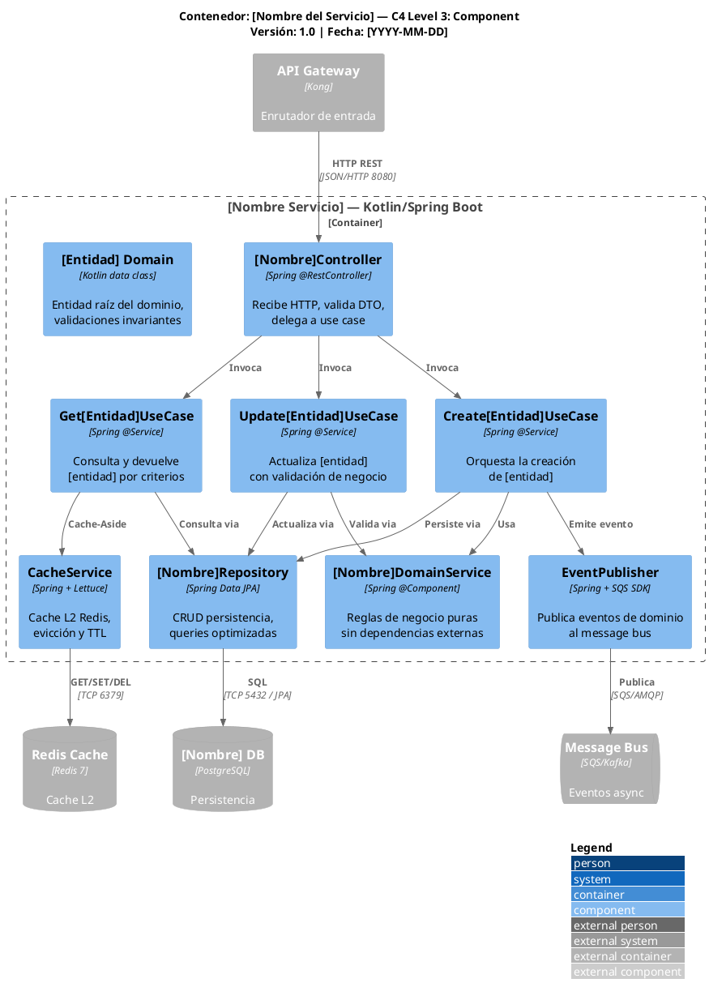

# 📐 SKILL: C4 MODEL DIAGRAM EXPERT

**skill_id**: c4-model-diagram-expert  
**version**: 1.0.0  
**nivel**: Expert  
**categoria**: architecture / diagramming / c4-model  
**last_updated**: 2026-04-17  
**autor**: Skill Engineer Senior ZNS  
**compatible_con**:
- `2-agents/zns-tools/draw-senior/prompt-draw-c4-deployment-senior.md`
- `2-agents/zns-tecnical-team/4.zns-architecture/2.definition_of_architecture/prompt-arquitectura-soluciones.md`
- `2-agents/zns-tecnical-team/4.zns-architecture/2.definition_of_architecture/prompt-especialista-diagramacion-c4.md`
**dependencias**: ninguna (skill autónoma)

---

## 📌 Propósito de la Skill

Esta skill dota al agente de dominio Expert en la generación de diagramas C4 Model usando PlantUML y la biblioteca oficial `C4-PlantUML` de Simon Brown. Cubre los 4 niveles de abstracción, semántica de color, convenciones de nomenclatura, reglas de layout y anti-patrones críticos. Se activa siempre que el agente deba producir cualquier diagrama arquitectónico C4 a partir de una definición de arquitectura.

---

## 🧠 Conocimiento Núcleo

---

### 1️⃣ Los 4 Niveles del C4 Model — Mapa Mental

```
C4 Level 1 — CONTEXT (System Context)
  └── "¿Qué hace el sistema y quién lo usa?"
      Audiencia: Cualquier stakeholder (negocio, usuario final, gestor)
      Granularidad: Sistema completo como caja negra + usuarios + sistemas externos

C4 Level 2 — CONTAINER
  └── "¿Cómo está construido técnicamente a alto nivel?"
      Audiencia: Equipo de desarrollo, arquitectos, DevOps
      Granularidad: Aplicaciones, APIs, DBs, Message Brokers, SPA, Mobile apps

C4 Level 3 — COMPONENT
  └── "¿Qué hay dentro de cada contenedor?"
      Audiencia: Desarrolladores que trabajan en ese contenedor
      Granularidad: Controllers, Services, Repositories, Use Cases, Domain Objects

C4 Level 4 — CODE (opcional)
  └── "¿Cómo está implementado cada componente?"
      Audiencia: Desarrolladores implementando ese componente específico
      Granularidad: Clases, interfaces, funciones (usar sparingly)
```

> ❗ Regla de oro: Cada nivel de abstracción tiene una audiencia diferente. Si el diagrama mezcla niveles, es un anti-patrón.

---

### 2️⃣ Setup y Bibliotecas PlantUML Obligatorias

```plantuml
' ============================================================
' IMPORTS OBLIGATORIOS POR NIVEL (NO omitir ninguno)
' ============================================================

' Level 1 — Context
!include <C4/C4_Context>

' Level 2 — Container
!include <C4/C4_Container>

' Level 3 — Component
!include <C4/C4_Component>

' Level Deployment
!include <C4/C4_Deployment>

' Iconos AWS (cuando aplique)
!define AWSPuml https://raw.githubusercontent.com/awslabs/aws-icons-for-plantuml/v19.0/dist
!include AWSPuml/AWSCommon.puml
!include AWSPuml/Compute/all.puml
!include AWSPuml/Database/all.puml
!include AWSPuml/NetworkingContentDelivery/all.puml

' Dirección del layout
LAYOUT_WITH_LEGEND()
LAYOUT_LEFT_RIGHT()   ' ← para flujos horizontales (más legible en la mayoría de casos)
' LAYOUT_TOP_DOWN()  ' ← para jerarquías, usar cuando el flujo es vertical
```

---

### 3️⃣ Semántica de Color Obligatoria ZNS

Los colores NO son arbitrarios. Cada color tiene un significado semántico que el agente debe respetar en todos los diagramas:

| Tipo de Elemento | Color Hex | Nombre | Uso |
|------------------|-----------|--------|-----|
| Sistema principal (nuestro) | `#1168BD` | Azul corporativo C4 | Sistema en foco del diagrama |
| Sistema externo / terceros | `#999999` | Gris neutro | Sistemas fuera de nuestro control |
| Base de datos / almacenamiento | `#438DD5` | Azul claro | Cualquier forma de persistencia |
| Message broker / cola | `#E67E22` | Naranja | Kafka, RabbitMQ, SQS, SNS |
| Usuario/Persona | `#08427B` | Azul oscuro | Actores humanos |
| Boundary (caja de contexto) | `#AAAAAA` (borde) | Gris borde | Bounded context, namespace |
| Ambiente PROD | borde `#E74C3C` | Rojo | Nodo de deployment en producción |
| Ambiente STAGING | borde `#E67E22` | Naranja | Nodo de deployment en staging |
| Ambiente DEV | borde `#27AE60` | Verde | Nodo de deployment en desarrollo |

**Aplicación en PlantUML:**
```plantuml
' Sobrescribir colores ZNS (al inicio del diagrama)
UpdateElementStyle(person,        $bgColor="#08427B", $fontColor="white",  $borderColor="#063D73")
UpdateElementStyle(system,        $bgColor="#1168BD", $fontColor="white",  $borderColor="#0E4D8A")
UpdateElementStyle(system_ext,    $bgColor="#999999", $fontColor="white",  $borderColor="#707070")
UpdateElementStyle(container,     $bgColor="#438DD5", $fontColor="white",  $borderColor="#2E6DA4")
UpdateElementStyle(component,     $bgColor="#85BBE0", $fontColor="black",  $borderColor="#5A9DC5")
UpdateElementStyle(database,      $bgColor="#438DD5", $fontColor="white",  $borderColor="#2E6DA4", $shape=EightSidedShape())
UpdateRelStyle($lineColor="#707070", $textColor="#707070")
```

---

### 4️⃣ Templates PlantUML por Nivel

#### Template C4 Level 1 — System Context

```plantuml
@startuml C4_L1_[NombreSistema]_Context
!include <C4/C4_Context>
LAYOUT_WITH_LEGEND()
LAYOUT_LEFT_RIGHT()

title Sistema: [Nombre del Sistema] — C4 Level 1: System Context\nVersión: 1.0 | Fecha: [YYYY-MM-DD]

' ─── PERSONAS ────────────────────────────────────────────
Person(usuario_final,    "Usuario Final",    "Persona que usa la\naplicación web/móvil")
Person(admin,            "Administrador",    "Gestiona la plataforma\ny configuraciones")

' ─── SISTEMA PRINCIPAL ───────────────────────────────────
System(sistema_principal, "[Nombre del Sistema]",
  "Descripción de 1 línea:\nqué hace el sistema para el usuario")

' ─── SISTEMAS EXTERNOS ───────────────────────────────────
System_Ext(auth_ext,    "Proveedor Auth\n(Auth0/Cognito)",  "Autenticación y\ngestión de identidades")
System_Ext(email_ext,   "Servicio Email\n(SendGrid)",       "Envío de correos\ntransaccionales")
System_Ext(pago_ext,    "Pasarela de Pago\n(Stripe)",       "Procesamiento de\npagos online")

' ─── RELACIONES ──────────────────────────────────────────
Rel(usuario_final,    sistema_principal, "Usa",          "HTTPS")
Rel(admin,            sistema_principal, "Administra",   "HTTPS")
Rel(sistema_principal, auth_ext,  "Autentica usuarios vía",   "HTTPS/OAuth2")
Rel(sistema_principal, email_ext, "Envía notificaciones vía", "HTTPS/API")
Rel(sistema_principal, pago_ext,  "Procesa pagos vía",        "HTTPS/API")

@enduml
```

#### Template C4 Level 2 — Container



#### Template C4 Level 3 — Component (por servicio)



---

### 5️⃣ Reglas de Layout y Legibilidad

#### Máximo de elementos por diagrama (regla ZNS no negociable)

| Nivel | Máx. cajas principales | Máx. relaciones | Justificación |
|-------|------------------------|-----------------|---------------|
| L1 Context  | 1 sistema + 8 actores/externos | 12 | Debe caber en 1 slide / pantalla |
| L2 Container| 10 contenedores dentro del boundary | 15 | Legibilidad sin zoom |
| L3 Component| 12 componentes por servicio | 18 | Un servicio a la vez |
| Deployment  | 15 nodos | 20 | Complejidad infraestructura |

> ❗ Si superas el límite: **divide el diagrama**. Crea un diagrama por bounded context o por servicio.

#### Etiquetas de relaciones: formato obligatorio

```plantuml
' ✅ CORRECTO — protocolo + descripción acción
Rel(serviceA, serviceB, "Consulta disponibilidad", "REST/HTTPS")
Rel(serviceA, db,       "Lee/Escribe pedidos",     "TCP 5432 / JPA")
Rel(serviceA, queue,    "Publica OrderCreated",    "SQS / async")

' ❌ INCORRECTO — demasiado vago o sin protocolo
Rel(serviceA, serviceB, "calls")
Rel(serviceA, db,       "uses")
```

#### Instrucciones de agrupación con boundaries

```plantuml
' Agrupar por bounded context / dominio de negocio
System_Boundary(bc_identity, "Bounded Context: Identity & Access") {
  Container(svc_auth,  ...)
  Container(svc_perms, ...)
}

System_Boundary(bc_orders, "Bounded Context: Orders & Payments") {
  Container(svc_orders,   ...)
  Container(svc_payments, ...)
}
```

---

### 6️⃣ Anti-patrones Críticos — NUNCA Hacer

| Anti-patrón | Problema | Solución |
|-------------|----------|----------|
| **Mezclar niveles en un mismo diagrama** | Confunde a la audiencia, imposible de leer | Un diagrama por nivel; referencias cruzadas |
| **Elementos sin descripción tecnológica** | "Container" sin saber si es API, DB, SPA | Siempre incluir `$techn` en cada elemento |
| **Relaciones sin etiqueta** | No se sabe qué fluye entre servicios | Toda relación debe tener verbo + protocolo |
| **Más de 15 elementos sin sub-dividir** | Diagrama ilegible, zoom obligatorio | Dividir por bounded context |
| **Sin título ni versión** | No trazable ni versionable | Siempre `title` con nombre, nivel y fecha |
| **LAYOUT_WITH_LEGEND() omitido** | Leyenda ausente, colores sin referencia | Siempre incluir al inicio |
| **Sistemas externos sin descripción** | No se sabe qué hace ni quién lo provee | Siempre incluir descripción breve |
| **Usar Mermaid para diagramas C4** | Pierde iconos cloud, control de layout y calidad visual | PlantUML + C4-PlantUML es el estándar ZNS |

---

### 7️⃣ Checklist de Calidad C4 por Diagrama

```markdown
## ✅ Checklist C4 — Diagrama [nivel] de [sistema]

### Estructura:
- [ ] Import correcto (`!include <C4/C4_[nivel]>`)
- [ ] `LAYOUT_WITH_LEGEND()` presente
- [ ] Dirección de layout declarada (`LAYOUT_LEFT_RIGHT` o `LAYOUT_TOP_DOWN`)
- [ ] `title` con: nombre del sistema, nivel C4 y fecha

### Elementos:
- [ ] Cada `Person` tiene nombre + descripción de rol
- [ ] Cada `System/Container/Component` tiene nombre + descripción de función + tecnología (`$techn`)
- [ ] Todos los sistemas externos identificados con `System_Ext`
- [ ] Bases de datos usan `ContainerDb` o `SystemDb` (no `Container`)
- [ ] Colas/brokers usan `ContainerQueue` (no `Container`)

### Relaciones:
- [ ] 100% de relaciones tienen etiqueta de acción + protocolo/tecnología
- [ ] Las relaciones siguen el flujo de izquierda a derecha o de arriba a abajo
- [ ] Sin relaciones bidireccionales innecesarias (separar en 2 flechas si hay flujo real bidireccional)

### UX y Legibilidad:
- [ ] Máximo de elementos respetado por nivel
- [ ] Elementos agrupados en boundaries cuando hay más de 4 servicios relacionados
- [ ] Semántica de color ZNS aplicada
- [ ] Diagrama legible a 100% de zoom en pantalla Full HD (1920x1080)
```

---

## ✅ Criterios de Aplicación

- Siempre que se genere cualquier diagrama C4 (Level 1, 2, 3, 4 o Deployment)
- Al revisar diagramas existentes para detectar violaciones de estándar
- Al explicar la arquitectura a un equipo nuevo

## ❌ Anti-patrones de Uso de Esta Skill

- No usar esta skill para generar diagramas de secuencia (usar UML `@startuml` con `sequenceDiagram`)
- No usar C4 para modelar procesos de negocio (usar BPMN o flowcharts simples)
- No generar C4 L4 (Code) salvo que sea explícitamente solicitado (raramente necesario)

---

## 📊 Métricas de Calidad de Diagramas C4

| Métrica | Umbral ZNS |
|---------|------------|
| Elementos por diagrama | ≤ 15 (alerta si > 10) |
| Relaciones sin etiqueta | 0% — todas etiquetadas |
| Diagramas sin leyenda | 0% — `LAYOUT_WITH_LEGEND()` obligatorio |
| Tiempo de comprensión L1 | ≤ 60 segundos por cualquier stakeholder |
| Tiempo de comprensión L2/L3 | ≤ 3 minutos por desarrollador del equipo |
| Diagramas con título y versión | 100% |

---

## 🔗 Instrucciones de Inyección en Agentes

Para incorporar esta skill en un agente, agregar la siguiente sección:

```markdown
### SKILL ACTIVA: C4 MODEL DIAGRAM EXPERT → ver: 2-agents/zns-tools/draw-senior/skills/c4-model-diagram-expert.skill.md

**Reglas no negociables:**
- PlantUML + C4-PlantUML es el único estándar aceptado (no Mermaid para C4)
- `LAYOUT_WITH_LEGEND()` obligatorio en todo diagrama
- Máx. 15 elementos por diagrama; dividir por bounded context si se supera
- Toda relación debe tener: verbo de acción + protocolo/tecnología
- Semántica de color ZNS: azul=#1168BD sistema, gris=#999999 externo, naranja=#E67E22 brokers
- Título obligatorio con: nombre sistema, nivel C4, versión y fecha
- Los 4 niveles tienen audiencias distintas — nunca mezclar niveles en un diagrama
```

---

## 🔄 Changelog

- v1.0.0: Versión inicial — C4 Model Expert con PlantUML, templates L1/L2/L3, semántica de color ZNS, anti-patrones y checklist completo
