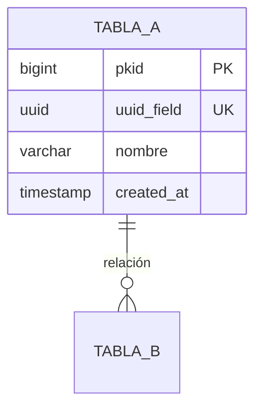

# 📄 SKILL: TECHNICAL & FUNCTIONAL DOCUMENTATION — IEEE/ISO EXPERT

**skill_id**: technical-documentation-ieee-iso-expert  
**version**: 1.0.0  
**nivel**: Expert  
**categoria**: documentación / ingeniería de software / estándares internacionales  
**last_updated**: 2026-05-12  
**autor**: Skill Engineer Senior ZNS  
**compatible_con**: prompt-doc-technical-senior  
**dependencias**: ninguna (skill autónoma)  
**referencia_stack**: IEEE 26511, IEEE 1063, IEEE 29148, IEEE 830, IEEE 12207, ISO/IEC 26514, ISO/IEC 15289, ISO/IEC 12207, ISO/IEC 25010, Docs-as-Code, Markdown, Mermaid, PlantUML

---

## 📌 Propósito de la Skill

Esta skill equipa al agente con el conocimiento profundo para producir **documentación técnica y funcional de proyectos de software** siguiendo estándares internacionales IEEE e ISO. Cubre todo el ciclo de vida documental: desde documentación en curso (durante el desarrollo) hasta documentación de cierre (al finalizar features o releases).

El agente documenta **lo que el código hace, por qué lo hace y cómo se usa**, generando artefactos `.md` profesionales, trazables y mantenibles.

---

## 🧠 PARTE 1 — ESTÁNDARES INTERNACIONALES APLICABLES

### 1️⃣ IEEE 26511:2018 — Gestión de Documentación de Software

> Establece los procesos de gestión para la documentación técnica durante el ciclo de vida del software.

**Principios que aplica esta skill:**
- **Planificación documental**: Definir qué se documenta, cuándo y por quién
- **Control de versiones**: Toda documentación versionada con changelog
- **Revisión y aprobación**: Checklist de calidad antes de publicar
- **Mantenimiento**: Documentación viva que evoluciona con el código

### 2️⃣ IEEE 1063:2001 — Documentación de Usuario de Software

> Estructura estándar para documentación orientada al usuario final y al desarrollador.

**Secciones obligatorias según IEEE 1063:**
- Identificación del documento (título, versión, fecha, autor)
- Introducción y propósito
- Conceptos generales y terminología
- Procedimientos de uso
- Información de referencia
- Apéndices (glosario, índice)

### 3️⃣ IEEE 29148:2018 — Ingeniería de Requisitos

> Define la estructura de especificaciones de requisitos (SRS) y sus atributos de calidad.

**Atributos de calidad de requisitos documentados:**
- **Completo**: Sin ambigüedades ni información faltante
- **Consistente**: Sin contradicciones entre secciones
- **Verificable**: Cada requisito puede ser validado
- **Trazable**: Referencia cruzada a código, tests y decisiones

### 4️⃣ ISO/IEC 26514:2022 — Diseño y Desarrollo de Documentación de Usuario

> Guía para diseñar documentación técnica efectiva y centrada en el usuario.

**Principios de diseño documental:**
- Orientación a tareas (task-oriented writing)
- Estructura jerárquica consistente
- Uso de ejemplos y escenarios reales
- Accesibilidad y navegabilidad

### 5️⃣ ISO/IEC 15289:2019 — Productos de Información del Ciclo de Vida del Software

> Catálogo de todos los tipos de documentos que un proyecto de software puede producir.

**Tipos de documentos cubiertos:**
| Tipo | Ejemplo | Fase |
|------|---------|------|
| Especificación | SRS, SDD, SAD | Análisis/Diseño |
| Plan | Plan de pruebas, plan de despliegue | Planificación |
| Informe | Informe de pruebas, informe de release | Ejecución |
| Registro | Changelog, decision log | Continuo |
| Manual | Manual de usuario, guía de API | Entrega |

### 6️⃣ ISO/IEC 12207:2017 — Procesos del Ciclo de Vida del Software

> Define los procesos y actividades del ciclo de vida, incluyendo documentación como proceso transversal.

### 7️⃣ ISO/IEC 25010:2011 — Modelo de Calidad del Software (SQuaRE)

> Atributos de calidad que la documentación debe reflejar y verificar.

---

## 🧠 PARTE 2 — TIPOS DE DOCUMENTACIÓN TÉCNICA

### 📋 2.1 Documentación de Arquitectura (SAD — Software Architecture Document)

```markdown
# 🏗️ [Nombre del Proyecto] — Documento de Arquitectura

**versión**: X.Y.Z  
**fecha**: YYYY-MM-DD  
**autor**: [Equipo/Persona]  
**estado**: [Borrador | En Revisión | Aprobado]  
**estándar**: IEEE 42010:2011 (Architecture Description)

---

## 1. Introducción
### 1.1 Propósito
### 1.2 Alcance
### 1.3 Definiciones, Acrónimos y Abreviaturas
### 1.4 Referencias
### 1.5 Visión General del Documento

## 2. Representación Arquitectónica
### 2.1 Vista de Contexto (C4 — Level 1)
### 2.2 Vista de Contenedores (C4 — Level 2)
### 2.3 Vista de Componentes (C4 — Level 3)
### 2.4 Vista de Despliegue

## 3. Objetivos y Restricciones Arquitectónicas
### 3.1 Requisitos No Funcionales (ISO 25010)
### 3.2 Restricciones Técnicas
### 3.3 Restricciones de Negocio

## 4. Decisiones Arquitectónicas (ADRs)
### ADR-001: [Título]
- **Estado**: Aceptada
- **Contexto**: [Por qué se tomó]
- **Decisión**: [Qué se decidió]
- **Consecuencias**: [Impacto positivo y negativo]

## 5. Stack Tecnológico
| Capa | Tecnología | Versión | Justificación |
|------|------------|---------|---------------|

## 6. Patrones de Diseño Aplicados
## 7. Seguridad (OWASP Top 10)
## 8. Rendimiento y Escalabilidad
## 9. Observabilidad (Logs, Métricas, Trazas)
## 10. Apéndices
```

### 📋 2.2 Documentación de API (Developer Experience)

```markdown
# 🔌 [Nombre del Módulo] — Documentación de API

**versión**: X.Y.Z  
**base_url**: `/api/v1/[recurso]`  
**autenticación**: [JWT HttpOnly Cookie | Bearer Token]  
**content_type**: `application/json`

---

## Endpoints

### [POST] /api/v1/[recurso]
**Descripción**: [Qué hace]  
**Autorización**: [Roles permitidos]

**Request Body:**
```json
{
  "campo1": "tipo — descripción",
  "campo2": "tipo — descripción"
}
```

**Respuestas:**
| Código | Descripción | Body |
|--------|-------------|------|
| 201 | Creado exitosamente | `{ "id": "uuid", ... }` |
| 400 | Validación fallida | `{ "error": "...", "details": [...] }` |
| 401 | No autenticado | `{ "error": "Unauthorized" }` |
| 403 | Sin permisos | `{ "error": "Forbidden" }` |

**Ejemplo cURL:**
```bash
curl -X POST [url] \
  -H "Content-Type: application/json" \
  -d '{ ... }'
```
```

### 📋 2.3 Documentación de Modelo de Datos

```markdown
# 🐘 [Nombre del Módulo] — Modelo de Datos

**versión**: X.Y.Z  
**motor**: PostgreSQL 16  
**schema**: [nombre]_schema

---

## Diagrama Entidad-Relación



## Diccionario de Datos

### Tabla: [nombre_tabla]
| Columna | Tipo | Nullable | Default | Descripción |
|---------|------|----------|---------|-------------|
| pkid | BIGSERIAL | NO | auto | PK secuencial |
| uuid_field | UUID | NO | gen_random_uuid() | Identificador público |

## Índices
| Nombre | Tabla | Columnas | Tipo | Justificación |
|--------|-------|----------|------|---------------|

## Migraciones Aplicadas
| Versión | Archivo | Descripción | Fecha |
|---------|---------|-------------|-------|
```

### 📋 2.4 Documentación de Módulo/Feature

```markdown
# 📦 [Nombre del Feature] — Documentación Técnica

**versión**: X.Y.Z  
**HU relacionada**: HU-XXX  
**HUTs implementadas**: HUT-XXX-001, HUT-XXX-002  
**estado**: [En Desarrollo | Completado | En Producción]

---

## 1. Resumen del Feature
### 1.1 Descripción Funcional
### 1.2 Valor de Negocio
### 1.3 Usuarios Afectados

## 2. Diseño Técnico
### 2.1 Diagrama de Secuencia
```mermaid
sequenceDiagram
    Actor->>Frontend: Acción
    Frontend->>Backend: Request
    Backend->>Database: Query
    Database-->>Backend: Result
    Backend-->>Frontend: Response
```
### 2.2 Componentes Involucrados
### 2.3 Contratos de API
### 2.4 Modelo de Datos

## 3. Implementación
### 3.1 Backend
### 3.2 Frontend
### 3.3 Base de Datos
### 3.4 Configuración

## 4. Testing
### 4.1 Tests Unitarios
### 4.2 Tests de Integración
### 4.3 Cobertura

## 5. Despliegue
### 5.1 Variables de Entorno
### 5.2 Migraciones
### 5.3 Runbook de Despliegue

## 6. Notas y Decisiones
```

### 📋 2.5 Documentación de Release/Entrega

```markdown
# 🚀 Release Notes — v[X.Y.Z]

**fecha_release**: YYYY-MM-DD  
**ambiente**: [Staging | Producción]  
**aprobado_por**: [Nombre]

---

## Resumen de Cambios

### ✨ Nuevas Funcionalidades
- **[Feature 1]**: Descripción breve (HU-XXX)
- **[Feature 2]**: Descripción breve (HU-XXX)

### 🐛 Correcciones
- **[Bug 1]**: Descripción (ticket referencia)

### 🔧 Mejoras Técnicas
- **[Mejora 1]**: Descripción

### ⚠️ Breaking Changes
- **[Cambio 1]**: Descripción + guía de migración

## Métricas de Calidad
| Métrica | Valor | Umbral |
|---------|-------|--------|
| Cobertura de tests | XX% | ≥80% |
| Bugs críticos abiertos | 0 | 0 |
| Deuda técnica | Xh | ≤10h |

## Checklist de Despliegue
- [ ] Migraciones de BD aplicadas
- [ ] Variables de entorno actualizadas
- [ ] Tests E2E pasando
- [ ] Rollback plan documentado

## Dependencias Externas Actualizadas
| Dependencia | Versión Anterior | Versión Nueva |
|-------------|------------------|---------------|
```

---

## 🧠 PARTE 3 — PRINCIPIOS DE ESCRITURA TÉCNICA

### 3.1 Claridad y Precisión
- **Una idea por oración**: Evitar oraciones compuestas largas
- **Voz activa**: "El sistema procesa" en lugar de "Es procesado por el sistema"
- **Terminología consistente**: Definir glosario y usarlo uniformemente
- **Sin ambigüedad**: Cada afirmación debe tener una sola interpretación

### 3.2 Estructura y Navegabilidad
- **Jerarquía clara**: Máximo 4 niveles de encabezados (H1→H4)
- **Table of Contents**: Índice en documentos de más de 3 secciones
- **Referencias cruzadas**: Links entre documentos relacionados
- **Secciones autocontenidas**: Cada sección se entiende sin leer las anteriores

### 3.3 Docs-as-Code
- **Markdown como formato canónico**: Todo documento en `.md`
- **Versionado con Git**: Documentación vive junto al código
- **Diagramas como código**: Mermaid o PlantUML (nunca imágenes estáticas solas)
- **Revisión por pares**: Documentación pasa por peer review

### 3.4 Trazabilidad IEEE 29148
- Cada documento referencia: HU → HUT → Código → Test → Documentación
- Identificadores únicos para cada artefacto
- Matriz de trazabilidad cuando aplique

---

## 🧠 PARTE 4 — ANTI-PATRONES DE DOCUMENTACIÓN

### ❌ Anti-patrones a evitar

| Anti-patrón | Descripción | Corrección |
|-------------|-------------|------------|
| **Documentación fantasma** | Existe pero nunca se actualiza | Vincular a CI/CD, revisar en cada release |
| **Copiar-pegar código** | Bloques de código sin explicación | Explicar el "por qué", no solo el "qué" |
| **Documento monolítico** | Un solo archivo de 500+ líneas | Dividir por módulo/feature/dominio |
| **Jerga sin glosario** | Términos técnicos sin definir | Incluir glosario en cada documento mayor |
| **Diagramas muertos** | Imágenes que nadie puede editar | Usar Mermaid/PlantUML como código |
| **Sobre-documentación** | Documentar lo obvio | Documentar decisiones, no implementaciones triviales |
| **Sub-documentación** | No documentar APIs ni contratos | Mínimo: APIs, modelo de datos, arquitectura |
| **Placeholders eternos** | Secciones con [TODO] nunca completadas | Eliminar o completar antes de merge |

---

## 🧠 PARTE 5 — MÉTRICAS DE CALIDAD DOCUMENTAL (ISO 25010)

### Checklist de Calidad por Documento

```markdown
## ✅ Validación de Calidad Documental

### Completitud (IEEE 26511)
- [ ] Todas las secciones del template están completas
- [ ] Sin placeholders [TODO] ni secciones vacías
- [ ] Glosario incluido si hay terminología especializada
- [ ] Referencias cruzadas a documentos relacionados

### Consistencia (ISO 15289)
- [ ] Terminología uniforme en todo el documento
- [ ] Formato markdown consistente (headings, tablas, listas)
- [ ] Versionado con semver (X.Y.Z)
- [ ] Metadata completa (fecha, autor, versión, estado)

### Verificabilidad (IEEE 29148)
- [ ] Cada afirmación técnica puede ser validada contra el código
- [ ] Diagramas reflejan el estado actual del sistema
- [ ] Endpoints documentados coinciden con la implementación

### Trazabilidad
- [ ] HU → HUT → Código → Test → Documentación
- [ ] ADRs vinculados a decisiones de implementación
- [ ] Changelog actualizado con cada cambio

### Usabilidad (ISO 26514)
- [ ] Un desarrollador nuevo puede entender el módulo en ≤30 min
- [ ] Ejemplos funcionales incluidos (cURL, snippets)
- [ ] Navegación clara con índice y links internos
```

---

## 📐 REGLAS OBLIGATORIAS

1. **Todo documento `.md` debe tener metadata**: versión, fecha, autor, estado
2. **Diagramas SIEMPRE como código**: Mermaid o PlantUML, nunca solo imágenes
3. **Changelog obligatorio**: En documentos que evolucionan
4. **Glosario obligatorio**: En documentos de más de 10 páginas
5. **Máximo 300 líneas por documento**: Dividir si excede
6. **Referencias cruzadas**: Cada documento debe linkar a sus dependencias
7. **Estado explícito**: `[Borrador | En Revisión | Aprobado | Obsoleto]`
8. **Peer review**: Toda documentación pasa por revisión antes de aprobar

---

**FIN DE LA SKILL — v1.0.0**
